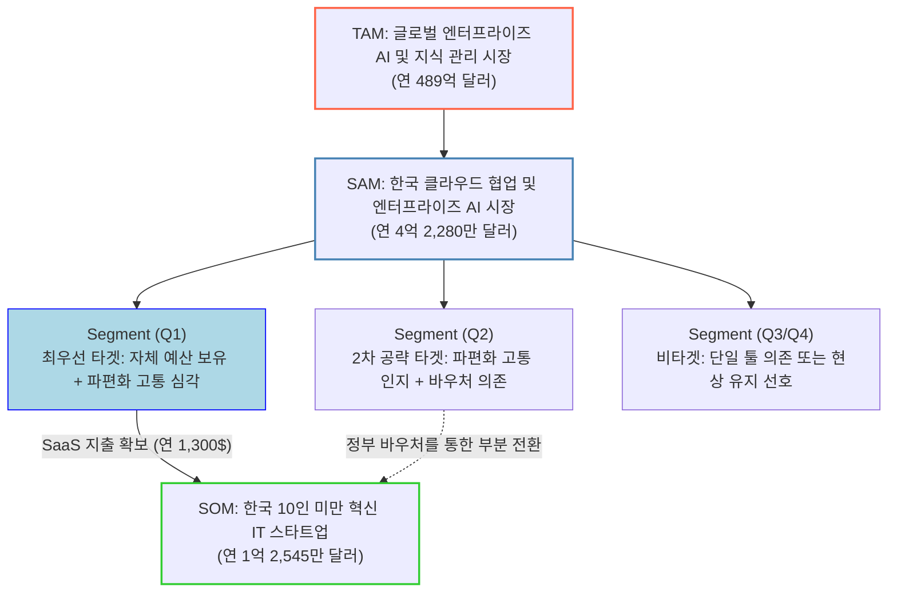

# CorpBrain 시장 규모 산출표 및 세그먼트 맵

## 1. TAM-SAM-SOM 프레임워크 (Mermaid 차트)

## 2. TAM-SAM-SOM 시장 규모 및 근거 테이블

| **구분** | **대응 단계** | **시장 정의** | **시장 규모 (추정치)** | **도출 근거 및 타겟 속성** |
| --- | --- | --- | --- | --- |
| **TAM**  (전체 시장) | 1단계  (거시 시장 탐색) | **글로벌 엔터프라이즈 AI 기반 지식 관리 생태계** (글로벌 비즈니스 확장 시 잠재 시장) | **연간 약 489억 달러** | 글로벌 지식 관리 소프트웨어(KMS) 시장(201억$)과 협업 툴 시장(489억$)의 융합 영역 기준 |
| **SAM**  (유효 시장) | 2단계  (범위 축소) | **한국 클라우드 협업 및 엔터프라이즈 AI 시장** (현실적으로 서비스 가능한 지리적, 기술적 시장) | **연간 약 4억 2,280만 달러** | 한국 팀 협업 SW 시장(3.6억$) + 한국 엔터프라이즈 생성형 AI 시장(0.5억$) 합산 |
| **SOM**  (초기 점유) | 7단계  (솔루션 구체화) | **한국 10인 미만 IT/커머스 기반 스타트업** (다중 채널 혼용 고통 + 자체 예산 보유의 생존 시장) | **연간 약 1억 2,545만 달러** | 기술 기반 스타트업 96.5만 개 중 상위 10%(96,500개) 타겟 × 기업당 문서화 에이전트 연간 지출 추정액(약 $1,300) |

## 3. Market Segment Map (행동 단서 기반 매트릭스)

다중 채널 환경에서 느끼는 **'문서화 및 파편화 고통'**을 세로축(Y)으로, SaaS에 대한 **'지출 능력(결제 성향)'**을 가로축(X)으로 배치하여 CorpBrain의 시장 진입 세그먼트를 시각화했습니다.

| **Y축: 파편화 고통 및 다중 툴 의존도 X축: SaaS 지출 및 결제 능력** | **자체 예산 보유 및 강한 지불 의향 (High WTP)** (생산성에 투자) | **예산 제한 및 외부 지원 의존 (Low WTP)** (무료 선호 및 바우처 의존) |
| --- | --- | --- |
| **심각 (High Pain)** - 이메일, 슬랙, Jira 혼용 - 맥락 단절 및 온보딩 지연 겪음 | **Q1: "Tech-Savvy Innovators" (최우선 타겟)** - **특징:** 개발 리소스 낭비(주 15시간)를 명확히 인지. 실패한 위키 경험 보유. - **전략:** 핵심 공략 대상. `문서화 노동 제로(Zero-UI)` 메시지로 인건비 방어(ROI) 가치 즉시 세일즈. | **Q2: "Pragmatic Explorers" (2차 공략 타겟)** - **특징:** 고통은 깊게 느끼나 데이터 보안 우려가 크고 결제 여력이 부족함. - **전략:** 잠재 시장. 정부 AI 바우처 공급 기업 등록 후, 보안성(RBAC) 강조를 통해 전환 유도. |
| **낮음 (Low Pain)** - 카톡방 하나로 업무 지시 - 지식 사일로를 인식 못 함 | **Q3: "관심 부족형 (저우선순위)"** - **특징:** 자금은 있으나 다중 툴을 쓰지 않아 지식 파편화 문제를 체감하지 못함. - **전략:** 타겟 보류. | **Q4: "Status-Quo Adherents" (비타겟)** - **특징:** 현상 유지 성향이 매우 강하며, 새로운 툴 학습에 강한 거부감을 지님. - **전략:** 명확한 비타겟. `영업 리소스 투입 시 LTV 적자 위험.` |
