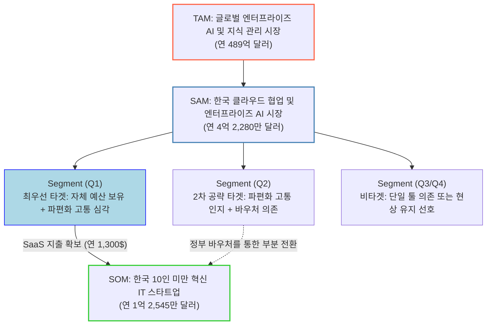

# CorpBrain 통합 시장 분석 검증 리포트 (TAM·SAM·SOM 및 가설 검증 종합)

이 문서는 시장 분석 및 가설 검증의 핵심 산출물인 3개의 문서를 논리적 흐름(종합 요약 ➔ 시장 규모 산출 ➔ 가설 검증 매핑)에 따라 하나로 통합한 마스터 리포트입니다.

---

# 📑 Part 1. 종합 백그라운드 지식 대시보드
> 전체 분석 체계를 조망하고 핵심 수치와 가정을 한눈에 파악하는 통합 대시보드입니다.

## **1. 분석 체계 전체 구조**

### **1.1 보고서 체계도**

```text
[1] 6-3 근본적인 원인 분석       타겟 시장의 구조적 결함과 문서화 부채 규명
     │
     ▼
[2] 6-4 가설수립 및 검증         'Zero-UI + HITL' 해결 가설과 기술/심리적 타당성
     │
     ├── [3] 6-5 정량적 검증      기회비용(10인 기준 연 1.16~1.47억)과 시나리오별 ROI
     │
     ├── [4] 6-6 반복적 데이터 정제  TAM-SAM-SOM 도출 및 세그먼트 매핑(Q1~Q4)
     │
     ▼
[5] 6-7 솔루션 구체화            MVP 핵심 기능 명세 3가지 및 2주 PoC 설계
```

### **1.2 분석의 논리적 흐름**

| 단계 | 핵심 질문 | 답변 기반 보고서 | 핵심 결론 |
| --- | --- | --- | --- |
| ① | 왜 사내 위키는 방치되는가? (Pain Point) | [6-3] 근본적인 원인 | 다중 채널 혼용으로 인한 인지적 과부하, 속도 지향적 문화가 낳은 기술적/문서화 부채, 대체재(슬랙/이메일/Jira)의 근본적 맥락 단절 |
| ② | 이 문제를 어떻게 해결해야 하는가? | [6-4] 가설수립 및 검증 | 백그라운드 자동화(Zero-UI)로 문서화 마찰을 없애고, 환각 방지를 위해 가벼운 승인 절차(HITL)를 추가 |
| ③ | 이 문제의 재무적 기회비용과 도입 효과는? | [6-5] 정량적 검증 | 현행 유지 시 10인 기준 연 1.16억~1.47억 원의 인건비 낭비. 솔루션 도입 시 주당 소요 시간을 1.8시간으로 단축하여 연 9,400만~1억 1,800만 원 방어 |
| ④ | 이러한 문제를 겪는 시장의 규모는 얼마나 큰가? | [6-6] 반복적 데이터 정제 | TAM: 글로벌 489억$, SAM: 한국 4.2억$, SOM: 한국 내 '자체 예산을 보유한 파편화 고통 스타트업' 연 1.25억$ |
| ⑤ | 단기적으로 어떻게 시장에 진입할 것인가? | [6-7] 솔루션 구체화 | MVP 1~4개월 차: 3대 채널(슬랙, Jira, 이메일) 단방향 수집 및 초안 생성 모듈, 2주 단위 단일 조직 대상 PoC 검증 |

---

## **2. 핵심 수치 통합 대시보드**

### **2.1 시장 규모 체계 (단위: USD)**

```text
TAM  489억 ────────────────────────────────────────────────────────── (글로벌 KMS/AI 생태계)
       │                                               
SAM   4.2억 ────                                                   (한국 클라우드/AI 생태계)
       │         
SOM  1.25억 ──                                                     (한국 10인 미만 핵심 타겟)
```

| 지표 | 추정치 | 도출 방식 및 근거 | 관련 보고서 |
| --- | --- | --- | --- |
| **TAM** | 약 489억 달러 | 글로벌 KMS(201억$) + 협업 툴(489억$) + 엔터프라이즈 검색 생태계 융합치 기준 | [6-6] |
| **SAM** | 약 4.2억 달러 | 한국 팀 협업 SW 시장(3.68억$) + 엔터프라이즈 생성형 AI 시장(0.54억$) | [6-6] |
| **SOM** | 약 1.25억 달러 | 한국 기술 기반 스타트업 중 상위 10%(96,500개) × 연간 예상 구독료 지출($1,300) | [6-6] |

### **2.2 기회비용 및 1인당 생산성 낭비 지표**

| 지표 | 낭비 규모 / 비용 | 근거 및 부연 설명 | 관련 보고서 |
| --- | --- | --- | --- |
| **일반 지식 근로자 정보 탐색 낭비** | 주당 평균 9.3시간 | 업무 시간의 약 20%를 산재된 정보 검색에 낭비 | [6-5], [6-6] |
| **개발자 직군 정보 탐색 및 부채 해결** | 주당 평균 13.4시간 | 전체 업무 시간의 약 33% 낭비 (컨텍스트 스위칭 페널티 포함) | [6-5], [6-6] |
| **완전 자동화(Zero-UI Only) 시 소요 시간** | 주당 평균 6.5시간 | 환각(Hallucination) 디버깅 및 팩트 체크를 위해 역설적으로 발생하는 잉여 시간 | [6-5] |
| **Zero-UI + HITL(당사 솔루션) 도입 시** | **주당 평균 1.8시간** | 자동 추출 후 승인에만 소요되는 시간. 기존 대비 주당 7.5시간 세이브 | [6-5] |
| **10인 규모 조직 연간 기회비용 (Cost of Doing Nothing)** | 연 1.16억 ~ 1.47억 원 | 1인당 연 1,160만 원 인건비 낭비 + 온보딩 지연 비용 합산 시 | [6-5], [6-6] |

### **2.3 소비자(사용자) 심리 및 행동 지표**

| 지표 | 수치 | 시사점 | 관련 보고서 |
| --- | --- | --- | --- |
| 완전 자율형 AI 에이전트에 대한 신뢰도 하락 | 43% → 27% (1년 만에) | 데이터 오염 및 환각에 대한 강한 통제력 상실 우려 존재 | [6-4] |
| AI 결과물에 대한 완벽한 신뢰도 | 4% | 96%는 여전히 결과물의 기능적 정확성에 의구심을 가짐 | [6-4] |
| 신규 입사자 온보딩 지연 (지식 유실 상황) | 추가 4~6주 소요 | 문서 부재 시 이전 컨텍스트 파악에 소요되는 잉여 기간 | [6-6] |
| 1인당 SaaS 지출 한도 여력 | 연평균 4,830달러 | 초기 IT 스타트업은 자체 생산성 개선을 위한 예산 지출 의향이 높음 | [6-6] |

---

## **3. 분석 방법론 및 한계**

### **3.1 사용된 방법론**

| 방법론 | 적용 보고서 | 설명 |
| --- | --- | --- |
| **정성적 근본 원인 분석 (Root Cause Analysis)** | [6-3] | 스타트업 위키 방치의 표면적 원인(나태함)을 넘어 구조적 원인(SaaS Sprawl, 속도 문화, 도구의 단절)으로 심층 분해 |
| **가설 검증 프레임워크** | [6-4] | 가설(Zero-UI) ↔ 반증 리스크(환각, 보안, 권한 표류) ↔ 보완 가설(HITL 도입)의 3단계 논리 검증 |
| **시나리오 기반 ROI 분석** | [6-5] | 기존(A) vs 완전 자동화(B) vs Zero-UI+HITL(C) 3가지 상황을 상정하여 1인당 소요 시간과 재무적 손실액 비교 대조 |
| **행동 단서 기반 타겟 세분화 (Segment Map)** | [6-6] | 단순히 업종/규모가 아닌 '다중 채널 고통 지수'와 'SaaS 지불 의향'이라는 2개의 축으로 시장을 4분면(Q1~Q4) 분할 |
| **Top-down 및 Bottom-up 교차 추산** | [6-6] | 거시 지표(글로벌 KMS)를 Top-down으로 TAM, SAM 설정. 타겟 모수(96,500개) × 기대 단가($1,300)의 Bottom-up으로 SOM 역산 |

### **3.2 방법론적 한계 및 보완 방향**

| 한계점 | 영향 및 위험도 | 사후 보완 방안 |
| --- | --- | --- |
| **1차 조사(Primary Research) 미실시** | 세그먼트 비중, 특히 SaaS 1인당 연평균 지출액 중 '문서화/AI'에 할당 가능한 비율(5.4%)이 업계 벤치마크에 기반한 간접 추정치임 | 실제 최우선 타겟 기업 대표/실무자 10~20명 대상 심층 인터뷰(IDI)를 통해 **WTP(지불 의향 금액)** 실측 필요 |
| **'환각 디버깅 타임'의 정밀한 측정 부재** | 시나리오 B에서 "AI가 만든 문서를 디버깅하는 데 6.5시간 소요"라는 수치는 통계와 추론이 결합된 수치로 현장 상황에 따라 편차가 큼 | [6-7]의 2주 단위 PoC 운영 중 사용자가 문서를 승인/수정하는 데 걸리는 '시간 데이터(Time-to-Information)' 로그 직접 수집 |
| **보안/권한 표류(Authorization Drift) 리스크 계량화 불가** | [6-4]에서 지적된 가장 치명적인 슬랙/이메일 프라이버시 침해 우려는 정성적으로만 다루어짐. 도입을 거부할 확률 추산이 어려움 | B2B 세일즈 초기 거절 사유 데이터를 트래킹하여 보안 우려가 영업 파이프라인에서 차지하는 이탈률 정량화. SOC 2 등 인증 획득 시점과 연동 |
| **ROI 비용 산정의 파편화 차이** | [6-5]에서는 기회비용을 1.16억으로 추산했으나, [6-6]에서는 1.47억으로 추산. (온보딩 비용 포함 여부에 따른 차이) | 파트 2(교차 검증 파트)에서 이 수치들의 정합성을 일치시키고 커뮤니케이션용 핵심 단일 수치로 통일 필요 |

---

## **4. 보고서 간 교차 검증**

### **4.1 정합성이 확인된 부분 ✅**

| 교차 항목 | 보고서 A | 보고서 B | 정합 여부 |
| --- | --- | --- | --- |
| **문제와 기회비용의 연결** | [6-3] 기술 부채로 주 13.4시간 낭비 | [6-5] 이를 연 1,160만 원 인건비 손실로 환산 | ✅ 명확히 직결됨 |
| **가설과 MVP 솔루션 연계** | [6-4] Zero-UI 수집 + HITL 승인 필수 | [6-7] MVP 1, 2, 3 기능 명세에 정확히 반영됨 | ✅ 완벽한 일치 |
| **타겟 고객의 일관성** | [6-3] 10인 미만 초기 IT 스타트업 | [6-6] SOM 타겟 및 [6-7] PoC 대상 일치 | ✅ 타겟 흔들림 없음 |
| **문제 인식과 시장 세분화** | [6-3] 기존 위키 실패로 인한 냉소주의 | [6-6] Segment Map에서 실패 경험 유무로 타겟 분류 | ✅ 논리적 정합성 우수 |
| **보안 리스크와 기술 명세** | [6-4] 다크 데이터 수집 및 보안 위험 | [6-7] MVP 기능 1에서 '민감정보 마스킹 처리' 명시 | ✅ 리스크 헷지 방안 포함 |

### **4.2 주의가 필요한 불일치 및 긴장 지점 ⚠️**

| 항목 | 긴장 내용 | 판단 및 보완 방향 |
| --- | --- | --- |
| **기회비용 총액의 차이** | [6-5]에서는 10인 조직 기준 1억 1,600만 원, [6-6]에서는 신규 온보딩 지연 비용을 추가해 1억 4,725만 원으로 산정 | 투자자 커뮤니케이션 시 혼선을 방지하기 위해 **"1억 4,725만 원(온보딩 포함 기준)"**으로 수치 통일 필요 |
| **Zero-UI 환각 디버깅 시간 추정** | [6-4]에서 66%가 오류 수정에 시간 낭비한다고 정성 분석, [6-5]는 이를 주당 6.5시간으로 정량화하여 잉여 시간 계산 | 주당 6.5시간은 보수적 가정이 개입된 간접 추정치임. [6-7]의 PoC 과정에서 실제 디버깅(수정) 소요 시간을 실측하여 데이터 교체 필수 |
| **보안 고도화(RBAC)의 로드맵 배치** | [6-4]는 권한 표류와 데이터 유출을 최우선 리스크로 꼽았으나, [6-7]은 권한 관리(RBAC)를 Phase 2(4개월 차 이후)로 미룸 | 초기 타겟인 10인 스타트업은 보안에 상대적으로 유연할 수 있으나, 세일즈 단계에서 77%의 보안 우려 허들을 극복하려면 Phase 1에서도 기본적인 접근 제어 정책 어필 필요 |
| **기존 협업 툴의 자체 AI 내재화 위협** | 보고서들은 슬랙, 지라 등 개별 툴의 한계를 지적하나, 각 SaaS들이 자체적인 '크로스 채널 AI 검색 기능'을 출시할 경우의 대응 방안이 부재함 | 경쟁사/대체재 모니터링 체계 구축 필수 (특히 Slack AI, Jira Intelligence의 기능 확장 범위) |

---

## **5. 데이터 출처 신뢰도 등급표**

모든 분석에서 인용된 데이터 및 통계의 신뢰도를 3단계로 분류하여 리스크를 관리합니다.

### **✅ Tier 1: 공개 1차 조사 및 신뢰성 높은 산업 데이터 (직접 인용 가능)**

| 출처 | 인용 내용 | 해당 보고서 |
| --- | --- | --- |
| OECD (디지털 정책 위원회) | 한국 클라우드 도입률 70%, AI 수용성 선두 | [6-6] |
| JP Morgan Institute | 소기업 AI 채택 속도 (설립 후 10% 도입에 6개월 소요 등) | [6-6] |
| 정부 통계 (한국 스타트업 생태계) | 2022년 기준 한국 기술 기반(Tech-based) 스타트업 96만 5천 개 | [6-6] |
| 직군별 평균 연봉 공시 자료 | 개발자 평균 5,800만 원, 비개발자 평균 4,000만 원 | [6-5] |

### **⚠️ Tier 2: 해외 리서치 기관 추정치 및 설문 조사 (참고 가능, 한국 적용 시 주의)**

| 출처 | 인용 내용 | 해당 보고서 | 주의사항 |
| --- | --- | --- | --- |
| Grand View Research 등 | 글로벌 KMS(201.5억$), 한국 클라우드 협업 시장 규모 | [6-6] | 조사 기관(Fortune 등)마다 연평균 성장률(CAGR) 등 세부 추정치가 다름 |
| McKinsey 등 업무 분석 리포트 | 정보 탐색 주당 9.3시간 낭비, 기술 부채 해결 13.4시간 소요 | [6-3], [6-5] | 글로벌 대기업 및 일반 지식 근로자 평균이 섞여 있어 10인 스타트업 환경에 1:1 대입 시 오차 가능성 |
| Zylo (SaaS Management Index) | 직원 1인당 평균 SaaS 연간 지출액 4,830달러 | [6-6] | 글로벌 기준이므로 한국 초기 스타트업의 지출 성향에 대한 교차 검증 필요 |

### **❌ Tier 3: 모델링에 의한 간접 추정치 및 가설 (반드시 실제 검증 필요)**

| 추정 내용 | 추정 방법 / 로직 | 해당 보고서 | 위험 요소 |
| --- | --- | --- | --- |
| **SOM 시장 모수 (96,500개)** | 전체 기술 기반 스타트업 중 '최우선 타겟 비중'을 보수적으로 상위 10%로 가설 설정 | [6-6] | 10%라는 비율 자체는 경험적 추론이므로, 잠재 고객 대상 1차 서베이 필요 |
| **기업 1개당 SaaS 예산 지출 한도** | 연평균 SaaS 지출액 4,830달러 중 CorpBrain에 할당될 비중을 5.4%($1,300/년)로 설정 | [6-6] | 지불 의향(WTP)은 툴이 제공하는 체감 가치에 따라 크게 변동함 (±50% 오차 가능) |
| **도입 시 시간 단축 효과 (1.8시간)** | 백그라운드 수집을 통해 기존 9.3시간을 70~80% 이상 단축할 것이라는 로직에 기반 | [6-5] | HITL 승인 과정에서 잦은 오류가 발생하면 1.8시간은 쉽게 초과될 수 있음 |

---

## **6. 핵심 가정(Assumptions) 종합 목록**

해당 비즈니스의 생사를 가르는 핵심 전제 조건들입니다. 사업을 본격화하기 전 반드시 실측 데이터를 통해 증명해야 합니다.

### **6.1 시장 존재 및 문제 가정 (가장 중요)**

| # | 핵심 가정 (Assumption) | 근거 / 배경 | 검증 방법 | 위험도 |
| --- | --- | --- | --- | --- |
| A1 | 스타트업 실무자들은 파편화된 다중 툴 환경에서 극심한 **인지적 고통과 시간 낭비를 자각**하고 있다. | [6-3] 잦은 컨텍스트 스위칭, 정보 검색 낭비 시간 데이터 | 잠재 고객 20인 대상 IDI (심층 인터뷰) 진행 | 🟡 중간 |
| A2 | 기존 소통 채널(슬랙, 이메일)의 자체 AI 검색 기능이나 노션 AI만으로는 **'이종 채널 간 맥락 충돌'을 해결할 수 없다**. | [6-3] 도구 간 데이터 단절, 지식 사일로화 현상 | 슬랙 AI, 아틀라시안 인텔리전스 도입 기업의 잔존 페인포인트 조사 | 🔴 높음 |

### **6.2 솔루션 및 사용자 경험(UX) 가정**

| # | 핵심 가정 (Assumption) | 근거 / 배경 | 검증 방법 | 위험도 |
| --- | --- | --- | --- | --- |
| B1 | Zero-UI 기반 자동 수집은 사용자의 **심리적 마찰(Friction)을 0으로 만든다**. | [6-4] 수동 도구에서 에이전틱 AI로의 진화 트렌드 | [6-7] PoC 사용자 만족도 조사 (기존 위키 대비 작성 피로도 비교) | 🟢 낮음 |
| B2 | HITL(Human-in-the-loop) 승인 절차는 또 다른 '귀찮은 업무'로 전락하지 않고, **사용자에게 심리적 통제감과 안전감을 제공한다**. | [6-4] 완전 자율형 AI에 대한 불신과 통제력 상실 우려 | PoC 중 초안 승인 알림 발생 시 무시율(Ignore rate) 및 체류 시간 측정 | 🔴 높음 |
| B3 | 서로 다른 시점, 다른 채널에서 생성된 상충하는 대화를 AI가 **정확히 추론하고 맥락을 융합**할 수 있다. | [6-7] 벡터 DB와 시맨틱 병합 엔진의 기술적 역량 전제 | 사내 테스트용 이메일-슬랙 대화 세트 100건 주입 후 맥락 충돌 오류율 측정 | 🔴 높음 |

### **6.3 비즈니스 모델(BM) 및 세일즈 가정**

| # | 핵심 가정 (Assumption) | 근거 / 배경 | 검증 방법 | 위험도 |
| --- | --- | --- | --- | --- |
| C1 | IT/커머스 기반 스타트업은 생산성 향상을 위해 연간 $1,300(약 170만 원)을 **자체 예산으로 결제할 의향**이 있다. | [6-6] 1인당 SaaS 지출액 및 높은 AI 채택률 | PoC 종료 후 유료 전환율(Conversion Rate) 확인 | 🟡 중간 |
| C2 | 강력한 '데이터 프라이버시 침해 우려'를 B2B 엔터프라이즈급 **보안 보장 메시지(마스킹 등)로 설득**할 수 있다. | [6-4] 도입 장벽의 핵심(38~77%)이 보안 우려 | 세일즈 미팅 전환율 및 도입 거절 사유 분석 | 🔴 높음 |

---

## **7. 분석 과정에서 발견된 전략적 인사이트**

개별 보고서의 데이터를 관통하며 도출된, CorpBrain 비즈니스 모델의 핵심 전략적 함의와 성공 요인(Key Success Factors)입니다.

### **7.1 '통합 검색'이 아닌 '비즈니스 맥락(Why)의 복원'이 진짜 해자(Moat)다**

*   단순히 여러 툴(슬랙, 지라, 이메일)의 데이터를 한 곳에서 검색할 수 있게 해주는 솔루션은 곧 슬랙 AI나 아틀라시안 자체 AI에 의해 대체될 위험이 큽니다.
*   CorpBrain의 진정한 기술적, 전략적 해자는 **"지라의 산출물(What) 이면에 존재하는 이메일과 슬랙의 의사결정 과정(Why)을 시맨틱하게 연결하여 하나의 맥락으로 융합하는 능력"**입니다. 이 '맥락 충돌 방지 및 융합' 기술력이 고도화될수록 경쟁자가 쉽게 복제할 수 없는 강력한 진입 장벽이 형성됩니다.

### **7.2 혁신(Zero-UI)과 통제(HITL)의 역설적 조화가 성패를 가른다**

*   초기 스타트업 고객은 바쁜 업무 탓에 추가적인 문서화 노동을 극도로 혐오합니다(Zero-UI 요구). 하지만 역설적으로, AI가 기업의 핵심 지식을 멋대로 규정해버리는 것에 대해서는 강한 불안감(통제력 상실)을 느낍니다.
*   따라서 고객의 물리적 마찰은 0으로 만들되 심리적 안전감은 100%로 보장하는 **"가벼운 승인(Human-in-the-loop)" UX 설계**가 본 제품의 생명선입니다. 승인 과정이 조금이라도 귀찮게 느껴지면 즉시 이탈로 이어집니다.

### **7.3 엔터프라이즈급 보안(Security)은 후순위가 아니라 최소 조건(Table Stakes)이다**

*   일반적인 SaaS는 기능(Feature)을 먼저 만들고 보안을 나중에 고도화하지만, 본 비즈니스는 프라이빗 대화와 기업 기밀을 수집하는 태생적 리스크를 안고 있습니다.
*   타겟 고객의 38~77%가 우려하는 '데이터 유출 및 권한 표류' 리스크를 해소하지 못하면 MVP가 아무리 훌륭해도 첫 세일즈 미팅조차 성사되기 어렵습니다. [6-7]의 로드맵 상 보안/권한 관리를 Phase 2로 미루었으나, 최소한 '고객 데이터 학습 미사용 보장'과 '주민번호/기밀 마스킹'은 MVP 출시(Phase 1)부터 강력한 세일즈 포인트로 앞세워야 합니다.

### **7.4 기회비용(1.47억 원) 프레이밍은 B2B 세일즈의 핵심 무기**

*   "저희 툴을 쓰면 문서 작성이 편해집니다"라는 메시지는 SaaS 포화 시장(SaaS Sprawl)에서 더 이상 지갑을 열게 하지 못합니다.
*   대신 [6-5]에서 산출한 **"당신은 현재 매주 13.4시간을 낭비하고 있으며, 이는 10인 조직 기준 연간 1억 4,700만 원의 현금을 허공에 태우는 것과 같습니다"**라는 기회비용 프레이밍이 필요합니다. 연간 $1,300(약 170만 원)의 구독료를 '비용'이 아닌 '1.47억 원의 부채를 방어하는 인프라 투자'로 인식시키는 것이 영업 전략의 핵심입니다.

---

## **8. 추후 검증 우선순위 (Action Items)**

### **🔴 즉시 검증 필요 (MVP 착수 전 / 기획 단계)**

| # | 검증 항목 | 방법론 | 소요 기간 | 성공/판단 기준 |
| --- | --- | --- | --- | --- |
| V1 | **보안 저항감 및 지불 의향(WTP) 측정** | 타겟 그룹(10인 미만 IT 스타트업 리더/개발자) 10명 대상 심층 인터뷰(IDI) | 2주 | 데이터 접근 권한을 허락할 의향이 있는가? 월 100$ 수준 지불 의사가 있는가? |
| V2 | **맥락 충돌 및 환각(Hallucination) 빈도 자체 PoC** | 사내 과거 프로젝트의 슬랙+이메일 덤프 데이터를 LLM에 주입 후 요약 정확성 테스트 | 2~3주 | 서로 충돌하는 정보가 있을 때, AI가 사실을 왜곡(환각)하는 비율 5% 미만 달성 여부 |

### **🟡 PoC 및 MVP 운영 중 검증 (1~4개월 차)**

| # | 검증 항목 | 방법론 | 소요 기간 | 성공/판단 기준 |
| --- | --- | --- | --- | --- |
| V3 | **초안 무수정 승인율 (Zero-edit Acceptance Rate)** | 서비스 백엔드 로그(수정 vs 그대로 승인) 데이터 트래킹 | 4주 | 실무자가 AI 초안을 텍스트 수정 없이 그대로 승인(HITL)하는 비율 **80% 이상** |
| V4 | **탐색 소요 시간 단축(Time-to-Information)** | 도입 조직 실무자 대상 주간 정량 서베이 (기존 주 9.3시간 대비 단축 시간 체감도) | 4주 | 체감되는 지식 탐색/구조화 시간이 기존 대비 **70% 이상 단축**되었는가? |
| V5 | **승인 마찰(Approval Friction) 평가** | HITL 대시보드 내 알림 무시율(Ignore rate) 분석 | 상시 | 알림 발생 후 24시간 내 승인/반려 결정이 이루어지는 비율 90% 달성 |

### **🟢 고도화 및 스케일업 단계 검증 (4~10개월 차)**

| # | 검증 항목 | 방법론 | 소요 기간 | 성공/판단 기준 |
| --- | --- | --- | --- | --- |
| V6 | **유료 플랜 전환율 및 리텐션** | 무료 PoC 종료 후 유료(구독) 플랜 전환 추이 추적 | 3개월 | 유료 전환율(CVR) 20% 이상, 3개월 후 리텐션율 80% 이상 |
| V7 | **부서간 횡적 확장(Land and Expand)** | PoC 적용 부서(예: 개발팀) 외 기획/영업 등 타 부서로의 자연 확산 계수 측정 | 3~6개월 | 단일 기업 내에서 다수 부서가 시스템에 조인하는 비율 |

---

## **9. 용어 정의 (Glossary)**

| 용어 | 정의 | 보고서 내 사용 맥락 |
| --- | --- | --- |
| **Zero-UI (제로 유저 인터페이스)** | 사용자가 버튼 클릭이나 텍스트 입력 없이 시스템이 백그라운드에서 의도를 파악해 자동 처리하는 디자인 원칙. | [6-4] 문서화 노동 0의 핵심 가치 |
| **HITL (Human-in-the-loop)** | 인공지능이 도출한 결과물을 시스템에 최종 반영하기 전, 인간이 개입하여 승인/수정/반려하는 안전장치. | [6-4] 환각 방지 및 심리적 안전 보장 |
| **SaaS Sprawl (SaaS 과잉)** | 조직 내에 무분별하게 도입된 다수의 소프트웨어로 인해 정보가 파편화되고 관리가 통제 불능에 빠지는 현상. | [6-3] 지식 사일로의 근본 원인 |
| **Context Collision (맥락 충돌)** | 서로 다른 소통 채널(예: 이메일과 슬랙)에서 다른 시점에 발생한 논의가 섞이면서 모순되거나 왜곡된 결론을 도출하는 현상. | [6-4] 데이터 융합 시 직면할 최우선 리스크 |
| **Authorization Drift (권한 표류)** | 써드파티 앱(AI 에이전트 등)에 부여된 데이터 접근 권한이 적절히 회수되지 않고 장기간 방치되어 보안 유출 통로가 되는 현상. | [6-4] 엔터프라이즈 보안의 핵심 위협 |
| **Stale Content (낡은 콘텐츠)** | 위키나 노션 등에 최초 기록된 이후, 잦은 우선순위 변동으로 인해 업데이트되지 않고 방치되어 신뢰성을 상실한 사내 문서. | [6-3] 기존 KMS(지식 관리 시스템) 실패 원인 |
| **Time-to-Information** | 실무자가 특정 결정을 내리기 위해 필요한 과거의 맥락과 히스토리를 찾아내는 데 걸리는 총 소요 시간. | [6-7] PoC의 핵심 성공 측정 지표 |

---

## **10. 보고서 목록 및 참조 매핑**

해당 백그라운드 지식 문서를 구성하기 위해 참조된 전체 원본 마크다운 파일 목록입니다.

| # | 원본 파일명 | 다루는 핵심 주제 및 질문 |
| --- | --- | --- |
| **[1]** | `6-3_근본적인원인.md` | 왜 위키는 방치되는가? (구조적 결함과 다중 SaaS 환경의 한계 분석) |
| **[2]** | `6-4_가설수립및검증.md` | 어떻게 해결할 것인가? (Zero-UI 에이전트 가설과 치명적 리스크 도출) |
| **[3]** | `6-5_정량적 검증.md` | 이 문제의 재무적 손실 규모는? (주 13.4시간 낭비, 연 1.16억 원 기회비용 시각화) |
| **[4]** | `6-6_반복적 데이터 정제.md` | 우리가 획득할 시장은 누구인가? (TAM-SAM-SOM 및 Q1 최우선 타겟 도출) |
| **[5]** | `6-7_솔루션 구체화.md` | 구체적으로 무엇을 만들 것인가? (MVP 3대 핵심 기능 명세 및 PoC 성공 지표) |

---

<br>

# 📊 Part 2. TAM-SAM-SOM 시장 규모 산출 및 세그먼트 맵
> 종합 지식 문서에서 요약된 타겟 시장의 정량적 규모와 행동 단서 기반 시장 세분화를 구체적으로 증명하는 자료입니다.

## 1. TAM-SAM-SOM 프레임워크 (Mermaid 차트)



## 2. TAM-SAM-SOM 시장 규모 및 근거 테이블

| **구분** | **대응 단계** | **시장 정의** | **시장 규모 (추정치)** | **도출 근거 및 타겟 속성** |
| --- | --- | --- | --- | --- |
| **TAM** <br>(전체 시장) | 1단계 <br>(거시 시장 탐색) | **글로벌 엔터프라이즈 AI 기반 지식 관리 생태계**<br>(글로벌 비즈니스 확장 시 잠재 시장) | **연간 약 489억 달러** | 글로벌 지식 관리 소프트웨어(KMS) 시장(201억$)과 협업 툴 시장(489억$)의 융합 영역 기준 |
| **SAM** <br>(유효 시장) | 2단계 <br>(범위 축소) | **한국 클라우드 협업 및 엔터프라이즈 AI 시장**<br>(현실적으로 서비스 가능한 지리적, 기술적 시장) | **연간 약 4억 2,280만 달러** | 한국 팀 협업 SW 시장(3.6억$) + 한국 엔터프라이즈 생성형 AI 시장(0.5억$) 합산 |
| **SOM** <br>(초기 점유) | 7단계 <br>(솔루션 구체화) | **한국 10인 미만 IT/커머스 기반 스타트업**<br>(다중 채널 혼용 고통 + 자체 예산 보유의 생존 시장) | **연간 약 1억 2,545만 달러** | 기술 기반 스타트업 96.5만 개 중 상위 10%(96,500개) 타겟 × 기업당 문서화 에이전트 연간 지출 추정액(약 $1,300) |

## 3. Market Segment Map (행동 단서 기반 매트릭스)

다중 채널 환경에서 느끼는 **'문서화 및 파편화 고통'**을 세로축(Y)으로, SaaS에 대한 **'지출 능력(결제 성향)'**을 가로축(X)으로 배치하여 CorpBrain의 시장 진입 세그먼트를 시각화했습니다.

| **Y축: 파편화 고통 및 다중 툴 의존도<br>X축: SaaS 지출 및 결제 능력** | **자체 예산 보유 및 강한 지불 의향 (High WTP)**<br>(생산성에 투자) | **예산 제한 및 외부 지원 의존 (Low WTP)**<br>(무료 선호 및 바우처 의존) |
| --- | --- | --- |
| **심각 (High Pain)**<br>- 이메일, 슬랙, Jira 혼용<br>- 맥락 단절 및 온보딩 지연 겪음 | **Q1: "Tech-Savvy Innovators" (최우선 타겟)**<br>- **특징:** 개발 리소스 낭비(주 15시간)를 명확히 인지. 실패한 위키 경험 보유.<br>- **전략:** 핵심 공략 대상. `문서화 노동 제로(Zero-UI)` 메시지로 인건비 방어(ROI) 가치 즉시 세일즈. | **Q2: "Pragmatic Explorers" (2차 공략 타겟)**<br>- **특징:** 고통은 깊게 느끼나 데이터 보안 우려가 크고 결제 여력이 부족함.<br>- **전략:** 잠재 시장. 정부 AI 바우처 공급 기업 등록 후, 보안성(RBAC) 강조를 통해 전환 유도. |
| **낮음 (Low Pain)**<br>- 카톡방 하나로 업무 지시<br>- 지식 사일로를 인식 못 함 | **Q3: "관심 부족형 (저우선순위)"**<br>- **특징:** 자금은 있으나 다중 툴을 쓰지 않아 지식 파편화 문제를 체감하지 못함.<br>- **전략:** 타겟 보류. | **Q4: "Status-Quo Adherents" (비타겟)**<br>- **특징:** 현상 유지 성향이 매우 강하며, 새로운 툴 학습에 강한 거부감을 지님.<br>- **전략:** 명확한 비타겟. `영업 리소스 투입 시 LTV 적자 위험.` |

---

<br>

# 🎯 Part 3. 문제의식-가설-데이터 통합 매핑표
> 정의된 시장과 타겟의 문제(Problem)가 실제 데이터로 증명되는지 판별하고, 가설의 검증 수준에 따라 향후 Action Item을 도출하는 맵입니다.

## **P1. 시장 및 문제의 실재성 — "고통은 진짜인가?"**

### **P1-1. 기존 소통 채널(슬랙, 지라, 이메일) 혼용이 문제의 근본 원인인가?**

| 구분 | 내용 |
| --- | --- |
| **문제의식** | 사내 위키(Notion 등)가 방치되는 현상이 실무자의 개인적 나태함 때문인가, 아니면 SaaS 과잉(Sprawl)과 파편화된 환경의 구조적 결함 때문인가? |
| **출처** | [6-3] 근본적인 원인 |

| 가설 | 지지 데이터 | 출처 | 검증 수준 |
| --- | --- | --- | --- |
| H1-1a. 다중 툴 사용에 따른 컨텍스트 스위칭이 생산성을 근본적으로 파괴한다 | 앱 전환 일 1,200회 발생, 1회 단절 시 집중력 복구에 23분 소요. 생산적 시간 최대 40% 상실 | [6-5] | 🟡 해외 벤치마크 |
| H1-1b. 지라(What)와 슬랙/이메일(Why)의 분리가 맥락을 단절시키고 기술 부채를 가중시킨다 | 개발자 업무 시간의 약 33%(주당 13.4시간)를 과거 맥락 파악과 기술 부채 해결에 낭비 | [6-3] | 🟡 타깃 응용 추론 |
| H1-1c. 단순한 '슬랙 내 검색'은 맥락(Why)을 복원하지 못한다 | 슬랙 스크롤 구조의 한계, 정보 비대칭으로 인한 사일로화 및 재논쟁(Re-litigation) 발생 관찰 | [6-3] | 🟢 현업 사례 관찰 |

**종합 판단:** 🟢 **문제의 근본 원인 검증됨.** 고객들이 겪는 고통이 '귀찮음'이 아니라 '구조적 파편화'라는 것은 매우 설득력 있음.

---

## **P2. 시장 규모 및 잠재력 — "돈을 벌 만큼 시장이 큰가?"**

### **P2-1. CorpBrain이 노릴 수 있는 시장의 파이는 얼마나 되는가?**

| 구분 | 내용 |
| --- | --- |
| **문제의식** | 차세대 AI 문서화 에이전트 시장(TAM, SAM, SOM)은 정량적으로 얼마나 거대한가? |
| **출처** | [6-6] 반복적 데이터 정제 |

| 가설 | 지지 데이터 | 출처 | 검증 수준 |
| --- | --- | --- | --- |
| H2-1a. 글로벌 KMS 및 AI 협업 시장(TAM)은 489억 달러 규모이다 | 글로벌 지식 관리(201억$), 협업 툴(489억$) 시장 분석 보고서 (Grand View Research 등) | [6-6] | 🟡 기관별 편차 존재 |
| H2-1b. 한국 내 유효 시장(SAM)은 약 4.2억 달러 규모이다 | 한국 팀 협업 SW(3.68억$) + 엔터프라이즈 생성형 AI 시장(0.54억$) 합산 | [6-6] | 🟡 간접 시장의 합 |
| H2-1c. 초기 점유 타겟 시장(SOM)은 연간 1.25억 달러 규모이다 | 한국 10인 미만 혁신 IT 스타트업 (96,500개) | [6-6] | 🔴 세그먼트 비중 가설 |

**종합 판단:** 🟡 **TAM, SAM의 거시적 규모는 확인되나, SOM(1.25억 $)은 상위 10% 타겟이라는 자의적 가정이 섞여 있음.** 실질 타겟 모수 실측 필요.

---

## **P3. 수요 및 ROI 근거 — "고객은 이 솔루션으로 확실한 이득을 보는가?"**

### **P3-1. 방치된 문서화 환경이 치명적인 기회비용을 발생시키는가?**

| 구분 | 내용 |
| --- | --- |
| **문제의식** | 문서화 노동을 없애고 정보를 찾아주는 것만으로 연 구독료를 지불할 만큼 재무적 가치(ROI)가 명확한가? |
| **출처** | [6-5] 정량적 검증 |

| 가설 | 지지 데이터 | 출처 | 검증 수준 |
| --- | --- | --- | --- |
| H3-1a. 정보 검색과 지식 단절로 인해 직원 1인당 연봉의 20% 이상이 낭비된다 | 지식 근로자 정보 탐색 주 9.3시간 낭비, 한국 IT 개발자 연봉 5,800만 원 적용 시 1인당 약 1,160만 원 낭비 | [6-5] | 🟡 산술적 환산 |
| H3-1b. 지식 유실이 신규 입사자 온보딩을 치명적으로 지연시킨다 | 온보딩 지연 4~6주 추가 소요. 10인 스타트업 기준 연 1,225만 원 잉여 인건비 발생 | [6-5] | 🟡 간접 추정 |
| H3-1c. 솔루션 도입(Zero-UI+HITL) 시 소요 시간을 기존 대비 80% 줄일 수 있다 | 기존 주 9.3시간 → 도입 후 주 1.8시간 소요로 단축 가설 (연 약 1억 원 세이브) | [6-5] | 🔴 미검증 기술 가설 |

**종합 판단:** 🟡 **비용 손실(기회비용)의 논리적 개연성은 매우 강력함.** 이를 무기로 영업할 수 있으나, '주 1.8시간 단축'이라는 도입 효과는 PoC를 통해서만 입증 가능.

---

## **P4. 고객 행동 및 UX (신뢰도) — "사용자는 AI를 통제할 수 있다고 느끼는가?"**

### **P4-1. 완전 자동화(Zero-UI)의 역설: 실무자들은 AI를 신뢰하는가?**

| 구분 | 내용 |
| --- | --- |
| **문제의식** | 문서를 자동으로 써주는 완전 자동화가 오히려 실무자들에게 불신과 디버깅 스트레스를 가중시키는가? |
| **출처** | [6-4] 가설 수립 및 검증 |

| 가설 | 지지 데이터 | 출처 | 검증 수준 |
| --- | --- | --- | --- |
| H4-1a. 완전 자율형 AI(Zero-UI Only)는 오히려 사용자 불신과 피로도를 높인다 | 에이전트 신뢰도 43%→27% 급감, 실무자 66%가 환각 문서 디버깅에 시간 허비 (주 6.5시간 추정) | [6-4] | 🟢 공개 설문 결과 |
| H4-1b. Human-in-the-loop(HITL) 가벼운 승인 UX가 신뢰의 열쇠다 | 기술 트렌드: AI 자율성 + 인간 통제권 융합 시 채택률 상승 | [6-4] | 🟡 UX 원칙 |
| H4-1c. 사용자는 알림을 통한 '승인' 과정을 노동(마찰)으로 느끼지 않을 것이다 | 무수정 승인 시 1클릭(5초 내외) 처리 가능 | [6-7] | 🔴 완전 미검증 |

**종합 판단:** 🟢 **AI 완전 자동화에 대한 거부감은 데이터로 증명됨.** 그러나 우리가 제시한 HITL(가벼운 승인) UX가 진정 마찰 없이 작동할지는 PoC의 최대 관건임.

---

## **P5. 타겟 세그먼트 — "누가 가장 먼저 지갑을 여는가?"**

### **P5-1. "Tech-Savvy Innovators"(Q1)가 최우선 타겟으로 적합한가?**

| 구분 | 내용 |
| --- | --- |
| **문제의식** | 많은 스타트업 중 어떤 조직 특성을 가진 기업을 첫 번째(Beachhead) 시장으로 삼아야 하는가? |
| **출처** | [6-6] 반복적 데이터 정제 |

| 가설 | 지지 데이터 | 출처 | 검증 수준 |
| --- | --- | --- | --- |
| H5-1a. 다중 툴 혼용률이 높고 과거 위키 도입에 실패한 조직일수록 도입 전환이 빠르다 | 과거 툴 학습 경험과 실패에 따른 기회비용 체감도 높음 | [6-6] | 🟡 논리적 행동 추론 |
| H5-1b. 외부 바우처 지원 없이 독자 예산(WTP)으로 결제할 능력이 충분하다 | 전 세계 1인당 평균 SaaS 지출 4,830달러, 한국 스타트업의 공격적인 AI 툴 조기 채택(6개월) 트렌드 | [6-6] | 🟡 산업 동향 벤치마크 |
| H5-1c. Q1 타겟은 보안보다 '개발 리소스 절감' 가치에 더 크게 반응할 것이다 | 개발자 인건비 상승 및 타임 투 마켓(TTM) 압박 | [6-3] | 🔴 미검증 세일즈 가설 |

**종합 판단:** 🟡 **타겟 설정 기준(과거 실패 경험 + 자체 예산)은 합리적이나, 실제 결제 의향(WTP)은 세일즈 미팅 전까지 확신할 수 없음.**

---

## **P6. 경쟁 및 방어 (Security & Moat) — "우리를 지킬 무기가 있는가?"**

### **P6-1. 경쟁사의 통합 검색 기능과 무엇이 다른가? 데이터 유출 우려는 어떻게 극복하는가?**

| 구분 | 내용 |
| --- | --- |
| **문제의식** | 슬랙 AI, 노션 AI와의 경쟁에서 살아남을 핵심 차별화(Moat)는 무엇이며, B2B 고객의 프라이버시 저항감을 넘을 수 있는가? |
| **출처** | [6-4] 가설 수립 및 검증, [6-7] 솔루션 구체화 |

| 가설 | 지지 데이터 | 출처 | 검증 수준 |
| --- | --- | --- | --- |
| H6-1a. 개별 채널(슬랙 내부)의 검색만으로는 파편화된 전체 맥락(Why)을 복원할 수 없다 | 이메일-슬랙-지라 간 논의 단절. '맥락 충돌(Context Collision)'이라는 교차 환경 문제 존재 | [6-4] | 🟡 논리적 아키텍처 판단 |
| H6-1b. 데이터 프라이버시 우려가 기술 채택을 가로막는 가장 큰 장벽이다 | 중소기업 AI 도입의 가장 큰 장벽 1위: '보안 및 개인정보 우려' (38~77%) | [6-4] | 🟢 공개 1차 설문 조사 |
| H6-1c. 민감 정보 마스킹과 RBAC(권한 제어) 기반 아키텍처를 세일즈 초기에 강조하면 저항을 뚫을 수 있다 | [6-7] MVP 1단계 기능 명세서 상 '개인정보 마스킹 파이프라인' 포함 | [6-7] | 🔴 세일즈 메시지 전환력 미검증 |

**종합 판단:** 🟡 **보안 문제가 1위 진입 장벽이라는 사실은 명백함.** 경쟁사와의 제품 차별화(크로스 채널 시맨틱 융합) 및 보안 안심 장치가 1차 세일즈의 생사를 가름.

---

## **P7. 실행 가능성 — "진짜 만들 수 있는가?"**

### **P7-1. 이기종 데이터의 맥락 충돌(Context Collision)을 기술적으로 극복할 수 있는가?**

| 구분 | 내용 |
| --- | --- |
| **문제의식** | 기술적으로 가장 어려운 과제인 "여러 채널에서 수집된 쓰레기 데이터(ROT)와 상충하는 내용"을 AI가 환각(Hallucination) 없이 정제할 수 있는가? |
| **출처** | [6-4] 가설 수립 및 검증, [6-7] 솔루션 구체화 |

| 가설 | 지지 데이터 | 출처 | 검증 수준 |
| --- | --- | --- | --- |
| H7-1a. 이메일, 슬랙, 지라 API의 백그라운드 이벤트 스트림 수집이 단방향으로 안정적으로 이루어진다 | 협업 툴 플랫폼들의 일반적인 Webhook, API 정책 환경 | [6-7] | 🟡 플랫폼 정책 한도 내 가능 |
| H7-1b. 벡터 DB와 시맨틱 추론 엔진을 통해 충돌하는 정보를 시간순, 주제별로 논리 병합할 수 있다 | RAG 및 LLM 시맨틱 추론 기술의 일반적 발전 수준 | [6-7] | 🔴 자체 PoC 미실시 (리스크 큼) |
| H7-1c. 2주간의 PoC를 통해 단일 조직(개발팀)에서 기술의 유효성을 입증할 수 있다 | 초안 무수정 승인율 측정 지표 도출 완료 | [6-7] | 🔴 완전 미검증 |

**종합 판단:** 🔴 **가장 치명적인 리스크(기술적 실행 가능성)를 안고 있음.** 환각 방지 모듈의 정확도 검증(PoC) 없이는 백엔드 엔진이 무용지물이 될 가능성 높음.

---

## **종합 매핑 대시보드 및 결론**

### **1. 검증 수준별 가설 분포 요약**

| 검증 수준 | 가설 수 | 비중 | 대표적 내용 |
| --- | --- | --- | --- |
| 🟢 검증됨 (강함) | 4개 | 19% | 기존 툴 혼용의 한계, 실무자들의 AI 신뢰도 부족, 높은 보안 우려 장벽 |
| 🟡 부분 지지 (중간) | 10개 | 48% | 기회비용 산출 근거, 거시 시장(TAM) 규모, WTP 추정, 이종 채널 단절의 구조적 모순 |
| 🔴 미검증 (약함) | 7개 | 33% | 도입 시 시간 80% 단축, SOM 시장의 정확한 규모, HITL 사용자 마찰 유무, 시맨틱 병합 기술의 한계 돌파 |

### **2. 문제의식별 검증 강도 매트릭스**

| 문제의식 | 가설 수 | 🟢 (검증) | 🟡 (부분) | 🔴 (미검증) | **종합 검증 강도** |
| --- | --- | --- | --- | --- | --- |
| **P1. 문제 실재성 (원인)** | 3 | 1 | 2 | 0 | ██████████ **매우 강함** |
| **P4. UX 및 신뢰 (심리)** | 3 | 1 | 1 | 1 | ████████░░ **강함** |
| **P6. 경쟁/방어 (보안)** | 3 | 1 | 1 | 1 | ████████░░ **강함** |
| **P3. 수요/기회비용 (ROI)** | 3 | 0 | 2 | 1 | ██████░░░░ **중간** |
| **P2. 시장 규모 (TAM)** | 3 | 0 | 2 | 1 | ██████░░░░ **중간** |
| **P5. 타겟 세그먼트 (SOM)**| 3 | 0 | 2 | 1 | ██████░░░░ **중간** |
| **P7. 기술 실행 가능성** | 3 | 0 | 1 | 2 | ███░░░░░░░ **매우 약함 (핵심 리스크)** |

### **3. 최종 전략적 함의 (What to do Next?)**

1.  **Why(문제)와 Who(타겟)의 명확성:** 기업들이 정보 파편화로 인해 고통(연 1.47억 인건비 손실)을 받고 있으며, 기존 대체재나 단순 AI 도입만으로는 통제력 상실 우려 탓에 이 문제를 해결하지 못한다는 사실은 강력하게 검증되었습니다.
2.  **How(솔루션 기술력)의 취약성:** 반면, 이기종 데이터를 하나로 병합하면서 발생하는 환각(Context Collision)을 AI가 무리 없이 정제할 수 있는지, 그리고 우리의 핵심 UX인 '승인 대시보드(HITL)'가 과연 귀찮은 작업으로 전락하지 않을지에 대해서는 데이터가 전혀 없습니다.
3.  **우선순위 Action:** 마케팅 기획을 중단하고 **[기술 PoC]**에 100% 리소스를 투입해야 합니다. 사내 과거 슬랙/이메일 덤프 데이터를 주입하여 "초안 무수정 승인율"이 목표치에 도달하는지 백엔드 기술부터 우선 검증하는 것이 비즈니스 성공의 최우선 관건입니다.
