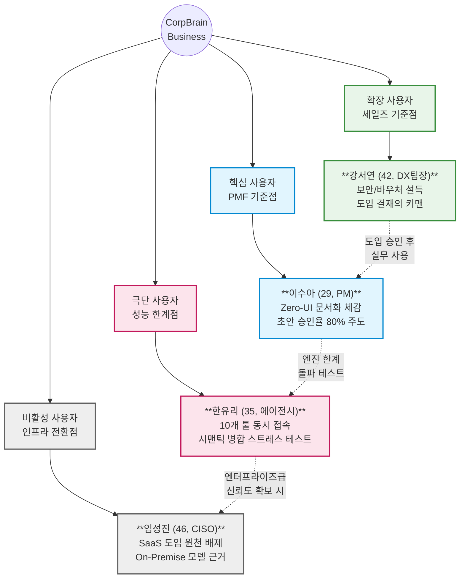
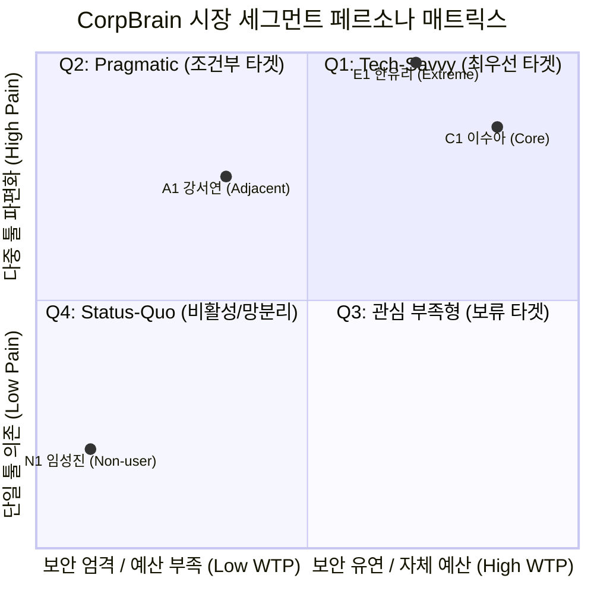
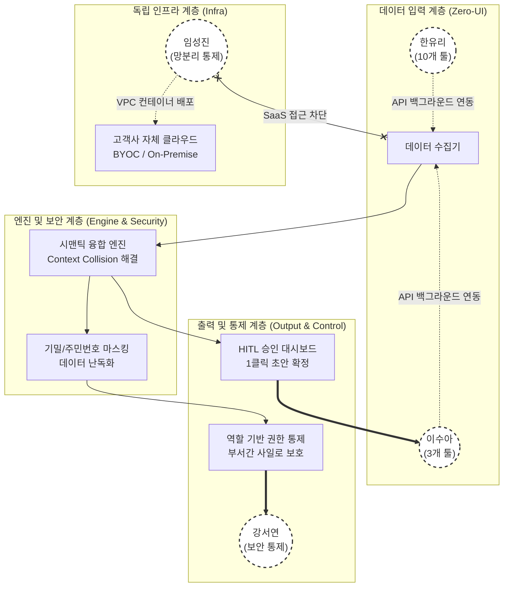
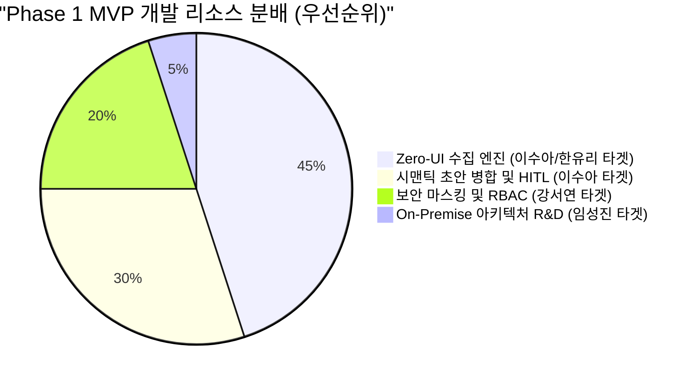

# **차세대 기업용 AI 문서화 에이전트(CorpBrain) — 고객 페르소나 스펙트럼 (최종)**

본 문서는 실재 가능성 검증 및 현실성 평가를 최종 통과한 4명의 페르소나를 종합하여, CorpBrain의 기능 기획과 B2B 영업 전략 수립의 기준으로 활용하기 위한 **최종 마스터 문서**입니다.

## **스펙트럼 구조 요약**

| 유형 | 채택 페르소나 | 목적 | 타겟 세그먼트 | 평가 점수 |
| --- | --- | --- | --- | --- |
| **핵심(Core)** | **이수아 (29, PM)** | 주력 타깃 — MVP(Zero-UI) 설계 및 PMF 지표의 핵심 기준 | Q1 (Tech-Savvy Innovators) | 실재 확률 90%+ |
| **확장(Adjacent)** | **강서연 (42, DX팀장)** | 인접 타깃 — B2B 세일즈 전략(예산·보안 우회로) 수립 기준 | Q2 (Pragmatic Explorers) | 실재 확률 90%+ |
| **극단(Extreme)** | **한유리 (35, 에이전시)** | 포용적 설계 — 엔진 스트레스 테스트 및 융합 한계치 기준 | Q4 변형 (다중 채널의 극한) | 실재 확률 80%+ |
| **비활성(Non-user)** | **임성진 (46, CISO)** | 시장 배제 — 진입 불가 조건 확인 및 인프라 로드맵 근거 | Q4 극단 (Status-Quo) | 실재 확률 95%+ |

---

## **1. 핵심 사용자 (Core) — 1명**

### **C1. 이수아 (29) — "파편화된 툴의 허브, 고통받는 PM"**

**세그먼트:** Q1 혁신적 IT 스타트업 | **역할:** 1년 차 SOM 제품 기획 및 성장의 핵심 엔진 | **평가:** 문제 ★★★★★ / 행동 ★★★★★ / 맥락 ★★★★★

| 항목 | 내용 |
| --- | --- |
| **유형명** | 파편화 융합형 실무자 |
| **직무** | 5인 규모 이커머스 스타트업 프로덕트 매니저(PM) |
| **주요 문제** | 기획(노션), 디자인(피그마), 개발(지라), 외부 소통(이메일) 탭을 모두 띄워놓고 각 채널의 히스토리를 매일 교차 대조하여 1~2시간씩 수동 문서화 작업에 낭비함. 동일 이슈임에도 지라의 결과(What)와 슬랙의 논의(Why)가 분리되어 맥락 단절(Context Collision) 발생. |
| **목표** | "백그라운드에서 알아서 슬랙/지라 데이터가 엮이고, 나는 퇴근 전 '초안 승인' 버튼 하나만 눌러 문서화가 끝났으면 좋겠다." |
| **사용 맥락** | 프로젝트 스프린트 진행 중, 정책 변경 히스토리를 누군가에게 설명해야 하거나 마일스톤 종료 후 회고/스펙 문서를 작성할 때. |
| **감정** | 매일 수작업으로 노션을 정리하는 것에 대한 **강한 피로감**. 바빠서 정리를 건너뛰었을 때 핵심 정보가 누락될까 봐 겪는 **불안과 허탈감**. |
| **대체 솔루션** | 노션 타임라인 수동 정리, 정기 회의를 통한 구두 인수인계, 슬랙 채널 내 수동 검색 |
| **핵심 니즈 기능** | 단방향 API 백그라운드 수집(Zero-UI) / 시간순·주제별 시맨틱 병합 초안 생성 / 가벼운 승인 절차(HITL 대시보드) / 원본 소스 딥링크 제공 |

> **MVP 설계 체크:** "이 기능이 이수아의 퇴근 전 노션 수동 정리 시간 1~2시간을 완전히 대체하는가?"

---

## **2. 확장 사용자 (Adjacent) — 1명**

### **A1. 강서연 (42) — "도입은 하고 싶은데, 예산과 보안이 막막한 팀장"**

**세그먼트:** Q2 실용적 탐색자 | **역할:** B2B 세일즈 및 파이프라인 개척 채널 | **평가:** 문제 ★★★★★ / 행동 ★★★★★ / 맥락 ★★★★

| 항목 | 내용 |
| --- | --- |
| **유형명** | B2B 도입 검토자 (결제 허들 보유) |
| **직무** | 15인 규모 전통 제조업 DX 담당 팀장 |
| **주요 문제** | 사내 지식 관리가 엉망이라 새로운 솔루션을 도입하고 싶으나, 경영진이 "영업 비밀을 왜 외부 AI에 넘기냐"며 강력히 반대함. 거기에 더해 자체적인 SaaS 지불 여력(예산)도 넉넉하지 않음. |
| **목표** | "경영진을 안심시킬 명확한 '보안 타협점(기밀 마스킹)'과 예산 부담을 덜어줄 '정부 지원금(AI 바우처)' 기반의 제안서가 필요하다." |
| **사용 맥락** | 10인 이상의 조직으로 넘어가며 부서 간 사일로가 발생할 때, 경영진에게 보고할 신규 솔루션(SaaS) 도입 기안을 작성하는 시점. |
| **감정** | 도입의 당위성을 증명해야 하는 **부담감**, 클라우드 연동에 따른 정보 유출 사고를 막아야 하는 **경계심과 우려**. |
| **대체 솔루션** | 구형 그룹웨어의 자체 게시판, 비싸고 성능이 떨어지는 레거시 사내망(On-Premise) 시스템 |
| **핵심 니즈 기능** | 주민번호 및 기업 기밀 마스킹 파이프라인 / 명확한 역할 기반 접근 제어(RBAC) / ROI(비용 절감) 산출 리포트 / AI 바우처 연계 가이드 |

> **확장 전략 체크:** "강서연에게 제공한 보안 아키텍처와 ROI 리포트가 경영진의 도입 결제를 받아낼 수 있는가?"

---

## **3. 극단 사용자 (Extreme) — 1명**

### **E1. 한유리 (35) — "클라이언트만 10곳, 10개 툴 동시 접속의 패닉"**

**세그먼트:** 극단 환경(Context Collision 극한) | **역할:** 엔진 스트레스 테스트 및 포용적 설계 기준 | **평가:** 문제 ★★★★★ / 행동 ★★★★★ / 맥락 ★★★★★

| 항목 | 내용 |
| --- | --- |
| **유형명** | 멀티호밍(Multi-homing) 한계 시험자 |
| **직무** | 10인 규모 디지털 대행사(에이전시) 프로젝트 매니저 |
| **주요 문제** | 클라이언트마다 슬랙, 잔디, 팀즈, 카톡 등 10개 이상의 다른 툴을 강제하여, 요구사항이 사방에서 쏟아짐. 누락 시 계약 위반이 되므로 10개 창을 띄워두고 수기로 강박적인 타임라인을 기록함. |
| **목표** | "수많은 외부 채널의 쏟아지는 산발적 요구사항이 누락 하나 없이 하나의 타임라인으로 자동 병합되었으면 좋겠다." |
| **사용 맥락** | 여러 클라이언트의 동시 다발적인 수정 요청이 쏟아지는 피크 타임, 혹은 누군가 "예전에 말씀드린 대로"라고 할 때 과거 흔적을 미친 듯이 검색해야 할 때. |
| **감정** | 정보의 폭포에서 겪는 **패닉과 산만함**. 하나라도 놓칠까 두려운 **강박과 극도의 피로감**. |
| **대체 솔루션** | 엑셀과 수첩에 타임라인 강박적 수기 기록 |
| **핵심 니즈 기능** | 5개 이상의 다중 채널 동시 융합(환각 없는 시맨틱 병합) / 원본 메시지 100% 추적 보장 체계 |

> **엔진 스트레스 체크:** "한유리의 10개 채널 메시지가 환각이나 순서 꼬임 없이 완벽한 타임라인으로 융합되는가?"

---

## **4. 비활성 사용자 (Non-user) — 1명**

### **N1. 임성진 (46) — "의료 데이터라 클라우드 반출은 불법입니다"**

**세그먼트:** Q4 (망분리 통제형) | **역할:** 엔터프라이즈 인프라 확장 로드맵 기준 | **평가:** 문제 ★★★★★ / 행동 ★★★★★ / 맥락 ★★★★★

| 항목 | 내용 |
| --- | --- |
| **유형명** | 규제 기반 원천 거부자 |
| **직무** | 12인 규모 헬스케어 스타트업 보안 책임자(CISO) |
| **비활성 핵심 이유** | **기능의 문제가 아니라 법과 규제의 문제.** 취급하는 정보가 민감한 의료 데이터라 외부 서드파티 AI나 클라우드 서버에 데이터를 올리는 행위 자체가 컴플라이언스 위반임. 문서화 편의성이 보안(망분리) 원칙을 절대 넘어설 수 없음. |
| **목표** | "문서화도 좋지만, 외부 인터넷과 완벽히 차단된 사내망(On-Premise)에서만 도는 시스템이 아니라면 절대 도입 불가." |
| **사용 맥락** | 영업팀의 SaaS(Option A) 도입 제안을 방화벽 정책과 규제를 근거로 최종 반려하는 결재 시점. |
| **감정** | 외부 솔루션에 대한 원천적 **불신 및 방어적 태도**. 통제권 유지를 위한 **단호함**. |
| **대체 솔루션** | 폐쇄망 내 자체 구축형 레거시 검색 엔진 |
| **활성화(전환) 조건** | SaaS 구독 모델로는 절대 불가능하며, 고객사 환경에 직접 배포하는 On-Premise 또는 BYOC 인프라 모델이 제공되어야만 영업 미팅 가능. |

> **인프라 로드맵 체크:** "임성진의 거절 사유가 장기적으로 CorpBrain이 Option B(구축형), Option C(BYOC)를 준비해야 하는 투자 유치 근거가 되는가?"

---

## **페르소나 간 비즈니스 사이클 연결 구조**

CorpBrain의 시장 진입 및 확장 전략은 아래와 같이 페르소나 간의 상호작용으로 완성됩니다.

```
[A1 강서연] — 경영진 보안 허들 돌파 (RBAC, 마스킹) 및 바우처 기반 결재 승인
       ↓ (도입 확정)
[C1 이수아] — 마찰 없는 Zero-UI 문서화로 실무 투입 → 초안 승인율 80% 달성 (PMF 입증)
       ↓ (기술 고도화)
[E1 한유리] — 이수아 모델을 10개 채널로 확장하여 엔진 스트레스 테스트 및 한계 돌파
       ↓ (성장기 진입)
[N1 임성진] — 스타트업에서 입증된 성능을 바탕으로, On-Premise 모델을 개발해 규제 시장(엔터프라이즈) 장악
```

---

## **페르소나별 MVP 기능 우선순위 매핑**

| CorpBrain MVP 핵심 기능 | C1 이수아 (실무/핵심) | A1 강서연 (도입/결재) | E1 한유리 (극한/검증) | N1 임성진 (거부/엔터) |
| --- | --- | --- | --- | --- |
| **이기종 채널 단방향 API 자동 수집 (Zero-UI)** | ★★★★★ | ★★★ | ★★★★★ | (SaaS 불가) |
| **시맨틱 융합 기반 히스토리 초안 생성** | ★★★★★ | ★★★ | ★★★★★ | (SaaS 불가) |
| **HITL(Human-in-the-loop) 가벼운 승인 UX** | ★★★★★ | ★★★★ | ★★★ | — |
| **원본 소스 딥링크(출처 추적)** | ★★★★ | ★★★ | ★★★★★ | — |
| **개인정보/기밀 마스킹 파이프라인** | ★★ | ★★★★★ | ★ | — |
| **권한 통제 (RBAC)** | ★★ | ★★★★★ | ★★ | (필수 전제) |
| **ROI(기회비용 절감) 대시보드 리포트** | ★ | ★★★★★ | ★ | — |
| **On-Premise / BYOC 인프라 제공** | — | — | — | ★★★★★ |

**👉 Phase 1 (출시 첫 3개월) 최우선 MVP 개발 초점:**
1. 이수아(C1)를 위한 **API 자동 수집 + 시맨틱 초안 생성 + HITL 대시보드** (기본 코어)
2. 강서연(A1)의 딜 클로징을 위한 **기밀 마스킹 파이프라인** (최소 보안 요구사항)

---

## **스펙트럼별 전략적 활용 가이드**

| 스펙트럼 | 활용 시점 (Action) | 핵심 검증 질문 (Checkpoint) |
| --- | --- | --- |
| **핵심 (C1 이수아)** | MVP 기능 우선순위 결정, 1차 PoC/베타테스터 리크루팅, PMF 핵심 지표(승인율) 설정 | "이 솔루션이 이수아의 퇴근 전 '수동 노션 타이핑'을 완벽하게 없애주는가?" |
| **확장 (A1 강서연)** | B2B 세일즈 덱(Sales Deck) 작성, AI 바우처 공급기업 등록, 보안 기능 로드맵 설정 | "영업 미팅에서 강서연 뒤에 있는 경영진의 '데이터 유출' 우려를 데이터로 잠재울 수 있는가?" |
| **극단 (E1 한유리)** | AI 병합 엔진 아키텍처 설계, 다중 채널 엣지 케이스(Edge Case) 오류 테스트 | "환각(Hallucination) 없이 10개의 채널 메시지가 하나의 타임라인으로 정확히 융합되는가?" |
| **비활성 (N1 임성진)** | 장기 인프라 로드맵 수립, 엔터프라이즈 B2B 거절 사유 방어 체계 수립 | "스타트업을 넘어 금융/의료 기업을 뚫기 위해 언제 구축형(On-Premise) 모델로 전환할 것인가?" |


## **Map 1. 스펙트럼 전체 구조 (Spectrum Overall Structure)**
각 페르소나가 CorpBrain 비즈니스 내에서 어떤 역할을 담당하며 어떻게 상호작용하는지를 보여주는 전체 구조도입니다.



---

## **Map 2. 시장 세그먼트 매트릭스 (Market Segment Quadrant)**
TAM-SAM-SOM 산출 시 정의했던 '파편화 고통'과 '결제 의향/보안 유연성'을 축으로 4명의 페르소나 위치를 맵핑했습니다.


- **해석:** 이수아(우상단)가 가장 이상적인 수익원이지만, 실제 B2B 시장의 파이를 키우려면 예산/보안 장벽에 막혀있는 강서연(좌상단)을 Q1 영역으로 끌어와야(마스킹, 바우처 등) 합니다. 임성진은 현재의 SaaS 모델로는 절대 도달할 수 없는 좌하단에 위치합니다.

---

## **Map 3. 전환 및 바이럴 흐름도 (B2B Sales & Viral Flow)**
실제 기업에 CorpBrain 솔루션이 안착하고 확장되는 과정에서 각 페르소나가 어떤 흐름으로 엮이는지 보여줍니다.

```mermaid
graph LR
    classDef sales fill:#FFF3E0,stroke:#F57C00,stroke-width:2px
    classDef product fill:#E3F2FD,stroke:#1976D2,stroke-width:2px
    classDef expansion fill:#F3E5F5,stroke:#7B1FA2,stroke-width:2px

    Start(영업/마케팅 시작) --> SalesDeck["보안 아키텍처 및<br>ROI 절감 리포트 제시"]:::sales
    SalesDeck --> A1["**강서연 (도입 검토)**<br>경영진 설득 및 바우처 확보"]:::sales
    A1 -- 사내망 도입 승인 --> C1["**이수아 (실무 적용)**<br>노션 수동 문서화 중단"]:::product
    C1 -- 무수정 승인 80% 달성 --> Viral["사내 타 부서로 바이럴<br>엔진 신뢰도 획득"]:::product
    
    Viral --> E1["**한유리 (극한 환경)**<br>고도화된 다중 툴 연동"]:::expansion
    E1 -- 극단적 병합 성공 --> Ent["엔터프라이즈급 성능 완성"]:::expansion
    Ent -.-> N1["**임성진 (규제 시장)**<br>On-Premise 패키지 제안"]:::expansion
```



---

## **Map 4. 플랫폼 접점 모델 (Platform Touchpoint Model)**
페르소나들이 CorpBrain 제품의 **어떤 계층(Layer)의 피처(Feature)**와 직접적으로 상호작용하는지 아키텍처 관점에서 시각화했습니다.



---

## **Map 5. 제품 설계 우선순위 (Product Design Priority)**
MVP(최소 기능 제품) 개발 시 리소스를 어디에 집중해야 하는지, 페르소나별 비중을 나타냅니다.



### **우선순위 해석:**
1. **45% (Zero-UI 엔진):** 사용자가 직접 입력하는 마찰을 없애는 것이 핵심이자, E1(한유리)의 극한 환경까지 버텨야 하므로 가장 많은 엔지니어링 리소스가 투입됩니다.
2. **30% (HITL 및 병합):** 이수아(C1)가 심리적 통제감을 느끼며 초안을 승인할 수 있는 대시보드 개발에 집중합니다.
3. **20% (보안 및 마스킹):** 강서연(A1)을 설득하기 위한 최소한의 B2B 세일즈 무기(Table Stakes)를 구축합니다.
4. **5% (On-Premise 준비):** 당장 개발하지는 않으나, 임성진(N1)의 요구사항을 아키텍처 초기 설계(모듈화 등)에 반영해 두어 훗날 기술 부채를 방지합니다.
