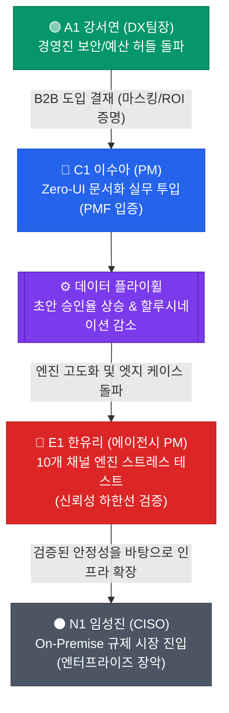

# 고객 여정지도 (CJM) — 차세대 기업용 AI 문서화 에이전트(CorpBrain)

본 문서는 CorpBrain의 주요 페르소나 스펙트럼(`7_페르소나_스펙트럼_최종.md`)을 바탕으로, 4가지 핵심 페르소나가 서비스를 접하고 의사결정하는 여정을 구조화한 마스터 문서입니다. 각 여정 단계별 **Pain Point**와 이를 극복하기 위한 **개선 기회**를 도출하여 제품 기획 및 세일즈 전략의 기준으로 삼습니다.

---

## CJM 01 · 핵심 사용자 (Core)

### C1 이수아 (29) — 파편화된 툴의 허브, 고통받는 PM (제품 실무자)

> **여정 특성:** 수동 문서화 작업에 강한 피로감을 느끼며, 기존 업무 흐름을 방해하지 않는 'Zero-UI' 기능에 즉각 반응합니다. 실무적 효용성(퇴근 시간 단축)이 증명되면 가장 강력한 사내 옹호자이자 전도사가 됩니다.

| 단계 | 고객 행동 | 고객 생각 | 감정 | Pain Point | 개선 기회 |
| --- | --- | --- | --- | --- | --- |
| **인지** | 슬랙, 지라, 노션을 오가며 수동으로 문서 정리를 하다가 지쳐 "슬랙 지라 자동 연동 문서화" 등을 검색. IT 커뮤니티에서 추천글 접촉. | "제발 누가 이거 좀 대신 정리해주는 AI 없나? 단순 반복 작업에 시간 뺏기는 거 너무 지친다." | 피로감 + 절실함 | **수많은 툴을 엮어줄 단일 허브의 부재** — 개별 툴의 자동화는 있지만, '이기종 채널 간의 맥락(Context)'을 하나로 병합해 주는 솔루션을 찾지 못함. | 핵심 키워드(슬랙/지라 동시 연동) 중심의 SEO 최적화. "퇴근 시간 1시간 단축" 카피라이팅 노출. |
| **고려** | 랜딩 페이지 접속. "Zero-UI 백그라운드 수집"과 "시맨틱 융합" 기능 작동 방식 탐색. 기존 업무 흐름 방해 여부 의심. | "또 새로운 툴 사용법을 배워야 하는 건가? 기존 업무 흐름을 방해하면 오히려 더 번거로운데..." | 호기심 + 경계심 | **새로운 툴 학습에 대한 높은 심리적 장벽** — 또 하나의 툴(SaaS)을 관리해야 한다는 부담감이 도입 시도의 가장 큰 허들. | "새로운 창을 띄울 필요가 없습니다(Zero-UI)" 강조. 1분 데모 영상으로 백그라운드 작동 방식 시각화. |
| **결정** | 백그라운드 작동 방식 및 HITL(초안 승인) 인터페이스 확인 후 플랜 가입 시도. 슬랙 및 지라 API 연동 과정 진입. | "내가 할 일은 퇴근 전 초안 승인뿐이라고? 이 정도면 밑져야 본전이지. 일단 연동해보자." | 기대감 + 결단 | **권한 연동 과정의 번거로움과 보안 우려** — 슬랙/지라 API 연동(OAuth) 과정이 복잡하거나 과도한 쓰기 권한 요구 시 즉시 이탈. | 1-Click 연동 UI 제공. "최소 읽기 권한(Read-only)만 요구합니다"라는 명확한 권한 안내 문구 전면 배치. |
| **온보딩** | 첫 업무일 종료 후 대시보드 접속. 생성된 "오늘의 히스토리 초안" 확인. 원본 딥링크로 병합 정확도 교차 검증. | "오, 슬랙에서 A팀장이 말한 거랑 지라 티켓 내용이 잘 연결됐네? 원본 링크도 바로 가지니 안심된다." | 놀라움 + 안도감 | **초기 생성 초안의 할루시네이션(환각) 및 정보 누락** — 첫 초안 맥락이 꼬여 있으면 즉시 신뢰 상실 및 이탈. | 원본 딥링크 필수 제공으로 즉각적 사실 확인(Fact-check) 지원. |
| **충성도** | 매일 퇴근 전 10분만 대시보드를 확인하고 초안을 노션으로 내보내기. 문서화 시간이 1~2시간에서 10분으로 단축. | "이거 없으면 예전으로 못 돌아가. PM들한테 완전 필수템이네. 다른 팀에도 써보라고 해야지." | 강한 만족감 + 전도사 | **새로운 업무 채널 연동 미지원** — 업무 확장 시 연동 채널 한계에 부딪히면 병목 현상 재발. | 사용자가 연동 희망 채널을 투표할 수 있는 로드맵 게시판 운영 및 지속적 Integration 추가. |

**플랫폼 핵심 가치:** "매일 2시간 걸리던 문서 정리를 퇴근 전 10분, 버튼 1개 클릭으로 끝냅니다."

---

## CJM 02 · 확장 사용자 (Adjacent)

### A1 강서연 (42) — 예산과 보안이 막막한 DX 팀장 (B2B 의사결정자)

> **여정 특성:** 실무진(C1)의 니즈를 인지하고 있으나, '보안 통제'와 '도입 명분(비용 절감)'이 최우선입니다. 이 여정의 마찰을 줄이는 것이 세일즈 클로징의 핵심입니다.

| 단계 | 고객 행동 | 고객 생각 | 감정 | Pain Point | 개선 기회 |
| --- | --- | --- | --- | --- | --- |
| **인지** | 실무진으로부터 도입 건의를 받음. "보안 마스킹 탑재 AI" 키워드로 상세 페이지 검토. | "실무진들이 원하긴 하는데... 경영진이 기밀 유출된다고 난리 칠 텐데." | 우려 + 방어적 | **강력한 사내 보안 규정과 예산 압박** — '데이터 유출 리스크'와 '도입 예산'이 1차 원천 차단 허들. | 랜딩 페이지 최상단에 "엔터프라이즈급 보안 및 마스킹 인증" 로고 배치. |
| **고려** | 권한 통제(RBAC)와 개인정보 마스킹 아키텍처 확인. 영업팀에 'AI 바우처' 가능 여부 문의. | "기밀 정보가 마스킹 처리되고 바우처까지 되면 경영진 설득할 명분이 생기겠는데?" | 안도감 + 계산 | **경영진 보고를 위한 정량적 도입 명분(ROI) 부족** — 명확한 비용 절감 및 보안 통제 근거 부재 시 기안 반려. | 월간 기회비용 절감(ROI) 시뮬레이터 제공. 도입 품의서용 템플릿(Sales Deck) 다운로드 지원. |
| **결정** | 미팅 후 보안 백서 및 ROI 리포트를 첨부하여 경영진 보고, 최종 결재(구매) 획득. | "지원금으로 예산 줄였고, 보안 가이드 확실하니 무난히 통과되겠지." | 확신 + 성취감 | **복잡하고 긴 B2B 구매 및 보안 심의 사이클** — 내부 보안 검토에서 기술 증명이 지연되면 도입 모멘텀 상실. | 도입 검토용 테스트 계정 신속 제공. 전용 '기술 보안 백서' 세일즈 키트 제공. |
| **온보딩** | 관리자 계정 활성화 후 조직도 연동. 부서별/직급별 RBAC 초기 세팅. | "직원들 권한 꼬이거나 엉뚱한 정보 접근하면 내 책임이 커지는데 설정이 직관적인가?" | 긴장 + 책임감 | **관리자 환경 셋업의 복잡성** — 권한 설정이 복잡하면 부서 확산이 지연되고 리소스 낭비. | SSO(SAML) 기반 원클릭 조직도 연동 및 엔터프라이즈 전담 CSM 배정. |
| **충성도** | 분기별 리포트를 통해 전사 생산성 향상을 수치로 확인. 전사 라이선스 확장 검토. | "생산성 올라간 게 지표로 확실히 보이니 연말 성과로 충분히 인정받겠어." | 만족감 + 신뢰 | **도입 후 정량적 성과 측정 도구 부재** — 솔루션 성과를 수치로 파악하지 못하면 갱신 거절 가능성. | 대시보드 내 '절감된 업무 시간' 기반 시각화 리포트 정기 생성 및 이메일 발송. |

**플랫폼 핵심 전략:** "경영진을 단번에 설득할 수 있는 완벽한 보안 명분과 비용 절감 지표 제공."

---

## CJM 03 · 극단 사용자 (Extreme)

### E1 한유리 (35) — 클라이언트만 10곳, 10개 툴 동시 접속의 패닉 (에이전시 PM)

> **여정 특성:** 채널 다원화의 극한을 경험하는 유저입니다. E1을 만족시키는 극단적인 데이터 투명성과 정합성 기준이, 역으로 C1(핵심 사용자)이 안심하고 사용할 수 있는 **신뢰 설계의 하한선(Baseline)**이 됩니다.

| 단계 | 고객 행동 | 고객 생각 | 감정 | Pain Point | 개선 기회 |
| --- | --- | --- | --- | --- | --- |
| **인지** | 10개 이상의 툴에서 쏟아지는 요청을 수기로 정리하다가 한계에 달해 "다중 채널 알림 통합" 검색. | "이러다 진짜 하나 누락해서 위약금 물겠다. 흩어진 채널 다 하나로 모아주는 거 없나?" | 패닉 + 강박 | **물리적인 툴 파편화의 극단적 심화** — 단순히 1~2개가 아닌 다수의 외부 폐쇄형 툴을 동시에 모니터링해야 하는 환경적 한계. | "10개 이상 다중 채널 동시 연동 스트레스 테스트 완료" 등 극한 환경 안정성 강조. |
| **고려** | CorpBrain의 시맨틱 융합 기능을 보며 여러 클라이언트의 유사한 요청이 엉키지 않을지 의심. | "단순히 긁어오는 건 잽피어로도 되는데. 얘네는 맥락을 안 꼬이게 잘 묶어줄까?" | 날카로운 의심 | **단순 데이터 수집을 넘어선 '시맨틱 분류' 신뢰성 부족** — 수많은 데이터가 환각 없이 정확하게 묶이는지에 대한 강한 의구심. | 다중 채널 데이터가 하나의 타임라인으로 병합되는 복잡계 과정을 시연하는 인터랙티브 데모. |
| **결정** | 100% 원본 추적(딥링크) 보장 체계 확인. 오류 발생 시 원본으로 즉시 복귀 가능하다는 확신 획득. | "초안이 좀 틀려도 원본 링크가 무조건 붙어있으면 팩트체크가 되니까 리스크 감수할 만하네." | 조건부 수용 | **AI의 정보 누락 가능성에 대한 극도의 공포** — 정보 누락이 계약 위반으로 직결되므로 AI를 100% 맹신할 수 없음. | "원본 데이터 100% 매핑 보장", "AI 누락 방지 안전망" 등 기능적 안전장치 전면 노출. |
| **온보딩** | 복잡한 클라이언트 프로젝트 3개를 동시 연동하여 병합 테스트. 꼬임 발생 시 즉각적 HITL 피드백. | "채널 A랑 채널 B 대화가 살짝 섞였네? 여기서 교정하면 다음엔 안 헷갈리려나?" | 예민함 + 검증 | **엣지 케이스 처리 시 발생하는 오류 교정 마찰** — 유사 프로젝트명 등 복잡한 맥락에서 AI 혼동 시 교정하는 과정의 번거로움. | 사용자가 직접 병합/분리 규칙을 미세 조정할 수 있는 '고급 태깅 및 필터링' 셋업 제공. |
| **충성도** | 환각 없이 대규모 채널 병합 확인 후 에이전시 내 확산. 데이터 정합성 유지 시 절대적 의존. | "이 엔진 진짜 물건이네. 10개 창 띄워놓던 패닉이 사라졌어. 절대 해지 못해." | 절대적 의존 | **연동 채널 API 변경에 따른 서비스 중단 리스크** — 특정 채널 API 정책 변경으로 연동 중단 시 즉시 업무 마비. | 써드파티 API 장애 시 즉각 알림 및 폴백(Fallback, 수동 업로드 등) 시스템 선제적 구축. |

**플랫폼 핵심 역할:** "가혹한 엔진 스트레스 테스트 보장. 여기서 환각이 안 생기면, 일반 기업에서도 절대 안 생깁니다."

---

## CJM 04 · 비활성 사용자 (Non-user)

### N1 임성진 (46) — "의료 데이터라 클라우드 반출은 불법입니다" (CISO)

> **여정 특성:** 제품 기능의 우수성과 무관하게 컴플라이언스(망분리) 규제로 인해 이탈합니다. 이 여정은 CorpBrain이 SaaS 시장을 넘어 엔터프라이즈로 확장하기 위해 직면하는 **시장 진입의 물리적 한계선**을 보여줍니다.

| 단계 | 고객 행동 | 고객 생각 | 감정 | Pain Point | 개선 기회 |
| --- | --- | --- | --- | --- | --- |
| **인지** | 실무 부서에서 CorpBrain SaaS 버전 도입 기안을 결재선에 올림. | "의료 데이터 다루는 회사에서 클라우드 SaaS를 쓰겠다고? 보안 규정 위반인데." | 원천 거부감 | **SaaS 아키텍처 자체가 컴플라이언스(망분리) 위반** — 솔루션의 기능과 무관하게 외부 서버 전송 구조 자체가 원천 불가 사유. | (SaaS 단계 아님) 엔터프라이즈 전용 On-Premise 구축 페이지로 별도 라우팅. |
| **고려** | 상세페이지의 데이터 마스킹 기술을 보더라도 "결국 서버 밖으로 나가는 건 안 됨"이라며 선 긋기. | "스타트업 제품이라 우리 내부망에 직접 설치(On-Premise)해 줄 기술력은 안 될 텐데." | 불신 + 방어 | **외부 클라우드 의존성에 대한 극도의 리스크 회피** — 데이터 통제권을 자사가 100% 통제해야 한다는 보수적 원칙. | On-Premise 구축형 모델 또는 BYOC(Bring Your Own Cloud) 아키텍처 옵션 제공 기획. |
| **결정** | 기안 최종 반려. 사내망 내 설치(On-Premise) 패키지가 존재할 때만 다시 영업 미팅을 허용하겠다고 통보. | "나중에 우리 망에 직접 배포해줄 수 있는 엔터프라이즈 수준으로 크면 그때 가져오라고 해." | 통제권 유지 | **엔터프라이즈 인프라 대응 역량 부족** — 금융/의료 시장 진입을 위한 독립 배포 환경 부재 시 B2B 시장 확장 정체. | 벤더 종속성을 제거한 도커/쿠버네티스 기반 독립 배포형 엔터프라이즈 패키지 선제 연구. |
| **온보딩** | (미도달) | - | - | - | - |
| **충성도** | (미도달) | - | - | - | - |

**플랫폼 핵심 활용:** "SaaS가 침투할 수 없는 엔터프라이즈 시장의 거절 사유를 역산하여, 다음 투자 라운드의 인프라 구축(On-Premise) 로드맵 근거로 활용."

---

## 4대 페르소나 여정 교차 인사이트 및 우선 해결 과제

단일 페르소나가 아닌 4명의 스펙트럼이 교차할 때, 플랫폼이 반드시 사수해야 할 절대 원칙이 도출됩니다.

1. **데이터 통제 및 신뢰 (보안/환각 검증): `E1 + A1`**
   - E1의 극단적 채널 연동에서 '100% 원본 딥링크 추적'이 보장되어야만, C1이 안심하고 초안을 승인할 수 있습니다.
   - A1의 마스킹 요구조차 통하지 않는 N1(망분리)의 존재는, 향후 CorpBrain이 On-Premise로 가야만 하는 명백한 한계 지표입니다.
2. **도입 및 학습 마찰 (UX 최적화): `C1 + A1`**
   - C1을 위한 Zero-UI(업무 흐름 방해 제로)가 완벽해야만 실무진의 저항이 없습니다.
   - A1을 위한 관리자 설정(RBAC, 조직도 연동)이 원클릭 수준이어야 전사 확산 시 족쇄가 되지 않습니다.
3. **정량적 효용 증명 (B2B 결재 논리): `A1`**
   - 문서 자동화가 '실제 기회비용 절감(ROI)'으로 치환되는 대시보드가 없다면, 실무자(C1)가 아무리 좋아해도 결재자(A1) 선에서 갱신이 거절됩니다.

### 플랫폼 성장 경로 — 여정 연결 구조

### 단계별 핵심 개선 기회 요약

| CJM 단계 | 가장 큰 공통 Pain | 최우선 개선 기회 (Key Feature) | 우선 해결 페르소나 |
| --- | --- | --- | --- |
| **인지** | 정보 보안에 대한 강한 우려 & 수동 업무 한계 | "엔터프라이즈급 보안" 메시징 & "퇴근 시간 단축" 타겟팅 | C1, A1 |
| **고려** | UI 변화에 대한 저항감 & 데이터 융합 신뢰 부족 | "Zero-UI" 백그라운드 구동 & 환각 없는 시맨틱 병합 데모 | C1, E1 |
| **결정** | B2B 도입 명분(ROI) 부족 & 누락 공포 | 자동화 ROI 리포트 제공 & 100% 원본 딥링크 추적 보장 | A1, E1 |
| **온보딩** | 관리자 권한(RBAC) 세팅 복잡성 & 엣지 케이스 오류 | SSO 연동 및 원클릭 조직도 셋업 & HITL 피드백 루프 | A1, C1 |
| **충성도** | 확장성 부족(미지원 채널) & 정량적 성과 증명 부재 | 유저 주도 Integration 로드맵 & 자동화 성과 시각화 리포트 | C1, A1 |
