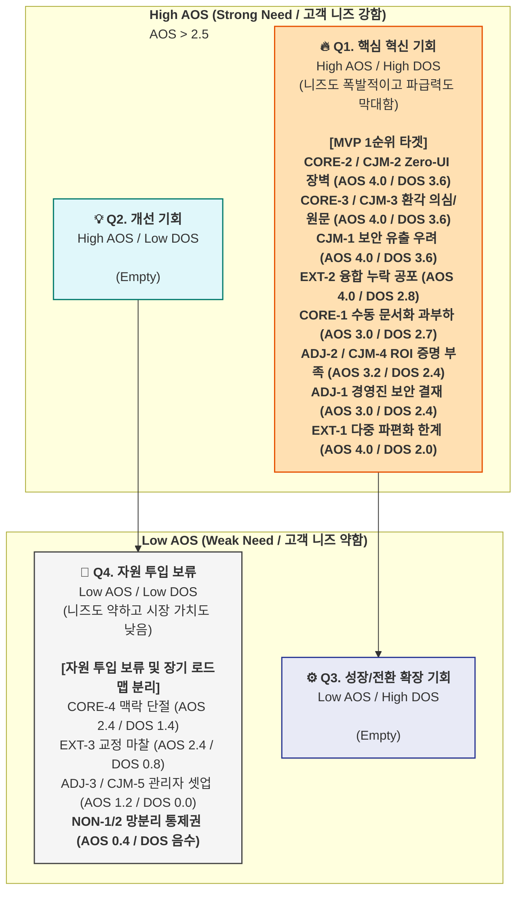

# 최종 시장 기회 판단 (AOS+DOS) — CorpBrain

### **1. DOS 산출 근거 (Market Relevance 평가 기준)**

---

DOS(최종 시장 기회 지표)를 계산하기 위해 각 Pain/Goal이 전체 B2B 시장(TAM/SAM/SOM)에서 차지하는 **전략적 중요성(Market Relevance)**을 수치화했습니다.

- **(높음: 0.8~0.9):** SOM 수익 엔진의 55% 이상을 차지하는 핵심 실무자(C1)가 사용을 지속하기 위한 필수 조건이거나, B2B 도입의 절대적 허들을 쥐고 있는 결재자(A1)를 설득하는 결정적 관문입니다. (예: Zero-UI 환경, 원본 딥링크 매핑, 기밀 마스킹 아키텍처, 실질적 ROI 증명)
- **(중간: 0.6~0.7):** 극한의 다중 채널(E1)을 융합하는 엔진 신뢰성의 하한선 등 파급력은 높지만, 모든 기업이 즉시 직면하는 최우선 진입 조건은 아닌 경우입니다.
- **(낮음: 0.5 이하):** 망분리 환경(N1)과 같이 현재의 SaaS 모델로는 매출 기여가 사실상 불가능한 영역이거나, 수동으로 충분히 우회 가능한 단순 불편함입니다.

---

### **2. 🚀 종합 기회 평가표 (AOS vs. DOS)**

이 분석은 **"고객이 이 문제를 얼마나 절박하게 생각하는가?(AOS)"**와 **"이 문제를 해결하는 것이 우리 솔루션의 매출/확산에 얼마나 큰 영향을 미치는가?(DOS)"**를 종합적으로 평가합니다.

- **AOS 기준:** 2.5 초과 시 'High' / 2.5 이하 시 'Low'
- **DOS 기준:** 1.5 초과 시 'High' / 1.5 이하 시 'Low'

| **분류 (세그먼트)** | **Pain / Goal** | **Imp** | **Sat** | **AOS** | **Market Rel.** | **DOS** | **Quadrant** | **전략적 해석** |
| --- | --- | --- | --- | --- | --- | --- | --- | --- |
| **Core (C1)** | 새로운 툴 학습 심리적 장벽 (CORE-2) | 5 | 1 | **4.0** | 0.9 | **3.6** | **Q1** | **(1순위)** "보이지 않는 백그라운드 구동(Zero-UI)"이 온보딩 이탈을 막는 핵심. |
| **Core (C1)** | AI 환각 의심 및 원본 추적 (CORE-3) | 5 | 1 | **4.0** | 0.9 | **3.6** | **Q1** | **(1순위)** B2B 환경에서 생성 AI 결과를 신뢰하게 만드는 절대 기준 (딥링크). |
| **CJM (인지)** | 외부 AI 연동 정보 유출 (CJM-1) | 5 | 1 | **4.0** | 0.9 | **3.6** | **Q1** | **(1순위)** 엔터프라이즈 도입 논의의 1차 관문 (마스킹). |
| **CJM (고려)** | UI 변화 저항/워크플로우 붕괴 (CJM-2) | 5 | 1 | **4.0** | 0.9 | **3.6** | **Q1** | **(1순위)** 기존 툴(슬랙, 지라)에서 벗어나지 않게 하는 전략. |
| **CJM (결정)** | AI 환각 의심 및 누락 공포 (CJM-3) | 5 | 1 | **4.0** | 0.9 | **3.6** | **Q1** | **(1순위)** 최종 도입 결정을 짓는 데이터 신뢰 구조화의 핵심. |
| **Extreme (E1)** | 시맨틱 융합 오류 및 누락 공포 (EXT-2) | 5 | 1 | **4.0** | 0.7 | **2.8** | **Q1** | **(1순위)** 다중 채널이 꼬이지 않음을 증명하여 B2B 전반의 불신 종식. |
| **Core (C1)** | 이기종 툴 수동 문서화 과부하 (CORE-1) | 5 | 2 | **3.0** | 0.9 | **2.7** | **Q1** | **(1순위)** "퇴근 시간 단축"이라는 프로덕트 본질적 가치이자 주력 소구점. |
| **Adjacent (A1)** | 경영진 기밀 유출 우려 (ADJ-1) | 5 | 2 | **3.0** | 0.8 | **2.4** | **Q1** | **(1순위)** B2B 도입 시 가장 큰 결재 허들 돌파 요건. |
| **Adjacent (A1)** | 정량적 도입 명분(ROI) 증명 부족 (ADJ-2) | 4 | 1 | **3.2** | 0.8 | **2.4** | **Q1** | **(1순위)** 차년도 라이선스 전사 확장(갱신율) 및 세일즈 무기로 직결. |
| **CJM (결정)** | 정량적 ROI 명분 부족 (CJM-4) | 4 | 1 | **3.2** | 0.8 | **2.4** | **Q1** | **(1순위)** B2B 영업 시 반드시 필요한 자동화 ROI 성과 리포트. |
| **Extreme (E1)** | 10개 채널 파편화 극단 심화 (EXT-1) | 5 | 1 | **4.0** | 0.5 | **2.0** | **Q1** | (2순위) 고통 강도(AOS)는 최고이나 절대 시장 볼륨이 작아 직접 파급력 제약. |
| **Core (C1)** | 동일 이슈의 맥락 단절 (CORE-4) | 4 | 2 | **2.4** | 0.7 | **1.4** | **Q4** | (보류) 문서 수집 자동화라는 핵심 엔진 이후에 고도화할 추적성 영역. |
| **Extreme (E1)** | 엣지 케이스 오류 교정 마찰 (EXT-3) | 4 | 2 | **2.4** | 0.4 | **0.8** | **Q4** | (보류) 사용 빈도나 파급력이 상대적으로 낮음. |
| **Adjacent (A1)** | 관리자 세팅(RBAC) 복잡성 (ADJ-3) | 3 | 3 | **1.2** | 0.6 | **0.0** | **Q4** | (보류) 시스템적 자동화보다 CS 지원이나 온보딩 매뉴얼로 단기 해결 가능. |
| **CJM (온보딩)** | 관리자 권한 세팅 복잡성 (CJM-5) | 3 | 3 | **1.2** | 0.6 | **0.0** | **Q4** | (보류) 상동. |
| **Non-user (N1)** | 클라우드 반출 불가 (NON-1) | 2 | 4 | **0.4** | 0.2 | **-0.4** | **Q4** | **(무시)** 규제적 진입 장벽. SaaS로는 매출 불가. 구축형 사업 전환 시 검토. |
| **Non-user (N1)** | 서드파티 통제권 상실 우려 (NON-2) | 1 | 4 | **0.2** | 0.1 | **-0.3** | **Q4** | **(무시)** 고객이 직접적 Pain을 느끼지 않고 만족 중이므로 투입 낭비. |

---

### **3. AOS vs. DOS 기회 포트폴리오 (Mermaid)**

---

### **4. 최종 전략 결론: MVP의 우선순위**

AOS와 DOS의 교차 분석을 통해, 초기 자원을 어디에 '올인(All-in)'해야 하는지 매우 명확한 **시장 진입 로드맵**이 도출되었습니다. B2B 시장 특성상, 실무자의 편의성과 결재권자의 보안 논리를 동시에 충족시키지 못하면 PMF에 도달할 수 없습니다.

### **Phase 1 (MVP 핵심): Q1 "핵심 혁신 기회" 집중 (AOS & DOS 모두 최상위)**

CorpBrain의 MVP는 화려한 부가 기능(대시보드 UI, 고급 어드민 권한 설정 등)을 버리고, 오직 **'저항 없는 수집'**과 **'완벽한 신뢰'** 두 가지를 증명하는 데 모든 역량을 투입합니다.

1. **마찰 제로의 백그라운드 엔진 (CORE-2, CORE-1, CJM-2):**
   - 새로운 탭을 여는 행위 자체를 차단하는 **Zero-UI 아키텍처**를 최우선 구현합니다. 사용자가 슬랙과 지라에서 평소처럼 일하기만 하면, 퇴근 전 문서화가 완료되는 경험이 SOM 수익 엔진의 기반입니다.
2. **환각 공포를 불식시키는 신뢰 설계 (CORE-3, EXT-2, CJM-3):**
   - 생성된 요약 문서의 모든 문장에 **'100% 원본 딥링크'**를 매핑합니다. 오류가 생겨도 원본으로 1초 만에 돌아가 팩트체크할 수 있는 안전망이 없으면 B2B에서 AI는 채택될 수 없습니다.
3. **B2B 결재 허들 돌파 무기 확보 (CJM-1, ADJ-1, ADJ-2):**
   - 경영진의 1차 거절 사유인 기밀 유출을 막는 **'엔터프라이즈급 마스킹 파이프라인'**과, 갱신의 근거가 될 **'자동화 ROI(절감 시간/비용) 시뮬레이터'**를 런칭 첫날부터 세일즈 키트로 탑재합니다.

### **Phase 2 (확장 보조): Q1 하위 극단 환경 고도화**

- **스트레스 테스트 입증 (EXT-1):** 에이전시나 대형 IT 벤더 등 다중 파편화가 극심한 곳(10개 이상 채널 연동)의 데이터를 무너짐 없이 병합해 냅니다. 시장 규모는 작으나 "극한 환경에서도 버틴 엔진"이라는 마케팅 브랜딩 에셋으로 활용합니다.

### **Phase 3 (보류/무시): Q4 "자원 투입 보류" (AOS & DOS 모두 낮음)**

- **망분리 규제 타겟 완전 배제 (NON-1, NON-2):** On-Premise 망분리 규제를 받는 금융/의료 페르소나를 설득하기 위해 SaaS 기능 커스터마이징을 시도하는 것은 막대한 리소스 낭비입니다. 현재 MVP 타겟에서 철저히 배제하며, 추후 독립형(도커/쿠버네티스) 패키지를 출시할 때 엔터프라이즈 B2B 세일즈로 분리 공략합니다.
- **관리자 기능 후순위 (ADJ-3, CJM-5):** RBAC(역할 기반 접근) 세팅의 편의성은 작동만 하면 되므로, 초기에는 화려한 UI보다는 전담 CSM의 개입으로 마찰을 수동 무마합니다.
