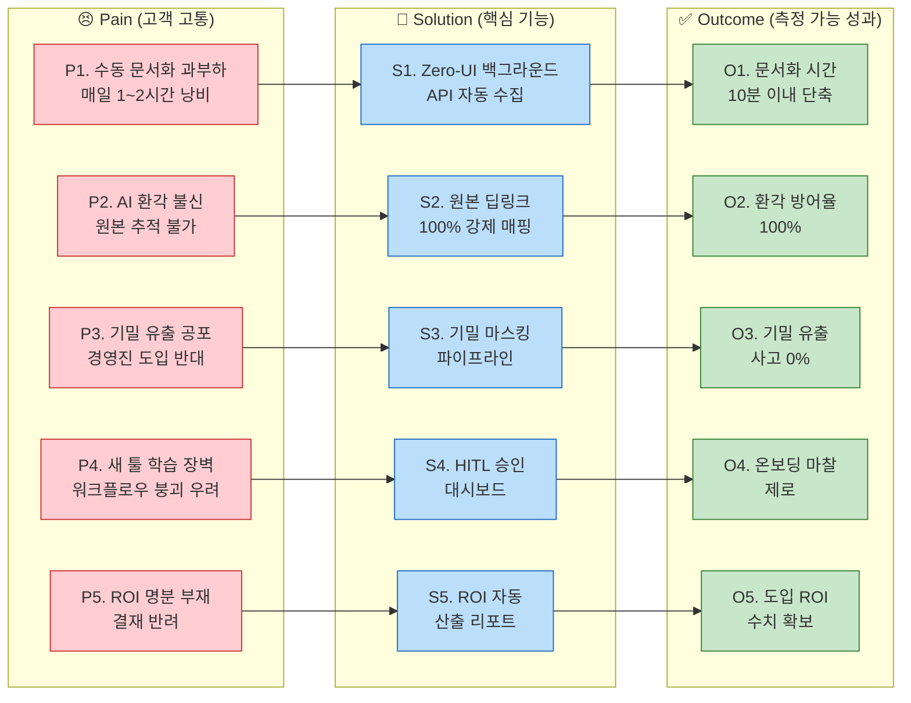

# CorpBrain Value Proposition Sheet v2 (Problem–Solution Fit) - Part 1

> **작성일:** 2026-04-29 | **버전:** v2 (GEMINI & OPUS 통합본 - Part 1)
> **대상 독자:** 처음으로 본격적인 신규 B2B SaaS 사업을 기획하는 예비 창업자 (대표님)
> **작성 목적:** 타겟 고객의 문제와 해결책의 핏(Problem-Solution Fit)을 검증하고, 직관적인 고객 가치 제안을 포괄적으로 정리한 문서입니다.

---

## 1. Pain–Solution–Outcome 핵심 흐름 정리

비즈니스의 복잡한 로직을 투자자와 고객에게 직관적으로 설명하기 위한 가치 흐름과 시스템 아키텍처 연계도입니다.

### 1-1. 전체 구조도 (Mermaid)

### 1-2. 페르소나별 요약 테이블

| 단계 | 실무자 (C1: 이수아 PM) | 결재권자 (A1: 강서연 팀장) | 극한 환경 유저 (E1: 한유리 PM) |
| --- | --- | --- | --- |
| **Pain (고통)** | 수많은 툴(슬랙, 지라) 파편화로 매일 1~2시간씩 수동 문서화 노동에 시달림. AI 환각 불신. | AI 도입 시 기밀 유출 반대, 확실한 비용 절감(ROI) 명분 부재. | 10개 이상 툴 파편화로 인한 패닉, 정보 누락 시 돌이킬 수 없는 위약금 리스크. |
| **Solution (해결책)** | **Zero-UI 백그라운드 수집기**: 평소처럼 일하면 알아서 시맨틱 초안 병합. | **엔터프라이즈급 마스킹 파이프라인** 및 ROI 시각화 대시보드 탑재. | **100% 원본 딥링크 매핑** 및 5개+ 채널 교정 가능한 직관적 HITL 피드백 루프. |
| **Outcome (원하는 결과)** | 퇴근 전 10분, 원클릭 승인으로 **문서화 시간 90% 극단적 단축**. | 기밀 유출 0%, 경영진 보고 시 **명확한 인건비 절감 성과 증명**. | 다중 채널 환경에서도 **오류/환각 없는 정보 병합, 클라이언트 컴플레인 제로**. |

---

## 2. 페르소나별 심층 문제 및 JTBD 매핑 (Problem–Solution Fit)

페르소나별 심층 니즈와 CorpBrain이 제공하는 차별적 가치를 상세히 매핑하여 세일즈 타겟을 이해하고 피칭할 수 있도록 구성했습니다.

### 2-1. 핵심 사용자 (Core) : "파편화 융합형 실무자" 이수아 (PM)
| 항목 | 내용 |
| --- | --- |
| **핵심 고통 (Pain)** | - 노션·피그마·지라·이메일 등 4개+ 채널 파편화로 **매일 1~2시간 수동 문서화** 낭비. - 지라(What)와 슬랙(Why)의 맥락 단절 및 새로운 SaaS 학습에 대한 저항감. |
| **목표 서술 (Job Statement)** | 기존 툴 화면을 벗어나지 않고, AI가 논의 맥락을 병합해 주어 **'버튼 클릭 한 번'으로 문서화를 끝내고자 함**. |
| **4 Forces 요약** | Push(복붙 피로), Pull(Zero-UI), Habit(수기 정리 관성), Anxiety(AI 환각) |
| **원하는 결과 (Outcome)** | 문서화 시간 **1~2h → 10분 이내** 단축, 환각 방어율 100%. |
| **핵심 제안 (Solution)** | **마찰 제로 초자동화 수집기 (Zero-UI Collector)**: 이탈 없는 백그라운드 자동 수집 및 시맨틱 융합. |
| **차별적 가치** | **"100% 원본 딥링크 추적 보장"**: 요약문 옆에 원본 링크를 매핑하여 1초 팩트체크가 가능하도록 지원. |

### 2-2. 확장 사용자 (Adjacent) : "B2B 도입 검토자" 강서연 (DX 팀장)
| 항목 | 내용 |
| --- | --- |
| **핵심 고통 (Pain)** | - AI 솔루션 도입 시 경영진의 극심한 **보안/기밀 유출 반대** 및 예산 부족 이중 허들. |
| **목표 서술 (Job Statement)** | 기밀 반출 우려를 차단하고, 절감된 인건비를 숫자로 증명해 **한 번에 도입 승인을 받아내고자 함**. |
| **4 Forces 요약** | Push(과거 반려), Pull(마스킹+ROI), Habit(레거시 유지), Anxiety(유출 책임) |
| **원하는 결과 (Outcome)** | 기밀 유출 0% 통제권 확보, 명확한 ROI 지표 자동 제공. |
| **핵심 제안 (Solution)** | **경영진 결재 프리패스 무기**: 강력한 기밀 마스킹 파이프라인과 대시보드 내 ROI 산출 리포트 탑재. |
| **차별적 가치** | 혁신성을 취하면서도 엔터프라이즈급 보안 통제권(RBAC/마스킹)을 제공해 결재 허들을 대폭 하락시킴. |

### 2-3. 극단 사용자 (Extreme) : "멀티호밍 한계 시험자" 한유리 (에이전시 PM)
| 항목 | 내용 |
| --- | --- |
| **핵심 고통 (Pain)** | - 10개 이상의 툴에서 쏟아지는 정보 폭포 패닉, 누락 시 발생하는 **위약금 및 계약 위반 리스크**. |
| **목표 서술 (Job Statement)** | 10개+ 채널 맥락이 꼬임 없이 **하나의 타임라인으로 완벽하게 시맨틱 융합** 되기를 원함. |
| **4 Forces 요약** | Push(10개 창 패닉), Pull(HITL 학습), Habit(메신저 관성), Anxiety(혼동 사고) |
| **원하는 결과 (Outcome)** | 다중 채널 누락 위약금 제로화, HITL 교정 마찰 최소화. |
| **핵심 제안 (Solution)** | **직관적 HITL 피드백 루프**: 엣지 케이스에서 가벼운 승인/수정 클릭을 통해 AI 엔진 교정(RL 재학습). |
| **차별적 가치** | **"인간과 AI의 완벽한 협업 구조"**: 오류 발생 시 피드백으로 자가 교정되는 안정성 보장. |

*(※ N1 비활성 사용자 - 임성진 CISO: 망분리 요건 상 클라우드 반출 불가이므로 MVP 타겟에서 제외하고 Phase 3 On-Premise로 공략)*

---

## 3. 솔루션 핵심 제안 및 차별적 가치

### 3-1. 핵심 가치 제안 (Value Proposition) 한 문장 요약
> **"CorpBrain은 중소기업 실무자가 기존 업무 도구를 그대로 쓰면서, AI가 백그라운드에서 파편화된 지식을 자동 수집·시맨틱 융합하여 '퇴근 전 승인 1클릭'으로 사내 위키를 완성시키되, 모든 AI 요약에 원본 출처를 강제 매핑하고 기밀 정보를 자동 마스킹하여 B2B 결재권자의 보안 우려까지 원천 차단하는, 마찰 제로·신뢰 완전 보장형 AI 문서화 에이전트입니다."**

### 3-2. 핵심 가치 3축 (Value Triad)
| 가치 축 | 해결 Pain | 핵심 기능 | Outcome |
| --- | --- | --- | --- |
| **🔇 마찰 제로 (Zero-UI)** | 수동 문서화, 학습 장벽 | API 백그라운드 수집 + 시맨틱 초안 + HITL 승인 | 업무 시간 90% 단축 |
| **🛡️ 신뢰 앵커 (Trust Anchor)** | AI 환각, 정보 유출 | 원본 딥링크 100% + 기밀 마스킹 파이프라인 | 환각 0%, 보안 사고 0% |
| **📊 결재 무기 (Deal Closer)** | ROI 부재, 예산 압박 | ROI 자동 산출 리포트 + AI 바우처 연계 가이드 | 즉각적인 B2B 도입 승인 |

### 3-3. 기존 대안과의 차별적 비교 (Competitor Analysis)
| 대안 / 경쟁사 | 가격(User/월) | 한계점 | CorpBrain 차별적 우위 | 고객 체감 메세지 |
| --- | --- | --- | --- | --- |
| **수기 정리** | (인건비 낭비) | 맥락 병합 불가, 1~2h 낭비 | Zero-UI로 수기 완전 제거 | "퇴근 전 10분, 버튼 1개로 끝" |
| **Notion Business** | ~$20 | 사용자 직접 입력 전제 | 백그라운드 자동 수집 | 사용자가 아무것도 안 해도 모임 |
| **Glean / 커스텀** | $50+ (100석) | 중소기업 접근 불가 | 10인 미만 최적화 가격 | 대기업용 엔터프라이즈 검색을 중소규모로 |
| **Zapier / Make** | $20~50 | 단순 포워딩, 시맨틱 불가 | 시맨틱 병합 + 딥링크 | 단순 데이터가 아닌 '맥락'의 병합 |

---

## 4. 검증 근거 및 지표 (Proof)

### 4-1. 정량적 근거
- **시장 검증 (TAM/SAM/SOM)**: 초기 SOM 시장(10인 미만 스타트업) 연 1.25억$ (약 96,500개 기업, 지불의향 $1,300/년)
- **최상위 Pain Point (AOS 4.0)**: Zero-UI, 환각 방어, 보안 마스킹 모두 최우선 해결 과제로 도출.
- **최상위 기회 영역 (DOS 3.6)**: 딥링크 추적과 마찰 없는 수집이 핵심 리텐션(Retention) 동인으로 작용.

### 4-2. 정성적 근거 (심층 인터뷰 발화 발췌)
- **C1**: "요약본 읽다가 찜찜하면 바로 원본 가서 팩트체크가 되니까 안심입니다."
- **A1**: "보안 유출 문제 없고, 월 OOO만원 절감 효과를 숫자로 보여줘야 결재가 수월합니다."
- **E1**: "교정해 줬을 때 바로 학습해서 다음부터 안 틀리면 충분히 감수할 수 있어요."

### 4-3. MVP PoC 검증 설계
| 검증 항목 | 성공 기준 | 방법 |
| --- | --- | --- |
| **Zero-UI 체감** | 문서화 시간 80%+ 단축 | 베타 5인 A/B 테스트 |
| **환각 방어** | 원본 딥링크 100% 매핑 | 자동+수동 샘플링 검증 |
| **B2B 전환 (세일즈)** | 경영진 도입 승인 1건 이상 | 실제 세일즈 파이프라인 가동 |
