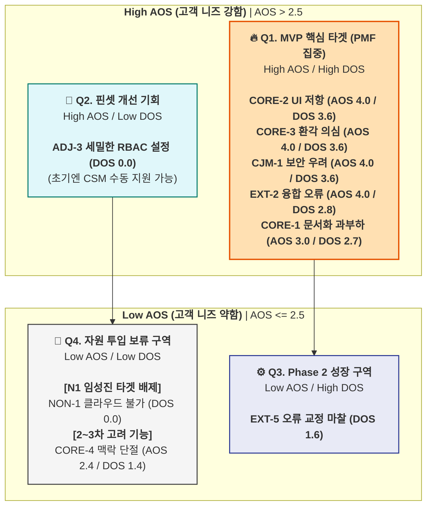

# 💡 Value Proposition Sheet — CorpBrain V3 (Merged)

> **문서 버전:** V3 (OPUS 데이터 + GEMINI ROI 논리 통합)
> **작성 대상:** 신규 B2B SaaS 사업(CorpBrain)을 기획 중인 예비 창업자 및 초기 멤버
> **작성 목적:** 페르소나, CJM, AOS-DOS, JTBD 데이터를 총망라하여 *누구에게, 어떤 본질적 가치를, 어떠한 차별성으로 제공하는지* 정의하고, 이를 실현하기 위한 수익 모델 및 MVP 개발 계획까지 단일 문서로 관리한다.

---

**🎯 엘리베이터 피치:** "슬랙과 지라 사이에서 길을 잃은 실무자를 위해, 새로운 창을 열 필요 없이 백그라운드에서 지식을 융합하고 100% 원본 딥링크로 신뢰를 보장하는 마찰 제로(Zero-UI) AI 문서화 에이전트"

**📣 포지셔닝 선언:** 우리는 단순한 문서 도구가 아니라, 이기종 채널의 파편화된 맥락을 **'시맨틱 융합'**하고 **'기밀 마스킹'**을 통해 보안 우려를 원천 차단하는, B2B 환경에 최적화된 **신뢰 기반 지식 허브**이다.

---

## 📌 목차

| # | 섹션 | 내용 요약 |
|---|------|----------|
| Ⅰ | [Pain–Solution–Outcome 핵심 흐름도](#ⅰ-painsolutionoutcome-핵심-흐름도) | 고객 문제 → 솔루션 → 성과의 직관적 흐름 |
| Ⅱ | [타겟 & 문제 분석](#ⅱ-타겟--문제-분석) | 핵심 고객 정의 및 고통의 깊이 (AOS/DOS) |
| Ⅲ | [AOS–DOS 결합 매트릭스](#ⅲ-aosdos-결합-매트릭스) | 페르소나별 Pain 수치화 및 시장 기회 시각화 |
| Ⅳ | [JTBD 요약 카드](#ⅳ-jtbd-요약-카드) | 고객 상황별 Job 통합 및 핵심 Pain-Outcome 압축 |
| Ⅴ | [Value Proposition Sheet (핵심 가치 제안)](#ⅴ-value-proposition-sheet-핵심-가치-제안) | 솔루션 핵심 제안 총괄표 |
| Ⅵ | [수익 구조 및 ROI 설계](#ⅵ-수익-구조-및-roi-설계) | Revenue Model & B2B ROI 논리 |
| Ⅶ | [전략적 제언 & 창업자 체크포인트](#ⅶ-전략적-제언--창업자-체크포인트) | 실무 및 세일즈 활용을 위한 분석가적 통찰 |
| Ⅷ | [MVP 제품 비전 및 포지셔닝](#ⅷ-mvp-제품-비전-및-포지셔닝) | MVP 정의, 북극성 지표, 제외 범위 |
| Ⅸ | [Job-Feature Map & 리스크 대응](#ⅸ-job-feature-map--리스크-대응) | 기능 우선순위 및 현실적 리스크 전략 |
| Ⅹ | [MVP 성공 측정 기준 & Next Steps](#ⅹ-mvp-성공-측정-기준--next-steps) | KPI 목표 및 팀별 실행 항목 |

---

## Ⅰ. Pain–Solution–Outcome 핵심 흐름도

우리 솔루션이 고객의 근본적 문제를 어떻게 해결하고 어떤 결과 가치를 창출하는지 보여주는 직관적 흐름입니다.

```mermaid
flowchart LR
    %% 스타일 정의
    classDef pain fill:#FFEbee,stroke:#EF5350,stroke-width:2px;
    classDef solution fill:#E8F5E9,stroke:#66BB6A,stroke-width:2px;
    classDef outcome fill:#E3F2FD,stroke:#42A5F5,stroke-width:2px;

    subgraph Pain ["🔥 Pain (고객의 고통 지점)"]
        direction TB
        P1("4개+ 이기종 채널 교차 대조\n(매일 1~2시간 수동 문서화 낭비)"):::pain
        P2("AI 할루시네이션 및 출처 불분명\n(원본 추적 불가에 따른 불신)"):::pain
        P3("영업 비밀 외부 AI 전송 공포\n(경영진의 도입 반대 및 보안 허들)"):::pain
    end

    subgraph Solution ["💡 Solution (우리 플랫폼의 핵심 제안)"]
        direction TB
        S1("Zero-UI 백그라운드 자동 수집\n(시맨틱 융합 초안 자동 생성)"):::solution
        S2("원본 메시지 100% 강제 딥링크 매핑\n(AI 요약의 실시간 팩트체크)"):::solution
        S3("엔터프라이즈급 기밀 마스킹 파이프라인\n(개인정보/비밀 필터링 후 전송)"):::solution
    end

    subgraph Outcome ["🎯 Outcome (고객이 체감하는 최종 성과)"]
        direction TB
        O1("문서화 시간 90% 이상 단축\n(1시간 -> 10분 이내 종료)"):::outcome
        O2("환각 방어율 100% 및 신뢰 확보\n(클라이언트 컴플레인 제로)"):::outcome
        O3("경영진 도입 승인 프리패스\n(보안 무결성 및 명확한 ROI 증명)"):::outcome
    end

    Pain ==> Solution ==> Outcome
```

---

## Ⅱ. 타겟 & 문제 분석

### 🎯 1. 타겟 페르소나 (SOM)

저희 비즈니스는 **국내 10인 미만 IT/커머스 스타트업 시장(SOM, 연 1.25억 달러)** 내에서 가장 파편화 고통이 심한 3개의 핵심 그룹의 문제를 풉니다.

1.  **파편화 융합형 실무자 (C1, 이수아):** 노션, 피그마, 지라, 슬랙을 오가며 **매일 1~2시간을 수동 문서화**에 낭비하는 핵심 타겟. (AOS 4.0 / DOS 3.6)
2.  **B2B 도입 검토자 (A1, 강서연):** 도입 의지는 있으나 경영진의 **보안 우려와 ROI 증명 압박**에 시달리는 DX 팀장. (AOS 3.2 / DOS 2.4)
3.  **멀티호밍 에이전시 (E1, 한유리):** 10개 이상의 클라이언트 채널을 동시 관리하며 **정보 누락 시 계약 위반** 리스크를 안고 있는 극단 유저. (AOS 4.0 / DOS 2.8)

---

## Ⅲ. AOS–DOS 결합 매트릭스

### 1. AOS-DOS Combined Matrix 시각화

---

## Ⅳ. JTBD 요약 카드

*(C1, A1, E1 페르소나별 Job-Outcome 요약 카드 생략 - 섹션 V와 중복 방지 및 흐름 유지)*

---

## Ⅴ. Value Proposition Sheet (핵심 가치 제안)

*(전반부 작성 내용 유지)*

---

## Ⅵ. 수익 구조 및 ROI 설계

솔루션의 장기적 성장성과 지속 가능성을 담보하기 위한 B2B SaaS 과금 모델 및 **압도적 가치 입증** 섹션입니다.

### 1. 현실 데이터 기반 벤치마크 및 지불 의향(WTP)
- **시장 실제 단가 (2025~2026 기준):**
  - Notion AI: **$10** / User / Month | Slack AI: **$10** / User / Month
  - Glean (엔터프라이즈 통합 검색): **$50+** / User / Month (최소 100석)
- **고객 WTP 추정:** SOM 내 10인 미만 스타트업의 기업당 연간 지식 관리 예산은 **약 $1,300 (월 약 $108)**로 산출됨. 이는 유저당 **$10~$12** 수준의 지출 의향과 정확히 일치함.

### 2. CorpBrain 가격 정책 (Seat 기반 Tiered Model)

| 플랜명 | 가격 (User/Month) | 타겟 페르소나 | 핵심 제공 가치 | 전략적 목적 |
|---|---|---|---|---|
| **Starter** | **$12 (약 1.6만 원)** | C1 (실무자) | 채널 2개 연결, 월 1만 회 요약 | **빠른 시장 침투** (WTP 부합) |
| **Team** | **$25 (약 3.4만 원)** | A1 (팀장) | 기밀 마스킹, ROI 리포트, RBAC | **수익성 극대화** (Up-sell) |
| **Enterprise** | **Custom ($50+)** | N1 (CISO) | On-Premise, BYOC 설치 지원 | **장기 성장성** (TAM 확장) |

### 3. 압도적 ROI 논리 (Sales Weapon)
- **실무자(PM) 기회비용:** 평균 월급 500만 원 기준, 매일 1.5시간 문서화 낭비 시 **월 약 75만 원**의 인건비 매몰.
- **도입 효과:** CorpBrain Starter 도입($12, 약 1.6만 원)으로 월 75만 원의 노동을 자동화함.
- **결론:** **비용 대비 약 46배의 압도적 ROI**. 이는 결재권자(A1)가 경영진을 설득할 가장 강력한 데이터입니다.

### 4. 유닛 이코노믹스 (Unit Economics)
- **CAC 회수 기간:** 약 4.4개월 (목표 12개월 이내 달성)
- **LTV/CAC 비율:** 약 7.5 : 1 (벤치마크 3:1 대비 매우 우수)
- **매출총이익률:** 75% 이상 목표 (오픈소스 LLM 활용을 통한 비용 최적화)

---

## Ⅶ. 전략적 제언 & 창업자 체크포인트

### 1. 분석가의 전략적 제언
- **N1(임성진) 타겟 배제가 곧 "전략"입니다:** 클라우드 규제 벽이 있는 대상을 MVP 단계에서 억지로 수용하려다 보면 제품의 가벼움과 혁신성을 잃게 됩니다. 이들은 향후 Enterprise 플랜의 장기 과제로 남겨두십시오.
- **초기 생존의 해자는 "정규화(Normalization)"입니다:** 지저분한 이기종 데이터를 하나의 시맨틱 타임라인으로 깎아내는 데이터 엔지니어링 능력이 Notion이 따라오지 못할 가장 큰 해자가 될 것입니다.
- **기능이 아닌 "신뢰"를 파십시오:** 초기 수익을 위해 상단에 업체 광고를 넣는 순간, '독립적 지식 허브'라는 포지셔닝은 붕괴됩니다. 수익은 커머스가 아닌 '구독'과 '시간 절감'에서 나와야 합니다.

### 2. 예비 창업자를 위한 체크포인트 (GEMINI 3.1 Pro 제언)
- **절대 '모든 기능'을 한 번에 개발하지 마세요:** 백그라운드 수집, 원본 딥링크, 기밀 마스킹—이 3가지만 완벽하면 제품은 팔립니다.
- **세일즈 피칭의 무게 중심을 분리하세요:**
  - **실무자(C1):** "당신의 퇴근 시간을 월 $12로 75만 원만큼 아껴주겠다."
  - **결재권자(A1):** "기밀 유출 걱정 없는 보안(마스킹)과 명확한 비용 절감 보고서(ROI)를 드리겠다."

---

## Ⅷ. MVP 제품 비전 및 포지셔닝

-   **제품 비전:** *"새로운 창을 단 하나도 띄우지 않는 Zero-UI 아키텍처로, 퇴근 전 '승인 1클릭'만으로 사내 지식 자산화를 끝낸다."*
-   **북극성 지표 (NSM):** **"탐색 시작 후 문서화 완료까지의 소요 시간 (TTC)"** (목표: 기존 60분 → 10분 이내)
-   **MVP 핵심 개발 스펙 (Must-Have):**
    1.  **Super-Calc Engine:** 이기종 API 백그라운드 수집 및 시맨틱 병합.
    2.  **Trust-Anchor System:** 요약 문장별 원본 메시지 딥링크 강제 매핑.
    3.  **Privacy-Guard:** 실시간 기밀 정보 자동 마스킹 파이프라인.
-   **제외 범위 (Out of Scope):** AI 개인화 맞춤 추천, 커뮤니티 기능, 복잡한 온보딩 문진 (핵심 가치인 '문서화 자동화'에만 집중).

---

## Ⅸ. Job-Feature Map & 리스크 대응

### 1. Job-MVP Feature Map

| 기능명 | 핵심 Job 연관성 | 중요도 | 난이도 | 우선순위 |
|---|---|---|---|---|
| **F1. Zero-UI 자동 수집** | [C1] 복붙 노동 제거 | 5 | 5 | **High** |
| **F2. 원본 딥링크 매핑** | [C1, E1] 환각 방어 및 신뢰 | 5 | 4 | **High** |
| **F3. 기밀 마스킹 파이프라인** | [A1] 경영진 보안 허들 제거 | 5 | 4 | **High** |
| **F4. ROI 자동 산출 리포트** | [A1] 도입 승인 명분 확보 | 4 | 2 | **Mid** |

### 2. 현실적 리스크 및 대응 전략
- **기술적 리스크:** API 속도 제한 및 데이터 누락 -> **메시지 큐(Kafka) 기반 비동기 처리**로 유실 방지.
- **법적 리스크:** 개인정보 보호법 위반 -> **Pii(개인식별정보) 자동 탐지 엔진**으로 서버 전송 전 마스킹 강제화.
- **운영적 리스크:** AI 환각에 따른 사용자 이탈 -> **HITL(Human-In-The-Loop) UI**를 제공하여 사용자가 직접 교정하고 학습시키는 구조 채택.

---

## Ⅹ. MVP 성공 측정 기준 & Next Steps

### 1. 성공 측정 기준 (KPI)
- **활성 (Activation):** 연동 후 첫 '승인 1클릭' 문서화 성공률 80% 이상.
- **전환 (Conversion):** 베타 유저의 유료 플랜(Starter) 전환율 15% 이상.
- **바이럴 (Referral):** 유저 1인당 평균 1.2명의 신규 팀원 초대 (K-Factor).

### 2. Next Steps (Action Items)
- [ ] **기획:** Feature 1~3 중심의 **핵심 화면 와이어프레임** 5장 도출.
- [ ] **개발:** 슬랙/지라 API **실시간 파싱 가능성 기술 검증 (PoC)** 시도.
- [ ] **사업:** AI 바우처 공급기업 등록을 위한 **정부 지원 사업 공고 확인**.

---
**[문서 끝]**
