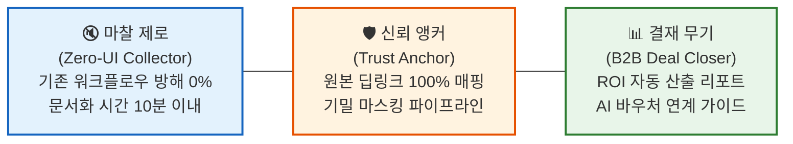
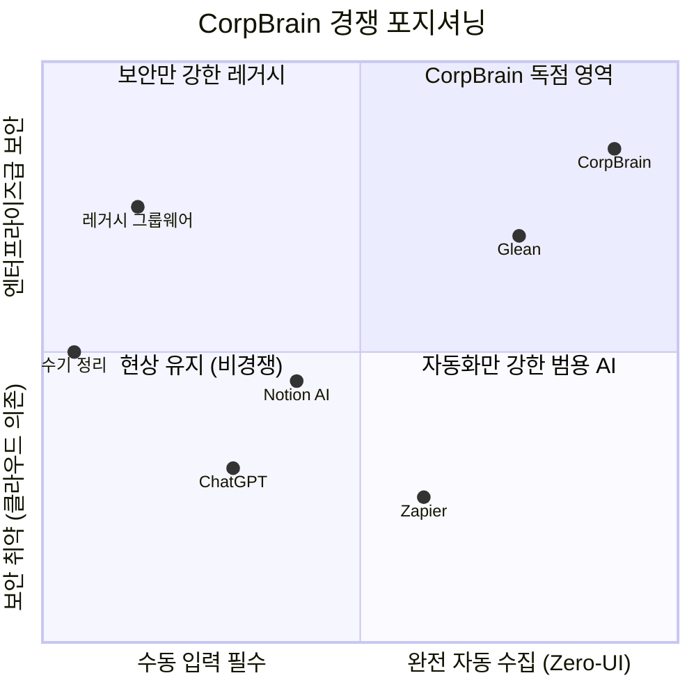
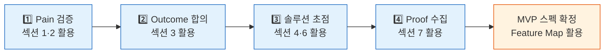

# CorpBrain Value Proposition Sheet (Problem–Solution Fit)

> **작성일:** 2026-04-29 | **작성 기준:** 페르소나·CJM·AOS/DOS·JTBD 인터뷰 통합 분석
> **대상 독자:** 본격적인 신규 사업을 처음 기획하는 예비창업자

---

## 1. 페르소나 및 CJM 방식의 고객별 핵심 문제 서술 (Pain · Needs)

### C1 이수아 (29, PM) — 핵심 사용자 · Q1 세그먼트

| 구분 | 내용 |
|---|---|
| **핵심 고통** | 노션·피그마·지라·이메일 등 4개 이상 채널을 교차 대조하며 **매일 1~2시간 수동 문서화**에 낭비 |
| **맥락 단절** | 지라의 결과(What)와 슬랙의 논의(Why)가 분리 → Context Collision 발생 |
| **감정 상태** | 수작업 반복의 **강한 피로감**, 정리 누락 시 **불안과 허탈감** |
| **CJM Pain 요약** | 인지: 이기종 허브 부재 / 고려: 새 툴 학습 장벽 / 결정: API 권한 보안 우려 / 온보딩: AI 환각 시 신뢰 상실 / 충성: 연동 채널 한계 |
| **핵심 니즈** | Zero-UI 백그라운드 수집, 시맨틱 병합 초안, HITL 승인 대시보드, 원본 딥링크 |

### A1 강서연 (42, DX팀장) — 확장 사용자 · Q2 세그먼트

| 구분 | 내용 |
|---|---|
| **핵심 고통** | 솔루션 도입 의지는 있으나 경영진의 **"영업 비밀 외부 AI 전송 반대"** + 예산 부족 이중 허들 |
| **감정 상태** | 도입 당위성 증명 **부담감**, 정보 유출 사고 방지 **경계심** |
| **CJM Pain 요약** | 인지: 보안+예산 원천 차단 / 고려: ROI 미비 시 기안 반려 / 결정: 보안 심의 지연 / 온보딩: RBAC 복잡성 / 충성: 성과 측정 도구 부재 |
| **핵심 니즈** | 기밀 마스킹 파이프라인, RBAC, ROI 산출 리포트, AI 바우처 연계 |

### E1 한유리 (35, 에이전시 PM) — 극단 사용자

| 구분 | 내용 |
|---|---|
| **핵심 고통** | 10개+ 클라이언트 채널에서 요구사항 동시 폭주, **누락 시 계약 위반** → 10개 창 수기 기록 강박 |
| **감정 상태** | 정보 폭포의 **패닉**, 놓칠까 두려운 **강박과 극도의 피로** |
| **핵심 니즈** | 5개+ 채널 동시 시맨틱 융합(환각 제로), 원본 100% 추적 보장 |

### N1 임성진 (46, CISO) — 비활성 사용자 (MVP 배제)

- **비활성 사유:** 의료 데이터 → 클라우드 반출 자체가 컴플라이언스 위반
- **전환 조건:** On-Premise / BYOC 인프라 모델 제공 시에만 가능
- **활용:** 장기 인프라 로드맵(Option B/C) 투자 근거로만 활용

---

## 2. JTBD 관점 인터뷰 결과에 따른 고객 상황별 목표 서술 (Goal · Job)

### C1 이수아 — Job Statement

> **When** 마일스톤이 끝나고 슬랙/지라의 파편화된 히스토리를 노션에 취합해야 할 때,
> **I want to** 기존 툴 화면을 벗어나지 않고 AI가 맥락을 병합한 초안을 제공받아,
> **So I can** 승인 클릭 한 번으로 문서화를 끝내고 싶다.

- **Push:** 복붙 단순 노동의 극심한 피로 | **Pull:** Zero-UI + 퇴근 전 승인 1회
- **Habit:** 노션 수기 정리 관성 | **Anxiety:** AI 환각으로 엉뚱한 요약 불안

### A1 강서연 — Job Statement

> **When** 부서 간 사일로 해결을 위해 신규 솔루션 도입 기안을 결재 올려야 할 때,
> **I want to** 기밀 반출 우려를 차단하고 절감 인건비를 숫자로 보여주어,
> **So I can** 한 번에 도입 승인을 받아내고 싶다.

- **Push:** 과거 보안 우려로 반려된 경험 | **Pull:** 마스킹 아키텍처 + ROI 리포트
- **Habit:** 레거시 게시판 유지 관성 | **Anxiety:** 정보 유출 시 전적 책임 두려움

### E1 한유리 — Job Statement

> **When** 10개+ 채널에서 다수 클라이언트 요청이 동시 폭주할 때,
> **I want to** 파편화된 맥락이 꼬임 없이 하나의 타임라인으로 시맨틱 융합되어,
> **So I can** 정보 누락으로 인한 위약금/컴플레인을 제로화하고 싶다.

- **Push:** 10개 창 수기 관리의 패닉 | **Pull:** HITL로 AI가 즉시 학습하는 쾌감
- **Habit:** 각기 다른 메신저 강제 사용 관성 | **Anxiety:** 유사 프로젝트명 혼동 사고

---

## 3. 고객이 원하는 Outcome (측정 가능한 목표 상태)

| # | Outcome | 페르소나 | AOS | DOS | 우선순위 |
|---|---|---|---|---|---|
| O-1 | 수동 문서화 시간 **1~2시간 → 10분 이내** 단축 | C1 | 4.0 | 3.6 | **1순위** |
| O-2 | AI 요약 전 문장에 원본 딥링크 → **환각 방어율 100%** | C1, E1 | 4.0 | 3.6 | **1순위** |
| O-3 | 기밀 유출 사고 **0%** + 명확한 **ROI 지표 확보** | A1 | 3.2 | 2.4 | **1순위** |
| O-4 | 다중 채널 환각 없는 병합 → **누락 위약금 제로화** | E1 | 4.0 | 2.8 | **1순위** |
| O-5 | HITL 피드백 시 AI 즉시 학습 → **교정 마찰 최소화** | E1 | 2.4 | 1.6 | 2순위 |

---

## 4. 우리 솔루션의 핵심 제안 (Value Proposition)

> **CorpBrain은 사용자가 새로운 창을 단 하나도 띄우지 않는 Zero-UI 아키텍처로, 슬랙·지라·메일 등 이기종 채널의 파편화된 지식을 백그라운드에서 자동 수집·시맨틱 융합하여, 퇴근 전 '승인 1클릭'만으로 사내 위키 문서화를 완료시키는 AI 에이전트입니다.**

### 핵심 가치 3축 (Value Triad)

| 가치 축 | 해결하는 Pain | 대상 | 핵심 기능 |
|---|---|---|---|
| **마찰 제로 (Zero-UI)** | 수동 문서화 과부하, 새 툴 학습 장벽 | C1, E1 | API 백그라운드 수집 + 시맨틱 초안 생성 + HITL 승인 |
| **신뢰 앵커 (Trust Anchor)** | AI 환각 불신, 정보 유출 공포 | C1, A1, E1 | 원본 딥링크 강제 매핑 + 주민번호/기밀 마스킹 |
| **결재 무기 (Deal Closer)** | ROI 명분 부재, 예산 압박 | A1 | 절감 시간/비용 시각화 리포트 + 바우처 연계 |

---

## 5. 기존 대안 (Competitor / Substitute)

| 대안 유형 | 구체적 솔루션 | 한계점 | CorpBrain 차별 포인트 |
|---|---|---|---|
| **현상 유지 (최강 경쟁자)** | 메신저 자체 검색 + 수기 정리 | 맥락 병합 불가, 시간 1~2h 낭비 | Zero-UI로 수기 작업 완전 제거 |
| **노션/컨플루언스** | 수동 위키 정리 | 사용자가 직접 써야 함 → 방치 | 백그라운드 자동 수집·초안 생성 |
| **Glean / Guru** | 엔터프라이즈 AI 검색 | 대기업 타겟, 중소기업 가격 부담 | 10인 미만 소기업 최적화 가격 |
| **Zapier / Make** | 채널 간 단순 포워딩 | 시맨틱 맥락 융합 불가 | 시맨틱 병합 + 딥링크 추적 |
| **ChatGPT / Claude** | 범용 LLM 직접 활용 | 기밀 문서 업로드 보안 거부감 | 오픈소스 LLM + 마스킹 파이프라인 |
| **레거시 그룹웨어** | 사내 게시판 | 검색·AI 기능 전무, UX 열악 | AI 기반 자동 구조화 + 현대적 UX |

---

## 6. 우리가 제공하는 차별적 가치

### 6-1. 경쟁 포지셔닝 매트릭스

### 6-2. 3대 차별적 가치 선언

| # | 차별적 가치 | 왜 경쟁사가 못 하는가 | 고객 체감 |
|---|---|---|---|
| **D-1** | **Zero-UI 완전 자동 수집** — 사용자가 새 탭을 여는 행위 자체를 차단 | 노션/컨플루언스는 사용자 입력 전제, Zapier는 시맨틱 병합 불가 | "퇴근 전 10분, 버튼 1개로 끝" |
| **D-2** | **100% 원본 딥링크 팩트체크** — 모든 AI 요약 문장에 출처 강제 매핑 | 범용 LLM은 출처 추적 미보장, Glean은 검색 중심(문서 생성 약함) | "찜찜하면 1초 만에 원본 확인" |
| **D-3** | **B2B 결재 원스톱 키트** — 마스킹+RBAC+ROI 리포트+바우처 가이드 통합 제공 | 스타트업 대상 솔루션 중 보안 아키텍처와 ROI 시뮬레이터를 동시 탑재한 경쟁사 부재 | "경영진 설득 자료가 자동 생성" |

---

## 7. Proof (근거 / 검증 데이터)

### 7-1. 정량적 근거

| 지표 | 수치 | 출처 |
|---|---|---|
| **문서화 노동 시간** | 실무자 1인당 주 5~15시간 낭비 (연 250~750시간) | 페르소나 C1 행동 분석 + 문제정의서 |
| **AOS 최상위 Pain** | Zero-UI 장벽·환각 의심·보안 유출 모두 **AOS 4.0** (만점) | AOS/DOS 종합 평가표 |
| **DOS 최상위 기회** | Zero-UI·딥링크 → **DOS 3.6** (시장 파급력 최대) | AOS/DOS 종합 평가표 |
| **SOM 시장 규모** | 연 1.25억 달러 (96,500개 타겟 기업 × $1,300) | TAM/SAM/SOM 산출표 |
| **ROI 추정** | 실무자 1인 기준 월 40~60시간 절감 → 연 인건비 약 600~900만원 절감 | CJM 충성도 단계 분석 |

### 7-2. 정성적 근거 (JTBD 인터뷰 핵심 발화)

| 페르소나 | 핵심 발화 (Evidence) |
|---|---|
| **C1 이수아** | *"요약본 읽다가 찜찜하면 바로 원본 가서 팩트체크가 되니까 안심입니다."* |
| **A1 강서연** | *"보안 유출 문제 없고, 월 OOO만 원의 인건비 절감 효과가 있다고 숫자로 보여줘야 결재가 수월해집니다."* |
| **E1 한유리** | *"교정(HITL)해 줬을 때 바로 학습해서 다음부터 안 틀린다면 충분히 감수할 수 있어요."* |

### 7-3. 검증 설계 (MVP PoC 계획)

| 검증 항목 | 성공 기준 | 방법 |
|---|---|---|
| Zero-UI 체감도 | C1 페르소나 문서화 시간 **80% 이상 단축** | 베타 테스터 5인 A/B 비교 |
| 환각 방어율 | 초안 내 원본 딥링크 **100% 매핑** 확인 | 자동화 테스트 + 수동 샘플링 |
| HITL 승인율 | 무수정 승인율 **70% 이상** | 1개월 파일럿 로그 분석 |
| B2B 결재 전환 | A1 페르소나 경영진 **도입 승인 1건 이상** | 실제 세일즈 파이프라인 추적 |

---

## 8. 솔루션 핵심가치 제안 — 한 문장 요약

> ### 📌 CorpBrain의 핵심 가치 제안
>
> **"CorpBrain은 중소기업 실무자가 기존 업무 도구(슬랙·지라·메일)를 그대로 쓰면서도, AI가 백그라운드에서 파편화된 지식을 자동 수집·시맨틱 융합하여 '퇴근 전 승인 1클릭'으로 사내 위키를 완성시키되, 모든 AI 요약에 원본 출처를 강제 매핑하고 기밀 정보를 자동 마스킹하여 B2B 결재권자의 보안 우려까지 원천 차단하는, 마찰 제로·신뢰 완전 보장형 AI 문서화 에이전트입니다."**

---

## [추가 섹션] Job → MVP Feature Map (기능 우선순위 정리)

JTBD 인터뷰와 AOS/DOS 분석을 통합하여, 각 Job이 요구하는 MVP 기능을 우선순위별로 매핑합니다.

### Phase 1 (MVP 핵심) — 출시 첫 3개월

| Job (JTBD) | 대상 기능 | Outcome 연결 | DOS |
|---|---|---|---|
| C1: 승인 1클릭 문서화 | **이기종 채널 API 백그라운드 자동 수집 (Zero-UI)** | O-1 | 3.6 |
| C1: 승인 1클릭 문서화 | **시맨틱 융합 히스토리 초안 생성** | O-1 | 3.6 |
| C1/E1: AI 신뢰 확보 | **원본 딥링크 100% 강제 매핑** | O-2 | 3.6 |
| C1: 심리적 통제감 | **HITL 승인 대시보드 (1클릭 확정)** | O-1 | 3.6 |
| A1: 경영진 설득 | **주민번호/기밀 자동 마스킹 파이프라인** | O-3 | 2.4 |
| A1: 도입 명분 확보 | **ROI(절감 시간/비용) 자동 산출 리포트** | O-3 | 2.4 |

### Phase 2 (확장) — 출시 후 6개월

| Job (JTBD) | 대상 기능 | Outcome 연결 | DOS |
|---|---|---|---|
| E1: 다중 채널 병합 | **5개+ 채널 동시 시맨틱 융합 엔진 고도화** | O-4 | 2.8 |
| E1: 오류 교정 학습 | **HITL 피드백 기반 RL 재학습 루프** | O-5 | 1.6 |
| A1: 전사 확산 | **RBAC 역할 기반 접근 통제** | — | 0.0 |
| A1: 바우처 활용 | **정부 AI 바우처 연계 가이드** | O-3 | — |

### Phase 3 (장기 로드맵)

| Job (JTBD) | 대상 기능 | 비고 |
|---|---|---|
| N1: 망분리 환경 | On-Premise / BYOC 독립 배포형 패키지 | 엔터프라이즈 B2B 진입 시 |
| 공통: 자율 지식 구조화 | RL 기반 지식 분류 정책 자동 최적화 | 데이터 플라이휠 성숙 후 |
| 공통: 에이전트 가드닝 | 지식 그래프 스캔 + 고립 문서 연결 + 용어 표준화 | 장기 품질 관리 |

---

## [추가 섹션] 예비창업자를 위한 VPS 활용 가이드

### 이 문서를 어떻게 활용해야 하는가

| 단계 | 체크 질문 | 실패 시 대응 |
|---|---|---|
| **Pain 검증** | 타겟 고객 5인 이상이 동일 Pain을 언급하는가? | 페르소나 재정의 필요 |
| **Outcome 합의** | 고객이 측정 가능한 성공 기준에 동의하는가? | JTBD 인터뷰 재실시 |
| **솔루션 초점** | 핵심 가치 3축 중 2개 이상이 경쟁사 대비 명확히 우위인가? | 차별화 전략 재수립 |
| **Proof 수집** | PoC에서 성공 기준 70% 이상 달성했는가? | 피봇 또는 기능 재설계 |

### 핵심 주의사항

> ⚠️ **예비창업자가 가장 빠지기 쉬운 함정**
>
> 1. **기능 과잉:** Phase 1에 모든 기능을 넣으려는 충동 → **Zero-UI + 딥링크 + 마스킹** 3개만 집중
> 2. **비타겟 설득:** N1(망분리) 같은 비활성 사용자를 초기에 설득하려는 시도 → MVP에서 철저히 배제
> 3. **실무자만 집중:** C1(실무자)의 만족만으로는 매출 불가 → A1(결재자) 설득 무기(ROI)가 B2B의 생명선

---

## 문서 출처 및 참조

| 참조 문서 | 활용 섹션 |
|---|---|
| `01_CorpBrain_Business_One_Pager.md` | 서비스 정의, 인프라 옵션, BM 후보 |
| `5-2_문제정의서-실무자관점.md` | 핵심 문제 정의 |
| `6-10_TAM_SAM_SOM_산출표.md` | 시장 규모, 세그먼트 매트릭스 |
| `7_페르소나_스펙트럼_최종.md` | 4대 페르소나 Pain·Needs·니즈 기능 |
| `8_고객여정지도_최종.md` | CJM 단계별 Pain Point·개선 기회 |
| `9_최종시장기회판단_AOS_DOS.md` | AOS/DOS 우선순위, MVP 전략 |
| `10_JTBD_심층_인터뷰_결과_보고서.md` | Job Statement, Outcome, 4 Forces |
| `11_ValueProposition_Sheet_작성방법.md` | VPS 작성 프레임워크 |
