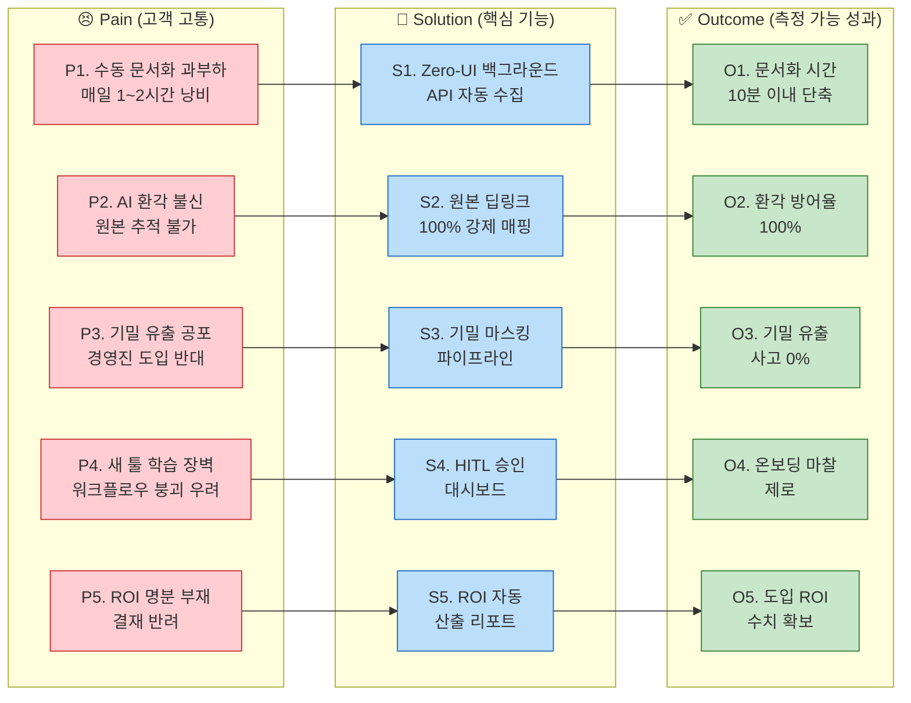
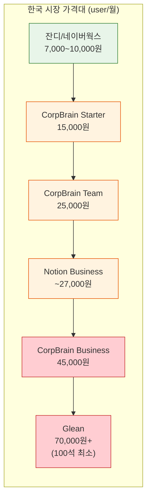

# CorpBrain Value Proposition Sheet v2 (Problem–Solution Fit)

> **작성일:** 2026-04-29 | **버전:** v2 (Pain–Solution–Outcome 흐름 + 수익구조 통합)
> **대상 독자:** 본격적인 신규 사업을 처음 기획하는 예비창업자

---

## Part A. Pain–Solution–Outcome 흐름 정리

### 전체 구조도

### Pain–Solution–Outcome 매핑 테이블

| # | Pain (고객 고통) | 대상 | AOS | Solution (핵심 기능) | Outcome (측정 가능 성과) | DOS |
|---|---|---|---|---|---|---|
| **1** | 이기종 채널 수동 문서화 과부하 (매일 1~2h 낭비) | C1 이수아 | 4.0 | Zero-UI 백그라운드 API 자동 수집 + 시맨틱 융합 초안 생성 | 문서화 시간 **1~2시간 → 10분** 단축 | 3.6 |
| **2** | AI 환각 불신 — 요약 결과를 신뢰할 수 없음 | C1, E1 | 4.0 | 모든 AI 요약 문장에 원본 딥링크 100% 강제 매핑 | **환각 방어율 100%**, 1초 팩트체크 | 3.6 |
| **3** | 기밀 유출 공포 — 경영진 "외부 AI 반대" | A1 강서연 | 4.0 | 주민번호/기업 기밀 자동 마스킹 파이프라인 + RBAC | **기밀 유출 사고 0%** | 3.6 |
| **4** | 새 툴 학습 장벽 — 워크플로우 붕괴 우려 | C1 | 4.0 | 기존 툴(슬랙/지라) 화면 이탈 없는 Zero-UI + HITL 1클릭 승인 | **온보딩 마찰 제로**, 추가 학습 불필요 | 3.6 |
| **5** | 정량적 도입 명분(ROI) 부재 → 결재 반려 | A1 | 3.2 | 절감 시간/비용 자동 산출 ROI 리포트 + AI 바우처 연계 가이드 | **월 인건비 절감 수치 자동 제공** | 2.4 |
| **6** | 다중 채널(10개+) 시맨틱 병합 오류 공포 | E1 한유리 | 4.0 | 5개+ 채널 동시 시맨틱 융합 엔진 + HITL 피드백 RL 재학습 | **정보 누락 위약금 제로화** | 2.8 |

---

## 1. 고객별 핵심 문제 서술 (Pain · Needs)

### C1 이수아 (29, PM) — 핵심 사용자

| 구분 | 내용 |
|---|---|
| **핵심 고통** | 노션·피그마·지라·이메일 등 4개+ 채널 교차 대조 → **매일 1~2시간 수동 문서화** 낭비 |
| **맥락 단절** | 지라의 결과(What)와 슬랙의 논의(Why) 분리 → Context Collision |
| **감정** | 수작업 반복 **피로감**, 정리 누락 시 **불안** |
| **핵심 니즈** | Zero-UI 백그라운드 수집, 시맨틱 병합 초안, HITL 승인, 원본 딥링크 |

### A1 강서연 (42, DX팀장) — 확장 사용자

| 구분 | 내용 |
|---|---|
| **핵심 고통** | 경영진 **"영업 비밀 외부 AI 전송 반대"** + 예산 부족 이중 허들 |
| **감정** | 도입 증명 **부담감**, 정보 유출 방지 **경계심** |
| **핵심 니즈** | 기밀 마스킹, RBAC, ROI 산출 리포트, AI 바우처 연계 |

### E1 한유리 (35, 에이전시 PM) — 극단 사용자

| 구분 | 내용 |
|---|---|
| **핵심 고통** | 10개+ 채널 동시 폭주, **누락 시 계약 위반** → 수기 기록 강박 |
| **감정** | 정보 폭포 **패닉**, 놓칠까 두려운 **강박** |
| **핵심 니즈** | 5개+ 채널 동시 시맨틱 융합(환각 제로), 원본 100% 추적 |

### N1 임성진 (46, CISO) — 비활성 사용자 (MVP 배제)

- 의료 데이터 → 클라우드 반출 자체가 컴플라이언스 위반 → On-Premise 제공 시에만 가능

---

## 2. JTBD 목표 서술 (Goal · Job)

| 페르소나 | Job Statement | 4 Forces 요약 |
|---|---|---|
| **C1 이수아** | 기존 툴을 벗어나지 않고 AI가 맥락 병합 초안을 제공 → **승인 1클릭으로 문서화 종료** | Push: 복붙 피로 / Pull: Zero-UI / Habit: 수기 정리 관성 / Anxiety: AI 환각 |
| **A1 강서연** | 기밀 반출 우려 차단 + 절감 인건비를 숫자로 제시 → **한 번에 도입 승인** | Push: 과거 반려 / Pull: 마스킹+ROI / Habit: 레거시 유지 / Anxiety: 유출 책임 |
| **E1 한유리** | 10개+ 채널 맥락이 꼬임 없이 **하나의 타임라인으로 시맨틱 융합** | Push: 10개 창 패닉 / Pull: HITL 학습 / Habit: 메신저 관성 / Anxiety: 혼동 사고 |

---

## 3. 고객이 원하는 Outcome

| # | Outcome (측정 가능) | 페르소나 | AOS | DOS | 순위 |
|---|---|---|---|---|---|
| O-1 | 문서화 시간 **1~2h → 10분** | C1 | 4.0 | 3.6 | **1순위** |
| O-2 | 환각 방어율 **100%** (원본 딥링크) | C1, E1 | 4.0 | 3.6 | **1순위** |
| O-3 | 기밀 유출 **0%** + ROI 지표 확보 | A1 | 3.2 | 2.4 | **1순위** |
| O-4 | 다중 채널 누락 **위약금 제로** | E1 | 4.0 | 2.8 | **1순위** |
| O-5 | HITL 교정 마찰 **최소화** | E1 | 2.4 | 1.6 | 2순위 |

---

## 4. 솔루션 핵심 제안 (Value Proposition)

> **CorpBrain은 사용자가 새로운 창을 단 하나도 띄우지 않는 Zero-UI 아키텍처로, 이기종 채널의 파편화된 지식을 백그라운드에서 자동 수집·시맨틱 융합하여, 퇴근 전 '승인 1클릭'만으로 사내 위키 문서화를 완료시키는 AI 에이전트입니다.**

### 핵심 가치 3축 (Value Triad)

| 가치 축 | 해결 Pain | 핵심 기능 | Outcome |
|---|---|---|---|
| **🔇 마찰 제로 (Zero-UI)** | 수동 문서화, 학습 장벽 | API 백그라운드 수집 + 시맨틱 초안 + HITL 승인 | O-1, O-4 |
| **🛡️ 신뢰 앵커 (Trust Anchor)** | AI 환각, 정보 유출 | 원본 딥링크 100% + 기밀 마스킹 | O-2, O-3 |
| **📊 결재 무기 (Deal Closer)** | ROI 부재, 예산 압박 | ROI 자동 산출 + 바우처 연계 | O-3, O-5 |

---

## 5. 기존 대안 (Competitor / Substitute)

| 대안 | 실제 가격 (2025~2026 기준) | 한계점 | CorpBrain 차별점 |
|---|---|---|---|
| **수기 정리 (최강 경쟁자)** | 무료 (인건비만 발생) | 맥락 병합 불가, 1~2h 낭비 | Zero-UI로 수기 완전 제거 |
| **Notion Business** | $20/user/월 (연간) | 사용자 직접 입력 전제 → 방치 | 백그라운드 자동 수집 |
| **Glean** | $50+/user/월, 최소 100석 | 중소기업 접근 불가 (연 $60K+) | 10인 미만 최적화 가격 |
| **Guru** | ~$25/seat/월 | 검색 중심, 문서 자동 생성 약함 | 시맨틱 융합 초안 생성 |
| **Zapier/Make** | $20~50/월 (워크플로우당) | 시맨틱 맥락 융합 불가 | 시맨틱 병합 + 딥링크 |
| **잔디** | 8,000~10,000원/user/월 | 메시징 특화, AI 문서화 없음 | AI 기반 자동 구조화 |
| **네이버웍스 Standard** | 7,000원/user/월 | 협업 기본 기능, 지식 관리 약함 | 지식 자동 수집·융합 엔진 |

---

## 6. 차별적 가치

| # | 차별적 가치 | 경쟁사가 못 하는 이유 | 고객 체감 |
|---|---|---|---|
| **D-1** | **Zero-UI 완전 자동 수집** | Notion은 입력 전제, Zapier는 시맨틱 불가 | "퇴근 전 10분, 버튼 1개로 끝" |
| **D-2** | **100% 원본 딥링크 팩트체크** | 범용 LLM은 출처 미보장, Glean은 검색 중심 | "찜찜하면 1초 원본 확인" |
| **D-3** | **B2B 결재 원스톱 키트** | 중소기업 타겟에서 마스킹+ROI 동시 탑재 경쟁사 부재 | "경영진 설득 자료 자동 생성" |

---

## 7. Proof (근거 / 검증 데이터)

### 7-1. 정량적 근거

| 지표 | 수치 | 출처 |
|---|---|---|
| 문서화 노동 시간 | 실무자 1인당 주 5~15시간 낭비 | 페르소나 C1 + 문제정의서 |
| AOS 최상위 Pain | Zero-UI·환각·보안 모두 **AOS 4.0** | AOS/DOS 평가표 |
| DOS 최상위 기회 | Zero-UI·딥링크 → **DOS 3.6** | AOS/DOS 평가표 |
| SOM 시장 규모 | 연 1.25억$ (96,500개 기업 × $1,300) | TAM/SAM/SOM 산출표 |

### 7-2. 정성적 근거 (인터뷰 발화)

| 페르소나 | 핵심 발화 |
|---|---|
| **C1** | *"요약본 읽다가 찜찜하면 바로 원본 가서 팩트체크가 되니까 안심입니다."* |
| **A1** | *"보안 유출 문제 없고, 월 OOO만원 절감 효과를 숫자로 보여줘야 결재가 수월합니다."* |
| **E1** | *"교정해 줬을 때 바로 학습해서 다음부터 안 틀리면 충분히 감수할 수 있어요."* |

### 7-3. 검증 설계 (MVP PoC)

| 검증 항목 | 성공 기준 | 방법 |
|---|---|---|
| Zero-UI 체감 | 문서화 시간 **80%+ 단축** | 베타 5인 A/B |
| 환각 방어 | 딥링크 **100% 매핑** | 자동+수동 샘플링 |
| HITL 승인율 | 무수정 승인 **70%+** | 1개월 파일럿 |
| B2B 전환 | 경영진 도입 승인 **1건+** | 세일즈 파이프라인 |

---

## 8. 핵심 가치 제안 — 한 문장 요약

> ### 📌 CorpBrain의 핵심 가치 제안
>
> **"CorpBrain은 중소기업 실무자가 기존 업무 도구를 그대로 쓰면서, AI가 백그라운드에서 파편화된 지식을 자동 수집·시맨틱 융합하여 '퇴근 전 승인 1클릭'으로 사내 위키를 완성시키되, 모든 AI 요약에 원본 출처를 강제 매핑하고 기밀 정보를 자동 마스킹하여 B2B 결재권자의 보안 우려까지 원천 차단하는, 마찰 제로·신뢰 완전 보장형 AI 문서화 에이전트입니다."**

---

## Part B. 수익구조 설계 (Revenue Architecture)

> 아래 가격 정책은 **실제 경쟁사 가격**, **B2B SaaS 업계 벤치마크**, **한국 협업툴 시장 가격대**를 근거로 설계했습니다.

---

### 9. 가격 정책 설계 근거 (시장 실제 데이터)

#### 9-1. 경쟁사 실제 가격 벤치마크

| 경쟁/대안 솔루션 | 가격 (2025~2026 실제) | 비고 |
|---|---|---|
| Notion Business (AI 포함) | **$20/user/월** (연간) | 2025년 AI 별도 $10 애드온 폐지, Business에 번들 |
| Glean | **$50+/user/월**, 최소 100석 | 연 최소 $60,000+ 계약, AI 추가 $15/user |
| Guru | **~$25/seat/월** | 최소 10석, 중소기업 타겟 |
| 잔디 Premium | **8,000~10,000원/user/월** | 한국 시장 협업툴 가격대 |
| 네이버웍스 Standard | **7,000원/user/월** (연간) | 한국 시장 기준가 |
| 플로우 Business | **~10,000원/user/월** | 한국 프로젝트 협업 특화 |

#### 9-2. B2B SaaS 업계 벤치마크 (2025~2026)

| 지표 | 벤치마크 수치 | 출처 |
|---|---|---|
| SMB SaaS Entry Tier | **$5~29/user/월** | getmonetizely.com, stonly.com |
| SMB SaaS Pro Tier | **$25~59/user/월** | getmonetizely.com |
| 업계 중간값 (Entry) | **$29/user/월** | prospeo.io |
| 연간 가격 인상률 | **8~12% YoY** | getmonetizely.com |
| 건강한 LTV/CAC 비율 | **3:1 이상** | chargebee.com, payproglobal.com |
| SMB 평균 LTV/CAC | **~2.5:1** | 업계 평균 |
| CAC 회수 기간 목표 | **12개월 이내** | optif.ai |
| SMB 평균 CAC | **$200~700/고객** | 업계 평균 |
| SaaS 목표 매출총이익률 | **75%+** (우수: 80~85%) | gsquaredcfo.com |
| 호스팅 비용 비율 | **ARR의 5% (중간값)** | saas-capital.com |
| 인프라 총비용 비율 | **ARR의 6~12%** | withorb.com |

---

### 10. CorpBrain 요금제 설계

#### 설계 원칙

1. **한국 협업툴 가격대(7,000~10,000원)보다 높되**, Notion AI($20/user)보다 낮은 포지셔닝
2. **Glean($50+/user, 100석 최소)이 진입 불가능한 10인 미만** 영역을 독점
3. **AI 기능을 별도 애드온이 아닌 코어에 번들** — 2025년 Notion의 전략과 동일 방향
4. **연간 결제 시 할인**으로 ARR 예측 가능성 확보

#### 요금제 구조

| 요금제 | 월 가격 (user당) | 연간 결제 시 | 대상 | 포함 기능 |
|---|---|---|---|---|
| **Starter** | **15,000원** (~$11) | **12,000원/월** (~$9) | 1~3인 팀 (프리랜서/초기 스타트업) | API 수집 2채널, 시맨틱 초안, HITL 대시보드, 딥링크, 저장 5GB |
| **Team** (주력) | **25,000원** (~$18) | **20,000원/월** (~$15) | 4~10인 팀 (SOM 핵심 타겟) | API 수집 5채널, 기밀 마스킹, RBAC, ROI 리포트, 저장 20GB |
| **Business** | **45,000원** (~$33) | **36,000원/월** (~$27) | 10~30인 (확장 단계) | 무제한 채널, SSO, 고급 RBAC, 전담 CSM, 저장 100GB |

> **AI 바우처 연계:** 정부 AI 바우처(최대 80% 지원) 공급기업 등록 시, A1(강서연) 세그먼트의 실질 부담금이 Team 기준 **월 4,000~5,000원/user**로 하락 → 결재 허들 극적 감소

#### 가격 포지셔닝 맵

---

### 11. 유닛 이코노믹스 (Unit Economics) — 현실 데이터 기반

#### 11-1. 핵심 수익 지표 시뮬레이션 (Team 플랜 기준)

| 지표 | 산출 | 근거 |
|---|---|---|
| **ARPU** (월) | 25,000원 × 6인(평균) = **150,000원/월** | SOM 타겟: 10인 미만, 평균 활성 6인 추정 |
| **ARPA** (연) | 150,000원 × 12 = **1,800,000원/년** (~$1,330) | SOM 산출표의 기업당 $1,300과 정합 |
| **목표 매출총이익률** | **75%+** | B2B SaaS 벤치마크 목표치 |
| **인프라 비용** (COGS) | ARPA의 **10~15%** (180,000~270,000원/년) | AI/GPU 컴퓨팅 포함 시 일반 SaaS(5%) 대비 상향 |
| **CAC 목표** | **300,000~500,000원** ($220~370) | SMB SaaS 벤치마크 $200~700 하단 |
| **CAC 회수 기간** | 500,000 ÷ (150,000 × 0.75) = **4.4개월** | 목표 12개월 이내 → **충족** |
| **LTV** (월 이탈률 3% 가정) | 150,000 × 0.75 ÷ 0.03 = **3,750,000원** | 월 이탈률 3% = 평균 수명 33개월 |
| **LTV/CAC** | 3,750,000 ÷ 500,000 = **7.5:1** | 벤치마크 3:1 대비 **우수** — 초기엔 마케팅 투자 확대 여지 |

> **주의:** 위 LTV/CAC 7.5:1은 이론적 상한입니다. 실제 초기 스타트업은 브랜드 인지도 부재로 CAC가 높아지므로, **첫 12개월은 3:1~5:1 범위**를 현실적 목표로 설정해야 합니다.

#### 11-2. 매출 시나리오 (Y1~Y3)

| 연차 | 유료 기업 수 | 평균 ARPA | ARR | 근거 |
|---|---|---|---|---|
| **Y1** | 50개사 | 1,800,000원 | **9,000만원** | SOM 96,500개 중 0.05%, 초기 세일즈 |
| **Y2** | 200개사 | 2,000,000원 | **4억원** | 바우처 효과 + 입소문 확산, ARPA 업셀 |
| **Y3** | 500개사 | 2,200,000원 | **11억원** | Business 플랜 전환 + 채널 확장 업셀 |

---

### 12. 과금 형태 및 확장 수익원

#### 12-1. 기본 과금: Seat-Based 구독 + Usage Sidecar

| 구분 | 형태 | 설명 |
|---|---|---|
| **기본료** | Seat 기반 월/연 구독 | 요금제별 user당 고정 과금 (업계 57%가 채택하는 표준 모델) |
| **사용량 과금** | 저장 용량 초과분 | 기본 할당량 초과 시 GB당 추가 과금 (1GB당 500원/월) |
| **AI 토큰 과금** | 월 기본 할당 초과 시 | Starter 10만 토큰/월 → 초과분 1,000토큰당 100원 |

> **설계 의도:** 2025~2026 SaaS 트렌드인 "하이브리드 모델(Seat + Usage Sidecar)"을 채택. 기본료로 ARR 예측성을 확보하면서, 사용량 과금으로 헤비 유저의 추가 매출을 흡수.

#### 12-2. 업셀/크로스셀 수익원

| 수익원 | 시점 | 예상 기여 |
|---|---|---|
| **플랜 업그레이드** (Starter → Team → Business) | 팀 규모 증가 또는 채널 추가 필요 시 | ARR의 20~30% |
| **프리미엄 커넥터** (ERP, SAP, 자체 DB 연동) | Phase 2 이후 | 커넥터당 월 10,000~30,000원 |
| **On-Premise 라이선스** (N1 세그먼트) | Phase 3 이후 | 초기 설치비 500~2,000만원 + 연 유지보수 |
| **AI 바우처 매출** (정부 지원금 수취) | Y1부터 | 기업당 바우처 최대 80% 지원 → 실질 매출 보전 |

#### 12-3. 수익성·성장성·지속가능성 체크리스트

| 관점 | 핵심 질문 | CorpBrain 설계 답변 | 근거 |
|---|---|---|---|
| **수익성** | 매출총이익률 75%+ 달성 가능한가? | ✅ 오픈소스 LLM 활용으로 API 비용 절감, 인프라 비용 ARR 10~15% 목표 | SaaS 매출총이익률 벤치마크 75%+ |
| **수익성** | CAC를 12개월 내 회수하는가? | ✅ Team 플랜 기준 4.4개월 회수 | SMB CAC 회수 벤치마크 <12개월 |
| **성장성** | 업셀 경로가 명확한가? | ✅ 3단계 요금제 + 프리미엄 커넥터 + 사용량 과금 | 플랜 업그레이드 트리거 명확 |
| **성장성** | SOM 시장 내 침투 현실적인가? | ✅ 96,500개 타겟 중 Y3 500개사 = 0.52% 침투 | 보수적 시나리오 |
| **지속가능성** | Lock-in 구조가 있는가? | ✅ HITL 피드백 → RL 재학습으로 사용할수록 정확도 향상 (데이터 플라이휠) | 전환 비용 증가 |
| **지속가능성** | 이탈 방어 전략이 있는가? | ✅ ROI 리포트로 정량적 성과 증명 → 갱신 근거 자동 제공 | A1 CJM 충성도 단계 Pain 해결 |

---

### 13. Job → MVP Feature Map (기능 우선순위)

| Phase | 기능 | Outcome | 수익 연결 |
|---|---|---|---|
| **Phase 1 (MVP, 3개월)** | Zero-UI 수집 + 시맨틱 초안 + HITL + 딥링크 + 마스킹 + ROI 리포트 | O-1~O-3 | Starter/Team 플랜 런칭 |
| **Phase 2 (확장, 6개월)** | 5개+ 채널 융합 + RL 재학습 + RBAC + 바우처 연계 | O-4, O-5 | Business 플랜 + 프리미엄 커넥터 |
| **Phase 3 (장기)** | On-Premise/BYOC + 에이전트 가드닝 | 엔터프라이즈 진입 | 라이선스 + 유지보수 수익 |

---

## 문서 출처 및 참조

| 참조 | 활용 섹션 |
|---|---|
| `01_CorpBrain_Business_One_Pager.md` | 서비스 정의, BM 후보 |
| `5-2_문제정의서-실무자관점.md` | 핵심 문제 정의 |
| `6-10_TAM_SAM_SOM_산출표.md` | 시장 규모, ARPA 정합성 검증 |
| `7_페르소나_스펙트럼_최종.md` | 페르소나 Pain·Needs |
| `8_고객여정지도_최종.md` | CJM Pain Point |
| `9_최종시장기회판단_AOS_DOS.md` | AOS/DOS 우선순위 |
| `10_JTBD_심층_인터뷰_결과_보고서.md` | Job Statement, Outcome |
| `11_ValueProposition_Sheet_작성방법.md` | VPS 프레임워크 |
| Notion AI 가격 (max-productive.ai, 2025) | 경쟁사 가격 근거 |
| Glean 가격 (retrieveit.ai, eesel.ai) | 경쟁사 가격 근거 |
| B2B SaaS 벤치마크 (getmonetizely.com, chargebee.com) | 가격·LTV/CAC 벤치마크 |
| 한국 협업툴 가격 (worksmobile.com, jandi.com) | 한국 시장 가격대 |
| SaaS 매출총이익률 (gsquaredcfo.com, saas-capital.com) | 수익성 벤치마크 |
