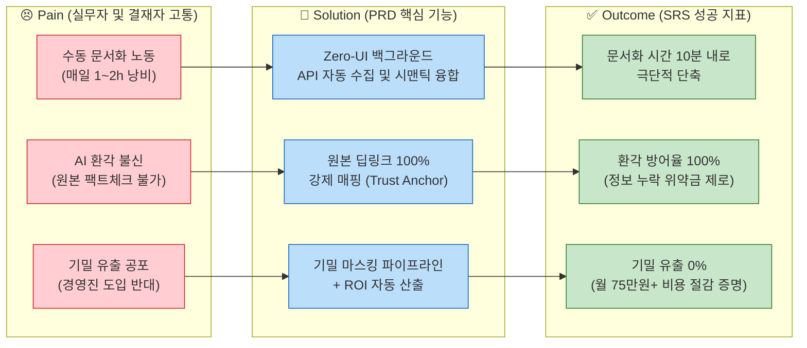

# CorpBrain Value Proposition Sheet (최종 통합본 - PRD/SRS 연계용)

> **작성 목적:** GEMINI v2의 직관적 고객 중심 피칭(가치 입증)과 OPUS v2의 논리적/재무적 아키텍처(구조화)를 결합한 마스터 문서입니다. 본 문서는 향후 작성될 **PRD(제품 요구사항 정의서)와 SRS(소프트웨어 요구사항 명세서)의 단단한 비즈니스적 기초(Root)** 역할을 합니다.

---

## 1. 핵심 가치 제안 (Executive Summary)

**"CorpBrain은 중소기업 실무자가 기존 업무 도구를 그대로 쓰면서(Zero-UI), AI가 백그라운드에서 파편화된 지식을 자동 수집·시맨틱 융합하여 '퇴근 전 승인 1클릭'으로 사내 위키를 완성시키는 AI 에이전트입니다. 모든 AI 요약에 원본 출처를 강제 매핑(100% 딥링크)하고, 기밀 정보를 자동 마스킹하여 B2B 결재권자의 보안 우려까지 원천 차단하는 마찰 제로·신뢰 완전 보장형 솔루션입니다."**

---

## 2. Pain–Solution–Outcome 아키텍처 (PRD 제품 목표 설정용)

향후 PRD의 **제품 목표(Product Goals) 및 주요 지표(Success Metrics)**로 직접 연결되는 가치 사슬입니다.

### 2.1. 전체 흐름도 시각화

---

## 3. 페르소나별 Value Proposition (PRD User Story 기반)

각 페르소나의 Pain과 JTBD(Jobs-to-be-Done)는 향후 PRD의 **유저 스토리(User Story: "나는 [역할]로서 [기능]을 원한다. 왜냐하면 [목표]하기 때문이다")**로 직결됩니다.

### 3.1. 핵심 사용자 (Core): 이수아 PM (파편화 융합형 실무자)
- **핵심 Pain**: 슬랙, 지라, 노션을 오가며 수동 문서화로 매일 1~2시간 낭비. 새 툴 학습 거부감.
- **JTBD 목표**: 기존 툴 화면을 벗어나지 않고(Zero-UI), AI가 병합한 초안을 버튼 1클릭으로 확정.
- **우리 솔루션(Feature)**: 마찰 제로 초자동화 수집기 (Zero-UI Collector)
- **차별적 가치(PRD 필수 제약)**: **100% 원본 딥링크 매핑**. 범용 LLM의 한계인 환각(Hallucination) 공포를 1초 팩트체크 기능으로 원천 불식.

### 3.2. 확장 사용자 (Adjacent): 강서연 DX 팀장 (B2B 도입 결재권자)
- **핵심 Pain**: 경영진의 '외부 AI 서버 전송 불가' 방침. 뚜렷한 도입 예산(ROI) 증명 난항.
- **JTBD 목표**: 기밀 유출을 원천 차단하고, 절감된 인건비를 수치화하여 한 번에 도입 결재 승인.
- **우리 솔루션(Feature)**: 엔터프라이즈급 기밀 마스킹 파이프라인 + 자동 ROI 시각화 리포트.
- **차별적 가치(세일즈 무기)**: 혁신적인 AI 수집 기술에 레거시 수준의 강력한 보안 통제권(RBAC)을 스타트업 툴 레벨에서부터 기본 번들로 제공.

### 3.3. 극단 사용자 (Extreme): 한유리 에이전시 PM (시스템 스트레스 테스터)
- **핵심 Pain**: 10개 이상의 툴에서 쏟아지는 클라이언트 요청. 맥락 꼬임 및 누락 시 돌이킬 수 없는 피해 발생.
- **우리 솔루션(Feature)**: 다중 채널 동시 시맨틱 융합 엔진 + 직관적 HITL(Human-In-The-Loop) 피드백 루프.
- **차별적 가치(엔진 신뢰성)**: AI의 완벽함을 강요하지 않고, 인간의 1클릭 교정 권한을 주어 파국적 리스크를 사용자 주도적으로 제어.

---

## 4. 수익 구조 및 가격 정책 (비즈니스 요구사항)

SRS의 **시스템 용량(Storage), 토큰 제한(Token Limit), 사용자 권한 계층(Role/Auth)** 등 인프라 스펙을 정의하는 기준입니다.

### 4.1. 과금 체계 설계 철학
- **가치 입증 기반 (ROI Logic)**: 실무자의 문서화 노동 시간(월 기회비용 약 75만 원)을 1.5만 원 수준의 구독료로 해결하는 압도적 비용 절감 제공.
- **시장 검증 기반 (Data-driven)**: Notion AI($20), 잔디 프리미엄(10,000원) 사이의 절묘한 타겟 포지셔닝(15,000원~25,000원). 10인 미만 초기 스타트업의 연 지출 의향($1,300)과 정합.

### 4.2. 하이브리드 요금제 (Seat + Usage + Token)
| 플랜명 | 월 가격(연결제 기준) | 대상 세그먼트 | 제공 기능 (SRS 권한 제약 스펙) | 전략적 역할 |
| --- | --- | --- | --- | --- |
| **Starter** | **12,000원/user** | C1 (이수아) | API 2채널 제한, 저장 5GB, 월 10만 토큰 제한 | 빠른 시장 침투 (초기 CAC 최소화) |
| **Team (주력)** | **20,000원/user** | A1 (강서연) | 무제한 채널, **기밀 마스킹, ROI 리포트**, 20GB | 수익성 확보 (LTV/CAC 7.5:1 타겟) |
| **Business** | **36,000원/user** | 중형 기업 | 고급 RBAC, SSO 연동, 전담 CSM, 100GB | ARPU 상승 및 확장 |
| **Enterprise** | **커스텀 ($50+)** | N1 (임성진) | **On-Premise / BYOC 구축형 환경** 제공 | 망분리 규제 타겟 장기 포획 |

---

## 5. JobMVP Feature Map & 로드맵 (PRD 백로그 구축용)

본 기능 목록은 즉시 **Jira/GitHub Issue의 에픽(Epic)** 단위로 치환됩니다.

| Phase (우선순위) | 에픽(Epic) 기능 명 | 해결 Pain / Outcome | 개발/스펙 기댓값 (SRS) |
| --- | --- | --- | --- |
| **Phase 1 (MVP Must-have)** | **Zero-UI API 수집 파이프라인** | C1의 수동 문서화 1h → 10분 단축 | 슬랙/지라 단방향 웹훅 및 토큰 기반 동기화. |
| **Phase 1 (MVP Must-have)** | **원문 딥링크 100% 매핑 엔진** | AI 환각 공포 종식 (신뢰도 100%) | 요약 노드 생성 시 원본 메시지 URI 강제 참조. |
| **Phase 1 (MVP Must-have)** | **사전 기밀 마스킹 파이프라인** | A1 경영진의 기밀 유출 반대 해소 | LLM 전송 전 정규식/NER 기반 PII 데이터 난독화. |
| **Phase 2 (Should-have)** | **HITL 기반 승인/수정 대시보드** | E1의 맥락 꼬임 오류 교정 마찰 최소화 | 프론트엔드 위젯, Diff UI 제공 및 RLHF 로깅. |
| **Phase 2 (Should-have)** | **도입 성과 ROI 시각화 리포트** | A1의 라이선스 갱신 명분 제공 | 절감된 토큰 수/시간을 대시보드 차트로 시각화. |
| **Phase 3 (Future-have)** | **On-Premise / BYOC 컨테이너화** | N1 망분리 타겟용 엔터프라이즈 진입 | k8s, Docker 기반 완전 독립 배포형 아키텍처 지원. |

---

## 6. 프로덕트 오너(PO)를 위한 4대 개발 원칙

본 문서를 바탕으로 PRD/SRS를 작성하실 기획자(PO)와 개발 리더를 위한 최상위 지침입니다.

1. **"Zero-UI가 생명이다"**: 프론트엔드 UI 화면을 화려하게 만드는 데 시간을 쏟지 마십시오. 사용자가 로그인 후 아무것도 하지 않아도 데이터가 흘러들어오는 '보이지 않는 백그라운드 파이프라인'의 안정성이 최우선입니다.
2. **"환각 방어(딥링크) 없이는 출시하지 마라"**: 요약 성능이 떨어져도 괜찮습니다. 틀린 요약문이라도 원본 링크만 클릭하면 1초 만에 팩트체크가 되는 구조가 B2B AI의 필수 런칭 요건입니다.
3. **"보안(마스킹)은 부가 기능이 아니라 결재 조건이다"**: 개발 편의를 위해 마스킹 파이프라인을 2차 업데이트로 미루면, 영업 미팅에서 B2B 결재권자(A1)에게 문전박대 당합니다. MVP에 무조건 포함되어야 합니다.
4. **"MVP 단계에서 구축형(On-Premise) 망분리 아키텍처는 고민하지 마라"**: SaaS의 빠른 배포와 피드백 루프에 집중하십시오. N1 타겟을 위한 독립형 패키징은 Series A 이후의 엔터프라이즈 전용 태스크(Phase 3)입니다.
