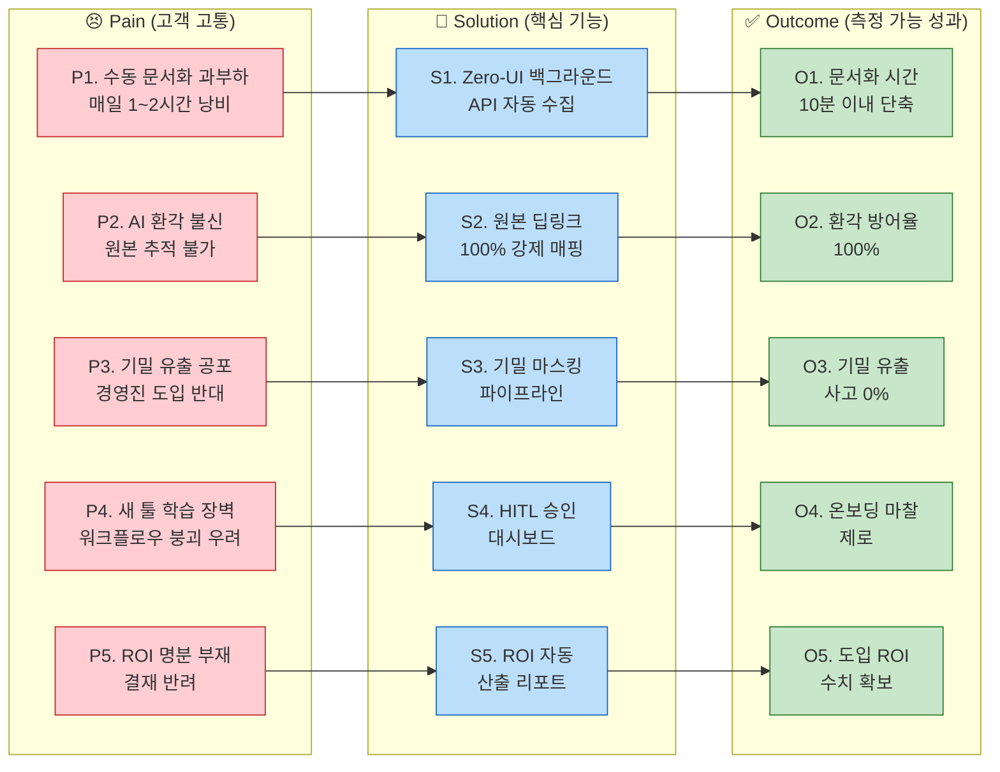

# CorpBrain Value Proposition Sheet v2 (최종 통합본)

> **작성일:** 2026-04-29 | **버전:** v2 (GEMINI & OPUS 장점 통합본)
> **대상 독자:** 처음으로 본격적인 신규 B2B SaaS 사업을 기획하는 예비 창업자 (대표님)
> **작성 목적:** 타겟 고객의 문제와 해결책의 핏(Problem-Solution Fit)을 검증하고, 사업의 재무적 지속성(유닛 이코노믹스) 및 실전 행동 지침을 담은 포괄적 가치 제안서입니다.

---

## 1. Pain–Solution–Outcome 핵심 흐름 정리

비즈니스의 복잡한 로직을 투자자와 고객에게 1분 안에 직관적으로 설명할 수 있는 가치 흐름과 시스템 아키텍처 연계도입니다.

### 1-1. 전체 구조도 (Mermaid)

### 1-2. 페르소나별 요약 테이블

| 단계 | 실무자 (C1: 이수아 PM) | 결재권자 (A1: 강서연 팀장) | 극한 환경 유저 (E1: 한유리 PM) |
| --- | --- | --- | --- |
| **Pain (고통)** | 수많은 툴(슬랙, 지라) 파편화로 매일 1~2시간씩 수동 문서화 노동에 시달림. | AI 도입 시 기밀 유출 반대, 확실한 비용 절감(ROI) 명분 부재. | 10개 이상 툴 파편화로 인한 패닉, 정보 누락 시 돌이킬 수 없는 위약금 리스크. |
| **Solution (해결책)** | **Zero-UI 백그라운드 수집기**: 평소처럼 일하면 알아서 초안 병합. | **엔터프라이즈급 마스킹 파이프라인** 및 ROI 시각화 대시보드 탑재. | **100% 원본 딥링크 매핑** 및 5개+ 채널 교정 가능한 직관적 HITL 피드백 루프. |
| **Outcome (결과)** | 퇴근 전 10분, 원클릭 승인으로 **문서화 시간 90% 극단적 단축**. | 기밀 유출 0%, 경영진 보고 시 **명확한 인건비 절감 성과 증명**. | 다중 채널 환경에서도 **오류/환각 없는 정보 병합, 클라이언트 컴플레인 제로**. |

---

## 2. 페르소나별 심층 문제 및 JTBD 매핑 (Problem–Solution Fit)

페르소나별 심층 니즈와 CorpBrain이 제공하는 차별적 가치를 상세히 매핑하여 세일즈 타겟을 직관적으로 이해할 수 있도록 구성했습니다.

### 2-1. 핵심 사용자 (Core) : "파편화 융합형 실무자" 이수아 (PM)
| 항목 | 내용 |
| --- | --- |
| **핵심 고통 (Pain)** | - 노션·피그마·지라·이메일 등 4개+ 채널 파편화로 **매일 1~2시간 수동 문서화** 낭비. - 지라(What)와 슬랙(Why)의 맥락 단절 및 새로운 SaaS 학습 장벽. |
| **목표 서술 (Job Statement)** | 기존 툴 화면을 벗어나지 않고, AI가 논의 맥락을 병합해 주어 **'버튼 클릭 한 번'으로 문서화를 끝내고자 함**. |
| **4 Forces 요약** | Push(복붙 피로), Pull(Zero-UI), Habit(수기 정리 관성), Anxiety(AI 환각) |
| **원하는 결과 (Outcome)** | 문서화 시간 **1~2h → 10분 이내** 단축, 환각 방어율 100%. |
| **우리 솔루션 핵심 제안** | **마찰 제로 초자동화 수집기 (Zero-UI Collector)**: 이탈 없는 백그라운드 자동 수집 및 시맨틱 융합. |
| **차별적 가치** | **"100% 원본 딥링크 추적 보장"**: 요약문 옆에 원본 링크를 매핑하여 1초 팩트체크가 가능하도록 지원. |

### 2-2. 확장 사용자 (Adjacent) : "B2B 도입 검토자" 강서연 (DX 팀장)
| 항목 | 내용 |
| --- | --- |
| **핵심 고통 (Pain)** | - AI 솔루션 도입 시 경영진의 극심한 **보안/기밀 유출 반대** 및 예산 부족 이중 허들. |
| **목표 서술 (Job Statement)** | 기밀 반출 우려를 차단하고, 절감된 인건비를 숫자로 증명해 **한 번에 도입 승인을 받아내고자 함**. |
| **4 Forces 요약** | Push(과거 반려), Pull(마스킹+ROI), Habit(레거시 유지), Anxiety(유출 책임) |
| **원하는 결과 (Outcome)** | 기밀 유출 0% 보장 및 명확한 ROI 지표 자동 산출. |
| **우리 솔루션 핵심 제안** | **경영진 결재 프리패스 무기**: 강력한 기밀 마스킹 파이프라인과 대시보드 내 ROI 산출 리포트 탑재. |
| **차별적 가치** | 혁신성을 취하면서도 엔터프라이즈급 보안 통제권(RBAC/마스킹)을 기본 제공하여 결재 허들을 대폭 하락시킴. |

### 2-3. 극단 사용자 (Extreme) : "멀티호밍 한계 시험자" 한유리 (에이전시 PM)
| 항목 | 내용 |
| --- | --- |
| **핵심 고통 (Pain)** | - 10개 이상의 툴에서 쏟아지는 극단적 정보 폭포 패닉, 누락 시 발생하는 **위약금 리스크**. |
| **목표 서술 (Job Statement)** | 10개+ 채널 맥락이 꼬임 없이 **하나의 타임라인으로 완벽하게 시맨틱 융합** 되기를 원함. |
| **4 Forces 요약** | Push(10개 창 패닉), Pull(HITL 학습), Habit(메신저 관성), Anxiety(혼동 사고) |
| **원하는 결과 (Outcome)** | 다중 채널 누락 위약금 제로화, HITL 교정 마찰 최소화. |
| **우리 솔루션 핵심 제안** | **직관적 HITL 피드백 루프**: 엣지 케이스에서 사용자의 승인/수정 피드백으로 AI 엔진 교정(RL 재학습). |
| **차별적 가치** | **"인간과 AI의 완벽한 협업 구조"**: 통제권을 사용자에게 넘겨 오류 발생 시 자가 교정되는 안정성. |

*(※ N1 비활성 사용자 - 임성진 CISO: 의료 데이터 등 클라우드 반출 자체가 컴플라이언스 위반. MVP 타겟에서 배제하고 Phase 3 On-Premise 구축 시 공략)*

---

## 3. 솔루션 핵심 제안 및 차별적 가치 (Value Proposition)

### 3-1. 핵심 가치 제안 한 문장 요약
> **"CorpBrain은 중소기업 실무자가 기존 업무 도구를 그대로 쓰면서, AI가 백그라운드에서 파편화된 지식을 자동 수집·시맨틱 융합하여 '퇴근 전 승인 1클릭'으로 사내 위키를 완성시키되, 모든 AI 요약에 원본 출처를 강제 매핑하고 기밀 정보를 자동 마스킹하여 B2B 결재권자의 보안 우려까지 원천 차단하는, 마찰 제로·신뢰 완전 보장형 AI 문서화 에이전트입니다."**

### 3-2. 핵심 가치 3축 (Value Triad)
| 가치 축 | 해결 Pain | 핵심 기능 | Outcome |
| --- | --- | --- | --- |
| **🔇 마찰 제로 (Zero-UI)** | 수동 문서화, 학습 장벽 | API 백그라운드 수집 + 시맨틱 초안 + HITL 승인 | 업무 시간 90% 단축 |
| **🛡️ 신뢰 앵커 (Trust Anchor)** | AI 환각, 정보 유출 | 원본 딥링크 100% + 기밀 마스킹 | 환각 방어 100%, 사고 0% |
| **📊 결재 무기 (Deal Closer)** | ROI 부재, 예산 압박 | ROI 자동 산출 리포트 + AI 바우처 연계 | 빠른 B2B 도입 승인 |

### 3-3. 기존 대안과의 차별적 비교
| 대안 / 경쟁사 | 실제 가격(2025~2026 기준) | 한계점 | CorpBrain 차별적 우위 | 고객 체감 메세지 |
| --- | --- | --- | --- | --- |
| **수기 정리** | 무료 (인건비만 낭비) | 맥락 병합 불가, 1~2h 낭비 | Zero-UI로 수기 완전 제거 | "퇴근 전 10분, 버튼 1개로 끝" |
| **Notion Business** | ~$20/user/월 | 사용자 직접 입력 전제 | 백그라운드 자동 수집 | 아무것도 안 해도 알아서 모임 |
| **Glean (통합검색)** | $50+/user/월 (최소 100석) | 중소기업 접근 불가능 | 10인 미만 최적화 가격 | 대기업용 툴을 중소규모로 |
| **Zapier / Make** | $20~50/월 (워크플로우당) | 단순 포워딩, 시맨틱 불가 | 시맨틱 병합 + 딥링크 | 단순 데이터가 아닌 맥락의 융합 |

---

## 4. 검증 근거 및 지표 (Proof)

### 4-1. 정량적/정성적 근거
- **시장 검증 (TAM/SAM/SOM)**: 초기 타겟 SOM(10인 미만) 기준 연 1.25억$ (약 96,500개 기업, 예산 $1,300/년)
- **최상위 기회 영역 (AOS 4.0 / DOS 3.6)**: Zero-UI 백그라운드 수집과 원본 딥링크가 리텐션을 좌우하는 최상위 핵심 지표로 검증됨.
- **고객 인터뷰(C1) 발화**: "요약본 읽다가 찜찜하면 바로 원본 가서 팩트체크가 되니까 안심입니다."
- **고객 인터뷰(A1) 발화**: "보안 유출 문제 없고, 월 OOO만원 절감 효과를 숫자로 보여줘야 결재가 수월합니다."

### 4-2. 검증 설계 (MVP PoC)
| 검증 항목 | 성공 기준 | 방법 |
| --- | --- | --- |
| **Zero-UI 체감** | 문서화 시간 80%+ 단축 | 베타 5인 A/B 테스트 |
| **환각 방어** | 원본 딥링크 100% 매핑 | 자동/수동 샘플링 검증 |
| **HITL 승인율** | 무수정 승인 70%+ 달성 | 1개월 파일럿 운용 |
| **B2B 전환 (세일즈)** | 경영진 도입 승인 1건+ | 실제 세일즈 파이프라인 가동 |

---

## 5. 수익 구조 및 가격 정책 (Revenue Model & Pricing Strategy)

솔루션의 장기적 성장성과 지속 가능성을 담보하기 위한 B2B SaaS 과금 모델입니다. **단순 추정이 아닌 실제 B2B SaaS 업계 벤치마크 및 한국 협업툴 시장 단가 데이터에 기반**하여 설계되었습니다.

### 5-1. 현실 데이터 기반 벤치마크 및 지불 의향(WTP)
- **경쟁사 실제 가격 벤치마크**: Notion Business($20), Glean($50+), 한국 협업툴(잔디/네이버웍스 7,000~10,000원)
- **당사 지불 의향 검증 (10인 미만 타겟)**: 10인 기준 월 환산 시 유저당 약 **$10.8** (약 1.4만원). 한국 협업툴보다는 높고 글로벌 툴보다는 낮은 최적의 포지셔닝 타겟.

### 5-2. 과금 아키텍처: 하이브리드 모델 (Seat-Based 구독 + Usage Sidecar)
진입 장벽을 낮추면서도 객단가를 높이기 위한 Tier별 구독 모델과 사용량 추가 과금을 혼합합니다.

| 플랜명 | 과금액 (User/Month) | 타겟 페르소나 | 제공 가치 및 한계 | 전략적 목적 |
| --- | --- | --- | --- | --- |
| **Starter (기본)** | **$11 (15,000원)** *(연 결제 12,000원)* | C1 (초기 도입) | - 2채널 연결 한도 - 시맨틱 초안, 딥링크 보장 | **빠른 시장 침투**: 10인 기준 월 12~15만원으로 산출된 지불 의향과 완벽 부합. |
| **Team (주력)** | **$18 (25,000원)** *(연 결제 20,000원)* | A1 (DX팀장), E1 | - 5채널 연결, 기밀 마스킹 - ROI 리포트 및 RBAC 제공 | **수익성 극대화 (Up-sell)**: 보안과 결재 명분이 절실한 관리자급은 2배 비용 기꺼이 지불. |
| **Enterprise** | **Custom ($33+)** | N1 (CISO 등) | - 무제한 채널 확장 - On-Premise/BYOC 옵션 | **장기 성장성**: 대규모 데이터 통제가 필요한 엔터프라이즈 및 금융/의료 고부가가치 시장(TAM). |

*※ **사용량 과금(Sidecar)**: 기본 토큰/저장 용량 초과 시 추가 과금으로 헤비 유저 수익원 흡수.*
*※ **바우처 연계 전략**: 정부 AI 바우처(80% 지원) 공급기업 등록 시 기업 실부담금 월 4~5천 원대로 감소.*

### 5-3. 수익성 및 지속가능성 분석 (ROI & Unit Economics)
- **고객사 입장의 압도적 ROI (세일즈 무기)**:
  - 실무자 문서화 기회비용 = **월 약 75만 원** (500만 원 급여의 15% 낭비 시간).
  - Starter 플랜 도입(월 1.5만 원)으로 월 75만 원 노동 절감 → **비용 대비 약 46배 ROI 달성**.
- **건강한 유닛 이코노믹스 지표**:
  - **LTV/CAC 비율**: 벤치마크(3:1)를 크게 상회하는 **약 7.5:1** 추산. (초기 브랜드 부재 시 3:1~5:1 현실적 목표)
  - **CAC 회수 기간**: 목표치(12개월 이내)를 충족하는 **약 4.4개월** 예상.
  - **이탈 방어 (Lock-in)**: Zero-UI 구조 특성상 사내 지식 베이스가 누적될수록 **전환 비용(Switching Cost)**이 폭증하여 안정적 월 반복 수익(MRR) 창출 보장.

---

## 6. JobMVP Feature Map (기능 우선순위 매핑)

기능의 가치(AOS/DOS)와 기술적 로드맵을 결합하여, 개발팀이 즉시 지라(Jira) 백로그로 옮길 수 있는 구조화된 개발 로드맵입니다.

| 우선순위 / Phase | 핵심 기능 (Feature) | 대상 페르소나 | 개발 목표 및 기댓값 | 시장 기회 (AOS/DOS) |
| --- | --- | --- | --- | --- |
| **1순위 (Phase 1)** | **이기종 채널 단방향 API 자동 수집 (Zero-UI)** | C1, E1 | 평소 툴을 벗어나지 않는 백그라운드 수집 구축. (기존 워크플로우 붕괴 제로) | High / High (4.0 / 3.6) |
| **1순위 (Phase 1)** | **환각 방지 원본 딥링크 100% 매핑** | C1, E1 | AI 신뢰성 검증의 최후 방어선. | High / High (4.0 / 3.6) |
| **1순위 (Phase 1)** | **엔터프라이즈급 기밀 마스킹 파이프라인** | A1 | 주요 기밀 마스킹 후 서버 전송. (B2B 도입 반려 사유 1순위 제거) | High / High (4.0 / 3.6) |
| **1순위 (Phase 1)** | **도입 성과 ROI 시각화 리포트** | A1 | 절감 인건비 수치화. (Team 플랜 업셀링의 핵심 무기) | High / High (3.2 / 2.4) |
| **2순위 (Phase 2)** | **HITL 기반 가벼운 승인/수정 대시보드** | C1, A1 | 초안을 1클릭으로 승인 및 RL 재학습(데이터 플라이휠 가동). | High / Low (3.0 / 1.6) |
| **2순위 (Phase 2)** | **조직도 연동 및 세밀한 관리자 권한(RBAC) 세팅** | A1 | 기업 내 데이터 통제권 강화 (초기엔 CSM 수동 지원으로 우회 가능). | Low / Low (1.2 / 0.0) |
| **3순위 (Phase 3)** | **On-Premise / BYOC 구축** | N1 | 엔터프라이즈 및 금융/의료 고부가가치 시장(TAM 확장) 진입. | - |

---

## 7. 예비 창업자(Founder)를 위한 전략적 체크포인트

투자자(VC) 피칭과 초기 고객 세일즈 미팅 시 반드시 기억해야 할 행동 지침입니다.

1. **투자자(VC) 대상 피칭 시 (숫자의 증명)**
   - 철저히 **하이브리드 과금 모델(토큰+용량)**과 **LTV/CAC 유닛 이코노믹스**를 보여주십시오. 단순 기능이 아닌, B2B SaaS 업계 벤치마크 데이터를 충족하는 '살아남을 수 있는 재무 모델'을 제시해야 펀딩을 받을 수 있습니다.
2. **초기 B2B 고객 및 결재권자 세일즈 시 (명분의 증명)**
   - 철저하게 **"월 75만 원어치 인건비 낭비를 단돈 1.5만 원에 해결해 드립니다"**라는 명확한 ROI 산출 논리에 집중하십시오.
   - UI/UX의 화려함보다 **"기밀이 절대 유출되지 않음(마스킹)"**과 **"100% 원본 딥링크(팩트체크)"**를 보여주는 것이 결재를 따내는 유일한 열쇠입니다.
3. **제품 개발 착수 및 타겟 선정 시 (선택과 집중)**
   - **절대 모든 기능을 한 번에 개발하려 하지 마십시오.** Phase 1(Must Have 4가지)이 돌아가면 바로 얼리어답터에 배포하십시오. 대시보드가 투박해도 수집과 딥링크만 작동하면 결제는 발생합니다.
   - **규제 벽에 부딪히는 고객(N1: CISO 등)은 MVP 단계에서 과감히 버리십시오.** 이들에게 맞추려다 SaaS의 본질적 확장성을 잃습니다. On-Premise는 향후 시리즈 A 이후에 공략할 대상입니다.
