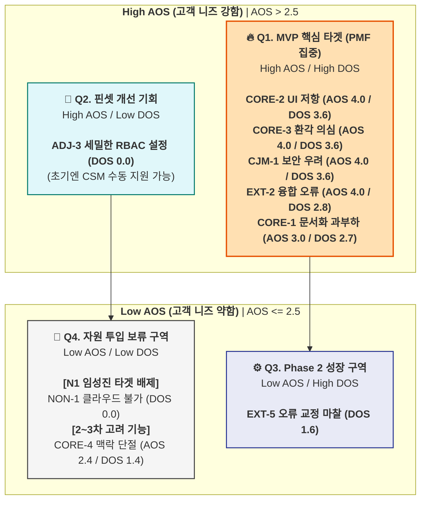

# 💡 Value Proposition Sheet — CorpBrain V4 (Merged)

> **문서 버전:** V4 (OPUS 데이터 + GEMINI ROI 논리 통합)
> **작성 대상:** 신규 B2B SaaS 사업(CorpBrain)을 기획 중인 예비 창업자 및 초기 멤버
> **작성 목적:** 페르소나, CJM, AOS-DOS, JTBD 데이터를 총망라하여 *누구에게, 어떤 본질적 가치를, 어떠한 차별성으로 제공하는지* 정의하고, 이를 실현하기 위한 수익 모델 및 MVP 개발 계획까지 단일 문서로 관리한다.

---

**🎯 엘리베이터 피치:** "슬랙과 지라 사이에서 길을 잃은 실무자를 위해, 새로운 창을 열 필요 없이 백그라운드에서 지식을 융합하고 100% 원본 딥링크로 신뢰를 보장하는 마찰 제로(Zero-UI) AI 문서화 에이전트"

**📣 포지셔닝 선언:** 우리는 단순한 문서 도구가 아니라, 이기종 채널의 파편화된 맥락을 **'시맨틱 융합'**하고 **'기밀 마스킹'**을 통해 보안 우려를 원천 차단하는, B2B 환경에 최적화된 **신뢰 기반 지식 허브**이다.

---

## 📌 목차

| # | 섹션 | 내용 요약 |
|---|------|----------|
| Ⅰ | [Pain–Solution–Outcome 핵심 흐름도](#ⅰ-painsolutionoutcome-핵심-흐름도) | 고객 문제 → 솔루션 → 성과의 직관적 흐름 |
| Ⅱ | [타겟 & 문제 분석](#ⅱ-타겟--문제-분석) | 핵심 고객 정의 및 고통의 깊이 (AOS/DOS) |
| Ⅲ | [AOS–DOS 결합 매트릭스](#ⅲ-aosdos-결합-매트릭스) | 페르소나별 Pain 수치화 및 시장 기회 시각화 |
| Ⅳ | [JTBD 요약 카드](#ⅳ-jtbd-요약-카드) | 고객 상황별 Job 통합 및 핵심 Pain-Outcome 압축 |
| Ⅴ | [Value Proposition Sheet (핵심 가치 제안)](#ⅴ-value-proposition-sheet-핵심-가치-제안) | 솔루션 핵심 제안 총괄표 |
| Ⅵ | [수익 구조 및 ROI 설계](#ⅵ-수익-구조-및-roi-설계) | Revenue Model & B2B ROI 논리 |
| Ⅶ | [전략적 제언 & 창업자 체크포인트](#ⅶ-전략적-제언--창업자-체크포인트) | 실무 및 세일즈 활용을 위한 분석가적 통찰 |
| Ⅷ | [MVP 제품 비전 및 포지셔닝](#ⅷ-mvp-제품-비전-및-포지셔닝) | MVP 정의, 북극성 지표, 제외 범위 |
| Ⅸ | [Job-Feature Map & 리스크 대응](#ⅸ-job-feature-map--리스크-대응) | 기능 우선순위 및 현실적 리스크 전략 |
| Ⅹ | [MVP 성공 측정 기준 & Next Steps](#ⅹ-mvp-성공-측정-기준--next-steps) | KPI 목표 및 팀별 실행 항목 |

---

## Ⅰ. Pain–Solution–Outcome 핵심 흐름도

우리 솔루션이 고객의 근본적 문제를 어떻게 해결하고 어떤 결과 가치를 창출하는지 보여주는 직관적 흐름입니다.

```mermaid
flowchart LR
    %% 스타일 정의
    classDef pain fill:#FFEbee,stroke:#EF5350,stroke-width:2px;
    classDef solution fill:#E8F5E9,stroke:#66BB6A,stroke-width:2px;
    classDef outcome fill:#E3F2FD,stroke:#42A5F5,stroke-width:2px;

    subgraph Pain ["🔥 Pain (고객의 고통 지점)"]
        direction TB
        P1("4개+ 이기종 채널 교차 대조\n(매일 1~2시간 수동 문서화 낭비)"):::pain
        P2("AI 할루시네이션 및 출처 불분명\n(원본 추적 불가에 따른 불신)"):::pain
        P3("영업 비밀 외부 AI 전송 공포\n(경영진의 도입 반대 및 보안 허들)"):::pain
    end

    subgraph Solution ["💡 Solution (우리 플랫폼의 핵심 제안)"]
        direction TB
        S1("Zero-UI 백그라운드 자동 수집\n(시맨틱 융합 초안 자동 생성)"):::solution
        S2("원본 메시지 100% 강제 딥링크 매핑\n(AI 요약의 실시간 팩트체크)"):::solution
        S3("엔터프라이즈급 기밀 마스킹 파이프라인\n(개인정보/비밀 필터링 후 전송)"):::solution
    end

    subgraph Outcome ["🎯 Outcome (고객이 체감하는 최종 성과)"]
        direction TB
        O1("문서화 시간 90% 이상 단축\n(1시간 -> 10분 이내 종료)"):::outcome
        O2("환각 방어율 100% 및 신뢰 확보\n(클라이언트 컴플레인 제로)"):::outcome
        O3("경영진 도입 승인 프리패스\n(보안 무결성 및 명확한 ROI 증명)"):::outcome
    end

    Pain ==> Solution ==> Outcome
```

---

## Ⅱ. 타겟 & 문제 분석

### 🎯 1. 타겟 페르소나 (SOM)

저희 비즈니스는 **국내 10인 미만 IT/커머스 스타트업 시장(SOM, 연 1.25억 달러)** 내에서 가장 파편화 고통이 심한 3개의 핵심 그룹의 문제를 풉니다.

**1. 파편화 융합형 실무자 (C1, 이수아 - 29세, PM)**
- **특징:** 기획(노션), 디자인(피그마), 개발(지라), 외부 소통(이메일) 등 4개 이상의 이기종 채널을 상시 띄워두고 업무를 진행하는 5인 규모 스타트업의 핵심 엔진.
- **Pain Point:** 동일 이슈임에도 지라에는 결과(What)만, 슬랙에는 논의(Why)만 분리되어 남는 **'맥락 단절(Context Collision)'** 현상. 이 파편화된 히스토리를 교차 대조하여 사내 위키에 취합하는 데 **매일 1~2시간을 수동 문서화 작업에 낭비**함. 바빠서 정리를 건너뛸 경우 핵심 정보 누락에 대한 강박적 불안감을 느낌.

**2. B2B 도입 검토자 (A1, 강서연 - 42세, DX팀장)**
- **특징:** 사내 지식 관리를 체계화하고자 하나, 15인 규모 조직 특유의 예산 한계와 보수적 경영진을 설득해야 하는 위치.
- **Pain Point:** AI 솔루션 도입 시 경영진이 제기하는 **"영업 비밀 외부 유출"** 우려가 1차 도입 반려 사유임. 또한 자체 예산이 부족하여, 경영진에게 보고할 **'정량적 도입 명분(절감되는 인건비 ROI)'**이 숫자로 입증되지 않으면 결재를 받아낼 수 없는 이중 허들에 직면함.

**3. 멀티호밍 한계 시험자 (E1, 한유리 - 35세, 에이전시 PM)**
- **특징:** 슬랙, 잔디, 팀즈, 카톡 등 10개 이상의 클라이언트 채널을 동시 다발적으로 관리하는 극단적 업무 환경.
- **Pain Point:** 사방에서 쏟아지는 산발적 요구사항 중 단 하나라도 누락 시 **'계약 위반(위약금)'**으로 직결됨. 정보의 폭포 속에서 겪는 패닉과 산만함을 통제하기 위해 10개 창을 띄워두고 수기로 강박적인 타임라인을 기록하는 극한의 피로감을 느낌.

> **🚫 배제 타겟 (N1, 임성진 - CISO):** 취급 정보가 민감한 의료/금융 데이터라 **'클라우드 반출 자체가 법적으로 불가'**한 그룹. 문서화 편의성이 보안(망분리) 규제를 넘을 수 없으므로, 현 SaaS 기반 MVP 타겟에서 철저히 배제하여 초기 리소스 낭비를 방지함.

---

## Ⅲ. AOS–DOS 결합 매트릭스

### 1. AOS-DOS 산출 근거 및 평가 논리

본 지표는 **"고객이 이 문제를 얼마나 절박하게 생각하는가?(AOS)"**와 **"이 문제를 해결하는 것이 우리 솔루션의 매출 확장에 얼마나 직결되는가?(DOS)"**를 교차 검증한 결과입니다.

- **AOS (결핍 강도):** `Importance × (1 - Satisfaction / 5)` (Likert 5점 척도). '정보 유출 공포', '수동 문서화 낭비', '새로운 툴 학습 거부감' 등 기존 대안(수기 정리, 사내 게시판)으로 해결되지 않는 항목들이 4.0(최고점)을 기록함.
- **DOS (시장 기회):** `AOS × Market Relevance`. 실무자(C1)가 매일 체감하는 편의성이자 결재자(A1)를 설득하는 절대적 관문(예: 마스킹, 딥링크)일수록 0.9의 높은 가중치를 부여함.

### 2. AOS-DOS Combined Matrix 시각화

---

## Ⅳ. JTBD 요약 카드 및 4 Forces 분석

### 🃏 Card 01. 수익 기여 1순위: 이수아 (C1)
> **"수동 복붙 노동에서 영원히 해방되고 싶다"**

| 항목 | 상세 분석 |
| --- | --- |
| **💡 통합 Job** | 프로젝트 마일스톤 종료 시, 기존 툴 화면을 벗어나지 않고도 AI가 논의 맥락을 병합한 초안을 제공해 주어 **'승인 클릭 한 번'으로 문서화를 끝내고자** 함. |
| **🔥 4 Forces** | **[Push]** 여러 툴을 오가며 복붙해야 하는 단순 노동 피로감 **[Pull]** Zero-UI 자동 수집과 '퇴근 전 승인 1회'라는 극강의 편의성 **[Habit]** 울며 겨자 먹기로 노션에 수기로 타임라인을 정리하던 관성 **[Anxiety]** AI가 할루시네이션(환각)을 일으켜 엉뚱한 내용을 요약할까 봐 불안 |
| **🎯 Outcome** | 매일 1~2시간 소요되던 수동 문서화 시간을 **10분 이내로 극단적 단축 (정보 누락 0건)** |

### 🃏 Card 02. 결재 허들 돌파 1순위: 강서연 (A1)
> **"경영진의 보안 불안을 잠재우고 숫자로 성과를 입증하고 싶다"**

| 항목 | 상세 분석 |
| --- | --- |
| **💡 통합 Job** | 새로운 지식 관리 솔루션 도입 시, 경영진의 기밀 반출 우려를 완벽히 차단하고 절감된 인건비를 숫자로 보여주어 **'한 번에 도입 승인'을 받아내고자** 함. |
| **🔥 4 Forces** | **[Push]** 과거 AI 툴 도입 시 경영진의 보안 우려로 반려된 경험 **[Pull]** 강력한 기밀 마스킹 아키텍처와 대시보드 내 ROI 자동 산출 리포트 **[Habit]** 비용과 보안 문제로 레거시 게시판을 억지로 유지하는 보수적 관성 **[Anxiety]** 혹시 모를 내부 정보 유출 시 모든 책임을 져야 한다는 두려움 |
| **🎯 Outcome** | **기밀 데이터 유출 사고 0%** 달성 및 도입 후 **명확한 ROI(비용 절감) 지표 확보** |

### 🃏 Card 03. 엔진 신뢰성 1순위: 한유리 (E1)
> **"10개 채널의 폭포 속에서도 단 하나의 단서도 놓치고 싶지 않다"**

| 항목 | 상세 분석 |
| --- | --- |
| **💡 통합 Job** | 10개 이상의 채널에서 쏟아지는 파편화된 요구사항이 **꼬임 없이 하나의 타임라인으로 정확히 시맨틱 융합**되는 것을 확인하고자 함. |
| **🔥 4 Forces** | **[Push]** 창 10개를 띄워놓고 수기로 관리하며 느끼는 패닉과 정보 누락 강박 **[Pull]** 직관적인 수동 교정(HITL)을 통해 AI가 내 의도를 즉시 학습하는 쾌감 **[Habit]** 클라이언트가 요구하는 각기 다른 메신저를 무조건 맞춰줘야 하는 업계 관성 **[Anxiety]** 유사한 프로젝트명에서 AI가 내용을 섞어버리면 돌이킬 수 없는 사고 발생 |
| **🎯 Outcome** | 다중 채널 환경에서 환각 없는 정보 병합으로 **클라이언트 위약금 및 컴플레인 제로화** |

---

## Ⅴ. Value Proposition Sheet (핵심 가치 제안)

| 항목 | 상세 내용 (B+C+D 융합 가치사슬 기반) | 전략적 근거 (5Forces & KSF) |
| --- | --- | --- |
| **핵심 제안 (Value Proposition)** | **"새로운 창을 열지 않는 지식 융합, 1초 만에 확인하는 원본의 신뢰"** 중소기업용 Zero-UI AI 문서화 에이전트 | B시장(검색)과 D시장(위키)의 거대 기업과 정면 승부를 피하고, 10인 미만 스타트업 타겟의 **'Zero-Effort 자동화'**로 가치 전환 |
| **고객별 핵심 문제 (Pain)** | ① (C1) 매일 1~2시간 파편화 툴 수동 복붙 ② (A1) 기밀 유출 보안 우려 및 ROI 증명 불가 ③ (E1) 다중 채널(10개 이상) 정보 누락 리스크 | "메신저 내 자체 검색"이라는 기존 시장의 강력한 '현상 유지 관성(대체재)'을 깨기 위해선 치명적 Pain 해결 필요 |
| **해결책 (Solution & Value Chain)** | **[Input]** 이기종 채널 백그라운드 API 자동 수집 (Zero-UI) **[Process]** 자율 지식 구조화 엔진 기반 타임라인 병합 **[Output]** 원본 딥링크 강제 매핑 및 기밀 마스킹 파이프라인 | 파서 기술(A시장)은 외부 조달(Buy/Use)로 R&D 비용을 낮추고, 백그라운드 수집 기술에 자원을 집중 |
| **차별적 우위 (Unfair Advantage)** | ① Notion이 따라올 수 없는 **수집 중심 아키텍처** ② 범용 LLM이 못하는 **100% 딥링크(환각 제로화)** ③ 시스템 통제권을 주는 **피드백 루프(HITL) UX** | 거대 AI 플랫폼이 소형 B2B 고객에게 커스텀으로 제공하기 힘든 정교한 '문서 충돌 제어 및 마스킹' 영역 선점 |
| **기존 대안의 한계 (Competitors)** | • **수기 정리:** 맥락 병합 불가, 인건비 기회비용 낭비 • **Zapier:** 시맨틱 융합 불가, 딥링크 부재 • **Glean 등:** 10인 미만 기업이 쓰기에 너무 비쌈($50+) | 기존 위키(Notion 등) 시장의 한계인 '수동 편집 및 콜드 스타트'의 진입 장벽 구조적 파괴 |

## Ⅵ. 시장 규모 및 수익 구조 설계 (TAM-SAM-SOM & ROI)

본 섹션은 솔루션의 장기적 성장성을 담보하기 위한 B2B SaaS 과금 모델과, 투자자 및 결재권자를 설득할 압도적 시장 데이터입니다.

### 1. 시장 규모 (TAM-SAM-SOM) 산출 근거
- **TAM (글로벌 엔터프라이즈 AI 및 지식 관리 시장):** **연 489억 달러**
  - 근거: 글로벌 KMS 시장(201억$) + 협업 툴 시장(489억$) 융합 영역.
- **SAM (한국 클라우드 협업 및 기업용 AI 시장):** **연 4.2억 달러**
  - 근거: 한국 팀 협업 SW 시장(3.6억$) + 한국 엔터프라이즈 생성형 AI 시장(0.5억$) 합산.
- **SOM (한국 10인 미만 혁신 IT 스타트업):** **연 1.25억 달러 (약 1,600억 원)**
  - 근거: 기술 기반 스타트업 96.5만 개 중 도입 여력이 있는 상위 10%(96,500개 기업) 타겟 × 기업당 연간 지식 관리 지출 추정액(약 $1,300).

### 2. CorpBrain 가격 정책 (Seat 기반 Tiered Model)
SOM 내 유저당 WTP(지불 의향)가 월 $10~$12로 추정됨에 따라, 초기 침투와 수익성을 동시 달성하는 모델을 설계합니다.

| 플랜명 | 가격 (User/Month) | 타겟 페르소나 | 핵심 제공 가치 | 전략적 목적 |
|---|---|---|---|---|
| **Starter** | **$12 (약 1.6만 원)** | C1 (실무자) | 2개 채널 자동 수집, 월 1만 회 요약 | **빠른 시장 침투** (WTP 부합) |
| **Team** | **$25 (약 3.4만 원)** | A1 (팀장) | 기밀 마스킹, 권한 통제(RBAC), ROI 리포트 | **수익성 극대화** (Up-sell, 바우처 타겟) |
| **Enterprise** | **Custom ($50+)** | N1 (CISO) | On-Premise, BYOC 독립 설치 지원 | **장기 성장성** (TAM 확장, 규제 시장 공략) |

### 3. 압도적 ROI 논리 (Sales Weapon)
B2B 세일즈의 핵심은 "문서화가 편해진다"가 아니라 **"연 1.47억 원의 매몰 비용을 방어한다"**는 메시지입니다.
- **기회비용 손실:** 실무자 1인 평균 월급 500만 원 기준, 다중 채널 정보 탐색 및 수동 문서화에 주당 평균 9.3~13.4시간을 낭비함. (10인 조직 기준 연간 약 1.47억 원의 인건비 매몰).
- **압도적 46배 ROI:** CorpBrain Starter($12, 약 1.6만 원) 도입 시, 실무자당 **월 75만 원 상당의 낭비되는 노동 시간을 자동화**함. 

### 4. 유닛 이코노믹스 (Unit Economics)
- **CAC 회수 기간:** 약 4.4개월 (SaaS 벤치마크 12개월 이내 달성)
- **LTV/CAC 비율:** 약 7.5 : 1 (벤치마크 3:1 대비 매우 우수)
- **매출총이익률:** 75% 이상 목표 (초기 오픈소스 LLM 활용을 통한 API 비용 최적화)

---

## Ⅶ. 전략적 제언 & 창업자 체크포인트

### 1. 분석가의 전략적 제언 (플랫폼 성장 경로 기반)
- **N1(임성진) 타겟 배제가 곧 "전략"입니다:** 클라우드 규제 벽이 있는 망분리 대상을 SaaS 단계에서 억지로 수용하려다 보면 혁신성을 잃게 됩니다. 이들은 Option B/C(On-Premise/BYOC) 독립 배포가 준비되는 장기 로드맵으로 분리하십시오.
- **초기 생존의 해자는 "정규화(Normalization)"입니다:** 단순 수집을 넘어, 이기종 채널 간의 '맥락 충돌(Context Collision)'을 자율적으로 병합하는 데이터 엔지니어링 능력이 가장 큰 해자가 될 것입니다.
- **기능이 아닌 "신뢰"를 파십시오:** 초기 수익을 위해 상단에 업체 광고를 넣는 순간, '독립적 지식 허브'라는 포지셔닝은 붕괴됩니다. 수익은 커머스가 아닌 '구독'과 '시간 절감'에서 나와야 합니다.

### 2. 예비 창업자를 위한 세일즈 피칭 가이드
- **절대 '모든 기능'을 한 번에 개발하지 마세요:** 백그라운드 수집, 원본 딥링크, 기밀 마스킹—이 3가지만 완벽하면 제품은 무조건 팔립니다.
- **세일즈 피칭의 무게 중심을 철저히 분리하세요:**
  - **실무자(C1) 타겟:** "새로운 툴을 배울 필요조차 없습니다. 기존처럼 일하시면 퇴근 10분 전에 초안만 승인하십시오."
  - **결재권자(A1) 타겟:** "외부로 기밀이 한 글자도 나가지 않습니다. 연간 1.47억 원의 매몰 비용을 월 $12로 방어해 드립니다."

---

## Ⅷ. MVP 제품 비전 및 포지셔닝

- **제품 비전:** *"수동 작성의 시대 종말. 새로운 창을 단 하나도 띄우지 않는 Zero-UI 아키텍처로, 사내 지식 자산화를 '승인 1클릭'으로 끝낸다."*
- **북극성 지표 (NSM):** **"탐색 시작 후 문서화 완료까지의 소요 시간 (TTC)"** (목표: 기존 60분 → 10분 이내 단축)
- **핵심 성공 요인 (KSFs) 기반 MVP Must-Have 스펙:**
  1. **Zero-Effort Background Automation:** 수동 편집/업로드를 원천 배제한 슬랙/지라 API 기반 백그라운드 수집.
  2. **Autonomous Knowledge Gardening:** 자율 지식 구조화 엔진을 통한 이기종 데이터 시맨틱 병합 (SI의 프로덕트화).
  3. **Hardware-as-a-Service (HaaS) 대비 설계:** 향후 보안 공포가 큰 엔터프라이즈를 위한 어플라이언스 렌탈 턴키 모델(C시장 대응) 아키텍처 염두.
  4. **Trust-Anchor System:** 환각 방어 및 100% 원문 딥링크 매핑.
  5. **Privacy-Guard & HITL UX:** 기밀 실시간 마스킹 및 실무자 참여형 피드백 루프 구축(자기 진화형 플라이휠).
- **제외 범위 (Out of Scope):** 파싱(Parsing) 원천 기술 개발(외부 조달), AI 개인화 맞춤 추천, 커뮤니티 기능 등 문서화 융합 본질을 벗어난 모든 기능.

---

## Ⅸ. 여정(CJM) 기반 리스크 및 대응 전략

| 분류 | 예상 리스크 (Pain Point) | 대응 전략 (Mitigation) |
|---|---|---|
| **기술적 리스크** | API 속도 제한 및 다중 채널(10개 이상) 연동 시 병목/누락 현상 발생 | **메시지 큐(Kafka) 기반 비동기 처리** 아키텍처 적용 및 써드파티 장애 시 수동 폴백(Fallback) 지원 |
| **법적/보안 리스크** | SaaS 연동 과정에서 과도한 권한 요구 및 '영업 비밀 외부 유출' 공포 | **1-Click 연동 UI** (최소 읽기 권한만 요구) 및 전송 전 Pii(개인식별정보) 자동 마스킹 파이프라인 강제화 |
| **운영적 리스크** | 초기 생성 초안의 할루시네이션(환각) 발견 시 즉각적인 고객 이탈 | 요약 문장별 **'원본 소스 딥링크 100% 매핑'**으로 실시간 팩트체크 환경 구축 (환각에 대한 톨러런스 확보) |
| **제품주도성장 리스크** | 엣지 케이스 오류 발생 시 AI가 반복적으로 같은 실수를 할 경우의 피로도 | 사용자의 **HITL(Human-In-The-Loop) 수정 행위**를 즉시 보상 함수(RL)로 반영하는 자율 피드백 루프 구축 |

---

## Ⅹ. AARRR 성공 측정 기준 & Next Steps

### 1. MVP 핵심 KPI 타겟
- **Acquisition (획득):** 랜딩 페이지 체류 시간 증가 및 '테스트 계정 신청률 5% 이상' 달성.
- **Activation (활성):** 계정 연동 후 **첫 '승인 1클릭' 완료까지 소요 시간 10분 이내** (초안 무수정 승인율 80% 이상).
- **Retention (유지):** 1개월 차 리텐션 90% 달성 (Zero-UI 특성상 해지율을 극도로 억제).
- **Revenue (수익):** 베타 유저의 유료 플랜(Starter/Team) **전환율 15% 이상**.
- **Referral (추천):** 유저 1인당 평균 1.2명의 타 부서 신규 팀원 초대 (조직 내 K-Factor 1.2+).

### 2. 즉시 실행(Action) 플랜
- [ ] **기술 PoC:** 이기종 데이터(이메일-슬랙-Jira) 주입 시 발생하는 맥락 충돌(Context Collision) 병합 테스트.
- [ ] **보안 프로토타이핑:** 개인정보/기밀 마스킹 파이프라인 실효성 검증 모델 구축.
- [ ] **세일즈 키트:** 10인 미만 상위 10% 혁신 스타트업 리스트업 및 '연간 ROI 시뮬레이터' 포함된 세일즈 덱(Sales Deck) 제작.

---
**[문서 끝]**
