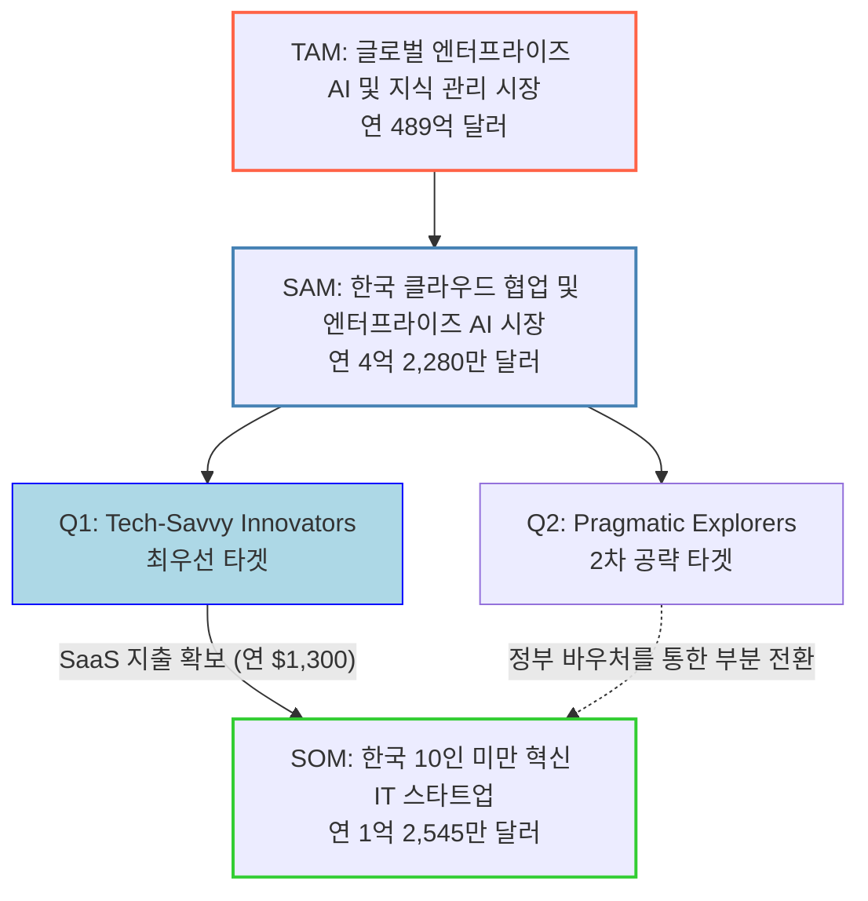
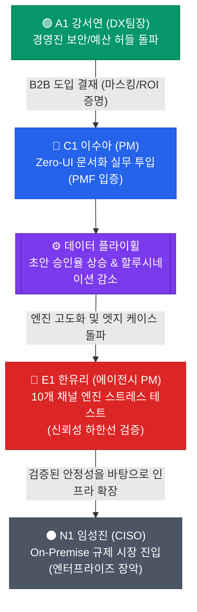
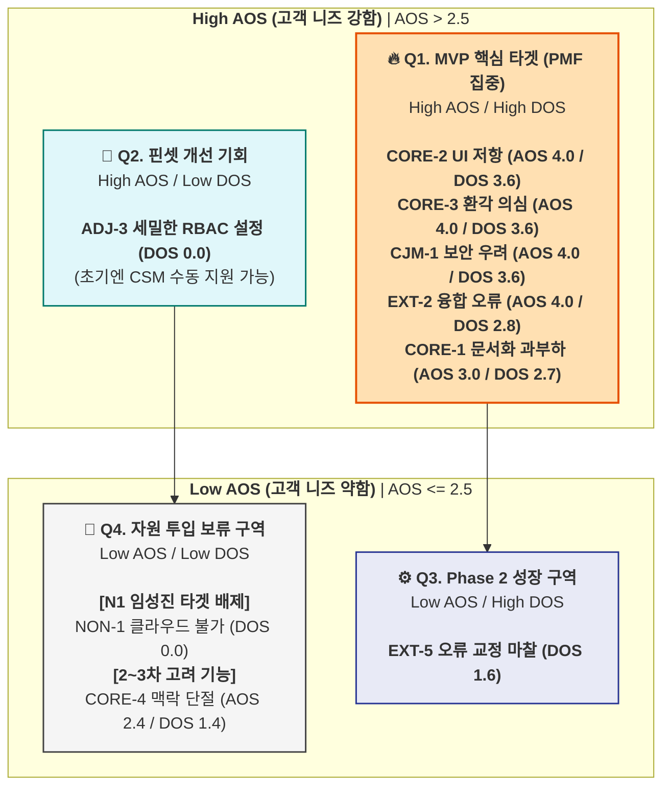

# 💡 Value Proposition Sheet — CorpBrain V5

> **문서 버전:** V5 (비즈니스 분석 통합본)
> **통합 원본:** `02_VPS-Drafts/VPS_rooted_v4.md` + `01_Biz-Analysis/` 전체 리서치 문서 12건
> **작성 대상:** 신규 B2B SaaS 사업(CorpBrain)을 기획 중인 예비 창업자 및 초기 멤버
> **작성 목적:** 비즈니스 리서치(Porter's 5 Forces, 가치사슬, KSF, TAM-SAM-SOM, 페르소나, CJM, AOS-DOS, JTBD)를 직접 포함하여, *왜 이 시장인지, 누구에게, 어떤 본질적 가치를, 어떠한 차별성으로 제공하는지* 정의하고, 이를 실현하기 위한 수익 모델 및 MVP 개발 계획까지 **단일 문서로 관리**한다.

---

**🎯 엘리베이터 피치:** "슬랙과 지라 사이에서 길을 잃은 실무자를 위해, 새로운 창을 열 필요 없이 백그라운드에서 지식을 융합하고 100% 원본 딥링크로 신뢰를 보장하는 마찰 제로(Zero-UI) AI 문서화 에이전트"

**📣 포지셔닝 선언:** 우리는 단순한 문서 도구가 아니라, 이기종 채널의 파편화된 맥락을 **'시맨틱 융합'**하고 **'기밀 마스킹'**을 통해 보안 우려를 원천 차단하는, B2B 환경에 최적화된 **신뢰 기반 지식 허브**이다.

---

## 📌 목차

| # | 섹션 | 내용 요약 |
|---|------|----------|
| Ⅰ | [Pain–Solution–Outcome 핵심 흐름도](#ⅰ-painsolutionoutcome-핵심-흐름도) | 고객 문제 → 솔루션 → 성과의 직관적 흐름 |
| Ⅱ | [타겟 & 문제 분석](#ⅱ-타겟--문제-분석) | 핵심 고객 정의 및 고통의 깊이 (AOS/DOS) |
| Ⅲ | [AOS–DOS 결합 매트릭스](#ⅲ-aosdos-결합-매트릭스) | 페르소나별 Pain 수치화 및 시장 기회 시각화 |
| Ⅳ | [JTBD 요약 카드](#ⅳ-jtbd-요약-카드) | 고객 상황별 Job 통합 및 핵심 Pain-Outcome 압축 |
| Ⅴ | [Value Proposition Sheet (핵심 가치 제안)](#ⅴ-value-proposition-sheet-핵심-가치-제안) | 솔루션 핵심 제안 총괄표 |
| Ⅵ | [수익 구조 및 ROI 설계](#ⅵ-수익-구조-및-roi-설계) | Revenue Model & B2B ROI 논리 |
| Ⅶ | [전략적 제언 & 창업자 체크포인트](#ⅶ-전략적-제언--창업자-체크포인트) | 실무 및 세일즈 활용을 위한 분석가적 통찰 |
| Ⅷ | [MVP 제품 비전 및 포지셔닝](#ⅷ-mvp-제품-비전-및-포지셔닝) | MVP 정의, 북극성 지표, 제외 범위 |
| Ⅸ | [Job-Feature Map & 리스크 대응](#ⅸ-job-feature-map--리스크-대응) | 기능 우선순위 및 현실적 리스크 전략 |
| Ⅹ | [MVP 성공 측정 기준 & Next Steps](#ⅹ-mvp-성공-측정-기준--next-steps) | KPI 목표 및 팀별 실행 항목 |

---

## Ⅰ. Pain–Solution–Outcome 핵심 흐름도

우리 솔루션이 고객의 근본적 문제를 어떻게 해결하고 어떤 결과 가치를 창출하는지 보여주는 직관적 흐름입니다.

```mermaid
flowchart LR
    %% 스타일 정의
    classDef pain fill:#FFEbee,stroke:#EF5350,stroke-width:2px;
    classDef solution fill:#E8F5E9,stroke:#66BB6A,stroke-width:2px;
    classDef outcome fill:#E3F2FD,stroke:#42A5F5,stroke-width:2px;

    subgraph Pain ["🔥 Pain (고객의 고통 지점)"]
        direction TB
        P1("4개+ 이기종 채널 교차 대조\n(매일 1~2시간 수동 문서화 낭비)"):::pain
        P2("AI 할루시네이션 및 출처 불분명\n(원본 추적 불가에 따른 불신)"):::pain
        P3("영업 비밀 외부 AI 전송 공포\n(경영진의 도입 반대 및 보안 허들)"):::pain
    end

    subgraph Solution ["💡 Solution (우리 플랫폼의 핵심 제안)"]
        direction TB
        S1("Zero-UI 백그라운드 자동 수집\n(시맨틱 융합 초안 자동 생성)"):::solution
        S2("원본 메시지 100% 강제 딥링크 매핑\n(AI 요약의 실시간 팩트체크)"):::solution
        S3("엔터프라이즈급 기밀 마스킹 파이프라인\n(개인정보/비밀 필터링 후 전송)"):::solution
    end

    subgraph Outcome ["🎯 Outcome (고객이 체감하는 최종 성과)"]
        direction TB
        O1("문서화 시간 90% 이상 단축\n(1시간 -> 10분 이내 종료)"):::outcome
        O2("환각 방어율 100% 및 신뢰 확보\n(클라이언트 컴플레인 제로)"):::outcome
        O3("경영진 도입 승인 프리패스\n(보안 무결성 및 명확한 ROI 증명)"):::outcome
    end

    Pain ==> Solution ==> Outcome
```

---

## Ⅱ. 타겟 & 문제 분석

### 🏭 1. 시장 환경 — 왜 이 시장인가?

#### 1-1. 산업 트렌드 및 시장 환경 (Porter's 5 Forces 기반)

> **출처:** `2_CorpBrain_시장별_5Forces_비교_및_융합전략.md`, `5-2_문제정의서-실무자관점.md`

국내 기업용 AI 및 지식 관리 시장은 글로벌 **489억 달러** 규모의 거대 생태계 일부로, 4개 세부 시장(A:전처리, B:RAG 검색, C:sLLM 인프라, D:위키)이 교차하는 융합 영역입니다. CorpBrain은 이 4개 시장의 약점을 파고드는 **융합 및 회피 전략**으로 포지셔닝합니다.

| Porter's Force | 강도 | 핵심 분석 결과 |
|---|---|---|
| **기존 기업 간 경쟁** | 매우 강함 | Glean, Microsoft 등 막강한 자본의 기업들이 B시장(RAG 검색)에서 레드오션을 형성. D시장(위키)은 Notion, Atlassian 등이 AI 기능을 공격적으로 탑재하며 '거인들의 전쟁' 상태. **전략: 범용 검색/위키와 정면 승부를 피하고, 10인 미만 스타트업으로 극단적 타겟 축소** |
| **신규 진입자 위협** | 시장별 극단 차이 | B시장(RAG)은 오픈소스로 진입 장벽이 사실상 제로. 반면 D시장(위키)은 누적 문서 자산 + 업무 습관 락인으로 진입 장벽이 높음. **전략적 해자:** '수동 편집 및 콜드 스타트'라는 기존 위키의 구조적 약점을 Zero-UI 자동화로 파괴 |
| **구매자 교섭력** | 높음 | B시장은 대안 솔루션이 풍부하여 구매자 협상력이 매우 높음. 그러나 D시장은 데이터 마이그레이션 번거로움으로 '포로화된 고객' 상태. **전략:** 수집 자동화 + 시맨틱 융합이라는 독점적 가치로 '대리인(Agent)' 포지셔닝 확보 |
| **대체재 위협** | 강함 | 가장 강력한 대체재는 시스템이 아닌 **'현상 유지 관성'** — "기존 메신저에서 검색하면 충분하다"는 인식. 구글 문서나 카톡 공지가 사실상 대체재로 기능 |
| **공급자 교섭력** | 시장별 차이 | C시장(sLLM)은 NVIDIA GPU 독점으로 수익 구조 붕괴 리스크 존재. D시장(위키)은 순수 S/W로 공급자 영향 제한적. **전략:** 오픈소스 LLM(Gemma 등)으로 특정 공급자 종속 회피 |

> **5 Forces 종합 결론:** 4개 시장 모두 자본력 있는 대기업이 장악하거나 치명적 비용 리스크가 존재하여 직접 진입 시 생존 불가. B&D 시장의 가치를 전환하여, 거대 위키 플랫폼의 약점인 **'문서화 노동'을 완전히 자동화(Zero-effort Auto-Wiki)**하는 방향으로 해자를 구축해야 한다.

#### 1-2. 가치사슬(Value Chain) 설계 및 핵심 성공 요인(KSF)

> **출처:** `3_통합 가치사슬설계.md`, `4_KSFs.md`

**가치사슬 주요 활동 설계 (B+C+D Winning Mix):**

| 주요 활동 | 설계 방향 | 경쟁 우위 확보 방안 |
|---|---|---|
| **조달 물류** | **[B시장]** 슬랙, 카톡, 이메일 등 사내 협업툴 API 연동을 통해 파편화된 지식을 백그라운드에서 자동 수집. 기초 파싱(A시장)은 오픈소스 차용 | **Zero-UI 백그라운드 자동 흡수:** 사용자의 매뉴얼 업로드를 완전 배제 |
| **운영** | **[D시장]** 자율 지식 구조화 엔진이 폴더 구조 리팩터링 및 고립 문서 연결을 자율 수행. 타임스탬프 대조로 변경점(Diff)과 충돌(Conflict) 자동 관리 | **자율 가드닝(Gardening):** RL 보상 함수 기반의 자기 진화형 분류 정확도 |
| **산출 물류** | **[C시장]** 퍼블릭 클라우드 배제, 고객사 사내망에서만 폐쇄적으로 작동하는 물리적 GPU 워크스테이션(턴키) 배포 | **어플라이언스 렌탈(HaaS):** '정수기 렌탈 방식'으로 초기 자본 장벽 제거 |
| **마케팅/영업** | \"퇴사 시 노하우 유실 방지\" + \"완벽한 보안\" 소구. 정수기 렌탈 방식의 HaaS 월 과금 모델을 핵심 무기로 영업 | **기회비용 프레이밍:** \"연 1.47억 원의 매몰 비용을 방어하라\" |
| **서비스** | 사용자의 승인/수정 행동을 RL 보상 함수로 즉각 반영하여 자율 진화하는 A/S 체계. 물리 HW 장애 시 현장 유지보수 | **자기 진화형 데이터 플라이휠:** HITL 피드백 → RL 학습 → 정확도 상승 |

**Top 5 핵심 성공 요인 (KSF):**

| 순위 | KSF | 근거 출처 |
|---|---|---|
| 1 | **Zero-Effort 데이터 수집의 백그라운드 완전 자동화** | 5 Forces '대체재 위협(현상 유지 관성)' + 가치사슬 '조달 물류' |
| 2 | **SI의 소프트웨어화: 자율 지식 구조화 엔진(RL 기반 가드닝)** | 가치사슬 '운영' + 5 Forces '기존 경쟁자(Notion/Atlassian)' |
| 3 | **보안 공포와 자본 장벽을 동시에 허무는 '어플라이언스 렌탈(HaaS)'** | 5 Forces '구매자 교섭력' + 가치사슬 '산출 물류' |
| 4 | **직관적 문서 충돌 제어 및 HITL 피드백 루프 UX** | 가치사슬 '서비스' + 5 Forces '대체재 위협' |
| 5 | **비핵심 기술의 과감한 외부 조달 및 R&D 자원 선택적 집중** | 5 Forces '공급자 교섭력' + 가치사슬 '기술 개발' |

#### 1-3. 시장 규모 (TAM-SAM-SOM)

> **출처:** `6-10_CorpBrain_TAM_SAM_SOM_산출표.md`, `6_CorpBrain_통합_시장분석_요약본.md`

| 구분 | 규모 | 근거 |
|---|---|---|
| **TAM** (글로벌 엔터프라이즈 AI 및 지식 관리 생태계) | **연 489억 달러** | 글로벌 KMS 시장(201억$) + 협업 툴 시장(489억$) 융합 영역 |
| **SAM** (한국 클라우드 협업 및 기업용 AI 시장) | **연 4.2억 달러** | 한국 팀 협업 SW 시장(3.6억$) + 한국 엔터프라이즈 생성형 AI(0.5억$) |
| **SOM** (한국 10인 미만 혁신 IT 스타트업) | **연 1.25억 달러 (약 1,600억 원)** | 기술 기반 스타트업 96.5만 개 중 상위 10%(96,500개) × 기업당 연간 $1,300 |

**핵심 행동·심리 지표 (공개 조사 및 추정 데이터):**

| 지표 | 수치 | 출처 | 검증 수준 |
|---|---|---|---|
| 지식 근로자 정보 탐색 낭비 | 주당 평균 **9.3시간** | McKinsey 등 업무 분석 리포트 | ⚠️ 해외 벤치마크 |
| 개발자 직군 정보 탐색·부채 해결 | 주당 평균 **13.4시간** | 업무 시간의 약 33% 낭비 | ⚠️ 타깃 응용 추론 |
| 완전 자율형 AI에 대한 신뢰도 하락 | **43% → 27%** (1년 만에) | 공개 설문 조사 | ✅ 공개 조사 |
| AI 결과물에 대한 완벽 신뢰도 | **4%** (96%가 정확성 의구심) | 공개 설문 조사 | ✅ 공개 조사 |
| 10인 조직 연간 기회비용 (Cost of Doing Nothing) | **연 1.16~1.47억 원** | 인건비 낭비 + 온보딩 지연 합산 | ⚠️ 산술적 환산 |
| 1인당 SaaS 연간 지출 한도 | **$4,830** | Zylo (SaaS Management Index) | ⚠️ 글로벌 기준 |

**전략적 인사이트 — 시장 가설 검증 강도:**

| 문제의식 | 검증 강도 | 핵심 데이터 |
|---|---|---|
| P1. 문제 실재성 (원인) | ██████████ **매우 강함** | 기존 툴 혼용의 한계, 맥락 단절 구조적 결함 확인(🟢) |
| P4. UX 및 신뢰 (심리) | ████████░░ **강함** | 완전 자율 AI 불신 데이터 확보, HITL 수용성 전제(🟢) |
| P6. 경쟁/방어 (보안) | ████████░░ **강함** | 보안 우려 1위 장벽(38~77%), 이종 채널 융합 해자(🟢) |
| P2. 시장 규모 (TAM) | ██████░░░░ **중간** | TAM/SAM 확인, SOM 세그먼트 비중은 자의적 가정(🟡) |
| P3. 수요/기회비용 (ROI) | ██████░░░░ **중간** | 비용 논리 강력하나 '1.8시간 단축'은 PoC 필요(🟡) |
| P7. 기술 실행 가능성 | ███░░░░░░░ **매우 약함** | 시맨틱 병합 PoC 미실시, 환각 정제 능력 미검증(🔴) |

> **\"왜(Why)\"는 강하고, \"어떻게(How)\"는 아직 가설이다.** → MVP 착수 전 P7(기술 PoC: 맥락 충돌 병합 정확도)에 100% 리소스를 집중해야 한다.

---

### 🎯 2. 타겟 — 누구를 위한 것인가?

> **출처:** `7_페르소나_스펙트럼_최종.md`

저희 비즈니스는 **국내 10인 미만 IT/커머스 스타트업 시장(SOM, 연 1.25억 달러)** 내에서 가장 파편화 고통이 심한 3개의 핵심 그룹의 문제를 풉니다.

**1. 파편화 융합형 실무자 (C1, 이수아 - 29세, PM)**
- **특징:** 기획(노션), 디자인(피그마), 개발(지라), 외부 소통(이메일) 등 4개 이상의 이기종 채널을 상시 띄워두고 업무를 진행하는 5인 규모 스타트업의 핵심 엔진.
- **Pain Point:** 동일 이슈임에도 지라에는 결과(What)만, 슬랙에는 논의(Why)만 분리되어 남는 **'맥락 단절(Context Collision)'** 현상. 이 파편화된 히스토리를 교차 대조하여 사내 위키에 취합하는 데 **매일 1~2시간을 수동 문서화 작업에 낭비**함. 바빠서 정리를 건너뛸 경우 핵심 정보 누락에 대한 강박적 불안감을 느낌.

**2. B2B 도입 검토자 (A1, 강서연 - 42세, DX팀장)**
- **특징:** 사내 지식 관리를 체계화하고자 하나, 15인 규모 조직 특유의 예산 한계와 보수적 경영진을 설득해야 하는 위치.
- **Pain Point:** AI 솔루션 도입 시 경영진이 제기하는 **"영업 비밀 외부 유출"** 우려가 1차 도입 반려 사유임. 또한 자체 예산이 부족하여, 경영진에게 보고할 **'정량적 도입 명분(절감되는 인건비 ROI)'**이 숫자로 입증되지 않으면 결재를 받아낼 수 없는 이중 허들에 직면함.

**3. 멀티호밍 한계 시험자 (E1, 한유리 - 35세, 에이전시 PM)**
- **특징:** 슬랙, 잔디, 팀즈, 카톡 등 10개 이상의 클라이언트 채널을 동시 다발적으로 관리하는 극단적 업무 환경.
- **Pain Point:** 사방에서 쏟아지는 산발적 요구사항 중 단 하나라도 누락 시 **'계약 위반(위약금)'**으로 직결됨. 정보의 폭포 속에서 겪는 패닉과 산만함을 통제하기 위해 10개 창을 띄워두고 수기로 강박적인 타임라인을 기록하는 극한의 피로감을 느낌.

> **🚫 배제 타겟 (N1, 임성진 - CISO):** 취급 정보가 민감한 의료/금융 데이터라 **'클라우드 반출 자체가 법적으로 불가'**한 그룹. 문서화 편의성이 보안(망분리) 규제를 넘을 수 없으므로, 현 SaaS 기반 MVP 타겟에서 철저히 배제하여 초기 리소스 낭비를 방지함.

---

### 📉 3. 문제의 깊이 — 고객 여정(CJM)에서 드러나는 Pain

> **출처:** `8_고객여정지도_최종.md`

**CJM 단계별 핵심 Pain Point — 전 페르소나 교차 분석:**

| CJM 단계 | 가장 큰 공통 Pain | 해당 페르소나 | 개선 기회 |
|---|---|---|---|
| **인지** | 수많은 툴을 엮어줄 단일 허브의 부재 | C1, E1 | \"퇴근 시간 1시간 단축\" SEO 최적화, \"슬랙/지라 동시 연동\" 키워드 선점 |
| **고려** | 새로운 툴 학습에 대한 높은 심리적 장벽 + 보안 우려 | C1, A1 | \"새로운 창을 띄울 필요 없음(Zero-UI)\" 강조, 1분 데모 영상 |
| **결정** | 권한 연동 과정의 번거로움 + API 과도한 쓰기 권한 요구 | C1, A1, E1 | 1-Click 연동 UI, \"최소 읽기 권한(Read-only)만 요구\" 명시 |
| **온보딩** | 초기 생성 초안의 할루시네이션 및 정보 누락 | C1, E1 | 원본 딥링크 필수 제공, HITL 대시보드로 즉각 팩트체크 |
| **충성도** | 새로운 업무 채널 연동 미지원 시 병목 재발 | C1, E1 | 로드맵 투표 게시판 운영, 지속적 Integration 추가 |

**페르소나별 여정 핵심 가치:**

| 페르소나 | 여정 핵심 가치 | 감정 곡선 |
|---|---|---|
| **C1** | \"1~2시간짜리 수동 문서화를 퇴근 전 10분으로\" | 피로감+절실함 → 호기심+경계심 → 기대감+결단 → 놀라움+안도감 → **강한 만족+전도사** |
| **A1** | \"보안 우려 해소 + 정량적 ROI로 경영진 한방 설득\" | 우려+방어 → 안도감+계산 → 확신+성취감 → 긴장+책임감 → **만족+신뢰** |
| **E1** | \"10개 채널의 폭포 속에서도 누락 0건\" | 패닉+강박 → 날카로운 의심 → 조건부 수용 → 예민+검증 → **절대적 의존** |

**플랫폼 성장 플라이휠:**

---

### 🚀 4. MVP 핵심 방향

우리의 MVP는 화려한 헬스케어 슈퍼앱이 아닙니다. 고객의 **문서화 노동을 60분에서 10분으로 압축**하는 단 세 가지 압도적인 기능만 던집니다.

- **[Zero-UI Collector]:** 기존 툴 화면을 벗어나지 않고도 슬랙/지라/이메일 데이터를 백그라운드에서 시맨틱하게 융합한 초안을 자동 생성하는 **마찰 제로 수집기**.
- **[Trust-Anchor System]:** 생성된 요약문의 모든 문장에 **원본 메시지 100% 딥링크**를 강제 매핑하여, AI 환각이 발생하더라도 1초 만에 원본으로 팩트체크할 수 있는 안전망.
- **[Privacy-Guard]:** 서버 전송 전 주민번호/기밀 키워드를 자동 감지하여 가리는 **엔터프라이즈급 마스킹 파이프라인**. 결재권자(A1)의 1차 거절 사유인 '기밀 유출 공포'를 원천 차단.

---

## Ⅲ. AOS–DOS 결합 매트릭스

> **출처:** `9_최종시장기회판단_AOS_DOS.md`

### 1. 페르소나별 Pain 수치화 및 AOS-DOS 산출

**AOS 산출 공식:** `Importance × (1 - Satisfaction / 5)` *(Likert 5점 척도 기준)*
**DOS 산출 공식:** `AOS × Market Relevance (MR)`

| 분류 (세그먼트) | Pain / Goal | Imp | Sat | AOS | MR | DOS | Quadrant | 전략적 해석 |
| --- | --- | --- | --- | --- | --- | --- | --- | --- |
| **Core (C1)** | 새로운 툴 학습 심리적 장벽 (CORE-2) | 5 | 1 | **4.0** | 0.9 | **3.6** | **Q1** | **(1순위)** Zero-UI가 온보딩 이탈을 막는 핵심 |
| **Core (C1)** | AI 환각 의심 및 원본 추적 (CORE-3) | 5 | 1 | **4.0** | 0.9 | **3.6** | **Q1** | **(1순위)** 생성 AI 결과를 신뢰하게 만드는 절대 기준 (딥링크) |
| **CJM (인지)** | 외부 AI 연동 정보 유출 (CJM-1) | 5 | 1 | **4.0** | 0.9 | **3.6** | **Q1** | **(1순위)** 엔터프라이즈 도입 논의의 1차 관문 (마스킹) |
| **CJM (고려)** | UI 변화 저항/워크플로우 붕괴 (CJM-2) | 5 | 1 | **4.0** | 0.9 | **3.6** | **Q1** | **(1순위)** 기존 툴에서 벗어나지 않게 하는 전략 |
| **CJM (결정)** | AI 환각 의심 및 누락 공포 (CJM-3) | 5 | 1 | **4.0** | 0.9 | **3.6** | **Q1** | **(1순위)** 최종 도입 결정을 짓는 신뢰 구조화 핵심 |
| **Extreme (E1)** | 시맨틱 융합 오류 및 누락 공포 (EXT-2) | 5 | 1 | **4.0** | 0.7 | **2.8** | **Q1** | **(1순위)** 다중 채널 꼬임 방지로 B2B 전반 불신 종식 |
| **Core (C1)** | 이기종 툴 수동 문서화 과부하 (CORE-1) | 5 | 2 | **3.0** | 0.9 | **2.7** | **Q1** | **(1순위)** \"퇴근 시간 단축\" 프로덕트 본질 가치 |
| **Adjacent (A1)** | 경영진 기밀 유출 우려 (ADJ-1) | 5 | 2 | **3.0** | 0.8 | **2.4** | **Q1** | **(1순위)** B2B 도입 최대 결재 허들 돌파 요건 |
| **Adjacent (A1)** | 정량적 도입 명분(ROI) 증명 부족 (ADJ-2) | 4 | 1 | **3.2** | 0.8 | **2.4** | **Q1** | **(1순위)** 차년도 라이선스 갱신 및 세일즈 무기 직결 |
| **CJM (결정)** | 정량적 ROI 명분 부족 (CJM-4) | 4 | 1 | **3.2** | 0.8 | **2.4** | **Q1** | **(1순위)** B2B 영업 시 필수 자동화 ROI 리포트 |
| **Extreme (E1)** | 10개 채널 파편화 극단 심화 (EXT-1) | 5 | 1 | **4.0** | 0.5 | **2.0** | **Q1** | (2순위) AOS 최고이나 시장 볼륨 제한 |
| **Core (C1)** | 동일 이슈의 맥락 단절 (CORE-4) | 4 | 2 | **2.4** | 0.7 | **1.4** | **Q4** | (보류) 핵심 엔진 이후 고도화 영역 |
| **Extreme (E1)** | 엣지 케이스 오류 교정 마찰 (EXT-3) | 4 | 2 | **2.4** | 0.4 | **0.8** | **Q4** | (보류) 사용 빈도/파급력 상대적 낮음 |
| **Adjacent (A1)** | 관리자 세팅(RBAC) 복잡성 (ADJ-3) | 3 | 3 | **1.2** | 0.6 | **0.0** | **Q4** | (보류) CSM 수동 지원으로 단기 해결 가능 |
| **Non-user (N1)** | 클라우드 반출 불가 (NON-1) | 2 | 4 | **0.4** | 0.2 | **-0.4** | **Q4** | **(무시)** 규제적 진입 장벽. SaaS로는 매출 불가 |
| **Non-user (N1)** | 서드파티 통제권 상실 우려 (NON-2) | 1 | 4 | **0.2** | 0.1 | **-0.3** | **Q4** | **(무시)** 고객 Pain 부재, 투입 낭비 |

### 2. Satisfaction 핵심 발견

> Satisfaction 1점 = **시장 공백** — CORE-2(UI 저항), CORE-3(환각 의심), CJM-1(보안 유출), CJM-2(워크플로우 붕괴), CJM-3(누락 공포), EXT-2(융합 오류)가 모두 Sat=1로, **사실상 대체 솔루션이 존재하지 않는 시장 공백 영역**. 이 6개가 AOS 4.0 / DOS 3.6 최고 득점 후보.

### 3. AOS-DOS Combined Matrix 시각화

---

## Ⅳ. JTBD 요약 카드 및 4 Forces 분석

### 🃏 Card 01. 수익 기여 1순위: 이수아 (C1)
> **"수동 복붙 노동에서 영원히 해방되고 싶다"**

| 항목 | 상세 분석 |
| --- | --- |
| **💡 통합 Job** | 프로젝트 마일스톤 종료 시, 기존 툴 화면을 벗어나지 않고도 AI가 논의 맥락을 병합한 초안을 제공해 주어 **'승인 클릭 한 번'으로 문서화를 끝내고자** 함. |
| **🔥 4 Forces** | **[Push]** 여러 툴을 오가며 복붙해야 하는 단순 노동 피로감 **[Pull]** Zero-UI 자동 수집과 '퇴근 전 승인 1회'라는 극강의 편의성 **[Habit]** 울며 겨자 먹기로 노션에 수기로 타임라인을 정리하던 관성 **[Anxiety]** AI가 할루시네이션(환각)을 일으켜 엉뚱한 내용을 요약할까 봐 불안 |
| **🎯 Outcome** | 매일 1~2시간 소요되던 수동 문서화 시간을 **10분 이내로 극단적 단축 (정보 누락 0건)** |

### 🃏 Card 02. 결재 허들 돌파 1순위: 강서연 (A1)
> **"경영진의 보안 불안을 잠재우고 숫자로 성과를 입증하고 싶다"**

| 항목 | 상세 분석 |
| --- | --- |
| **💡 통합 Job** | 새로운 지식 관리 솔루션 도입 시, 경영진의 기밀 반출 우려를 완벽히 차단하고 절감된 인건비를 숫자로 보여주어 **'한 번에 도입 승인'을 받아내고자** 함. |
| **🔥 4 Forces** | **[Push]** 과거 AI 툴 도입 시 경영진의 보안 우려로 반려된 경험 **[Pull]** 강력한 기밀 마스킹 아키텍처와 대시보드 내 ROI 자동 산출 리포트 **[Habit]** 비용과 보안 문제로 레거시 게시판을 억지로 유지하는 보수적 관성 **[Anxiety]** 혹시 모를 내부 정보 유출 시 모든 책임을 져야 한다는 두려움 |
| **🎯 Outcome** | **기밀 데이터 유출 사고 0%** 달성 및 도입 후 **명확한 ROI(비용 절감) 지표 확보** |

### 🃏 Card 03. 엔진 신뢰성 1순위: 한유리 (E1)
> **"10개 채널의 폭포 속에서도 단 하나의 단서도 놓치고 싶지 않다"**

| 항목 | 상세 분석 |
| --- | --- |
| **💡 통합 Job** | 10개 이상의 채널에서 쏟아지는 파편화된 요구사항이 **꼬임 없이 하나의 타임라인으로 정확히 시맨틱 융합**되는 것을 확인하고자 함. |
| **🔥 4 Forces** | **[Push]** 창 10개를 띄워놓고 수기로 관리하며 느끼는 패닉과 정보 누락 강박 **[Pull]** 직관적인 수동 교정(HITL)을 통해 AI가 내 의도를 즉시 학습하는 쾌감 **[Habit]** 클라이언트가 요구하는 각기 다른 메신저를 무조건 맞춰줘야 하는 업계 관성 **[Anxiety]** 유사한 프로젝트명에서 AI가 내용을 섞어버리면 돌이킬 수 없는 사고 발생 |
| **🎯 Outcome** | 다중 채널 환경에서 환각 없는 정보 병합으로 **클라이언트 위약금 및 컴플레인 제로화** |

---

## Ⅴ. Value Proposition Sheet (핵심 가치 제안)

| 항목 | 상세 내용 (B+C+D 융합 가치사슬 기반) | 전략적 근거 (5Forces & KSF) |
| --- | --- | --- |
| **핵심 제안 (Value Proposition)** | **"새로운 창을 열지 않는 지식 융합, 1초 만에 확인하는 원본의 신뢰"** 중소기업용 Zero-UI AI 문서화 에이전트 | B시장(검색)과 D시장(위키)의 거대 기업과 정면 승부를 피하고, 10인 미만 스타트업 타겟의 **'Zero-Effort 자동화'**로 가치 전환 |
| **고객별 핵심 문제 (Pain)** | ① (C1) 매일 1~2시간 파편화 툴 수동 복붙 ② (A1) 기밀 유출 보안 우려 및 ROI 증명 불가 ③ (E1) 다중 채널(10개 이상) 정보 누락 리스크 | "메신저 내 자체 검색"이라는 기존 시장의 강력한 '현상 유지 관성(대체재)'을 깨기 위해선 치명적 Pain 해결 필요 |
| **해결책 (Solution & Value Chain)** | **[Input]** 이기종 채널 백그라운드 API 자동 수집 (Zero-UI) **[Process]** 자율 지식 구조화 엔진 기반 타임라인 병합 **[Output]** 원본 딥링크 강제 매핑 및 기밀 마스킹 파이프라인 | 파서 기술(A시장)은 외부 조달(Buy/Use)로 R&D 비용을 낮추고, 백그라운드 수집 기술에 자원을 집중 |
| **차별적 우위 (Unfair Advantage)** | ① Notion이 따라올 수 없는 **수집 중심 아키텍처** ② 범용 LLM이 못하는 **100% 딥링크(환각 제로화)** ③ 시스템 통제권을 주는 **피드백 루프(HITL) UX** | 거대 AI 플랫폼이 소형 B2B 고객에게 커스텀으로 제공하기 힘든 정교한 '문서 충돌 제어 및 마스킹' 영역 선점 |
| **기존 대안의 한계 (Competitors)** | • **수기 정리:** 맥락 병합 불가, 인건비 기회비용 낭비 • **Zapier:** 시맨틱 융합 불가, 딥링크 부재 • **Glean 등:** 10인 미만 기업이 쓰기에 너무 비쌈($50+) | 기존 위키(Notion 등) 시장의 한계인 '수동 편집 및 콜드 스타트'의 진입 장벽 구조적 파괴 |

## Ⅵ. 시장 규모 및 수익 구조 설계 (TAM-SAM-SOM & ROI)

본 섹션은 솔루션의 장기적 성장성을 담보하기 위한 B2B SaaS 과금 모델과, 투자자 및 결재권자를 설득할 압도적 시장 데이터입니다.

### 1. 시장 규모 (TAM-SAM-SOM) 산출 근거
- **TAM (글로벌 엔터프라이즈 AI 및 지식 관리 시장):** **연 489억 달러**
  - 근거: 글로벌 KMS 시장(201억$) + 협업 툴 시장(489억$) 융합 영역.
- **SAM (한국 클라우드 협업 및 기업용 AI 시장):** **연 4.2억 달러**
  - 근거: 한국 팀 협업 SW 시장(3.6억$) + 한국 엔터프라이즈 생성형 AI 시장(0.5억$) 합산.
- **SOM (한국 10인 미만 혁신 IT 스타트업):** **연 1.25억 달러 (약 1,600억 원)**
  - 근거: 기술 기반 스타트업 96.5만 개 중 도입 여력이 있는 상위 10%(96,500개 기업) 타겟 × 기업당 연간 지식 관리 지출 추정액(약 $1,300).

### 2. CorpBrain 가격 정책 (Seat 기반 Tiered Model)
SOM 내 유저당 WTP(지불 의향)가 월 $10~$12로 추정됨에 따라, 초기 침투와 수익성을 동시 달성하는 모델을 설계합니다.

| 플랜명 | 가격 (User/Month) | 타겟 페르소나 | 핵심 제공 가치 | 전략적 목적 |
|---|---|---|---|---|
| **Starter** | **$12 (약 1.6만 원)** | C1 (실무자) | 2개 채널 자동 수집, 월 1만 회 요약 | **빠른 시장 침투** (WTP 부합) |
| **Team** | **$25 (약 3.4만 원)** | A1 (팀장) | 기밀 마스킹, 권한 통제(RBAC), ROI 리포트 | **수익성 극대화** (Up-sell, 바우처 타겟) |
| **Enterprise** | **Custom ($50+)** | N1 (CISO) | On-Premise, BYOC 독립 설치 지원 | **장기 성장성** (TAM 확장, 규제 시장 공략) |

### 3. 압도적 ROI 논리 (Sales Weapon)
B2B 세일즈의 핵심은 "문서화가 편해진다"가 아니라 **"연 1.47억 원의 매몰 비용을 방어한다"**는 메시지입니다.
- **기회비용 손실:** 실무자 1인 평균 월급 500만 원 기준, 다중 채널 정보 탐색 및 수동 문서화에 주당 평균 9.3~13.4시간을 낭비함. (10인 조직 기준 연간 약 1.47억 원의 인건비 매몰).
- **압도적 46배 ROI:** CorpBrain Starter($12, 약 1.6만 원) 도입 시, 실무자당 **월 75만 원 상당의 낭비되는 노동 시간을 자동화**함. 

### 4. 유닛 이코노믹스 (Unit Economics)
- **CAC 회수 기간:** 약 4.4개월 (SaaS 벤치마크 12개월 이내 달성)
- **LTV/CAC 비율:** 약 7.5 : 1 (벤치마크 3:1 대비 매우 우수)
- **매출총이익률:** 75% 이상 목표 (초기 오픈소스 LLM 활용을 통한 API 비용 최적화)

---

## Ⅶ. 전략적 제언 & 창업자 체크포인트

### 1. 분석가의 전략적 제언 (플랫폼 성장 경로 기반)
- **N1(임성진) 타겟 배제가 곧 "전략"입니다:** 클라우드 규제 벽이 있는 망분리 대상을 SaaS 단계에서 억지로 수용하려다 보면 혁신성을 잃게 됩니다. 이들은 Option B/C(On-Premise/BYOC) 독립 배포가 준비되는 장기 로드맵으로 분리하십시오.
- **초기 생존의 해자는 "정규화(Normalization)"입니다:** 단순 수집을 넘어, 이기종 채널 간의 '맥락 충돌(Context Collision)'을 자율적으로 병합하는 데이터 엔지니어링 능력이 가장 큰 해자가 될 것입니다.
- **기능이 아닌 "신뢰"를 파십시오:** 초기 수익을 위해 상단에 업체 광고를 넣는 순간, '독립적 지식 허브'라는 포지셔닝은 붕괴됩니다. 수익은 커머스가 아닌 '구독'과 '시간 절감'에서 나와야 합니다.

### 2. 예비 창업자를 위한 세일즈 피칭 가이드
- **절대 '모든 기능'을 한 번에 개발하지 마세요:** 백그라운드 수집, 원본 딥링크, 기밀 마스킹—이 3가지만 완벽하면 제품은 무조건 팔립니다.
- **세일즈 피칭의 무게 중심을 철저히 분리하세요:**
  - **실무자(C1) 타겟:** "새로운 툴을 배울 필요조차 없습니다. 기존처럼 일하시면 퇴근 10분 전에 초안만 승인하십시오."
  - **결재권자(A1) 타겟:** "외부로 기밀이 한 글자도 나가지 않습니다. 연간 1.47억 원의 매몰 비용을 월 $12로 방어해 드립니다."

---

## Ⅷ. MVP 제품 비전 및 포지셔닝

- **제품 비전:** *"수동 작성의 시대 종말. 새로운 창을 단 하나도 띄우지 않는 Zero-UI 아키텍처로, 사내 지식 자산화를 '승인 1클릭'으로 끝낸다."*
- **북극성 지표 (NSM):** **"탐색 시작 후 문서화 완료까지의 소요 시간 (TTC)"** (목표: 기존 60분 → 10분 이내 단축)
- **핵심 성공 요인 (KSFs) 기반 MVP Must-Have 스펙:**
  1. **Zero-Effort Background Automation:** 수동 편집/업로드를 원천 배제한 슬랙/지라 API 기반 백그라운드 수집.
  2. **Autonomous Knowledge Gardening:** 자율 지식 구조화 엔진을 통한 이기종 데이터 시맨틱 병합 (SI의 프로덕트화).
  3. **Hardware-as-a-Service (HaaS) 대비 설계:** 향후 보안 공포가 큰 엔터프라이즈를 위한 어플라이언스 렌탈 턴키 모델(C시장 대응) 아키텍처 염두.
  4. **Trust-Anchor System:** 환각 방어 및 100% 원문 딥링크 매핑.
  5. **Privacy-Guard & HITL UX:** 기밀 실시간 마스킹 및 실무자 참여형 피드백 루프 구축(자기 진화형 플라이휠).
- **제외 범위 (Out of Scope):** 파싱(Parsing) 원천 기술 개발(외부 조달), AI 개인화 맞춤 추천, 커뮤니티 기능 등 문서화 융합 본질을 벗어난 모든 기능.

---

## Ⅸ. Job-Feature Map & 리스크 대응

> **출처:** `7_페르소나_스펙트럼_최종.md`, `10_JTBD_심층_인터뷰_결과_보고서.md`

### 1. Job-MVP Feature Map (기능 우선순위 매핑표)

| 기능명 (Feature) | 핵심 Job 연관성 | 중요도 | 난이도 | 우선순위 | MVP |
| --- | --- | --- | --- | --- | --- |
| **F1. Zero-UI 백그라운드 자동 수집** | **[C1 Job]** 복붙 노동 제거, 기존 툴에서 벗어나지 않는 마찰 제로 | 5 | 5 | **High** | ✔ |
| **F2. 원본 딥링크 100% 매핑** *(Trust-Anchor)* | **[C1, E1 Job]** 환각 방어 및 1초 팩트체크, B2B 신뢰의 절대 기준 | 5 | 4 | **High** | ✔ |
| **F3. 기밀 마스킹 파이프라인** *(Privacy-Guard)* | **[A1 Job]** 경영진 보안 허들 제거, 도입 결재 프리패스 | 5 | 4 | **High** | ✔ |
| **F4. ROI 자동 산출 리포트** | **[A1 Job]** 도입 승인 명분 확보, 차년도 갱신 근거 | 4 | 2 | **Mid** | ✔ |
| **F5. HITL 승인/수정 대시보드** | **[C1, E1 Job]** 심리적 통제감 + RL 보상 함수 연동 | 4 | 3 | **Mid** | ✔ |
| **F6. AI 개인화 맞춤 추천** | **[-]** 초개인화 (높은 초기 데이터 편향 위험) | 2 | 5 | Low | ✖ |

### 2. 페르소나-기능 매핑 종합표

| 기능 | C1 이수아 (실무/핵심) | A1 강서연 (도입/결재) | E1 한유리 (극한/검증) | N1 임성진 (거부/엔터) | Phase |
| --- | --- | --- | --- | --- | --- |
| 이기종 채널 API 자동 수집 (Zero-UI) | ★★★★★ | ★★★ | ★★★★★ | (SaaS 불가) | **1** |
| 시맨틱 융합 히스토리 초안 생성 | ★★★★★ | ★★★ | ★★★★★ | (SaaS 불가) | **1** |
| HITL 가벼운 승인 UX | ★★★★★ | ★★★★ | ★★★ | — | **1** |
| 원본 소스 딥링크 (출처 추적) | ★★★★ | ★★★ | ★★★★★ | — | **1** |
| 개인정보/기밀 마스킹 파이프라인 | ★★ | ★★★★★ | ★ | — | **1** |
| 권한 통제 (RBAC) | ★★ | ★★★★★ | ★★ | (필수 전제) | 2 |
| ROI(기회비용 절감) 대시보드 | ★ | ★★★★★ | ★ | — | 2 |
| On-Premise / BYOC 인프라 | — | — | — | ★★★★★ | 3 |

### 3. 현실 데이터 기반 리스크(Risk) 및 대응 전략

| 분류 | 예상 리스크 (Pain Point) | 대응 전략 (Mitigation) |
|---|---|---|
| **🔴 기술적 리스크** | API 속도 제한 및 다중 채널(10개 이상) 연동 시 병목/누락 현상 발생 | **메시지 큐(Kafka) 기반 비동기 처리** 아키텍처 적용 및 써드파티 장애 시 수동 폴백(Fallback) 지원 |
| **🔴 법적/보안 리스크** | SaaS 연동 과정에서 과도한 권한 요구 및 '영업 비밀 외부 유출' 공포 | **1-Click 연동 UI** (최소 읽기 권한만 요구) 및 전송 전 Pii(개인식별정보) 자동 마스킹 파이프라인 강제화 |
| **🔴 운영적 리스크** | 초기 생성 초안의 할루시네이션(환각) 발견 시 즉각적인 고객 이탈 | 요약 문장별 **'원본 소스 딥링크 100% 매핑'**으로 실시간 팩트체크 환경 구축 (환각에 대한 톨러런스 확보) |
| **🔴 제품주도성장 리스크** | 엣지 케이스 오류 발생 시 AI가 반복적으로 같은 실수를 할 경우의 피로도 | 사용자의 **HITL(Human-In-The-Loop) 수정 행위**를 즉시 보상 함수(RL)로 반영하는 자율 피드백 루프 구축 |

---

## Ⅹ. MVP 성공 측정 기준 & Next Steps

> **출처:** `6_통합_시장분석_검증리포트.md`, `6_CorpBrain_통합_시장분석_요약본.md`

### 1. 성공 측정 기준 (MVP 검증 KPI)

| 구분 | 주요 KPI | MVP 1차 목표 수치 |
| :--- | :--- | :--- |
| **Acquisition (획득)** | 랜딩 페이지 체류 시간 및 테스트 계정 신청률 | **5% 이상** |
| **Activation (활성)** | 연동 후 첫 '승인 1클릭' 완료까지 소요 시간 | **10분 이내** (무수정 승인율 80%+) |
| **Retention (유지)** | 1개월 차 리텐션 (Zero-UI 특성상 해지율 극도 억제) | **90% 이상** |
| **Revenue (수익)** | 베타 유저의 유료 플랜(Starter/Team) 전환율 | **15% 이상** |
| **Referral (추천)** | 유저 1인당 타 부서 신규 팀원 초대 | **K-Factor 1.2+** |

### 2. 추후 검증 우선순위 (Action Items)

**🔴 즉시 검증 필요 (MVP 착수 전)**

| # | 검증 항목 | 방법 | 소요 기간 |
| --- | --- | --- | --- |
| V1 | 이기종 데이터(이메일-슬랙-Jira) 맥락 충돌 병합 정확도 | 사내 과거 데이터 100건 주입 후 '초안 무수정 승인율' 측정 (기술 PoC) | 2~3주 |
| V2 | 개인정보/기밀 마스킹 파이프라인 실효성 검증 | 주민번호/기밀 키워드 탐지율 + 오탐률 측정 | 1~2주 |
| V3 | Q1 타겟 사용자 인터뷰 (Pain 진위 확인) | 심층 인터뷰 15~20명 (슬랙/지라 혼용 스타트업 PM) | 2~3주 |
| V4 | HITL 승인 UX가 '귀찮은 업무'로 전락하지 않는지 검증 | PoC 중 승인 알림 무시율(Ignore rate) 및 체류 시간 측정 | 2주 |

**🟡 MVP 출시 후 검증 (3개월 내)**

| # | 검증 항목 | 성공 기준 |
| --- | --- | --- |
| V5 | C1(이수아) D7 리텐션율 | ≥ 25% |
| V6 | 베타 유저 유료 전환율(Starter/Team) | ≥ 15% |
| V7 | 초안 무수정 승인율 (환각 방어 지표) | ≥ 80% |
| V8 | 세일즈 미팅 전환율 (보안 메시지 수용도) | ≥ 30% |

**🟢 6~12개월 차 검증**

| # | 검증 항목 | 성공 기준 |
| --- | --- | --- |
| V9 | 조직 내 K-Factor (타 부서 확산) | ≥ 1.2 |
| V10 | Team 플랜 Up-sell 비율 (Starter → Team) | ≥ 20% |
| V11 | AI 바우처 기반 Q2 타겟 전환 사례 | ≥ 3건 |

### 3. Next Steps (Action Items)

- [ ] **기획팀:** Feature 1~5 중심의 **핵심 화면 와이어프레임** 5장 도출.
- [ ] **개발팀:** 이기종 데이터(이메일-슬랙-Jira) 주입 시 **맥락 충돌(Context Collision) 병합 PoC** 시도.
- [ ] **보안팀:** 개인정보/기밀 **마스킹 파이프라인 실효성 검증** 모델 구축.
- [ ] **사업팀:** 10인 미만 상위 10% 혁신 스타트업 리스트업 및 **'연간 ROI 시뮬레이터' 포함 세일즈 덱(Sales Deck)** 제작.
- [ ] **사업팀:** AI 바우처 공급기업 등록을 위한 **정부 지원 사업 공고 확인**.

---

## 📚 참조 문서 (Reference)

본 문서에 직접 포함된 비즈니스 분석 원본 문서 목록:

| # | 파일명 | 분석 유형 | 주요 기여 섹션 |
|---|---|---|---|
| 1 | `01_CorpBrain_Business_One_Pager.md` | 비즈니스 원페이저 | 전체 프레임워크 기반 |
| 2 | `2_CorpBrain_시장별_5Forces_비교_및_융합전략.md` | Porter's Five Forces | Ⅱ-1.1 시장 환경 분석 |
| 3 | `3_통합 가치사슬설계.md` | 가치사슬 분석 (B+C+D) | Ⅱ-1.2 가치사슬 설계 |
| 4 | `4_KSFs.md` | 핵심 성공 요인 (KSF) | Ⅱ-1.2 KSF, Ⅶ 전략적 제언 |
| 5 | `5-2_문제정의서-실무자관점.md` | 문제 정의서 | Ⅱ-1.1 시장 환경 분석 |
| 6 | `6_CorpBrain_통합_시장분석_요약본.md` | 통합 시장 분석 요약 | Ⅱ-1.3 시장 규모, Ⅹ 검증 항목 |
| 7 | `6-10_CorpBrain_TAM_SAM_SOM_산출표.md` | TAM-SAM-SOM, 시장 세분화 | Ⅱ-1.3 시장 규모 |
| 8 | `6_통합_시장분석_검증리포트.md` | 가설 검증 종합 리포트 | Ⅱ-1.3 가설 검증, Ⅹ 검증 항목 |
| 9 | `7_페르소나_스펙트럼_최종.md` | 페르소나 스펙트럼 맵 | Ⅱ-2 타겟, Ⅸ 기능 매핑 |
| 10 | `8_고객여정지도_최종.md` | 고객 여정 지도 (CJM) | Ⅱ-3 문제의 깊이, 플라이휠 |
| 11 | `9_최종시장기회판단_AOS_DOS.md` | AOS-DOS 통합 분석 | Ⅲ 전체 |
| 12 | `10_JTBD_심층_인터뷰_결과_보고서.md` | JTBD 인터뷰 결과 | Ⅳ 전체, Ⅴ Proof |

---
**[문서 끝]**
