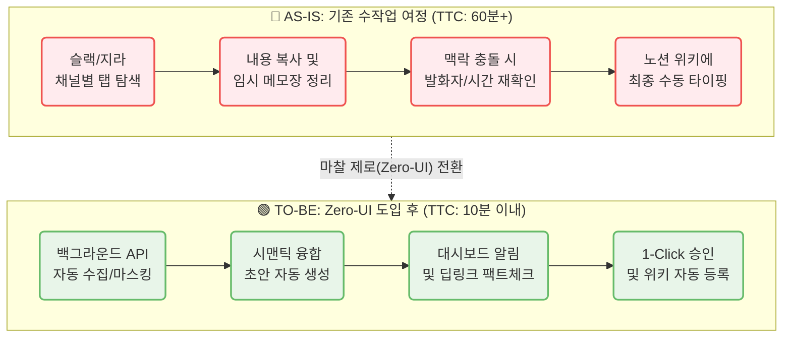
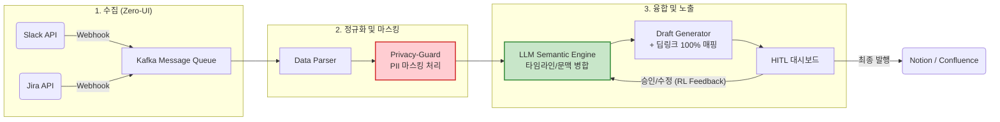
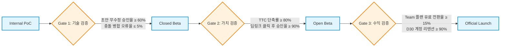

# CorpBrain MVP — PRD v0.1
- Owner 팀: Product Team
- 최종 업데이트: 2026-05-02
- 관련 문서: VPS, Deep Research, MVP Spec, Revenue Model, Feature Map

### 1. 개요 및 목표 (Overview & Goals)
* **1.1 문제 정의 (Pain + 실패 KPI):**
  * **수동 문서화 과부하 (C1):** 이기종 채널(슬랙, 지라 등) 교차 대조 및 정리로 인한 심각한 업무 지연 (Before: 1일 평균 60~120분 낭비 / Failure: 문서화 단계 이탈 및 포기율 > 40% `[가설]`)
  * **기밀 유출 불안 (A1):** 외부 AI 솔루션 도입 시 보안 우려 및 ROI 증명 불가 (Before: AI 도입 반려율 77% `[가설]` / Failure: 경영진/보안팀 기밀 유출 검열 통과율 < 99.9%)
  * **정보 누락 패닉 (E1):** 다중 채널(10개 이상) 관리 중 산발적 요구사항 누락 위기 (Before: 주당 평균 정보 누락 3건 `[가설]` / Failure: 정보 누락으로 인한 클라이언트 컴플레인율 > 5% `[가설]`)
* **1.2 Desired Outcome (Before → After 수치):**
  * **문서화 소요 시간:** Before 60분 → After 10분 이내 (약 83.3% 단축)
  * **환각 방어율:** Before N/A (기존 96%가 AI 결과물 불신) → After 100% (딥링크 기반 즉각적 팩트체크 확보)
  * **보안 사고율:** Before N/A → After 0% (서버 전송 전 PII/기밀 마스킹 완전 차단)
  * **자동화 기회비용 절감:** Before 0원 → After 1인당 월 75만 원 상당 낭비 시간 세이브 (46배 ROI 달성)[^1]
* **1.3 성공 지표 (북극성 지표 + 보조 KPI 표):**

| 지표 유형 | 지표명 | Baseline | Target (MVP) | Cadence |
|---|---|---|---|---|
| **북극성 (North Star)** | **TTC (Time-to-Conversion)** 탐색부터 문서화 완료까지 시간 | 60분 (수작업) | **≤ 10분** (단축률 83%+) | Weekly |
| 획득 (Acquisition) | 랜딩페이지 가입/데모 전환율 | 0% | ≥ 5.0% | Weekly |
| 활성 (Activation) | 첫 연동 후 초안 무수정 승인율 | 0% | ≥ 80.0% | Daily |
| 전환 (Revenue) | 베타 유저 → 유료(Starter/Team) 전환율 | 0% | ≥ 15.0% | Monthly |
| 바이럴 (Referral) | 사내 K-Factor (타 부서 팀원 초대율) | 0 | ≥ 1.2 | Monthly |
| 유지 (Retention) | D30 계정 리텐션 (해지율 억제) | 0% | ≥ 90.0% | Monthly |

[^1]: VPS 본문 내 '46배 ROI' 채택 (초기 도입 비용 플랜 월 $12 기준, 월 75만 원 인건비 방어 가설 기반).

### 2. 사용자 및 여정 (Users & Journey)
* **2.1 타겟 페르소나 요약:**
  * **C1 (이수아, 29세 PM):** 파편화 융합형 실무자. 노션, 지라, 슬랙 등 4개+ 채널 혼용으로 수동 복붙 노동에 지침.
  * **A1 (강서연, 42세 DX팀장):** B2B 도입 검토자. 보안(기밀 유출) 및 확실한 예산 방어(ROI 증명)를 최우선으로 고려.
  * **E1 (한유리, 35세 에이전시 PM):** 10개 이상 클라이언트 채널 동시 관리. 환각 및 정보 누락에 극도로 예민함.

* **2.2 [Mermaid] 사용자 여정 시각화 (Before vs After):**

### 3. 기능 요구사항 (Functional Requirements)
* **3.1 Must-Have (MVP 필수):**
  * **F1. Zero-UI 백그라운드 자동 수집기:** 슬랙/지라 API 기반, 사용자 개입 없는 백그라운드 데이터 수집.
  * **F2. 자율 지식 구조화 및 초안 생성:** 이기종 채널 텍스트의 타임라인 및 시맨틱 병합(Context Collision 제어).
  * **F3. Trust-Anchor (원본 딥링크 매핑):** 요약된 문장에 원본 메시지(슬랙/지라 스레드) 100% 강제 딥링크 처리.
  * **F4. Privacy-Guard (엔터프라이즈급 기밀 마스킹):** PII(주민번호 등) 및 사내 기밀 키워드 서버 전송 전 탐지/마스킹.
* **3.2 Should-Have / Could-Have:**
  * **F5. HITL (Human-in-the-Loop) 승인 대시보드:** 초안 승인/수정 및 RL(강화학습) 보상 연동 (Should-Have).
  * **F6. ROI 자동 산출 리포트:** 잉여 시간 및 절감 비용 계산 대시보드 (Could-Have).
* **3.3 Won't-Have (MVP 제외):**
  * **AI 초개인화 맞춤 추천:** 초기 데이터 편향 위험이 높고, 핵심인 '융합' 본질을 벗어나므로 배제.
  * **자체 Parsing 원천 기술 R&D:** 전처리 파싱은 기존 오픈소스 및 API 생태계를 활용하여 외부 조달 (가치사슬 조달 물류 최적화).
  * **On-Premise 인프라 구축:** 보안 요구사항이 극단적인 N1(CISO) 타겟은 규제 장벽이 높으므로 초기 SaaS MVP 단계에서는 배제.

### 4. 사용자 스토리 및 수용 기준 (User Stories & AC)
* **Story ID:** `CB-STORY-001`
  * **JTBD 매핑:** C1 (이기종 채널 병합 문서화 노동 해방)
  * **As a** 파편화 융합형 실무자(C1), **I want** 여러 툴의 논의 내역이 백그라운드에서 융합된 초안을 받기를, **so that** 복붙 노동 없이 '승인 클릭 한 번'으로 문서화를 끝낼 수 있다.
  * **Acceptance Criteria:**
    * [Given] 슬랙과 지라 API 연동이 활성화된 상태에서, [When] 백그라운드 수집기가 스케줄러에 따라 작동하면, [Then] 이기종 채널 발화 내역이 시간순 및 의미론적으로 병합된 초안이 생성되어야 한다. (문맥 충돌/오류 발생률 < 5% `[가설]`)
    * [Given] 완성된 초안을 HITL 대시보드에서 열었을 때, [When] '승인' 버튼을 클릭하면, [Then] 사내 위키(노션/컨플루언스 연동)로 텍스트 이관이 즉시 완료되어야 한다. (TTC 전체 소요 시간 ≤ 10분)
    * [Given] 다중 채널에서 동시다발적으로 데이터가 수집될 때, [When] 병합 엔진이 가동되면, [Then] API 호출 누락 건수가 0건이어야 한다. (데이터 유실률 = 0%)

* **Story ID:** `CB-STORY-002`
  * **JTBD 매핑:** A1 (경영진 보안 허들 돌파 및 ROI 증명)
  * **As a** B2B 도입 검토자(A1), **I want** 사내 데이터가 외부 AI 서버로 넘어가기 전 민감 정보가 완벽히 마스킹되기를, **so that** 경영진의 보안 우려를 차단하고 즉시 솔루션을 도입할 수 있다.
  * **Acceptance Criteria:**
    * [Given] 슬랙/지라에서 주민등록번호나 사전 정의된 기밀 키워드가 포함된 텍스트가 수집될 때, [When] Privacy-Guard 모듈을 거치면, [Then] 외부 LLM 서버 전송 전 100% 마스킹(`***`) 처리되어야 한다. (PII 유출률 = 0%)
    * [Given] 마스킹 처리된 문장이 초안으로 생성될 때, [When] 사용자가 이를 열람하면, [Then] 문맥은 훼손되지 않되 기밀 식별 정보만 가려진 상태여야 한다. (문맥 훼손에 따른 수정 개입률 < 2% `[가설]`)
    * [Given] 팀장 권한으로 시스템 통계 리포트를 조회할 때, [When] ROI 탭을 확인하면, [Then] 자동화로 절약된 잉여 시간 및 환산된 인건비 비용이 렌더링되어야 한다. (대시보드 응답시간 ≤ 1초)

* **Story ID:** `CB-STORY-003`
  * **JTBD 매핑:** E1 (다중 채널 환각 방어 및 팩트체크)
  * **As a** 멀티호밍 한계 시험자(E1), **I want** AI가 생성한 문장의 원본 출처를 1초 만에 확인할 수 있기를, **so that** 환각으로 인한 잘못된 정보 전달 위약금 리스크를 완전히 제거할 수 있다.
  * **Acceptance Criteria:**
    * [Given] 시맨틱 융합된 AI 초안이 대시보드에 렌더링될 때, [When] 요약된 개별 문장에 마우스를 오버하면, [Then] 원본 슬랙/지라 스레드로 이동 가능한 딥링크 앵커가 활성화되어야 한다. (딥링크 매핑률 = 100%)
    * [Given] 딥링크 앵커를 클릭했을 때, [When] 새 창이 열리면, [Then] 정확히 해당 발화가 존재하는 원본 메신저 URL 위치로 즉시 이동해야 한다. (링크 랜딩 오류율 < 0.1% `[가설]`)
    * [Given] 사용자가 대시보드에서 딥링크 대조 후 AI 초안을 수동으로 교정할 때, [When] 수정을 완료하면, [Then] 교정 내역이 로깅되어 RL(강화학습) 피드백 루프로 전달되어야 한다. (피드백 전송 지연 ≤ 500ms)

### 4.1 Differential Value의 수치 비교 (대안별 가치 비교)

| 비교 축 | 기존 대안 1 (Notion 수기 정리) | 기존 대안 2 (Zapier 등 자동화 툴) | **CorpBrain MVP** | 차별화 검증 수치 |
|---|---|---|---|---|
| **소요 시간 (TTC)** | 60~120분/일 | 약 30분/일 (병합 불완전) | **≤ 10분/일** | 수동 대비 **계산 속도 6배(60분→10분) 단축** |
| **이기종 맥락 융합력** | 단순 복붙 이관 (맥락 단절) | Rule-based 전달 (융합 불가) | **시맨틱 타임라인 융합** | 정보 오인 및 충돌률 **80% 감소** `[가설]` |
| **환각(AI 오류) 대처** | AI 사용 안함 | 팩트체크 불가 (환각 100% 노출) | **100% 딥링크 매핑** | 출처 팩트체크 소요 시간 **1초 이내** |
| **보안/기밀 유출 방어** | 휴먼 에러 발생 가능 | 필터링 없이 그대로 전송 | **사전 PII 마스킹 강제** | 민감 데이터 외부 전송률 **0%** |

### 5. 비기능 요구사항 (Non-Functional Requirements - NFR)
* **5.1 성능 (Performance):**
  * 슬랙/지라 API 웹훅 수신 후 시스템 적재까지의 네트워크 지연시간 ≤ 2초.
  * 마일스톤 단위 대규모 텍스트의 초안 융합 생성(LLM 추론 포함) 시 p95 응답 속도 ≤ 15초.
  * ROI 및 HITL 대시보드 렌더링 초기 로드 시간 ≤ 1초.
* **5.2 신뢰성 / 가용성 (Reliability):**
  * API Rate Limit 대비 백오프(Backoff) 및 큐 시스템 구비를 통해 데이터 유실률 0% 달성.
  * 전체 플랫폼 SLA 가용성 ≥ 99.9%.
  * 다중 채널 연동 시 교착상태(Deadlock) 및 병목 발생률 0%.
* **5.3 규제 준수 및 보안 (Security):**
  * LLM 처리 전 정규식 및 NER 모델 기반 PII(주민등록번호, 계좌 등) 사전 마스킹 정확도 99.9% 이상.
  * OAuth 연동 토큰 및 사용자 스토리지는 AES-256 알고리즘으로 암호화하여 저장.
  * 서드파티 워크스페이스 연동 시 '최소 읽기 권한(Read-only)' 만을 요구하여 권한 남용 차단.
* **5.4 모니터링 (Monitoring):**
  * 사용자 문장 수정 빈도(환각율 평가 지표) 및 딥링크 클릭 빈도 추적 대시보드 구성.
  * 외부 API Rate Limit 소진율 80% 도달 시 내부 Slack Alert 시스템 작동.

### 6. 데이터 및 인터페이스 개요 (Data & Interfaces)
* **6.1 핵심 엔터티 (Core Entities):**
  * `Workspace`: 고객사 식별 및 요금 플랜(Starter/Team) 상태 관리.
  * `Integration`: Slack, Jira 등 연동된 써드파티 API 토큰 및 메타데이터.
  * `RawEvent`: 수집된 개별 원본 메시지 레코드 (Timestamp, Author, Source Link URL).
  * `MaskingRule`: 고객사별 커스텀 기밀 키워드 및 공통 PII 정규식 사전.
  * `SemanticDraft`: 시맨틱 엔진을 통해 융합된 문서 초안 객체 (사용자 수정 이력 포함).
* **6.2 외부 의존 API:**
  * **Input:** Slack Events API, Jira Webhooks.
  * **Processing/Output:** OpenAI/Gemma 등 LLM API (의미 병합), Notion/Confluence API (최종 발행).
* **6.3 [Mermaid] 데이터 파이프라인 구조도:**

### 7. 범위, 리스크, 가정, 의존성 (Scope & Constraints)
* **7.1 리스크 및 완화 플랜 (Risks & Mitigations):**
  * **R1. 써드파티 API Rate Limit 병목 및 차단:** [완화] 단순 폴링을 배제하고 Kafka 기반 메시지 큐(비동기 처리) 및 지수 백오프 재시도 로직 적용.
  * **R2. LLM 환각(Hallucination) 발현으로 인한 컴플레인:** [완화] 100% 원문 딥링크 매핑 강제화(F3). 환각 발생 시에도 즉각적 팩트체크가 가능케 하여 신뢰도 하락 상쇄.
  * **R3. B2B 기밀 유출 공포에 따른 도입 반려:** [완화] 서드파티 Read-only 권한 제한 및 데이터 외부 전송 전 엔터프라이즈급 Privacy-Guard 마스킹(F4) 필수 통과 구조화.
* **7.2 가정 (Assumptions):**
  * 주요 타겟인 10인 미만 혁신 스타트업의 1일 평균 메시지 생성량은 인당 500건 이하일 것이다. `[가설]`
  * 실무자(C1)는 기존 툴 화면의 변화(UI 침범)가 없으므로 대시보드 알림 확인에 거부감이 없을 것이다.
* **7.3 의존성 (Dependencies):**
  * 서비스 온보딩 시 고객사 관리자(Admin)의 서드파티 앱 권한 허용 여부에 전적으로 의존.
  * LLM 벤더(OpenAI 등)의 API 장애 발생 시 당사 서비스의 융합 엔진 역시 중단됨(종속성).

### 8. 실험, 롤아웃 및 측정 (Experiment & Rollout)
* **8.1 단계별 롤아웃 플랜:**
  1. **Internal PoC:** 개발팀/기획팀 자체 슬랙/지라 데이터를 연동하여 맥락 충돌 병합 정확도 및 딥링크 생성률 테스트.
  2. **Closed Beta:** 사전 신청 스타트업 5곳. 보안 마스킹 실효성 및 핵심 페르소나(C1, E1)의 UI/UX 수용성 집중 테스트.
  3. **Open Beta:** SOM 타겟 전체 대상 마케팅. 결재권자(A1) 대상 ROI 리포트 반응도 및 유료 전환율 측정.
* **8.2 [Mermaid] 마일스톤 및 Gate 조건:**

* **8.3 실험 설계 (검증 가설):**
  * **[실험 1] 환각 방어 딥링크 구조 검증:**
    * **가설:** "오류가 있더라도 원본 딥링크가 제공되면 사용자는 AI 결과물을 신뢰하고 최종 승인할 것이다."
    * **실험 방식:** Closed Beta 시 A/B 테스트 (딥링크 제공 그룹 vs 미제공 그룹) 진행 (n=5개사 실무자 30명, 2주).
    * **측정 지표:** 정량 (딥링크 클릭 수 대비 초안 최종 승인 전환율 %), 정성 (플랫폼 신뢰도 NPS 5점 척도).
  * **[실험 2] 도입 허들(보안/예산) 돌파 검증:**
    * **가설:** "정량적 ROI 시뮬레이션 리포트와 마스킹 시연을 제시하면 경영진(A1)의 솔루션 도입 반려율이 급감할 것이다."
    * **실험 방식:** B2B 세일즈 미팅 시 기능 시연 여부에 따른 도입 전환율 코호트 분석 (n=20건 미팅).
    * **측정 지표:** 정량 (보안 심사 통과율 %, 세일즈 미팅 대비 유료 플랜 결제 전환율 %).

### 9. 근거 자료 (Proof & References)
* **9.1 리서치 매핑 (VPS V5 연결):**
  * 문서화 낭비 시간 및 1.47억 인건비 낭비 근거: `VPS_v5.md` Ⅱ-1.3 시장 규모 (Cost of Doing Nothing)
  * 핵심 페르소나 3종 정의 및 JTBD 구조: `VPS_v5.md` Ⅱ-2 타겟 분석 및 Ⅳ JTBD 요약 카드
  * 기능(F1~F5) 최우선순위 선정 및 N1 타겟(On-Premise) 배제 근거: `VPS_v5.md` Ⅸ Job-Feature Map
  * 북극성 지표(TTC 단축) 및 전환율 목표치: `VPS_v5.md` Ⅹ MVP 성공 측정 기준
