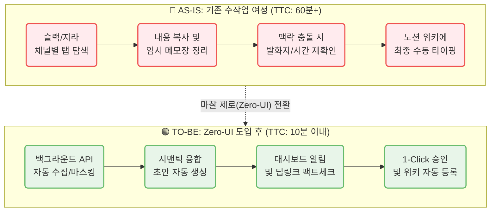
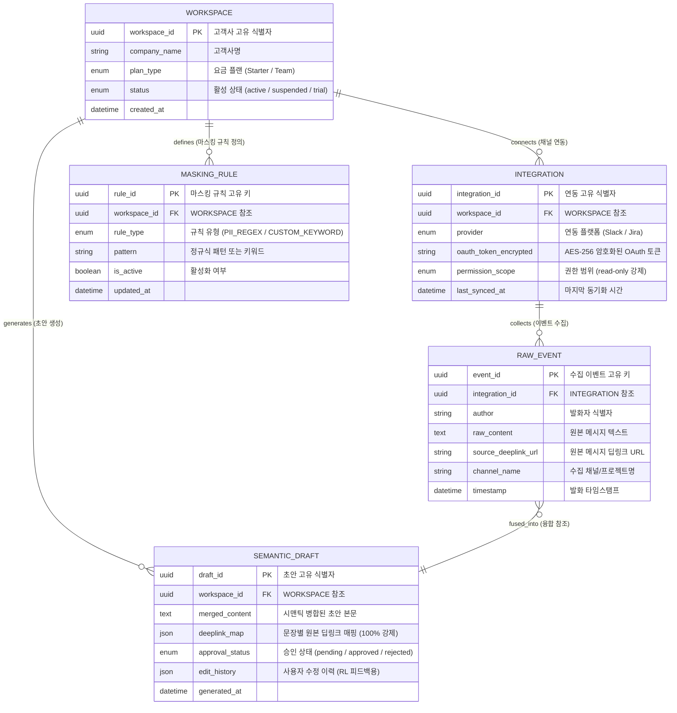
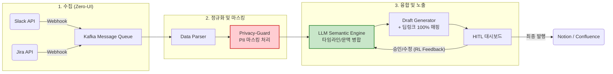
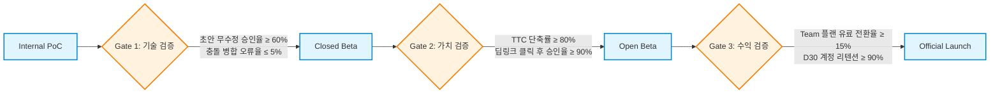

# CorpBrain MVP — PRD v0.4
- Owner 팀: Product Team
- 최종 업데이트: 2026-05-14
- 관련 문서: VPS, Deep Research, MVP Spec, Revenue Model, Feature Map

### 1. 개요 및 목표 (Overview & Goals)
* **1.1 문제 정의 (Pain + 실패 KPI):**
  * **수동 문서화 과부하 (C1):** 이기종 채널(슬랙, 지라 등) 교차 대조 및 정리로 인한 심각한 업무 지연 (Before: 1일 평균 60~120분 낭비 / Failure: 문서화 단계 이탈 및 포기율 > 40% `[가설]`)
  * **기밀 유출 불안 (A1):** 외부 AI 솔루션 도입 시 보안 우려 및 ROI 증명 불가 (Before: AI 도입 반려율 77% `[가설]` / Failure: 경영진/보안팀 기밀 유출 검열 통과율 < 99.9%)
  * **정보 누락 패닉 (E1):** 다중 채널(10개 이상) 관리 중 산발적 요구사항 누락 위기 (Before: 주당 평균 정보 누락 3건 `[가설]` / Failure: 정보 누락으로 인한 클라이언트 컴플레인율 > 5% `[가설]`)
* **1.2 Desired Outcome (Before → After 수치):**
  * **문서화 소요 시간:** Before 60분 → After 10분 이내 (약 83.3% 단축)
  * **환각 방어율:** Before N/A (기존 96%가 AI 결과물 불신) → After 100% (딥링크 기반 즉각적 팩트체크 확보)
  * **보안 사고율:** Before N/A → After 0% (서버 전송 전 PII/기밀 마스킹 완전 차단)
  * **자동화 기회비용 절감:** Before 0원 → After 1인당 월 75만 원 상당 낭비 시간 세이브 (46배 ROI 달성)[^1]
* **1.3 성공 지표 (북극성 지표 + 보조 KPI 표):**

| 지표 유형 | 지표명 | Baseline | Target (MVP) | Cadence | 측정 경로 (Instrumentation) |
|---|---|---|---|---|---|
| **북극성 (North Star)** | **TTC (Time-to-Conversion)**<br>탐색부터 문서화 완료까지 시간 | 60분 (수작업) | **≤ 10분** (단축률 83%+) | Weekly | **도구:** Mixpanel<br>**경로:** `draft_generated` → `draft_approved` 시간차 (고유 사용자, 세션 단위) |
| 획득 (Acquisition) | 랜딩페이지 가입/데모 전환율 | 0% | ≥ 5.0% | Weekly | **도구:** GA4<br>**경로:** `page_view(landing)` → 30분 이내 `signup_completed` 비율 |
| 활성 (Activation) | 첫 연동 후 초안 무수정 승인율 | 0% | ≥ 80.0% | Daily | **도구:** 내부 이벤트 로그<br>**경로:** `first_integration_connected` 후 최초 `draft_approved` 시 `edit_count = 0` 비율 |
| 전환 (Revenue) | 베타 유저 → 유료(Starter/Team) 전환율 | 0% | ≥ 15.0% | Monthly | **도구:** Stripe Billing API<br>**경로:** `trial_started` → 30일 이내 `subscription_activated` 비율 |
| 바이럴 (Referral) | 사내 K-Factor (타 부서 팀원 초대율) | 0 | ≥ 1.2 | Monthly | **도구:** 내부 초대 추적<br>**경로:** `invite_sent` 수 / 활성 사용자 수 (월간) |
| 유지 (Retention) | D30 계정 리텐션 (해지율 억제) | 0% | ≥ 90.0% | Monthly | **도구:** Mixpanel Cohort<br>**경로:** 가입 후 30일 `any_active_event` 발생 여부 |

[^1]: VPS 본문 내 '46배 ROI' 채택 (초기 도입 비용 플랜 월 $12 기준, 월 75만 원 인건비 방어 가설 기반).

### 2. 사용자 및 여정 (Users & Journey)
* **2.1 타겟 페르소나 요약:**
  * **C1 (이수아, 29세 PM):** 파편화 융합형 실무자. 노션, 지라, 슬랙 등 4개+ 채널 혼용으로 수동 복붙 노동에 지침.
  * **A1 (강서연, 42세 DX팀장):** B2B 도입 검토자. 보안(기밀 유출) 및 확실한 예산 방어(ROI 증명)를 최우선으로 고려.
  * **E1 (한유리, 35세 에이전시 PM):** 10개 이상 클라이언트 채널 동시 관리. 환각 및 정보 누락에 극도로 예민함.

* **2.2 [Mermaid] 사용자 여정 시각화 (Before vs After):**


### 3. 기능 요구사항 (Functional Requirements)

본 섹션에서는 사용자 스토리의 수용 기준(AC)을 시스템 레벨에서 구현하기 위한 기능의 볼륨과 우선순위를 정의합니다. 개발 리소스의 효율적 분배와 시장 안착 속도를 최적화하기 위해 MoSCoW 프레임워크를 기반으로 백로그를 구조화합니다.

#### 3.1 Must-Have (MVP 필수 — Sprint 1 內 구현 목표로 범위 한정)

- **F1. Zero-UI 백그라운드 자동 수집기 (Zero-Effort Background Collector):**
    - **상세 기능:** 사용자가 새로운 솔루션 창을 띄우거나 데이터를 수동 업로드할 필요 없이, Slack Events API 및 Jira Webhooks를 통해 사내 협업 채널의 발화 데이터를 백그라운드에서 자동으로 수집합니다. 수집된 원시 데이터는 Kafka 메시지 큐를 경유하여 비동기로 적재되며, 써드파티 API Rate Limit에 대비한 지수 백오프(Exponential Backoff) 재시도 로직이 내장됩니다. *(스프린트 1에서는 Slack 연동 우선 구현, Jira는 스프린트 2로 이관)*
    - **전략적 근거:** KSF 분석에서 '새로운 탭을 여는 행위 자체를 차단하는 Zero-UI 아키텍처'가 SOM 수익 엔진의 기반으로 도출되었습니다(KSF #1). AOS/DOS 분석 결과, Zero-UI 관련 Pain(CORE-2, CJM-2)의 AOS 4.0 / DOS 3.6으로 Q1 최상위에 위치하며, 10인 미만 소기업은 문서를 수동 작성할 전담 인력이 없으므로 고객의 문서 작성 노력을 '0'으로 수렴하게 만드는 것이 최소 참가 조건(Table Stakes)입니다.

- **F2. 자율 지식 구조화 및 초안 생성 (Autonomous Semantic Fusion Engine):**
    - **상세 기능:** 이기종 채널에서 수집된 비정형 텍스트를 타임스탬프 기반 시간순 정렬과 시맨틱 임베딩 기반 의미론적 병합을 동시에 수행하여, 하나의 구조화된 문서 초안으로 자동 생성합니다. 유사 발화의 문맥 충돌(Context Collision)을 감지하고, 발화자·시간·원본 채널 메타데이터를 대조하여 Diff/Conflict를 자동 관리합니다.
    - **전략적 근거:** 가치사슬 분석의 운영/생산(Operations) 핵심 전략으로, '파편화된 데이터가 모이는 것만으로는 지식이 되지 않는다'는 전제에 기반합니다(KSF #2). 대형 벤더의 SI 구축 비용을 기술로 대체하는 '자율 지식 가드닝' 역량이며, JTBD 인터뷰에서 C1 이수아가 "매일 1~2시간 소요되던 수동 문서화 시간을 10분 이내로 극단적 단축"을 핵심 Desired Outcome으로 제시한 근거에 직결됩니다.

- **F3. Trust-Anchor (원본 딥링크 매핑):**
    - **상세 기능:** 시맨틱 융합 엔진이 생성한 초안의 모든 요약 문장에 원본 메시지(슬랙 스레드, 지라 티켓)로 이동 가능한 딥링크 앵커를 100% 강제 매핑합니다. 사용자가 대시보드에서 특정 문장에 마우스를 오버하면 원본 URL이 즉시 활성화되어 1초 이내 팩트체크가 가능합니다.
    - **전략적 근거:** AOS/DOS 분석에서 AI 환각 의심(CORE-3, CJM-3)이 AOS 4.0 / DOS 3.6으로 Zero-UI와 동률 최상위를 기록했습니다. JTBD 인터뷰에서 E1 한유리는 "초안이 좀 틀려도 원본 링크가 무조건 붙어있으면 팩트체크가 되니까 리스크 감수할 만하다"고 진술했으며, 이는 B2B 환경에서 생성 AI 결과를 신뢰하게 만드는 절대적 안전망으로 기능합니다.

- **F4. Privacy-Guard (엔터프라이즈급 기밀 마스킹):**
    - **상세 기능:** 수집된 원시 데이터가 외부 LLM 서버로 전송되기 전, 정규식 패턴 매칭 및 NER(Named Entity Recognition) 모델을 이중으로 적용하여 PII(주민등록번호, 계좌번호 등)와 고객사 사전 정의 기밀 키워드를 탐지하고 `***`로 마스킹 처리합니다. 사용자가 HITL 대시보드에서 누락된 기밀 패턴을 수동 지정하면, 커스텀 정규식 사전에 즉시 반영되어 다음 파이프라인부터 자동 차단됩니다.
    - **전략적 근거:** CJM 분석에서 A1 강서연의 여정 최대 마찰점은 '경영진의 기밀 반출 우려에 의한 기안 반려'로 식별되었습니다. AOS/DOS에서 보안 유출 우려(CJM-1)가 AOS 4.0 / DOS 3.6으로 Q1 핵심에 위치하며, JTBD에서 A1은 "보안 유출 문제 없고, 월 OOO만 원의 인건비 절감 효과가 있다고 숫자로 보여줘야 결재가 수월해진다"고 진술하여, 마스킹은 B2B 도입의 1차 관문 돌파 필수 요건입니다.

#### 3.2 Should-Have / Could-Have

- **F5. HITL (Human-in-the-Loop) 승인 대시보드 (Should-Have):**
    - **상세 기능:** 시맨틱 엔진이 생성한 초안을 사용자가 '승인/수정/반려'할 수 있는 직관적 인터페이스를 제공합니다. 사용자의 승인/반려 행동 자체가 자율 지식 구조화 엔진의 강화학습(RL) 보상 함수(Reward Function)로 즉각 작용하여, 시스템이 분류 정확도를 자율적으로 높여가는 '자기 진화형 데이터 플라이휠'을 형성합니다.
    - **전략적 근거:** KSF #4에서 직관적인 문서 충돌 제어 및 보상 최적화 UX가 프로덕트 성공의 관건으로 도출되었습니다. 완벽하지 않은 AI의 한계를 사용자 참여로 메우고 락인(Lock-in)시키는 제품 주도 성장(PLG) 동력이며, AOS/DOS에서 오류 교정 마찰(EXT-3)의 DOS가 0.8로 낮아 Should-Have로 분류합니다.

- **F6. ROI 자동 산출 리포트 (Could-Have):**
    - **상세 기능:** 자동화로 절약된 잉여 시간 및 환산 인건비를 시각화하는 대시보드입니다. 팀장 권한으로 통계 리포트를 조회하면 월간 기회비용 절감 수치가 자동 렌더링됩니다.
    - **전략적 근거:** A1 결재권자의 도입 갱신 논리를 뒷받침하는 무기이나, MVP 단계에서는 세일즈 키트(Sales Deck)로 수동 대체 가능하므로 Could-Have로 분류합니다.

#### 3.3 Won't-Have (MVP 제외)

- **AI 초개인화 맞춤 추천:**
    - **제외 근거:** 초기 데이터 편향 위험이 높고, CorpBrain의 핵심인 '이기종 채널 융합'이라는 본질적 가치(PMF)를 벗어납니다. AOS/DOS 분석에서도 해당 Pain은 Q4(자원 투입 보류)에 해당합니다.
- **자체 Parsing 원천 기술 R&D:**
    - **제외 근거:** KSF #5의 '비핵심 기술의 과감한 외부 조달' 전략에 의거합니다. Unstructured 등 검증된 오픈소스 파서를 부품으로 조달(Buy/Use)하고, 절감된 역량을 자율 가드닝 알고리즘 고도화에 집중합니다.
- **On-Premise 인프라 구축:**
    - **제외 근거:** AOS/DOS 분석에서 N1(CISO) 타겟의 망분리 요구(NON-1)는 AOS 0.4 / DOS -0.4로 Q4 최하위에 위치합니다. SaaS 아키텍처 자체가 컴플라이언스 위반 사유이므로, 현재 MVP 단계에서는 명시적으로 배제하고 추후 엔터프라이즈 패키지로 분리 공략합니다.

### 4. 사용자 스토리 및 수용 기준 (User Stories & AC)
* **Story ID:** `CB-STORY-001`
  * **JTBD 매핑:** C1 (이기종 채널 병합 문서화 노동 해방)
  * **As a** 파편화 융합형 실무자(C1), **I want** 여러 툴의 논의 내역이 백그라운드에서 융합된 초안을 받기를, **so that** 복붙 노동 없이 '승인 클릭 한 번'으로 문서화를 끝낼 수 있다.
  * **Acceptance Criteria:**
    * [Given] 슬랙과 지라 API 연동이 활성화된 상태에서, [When] 백그라운드 수집기가 스케줄러에 따라 작동하면, [Then] 이기종 채널 발화 내역이 시간순 및 의미론적으로 병합된 초안이 생성되어야 한다. (문맥 충돌/오류 발생률 < 5% `[가설]`)
    * [Given] 완성된 초안을 HITL 대시보드에서 열었을 때, [When] '승인' 버튼을 클릭하면, [Then] 사내 위키(노션/컨플루언스 연동)로 텍스트 이관 API 호출이 완료되어 대시보드에 '발행 완료' 상태가 표시되기까지의 지연 시간이 **p95 ≤ 3초**이어야 한다. (TTC 전체 소요 시간 ≤ 10분) **검증:** Datadog APM `PATCH /api/v1/drafts/{id}/review` 엔드포인트 p95 latency 추적.
    * [Given] 다중 채널에서 동시다발적으로 데이터가 수집될 때, [When] 병합 엔진이 가동되면, [Then] API 호출 누락 건수가 0건이어야 한다. (데이터 유실률 = 0%)
    * **[실패 케이스 AC]** [Given] 써드파티 API Rate Limit 초과로 수집 지연이 발생할 때, [When] 메시지 큐 재시도(Backoff) 횟수가 **5회(지수 백오프 최대 대기 32초)**를 초과하면, [Then] 대시보드에 **60초 이내** 경고 알림(`collection_degraded` 이벤트)을 띄우고 수집 중단 전까지의 데이터만으로 초안을 생성하여 무한 대기를 방지해야 한다. (데이터 증발률 0%) **검증:** 스테이징 환경에서 Slack API Mock 429 응답 강제 주입 카오스 테스트 실행.

* **Story ID:** `CB-STORY-002`
  * **JTBD 매핑:** A1 (경영진 보안 허들 돌파 및 ROI 증명)
  * **As a** B2B 도입 검토자(A1), **I want** 사내 데이터가 외부 AI 서버로 넘어가기 전 민감 정보가 완벽히 마스킹되기를, **so that** 경영진의 보안 우려를 차단하고 즉시 솔루션을 도입할 수 있다.
  * **Acceptance Criteria:**
    * [Given] 슬랙/지라에서 주민등록번호나 사전 정의된 기밀 키워드가 포함된 텍스트가 수집될 때, [When] Privacy-Guard 모듈을 거치면, [Then] 외부 LLM 서버 전송 전 100% 마스킹(`***`) 처리되어야 한다. (PII 유출률 = 0%) **검증:** 주민번호 100건 + 계좌번호 50건 + 커스텀 키워드 50건 = 총 200건 테스트셋 기준, CI/CD 파이프라인 자동 회귀 테스트로 매 배포 시 실행. 마스킹 누락 1건 발생 시 배포 차단(Build Break).
    * [Given] 마스킹 처리된 문장이 초안으로 생성될 때, [When] 사용자가 이를 열람하면, [Then] 문맥은 훼손되지 않되 기밀 식별 정보만 가려진 상태여야 한다. (문맥 훼손에 따른 수정 개입률 < 2% `[가설]`)
    * [Given] 팀장 권한으로 시스템 통계 리포트를 조회할 때, [When] ROI 탭을 확인하면, [Then] 자동화로 절약된 잉여 시간 및 환산된 인건비 비용이 렌더링되어야 한다. (대시보드 응답시간 ≤ 1초)
    * **[실패 케이스 AC]** [Given] 모델이 신규 패턴의 기밀을 인식하지 못해 마스킹 누락이 의심될 때, [When] 사용자가 HITL 대시보드에서 수동으로 마스킹 처리를 지정하면, [Then] 해당 키워드는 즉시 커스텀 정규식 사전에 로드되어 다음 파이프라인부터 자동 차단되어야 한다. (업데이트 반영 지연 ≤ 1분)

* **Story ID:** `CB-STORY-003`
  * **JTBD 매핑:** E1 (다중 채널 환각 방어 및 팩트체크)
  * **As a** 멀티호밍 한계 시험자(E1), **I want** AI가 생성한 문장의 원본 출처를 1초 만에 확인할 수 있기를, **so that** 환각으로 인한 잘못된 정보 전달 위약금 리스크를 완전히 제거할 수 있다.
  * **Acceptance Criteria:**
    * [Given] 시맨틱 융합된 AI 초안이 대시보드에 렌더링될 때, [When] 요약된 개별 문장에 마우스를 오버하면, [Then] 원본 슬랙/지라 스레드로 이동 가능한 딥링크 앵커가 활성화되어야 한다. (딥링크 매핑률 = 100%)
    * [Given] 딥링크 앵커를 클릭했을 때, [When] 새 창이 열리면, [Then] 정확히 해당 발화가 존재하는 원본 메신저 URL 위치로 즉시 이동해야 한다. (링크 랜딩 오류율 < 0.1% `[가설]`)
    * [Given] 사용자가 대시보드에서 딥링크 대조 후 AI 초안을 수동으로 교정할 때, [When] 수정을 완료하면, [Then] 교정 내역이 로깅되어 RL(강화학습) 피드백 루프로 전달되어야 한다. (피드백 전송 지연 ≤ 500ms)
    * **[실패 케이스 AC]** [Given] 딥링크 앵커가 가리키는 원본 슬랙 메시지가 삭제 또는 아카이브 처리되었을 때, [When] 사용자가 딥링크를 클릭하면, [Then] '원본 삭제됨' 안내 토스트를 **1초 이내** 표시하고, 해당 문장에 ⚠️ 경고 배지를 자동 부착하여 팩트체크 불가 상태를 명시해야 한다. (경고 표시 지연 ≤ 1초) **검증:** 스테이징 환경에서 Slack 메시지 삭제 후 딥링크 클릭 시 404 응답 핸들링 E2E 테스트 실행.

### 4.1 Differential Value의 수치 비교 (대안별 가치 비교)

| 비교 축 | 기존 대안 1 (Notion 수기 정리) | 기존 대안 2 (Zapier 등 자동화 툴) | **CorpBrain MVP** | 차별화 검증 수치 | 검증 연결 |
|---|---|---|---|---|---|
| **소요 시간 (TTC)** | 60~120분/일 | 약 30분/일 (병합 불완전) | **≤ 10분/일** | 수동 대비 **계산 속도 6배(60분→10분) 단축** | §1.3 북극성 KPI Weekly TTC 추적 |
| **이기종 맥락 융합력** | 단순 복붙 이관 (맥락 단절) | Rule-based 전달 (융합 불가) | **시맨틱 타임라인 융합** | 정보 오인 및 충돌률 **80% 감소** `[가설]` | **§8.3 실험 1** A/B 테스트 수정 개입률 비교로 간접 검증 |
| **환각(AI 오류) 대처** | AI 사용 안함 | 팩트체크 불가 (환각 100% 노출) | **100% 딥링크 매핑** | 출처 팩트체크 소요 시간 **1초 이내** | §5.4 Level 2 딥링크 매핑률 모니터링 |
| **보안/기밀 유출 방어** | 휴먼 에러 발생 가능 | 필터링 없이 그대로 전송 | **사전 PII 마스킹 강제** | 민감 데이터 외부 전송률 **0%** | §5.3 마스킹 200건 회귀 테스트 (매 배포) |

### 5. 비기능 요구사항 (Non-Functional Requirements - NFR)
* **5.1 성능 (Performance):**
  * 슬랙/지라 API 웹훅 수신 후 시스템 적재까지의 네트워크 지연시간 **p95 ≤ 2초**. **측정:** Datadog APM `POST /webhook/slack` 및 `POST /webhook/jira` p95 latency.
  * 마일스톤 단위 대규모 텍스트의 초안 융합 생성(LLM 추론 포함) 시 **p95 응답 속도 ≤ 15초**. **측정:** Datadog APM `POST /api/v1/drafts/generate` p95 latency.
  * ROI 및 HITL 대시보드 렌더링 초기 로드 시간 **p95 ≤ 1초**. **측정:** Lighthouse CI LCP(Largest Contentful Paint), 매 배포 시 자동 측정.
* **5.2 신뢰성 / 가용성 (Reliability):**
  * API Rate Limit 대비 백오프(Backoff) 및 큐 시스템 구비를 통해 **데이터 유실률 0%** 달성. **검증:** 매주 1회 Kafka 메시지 수 vs. DB 적재 레코드 수 자동 대조 스크립트 실행.
  * 전체 플랫폼 SLA **가용성 ≥ 99.9%** (월간 허용 다운타임 ≤ 43.2분). **측정:** UptimeRobot 외부 합성 모니터링, 1분 주기 헬스체크.
  * 다중 채널 연동 시 **교착상태(Deadlock) 발생률 0%**. **검증:** PostgreSQL `pg_stat_activity` 기반 Deadlock 탐지 쿼리 5분 주기 크론 실행. 1건 탐지 시 Critical 알림.
* **5.3 규제 준수 및 보안 (Security):**
  * LLM 처리 전 정규식 및 NER 모델 기반 PII(주민등록번호, 계좌 등) 사전 **마스킹 정확도 ≥ 99.9%**. **검증 프로토콜:** 주민번호 100건 + 계좌번호 50건 + 커스텀 키워드 50건 = 총 200건 테스트셋. 매 모델 업데이트 시 회귀 테스트, F1-Score ≥ 0.999 미달 시 배포 차단.
  * OAuth 연동 토큰 및 사용자 스토리지는 **AES-256** 알고리즘으로 암호화하여 저장. 전송 구간 **TLS 1.3** 적용.
  * 서드파티 워크스페이스 연동 시 **'최소 읽기 권한(Read-only)'** 만을 요구하여 권한 남용 차단.
* **5.4 모니터링 (Monitoring):**
  * **대시보드 구성:** Grafana + Prometheus 연동, p50/p95/p99 Latency 및 API 에러율 실시간 시각화.
  * **단계별 알림 (Alerting) 임계치:**
    * **Level 1 (Warning):** 사용자 문장 수정 빈도(환각율 프록시)가 주간 평균 대비 **1.5배 이상 급증** 시 엔지니어링 Slack 채널 경고.
    * **Level 1 (Warning):** 외부 API Rate Limit 소진율 **80% 도달** 시 내부 Slack Alert.
    * **Level 2 (Critical):** 딥링크 매핑률이 **100% 미만으로 하락** 시 즉시 온콜 호출 및 초안 생성 일시 중단.
    * **Level 2 (Critical):** PII 마스킹 모듈 처리 지연 **> 5초** 또는 마스킹 실패 로그 **1건** 발생 시 PagerDuty Critical 알림 및 파이프라인 즉시 중단.
* **5.5 비용 (Cost):**
  * 1인당 월간 LLM 토큰 소모 비용(API Cost)은 **최대 $3.00 이하**로 유지 보장 (Starter 플랜 $12 기준 최소 75% 마진 방어). **측정:** OpenAI Usage API 일별 집계, 인당 환산 비용 Grafana 대시보드 시각화.
  * 비용 모니터링 대시보드 연동 및 월 한도액 **80% 초과 시 Warning, 95% 초과 시 Critical** Alert 발생.

### 6. 데이터 및 인터페이스 개요 (Data & Interfaces)

파편화된 이기종 채널의 비정형 데이터를 사용자가 신뢰할 수 있는 구조화된 초안으로 탈바꿈시키는 핵심은 데이터베이스 설계와 파이프라인의 견고함에 있습니다.

#### 6.1 핵심 엔터티 및 주요 필드 (Entity Relationship Diagram)



**설계 근거:** `RAW_EVENT`에 `source_deeplink_url` 필드를 필수(NOT NULL)로 배치함으로써 Trust-Anchor(F3)의 100% 딥링크 매핑을 데이터베이스 레벨에서 강제합니다. `MASKING_RULE`을 Workspace별로 분리하여, 고객사마다 고유한 기밀 키워드 사전을 독립적으로 관리할 수 있는 멀티테넌트 구조를 확보합니다. `SEMANTIC_DRAFT`의 `edit_history`(JSON)는 HITL 피드백 루프의 RL 보상 함수 입력 데이터로 직접 활용됩니다.

#### 6.2 외부/내부 API 개요 (입출력 및 제약사항)

**1) 외부 의존 API (External Dependencies):**

| 구분 | API | 용도 | 제약사항 |
|---|---|---|---|
| **Input** | Slack Events API | 채널 메시지 실시간 수신 (Webhook) | Rate Limit: Tier 3 (50+ req/min), Read-only scope 강제 |
| **Input** | Jira Webhooks | 이슈/코멘트 변경 이벤트 수신 | 커스텀 이벤트 필터링 필요, Admin 권한으로 등록 |
| **Processing** | OpenAI / Gemma LLM API | 시맨틱 병합 및 초안 생성 | 토큰 비용 $3/인/월 상한 준수, 마스킹 후 전송 필수 |
| **Output** | Notion / Confluence API | 승인된 초안의 최종 위키 발행 | OAuth 연동, 페이지 생성 권한 필요 |

**2) 내부 코어 API (Internal Core):**

- **시맨틱 초안 생성 API:**
    - **Method:** `POST /api/v1/drafts/generate`
    - **Request:**
        ```json
        {
          "workspace_id": "ws-abc123",
          "time_range": {
            "start": "2026-05-14T00:00:00Z",
            "end": "2026-05-14T23:59:59Z"
          },
          "channels": ["slack:general", "jira:CORP-sprint-12"],
          "masking_enabled": true
        }
        ```
    - **Response:**
        ```json
        {
          "draft_id": "draft-xyz789",
          "status": "pending_approval",
          "merged_content": "## 2026-05-14 프로젝트 히스토리\n...",
          "deeplink_map": [
            {
              "sentence_index": 0,
              "source_url": "https://slack.com/archives/C0X.../p1715...",
              "author": "이수아",
              "timestamp": "2026-05-14T09:32:00Z"
            }
          ],
          "masking_applied": {
            "pii_count": 3,
            "custom_keyword_count": 1
          },
          "generated_at": "2026-05-14T18:00:05Z"
        }
        ```

- **초안 승인/반려 API (HITL Feedback):**
    - **Method:** `PATCH /api/v1/drafts/{draft_id}/review`
    - **Request:**
        ```json
        {
          "action": "approve",
          "edits": [
            {
              "sentence_index": 2,
              "original": "A팀장이 디자인 검토를 요청함",
              "corrected": "A팀장이 디자인 시안 v2 검토를 요청함"
            }
          ],
          "publish_to": "notion"
        }
        ```
    - **Response:** `{ "status": "approved", "published_url": "https://notion.so/..." }`

#### 6.3 [Mermaid] 데이터 파이프라인 구조도


### 7. 범위, 리스크, 가정, 의존성 (Scope & Constraints)
* **7.1 주요 리스크 및 완화 플랜 (Risks & Mitigations):**
  * **R1. 써드파티 API Rate Limit 병목 및 차단:** [완화] 단순 폴링을 배제하고 Kafka 기반 메시지 큐(비동기 처리) 및 지수 백오프 재시도 로직 적용.
  * **R2. LLM 환각(Hallucination) 발현으로 인한 컴플레인:** [완화] 100% 원문 딥링크 매핑 강제화(F3). 환각 발생 시에도 즉각적 팩트체크가 가능케 하여 신뢰도 하락 상쇄.
  * **R3. B2B 기밀 유출 공포에 따른 도입 반려:** [완화] 서드파티 Read-only 권한 제한 및 데이터 외부 전송 전 엔터프라이즈급 Privacy-Guard 마스킹(F4) 필수 통과 구조화.
* **7.2 주요 구조 설계 결정 (ADR - Architecture Decision Records):**
  * **ADR-01. Kafka 비동기 큐 채택:** 다중 채널 동시 수집 시 발생하는 Deadlock 및 Rate Limit 방지와 데이터 유실률 0%라는 SLO를 달성하기 위해 동기식 폴링 대신 채택. (비즈니스적 무손실 신뢰 확보)
  * **ADR-02. 파서(Parser) 원천 기술 외부 조달:** 자체 개발 시 MVP 일정이 3개월 이상 지연될 리스크가 있어, 외부 검증된 오픈소스/솔루션으로 조달하여 개발 범위를 1스프린트로 단축함.
* **7.3 가정 (Assumptions):**
  * 주요 타겟인 10인 미만 혁신 스타트업의 1일 평균 메시지 생성량은 인당 500건 이하일 것이다. `[가설]`
  * 실무자(C1)는 기존 툴 화면의 변화(UI 침범)가 없으므로 대시보드 알림 확인에 거부감이 없을 것이다.
* **7.4 의존성 (Dependencies):**
  * 서비스 온보딩 시 고객사 관리자(Admin)의 서드파티 앱 권한 허용 여부에 전적으로 의존.
  * LLM 벤더(OpenAI 등)의 API 장애 발생 시 당사 서비스의 융합 엔진 역시 중단됨(종속성).

### 8. 실험, 롤아웃 및 측정 (Experiment & Rollout)
* **8.1 단계별 롤아웃 플랜:**
  1. **Internal PoC:** 개발팀/기획팀 자체 슬랙/지라 데이터를 연동하여 맥락 충돌 병합 정확도 및 딥링크 생성률 테스트.
  2. **Closed Beta:** 사전 신청 스타트업 5곳. 보안 마스킹 실효성 및 핵심 페르소나(C1, E1)의 UI/UX 수용성 집중 테스트.
  3. **Open Beta:** SOM 타겟 전체 대상 마케팅. 결재권자(A1) 대상 ROI 리포트 반응도 및 유료 전환율 측정.
* **8.2 [Mermaid] 마일스톤 및 Gate 조건:**

* **8.3 실험 설계 (핵심 가설 검증을 위한 A/B 테스트 상세):**

  CorpBrain의 차별적 가치인 "딥링크 기반 환각 방어"와 "마스킹+ROI 기반 B2B 도입 허들 돌파"가 실제 사용자 행동에 유의미한 변화를 일으키는지를 통계적으로 검증합니다.

  * **[실험 1] 환각 방어 딥링크 구조 검증:**
    * **귀무가설(H₀):** 원본 딥링크의 제공 여부는 사용자의 초안 최종 승인율에 통계적으로 유의미한 영향을 미치지 않는다.
    * **대립가설(H₁):** 원본 딥링크가 100% 매핑된 초안을 제공하면, 딥링크가 없는 초안 대비 최종 승인율이 최소 20% 이상 증가할 것이다.
    * **실험 환경 및 샘플링:** Closed Beta 참여 5개사에서 C1·E1 페르소나에 해당하는 실무자 30명을 무작위 추출합니다. 대조군(A)에는 딥링크 없이 초안만 제공하고, 실험군(B)에는 문장별 100% 딥링크가 매핑된 초안을 제공합니다. 실험 기간은 2주(10영업일)로 설정하여 충분한 초안 생성 사이클(인당 최소 10회)을 확보합니다.
    * **측정 지표:** Primary Metric은 초안 최종 승인 전환율(%). Secondary Metrics는 딥링크 클릭률(CTR), 세션당 평균 팩트체크 소요 시간(초), 플랫폼 신뢰도 설문(NPS 5점 척도).
    * **성공 임계치 (Success Criteria):**
        * 실험군(B)의 승인율이 대조군(A) 대비 유의수준 5%(p-value < 0.05) 이내에서 통계적으로 유의미하게 20% 포인트 이상 상회해야 합니다.
        * JTBD 인터뷰에서 E1 한유리가 진술한 "원본 링크가 무조건 붙어있으면 리스크 감수할 만하다"는 정성적 가설을 정량적으로 입증하는 것이 핵심입니다.
    * **계측 무결성 검증 (A/A 테스트):** A/B 테스트 본격 가동 전, 3일간 A/A 테스트를 우선 수행하여 대조군과 실험군 간의 베이스라인 승인율 오차가 유의수준 내(p-value > 0.05, 차이 없음)에 있음을 확인합니다. 이를 통해 실험 인프라(이벤트 로깅, 그룹 분배 로직)의 정합성을 사전 검증합니다.

  * **[실험 2] 도입 허들(보안/예산) 돌파 검증:**
    * **귀무가설(H₀):** 마스킹 시연 및 ROI 시뮬레이션 리포트의 제공 여부는 B2B 결재권자(A1)의 도입 승인율에 통계적으로 유의미한 영향을 미치지 않는다.
    * **대립가설(H₁):** 세일즈 미팅 시 Privacy-Guard 마스킹 라이브 시연과 정량적 ROI 리포트를 함께 제시하면, 미제시 대비 도입 승인율이 최소 30% 이상 증가할 것이다.
    * **실험 환경 및 샘플링:** Open Beta 진입 시점에 SOM 타겟(10인 미만 혁신 IT 스타트업) 중 세일즈 미팅이 확정된 20건을 대상으로 합니다. 대조군(A, 10건)은 표준 제품 소개만 진행하고, 실험군(B, 10건)은 마스킹 라이브 시연 + ROI 시뮬레이터 화면을 추가 제시합니다.
    * **측정 지표:** Primary Metric은 세일즈 미팅 대비 유료 플랜(Starter/Team) 결제 전환율(%). Secondary Metrics는 보안 심사 통과율(%), 미팅 후 7일 이내 후속 미팅 요청율(%).
    * **성공 임계치 (Success Criteria):**
        * 실험군(B)의 도입 전환율이 대조군(A) 대비 유의수준 10%(p-value < 0.10) 이내에서 30% 포인트 이상 상회해야 합니다. (B2B 세일즈 특성상 소규모 샘플이므로 유의수준을 10%로 완화)
        * CJM 분석에서 A1 강서연의 결정 단계 핵심 Pain인 '정량적 도입 명분(ROI) 부족'과 '복잡한 보안 심의 사이클'을 동시에 해소하는지를 검증합니다.
    * **성공 임계치 세분화:** 단순 결제 전환율 외에, 미팅 후 결재권자가 내부 보안팀에 기술 백서를 공유했는지(이메일 전달 추적) 여부를 Secondary Signal로 추적하여 '도입 모멘텀 유지' 여부를 정성적으로 보완합니다.

### 9. 근거 자료 및 검증 트레이서빌리티 (Proof & Traceability)

#### 9.1 리서치 매핑 (VPS V5 정합성 검증)

| PRD 내 주장/수치 | 원본 출처 | 원본 위치 | 정합성 |
|---|---|---|---|
| 문서화 1일 60~120분 낭비 | VPS_v5.md | Ⅱ-1.3 시장 규모 (Cost of Doing Nothing) | ✅ 일치 |
| 1.47억 인건비 낭비 | VPS_v5.md | Ⅱ-1.3 시장 규모 | ✅ 일치 |
| 46배 ROI (월 $12 대비 75만 원 절감) | VPS_v5.md | Ⅹ MVP 성공 측정 기준 | ✅ 일치 [^1] |
| 핵심 페르소나 C1/A1/E1 정의 | VPS_v5.md | Ⅱ-2 타겟 분석, Ⅳ JTBD 요약 카드 | ✅ 일치 |
| F1~F5 우선순위 및 N1 배제 | VPS_v5.md | Ⅸ Job-Feature Map | ✅ 일치 |
| 북극성 TTC ≤ 10분 | VPS_v5.md | Ⅹ MVP 성공 측정 기준 | ✅ 일치 |

#### 9.2 PRD 가설 → 실험 연결 매핑

| 가설 ID | PRD 내 가설 | 검증 실험 | 성공 임계치 | 실패 시 대응 |
|---|---|---|---|---|
| H-001 | 딥링크 제공 시 초안 승인율 20%↑ | §8.3 실험 1 (A/B, n=30) | p-value < 0.05 | 딥링크 UX 개선 후 재실험 |
| H-002 | 마스킹+ROI 시연 시 도입 승인율 30%↑ | §8.3 실험 2 (코호트, n=20) | p-value < 0.10 | 세일즈 키트 재설계 |
| H-003 | 문맥 충돌률 80% 감소 | §8.3 실험 1 Secondary (수정 개입률) | 대조군 대비 유의미 감소 | 시맨틱 엔진 병합 로직 튜닝 |
| H-004 | 문서화 이탈/포기율 > 40% (Before) | §8.1 Internal PoC 무수정 승인율 | Gate 1: ≥ 60% | 초안 품질 개선 후 재측정 |
