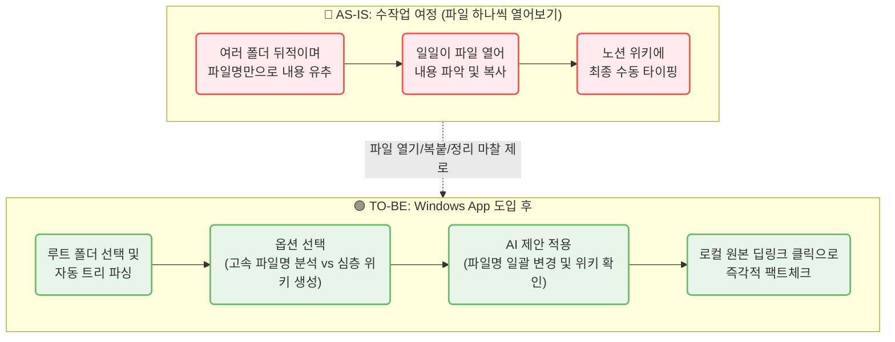

# CorpBrain MVP — PRD v0.8
- Owner 팀: Product Team
- 최종 업데이트: 2026-07-14
- 관련 문서: VPS, MVP Spec (Windows App 전환), Feature Map
- 변경 이력: v0.6(SaaS 기반)에서 v0.7(Windows 로컬 설치형, 파일트리 기반 분석 앱)으로 피벗, Phase 1~3 명세화 반영하여 v0.8로 고도화

### 1. 개요 및 목표 (Overview & Goals)
* **1.1 문제 정의 (Pain + 실패 KPI):**
  * **로컬 문서 파편화 및 수동 정리 과부하 (C1):** 수많은 폴더에 분산된 로컬 문서(.docx, .pdf 등)의 내용을 일일이 열어보고 정리/구조화하는 데 심각한 업무 지연 발생 (Before: 문서 파악 및 위키 작성에 1일 평균 60~120분 낭비)
  * **기밀 유출 불안 (A1):** 외부 SaaS(Cloud AI) 솔루션 도입 시 기업 문서 유출 우려 및 ROI 증명 불가 (Before: AI 도입 반려율 77% / Failure: 경영진/보안팀 기밀 유출 검열 통과 불가)
  * **정보 탐색 실패 및 지식 자산화 누락 (E1):** 프로젝트 단위로 파일명이 불규칙하고 파일 구조가 복잡하여 과거 산출물을 찾지 못하고 재작업 발생 (Before: 주당 평균 정보 유실 및 재탐색 3건 이상)
* **1.2 Desired Outcome (Before → After 수치):**
  * **문서 파악 및 위키화 소요 시간:** Before 60분 → After 10분 이내 (약 83.3% 단축)
  * **환각/출처 불명 방어율:** AI 위키 결과물의 모든 문장에 로컬 파일 경로(딥링크) 100% 매핑하여 즉시 원본 확인.
  * **보안 사고율:** 0%. 클라우드 API 사용 시 완벽한 마스킹 제공(정규식 및 NER 기반 PII 치환), 또는 100% 로컬 LLM 구동을 통한 망분리 수준의 보안 달성.
  * **파일 구조 가시성:** 무질서한 폴더/파일명 → AI 추천 기반의 일관된 Naming Rule(`[{Date}]_{ProjectName}_{DocumentType}_{Seq}.{ext}`) 자동 일괄 개편.

### 2. 사용자 및 여정 (Users & Journey)
* **2.1 타겟 페르소나 요약:**
  * **C1 (실무자):** 프로젝트 산출물 정리에 지친 기획자/개발자.
  * **A1 (B2B 도입 검토자/보안팀):** 로컬에서만 도는 폐쇄형 AI 솔루션을 선호.
  * **E1 (PM):** 산재된 클라이언트 요구사항 문서들을 하나의 위키로 묶어내야 하는 책임자.

* **2.2 [Mermaid] 사용자 여정 시각화 (Before vs After):**

### 3. 기능 요구사항 (Functional Requirements)

#### 3.1 Must-Have (MVP 필수 — 첫 윈도우 버전 구현 목표)

- **F1. 로컬 폴더 트리 파서 및 범위 선택 (Local Directory Explorer):**
    - **상세 기능:** 사용자가 윈도우 파일 탐색기를 통해 루트 폴더를 지정하면, 앱이 하위 폴더와 파일 트리 구조를 스캔하여 체크박스 형태로 시각화합니다. 사용자는 분석할 파일과 제외할 파일을 트리 UI에서 취사선택할 수 있습니다.
        - *예외 처리 (OS 제약):* 경로 260자(MAX_PATH) 초과 파일이나 권한 거부(Access Denied) 폴더 발견 시 앱 크래시를 방지하고 조용히 스캔에서 제외(Skip)합니다.
        - *UI Freezing 방지:* 파일 탐색은 백그라운드 비동기 스레드로 동작하며, 1회 최대 탐색 수를 10,000개로 제한하여 초과 시 일시 중지 및 사용자 확인을 요청합니다.
    - **지원 포맷 제한 (MVP):** `.docx`, `.pdf`, `.txt` 만 우선 스캔 및 분석 대상으로 필터링. (이미지/바이너리 제외)
    - **전략적 근거:** 분석 양을 제어하여 LLM 토큰 비용 및 처리 시간을 최적화하기 위함입니다.

- **F2. 하이브리드 LLM 구동 엔진 (Dual AI Engine):**
    - **상세 기능:** 환경 설정에서 2가지 LLM 구동 방식을 제공합니다.
        - **Option A (클라우드 API):** OpenAI/Anthropic API 사용. PII(기밀) 데이터는 텍스트 추출 직후 마스킹 처리되어 클라우드로 전송됨. 속도와 품질이 우수. (사용자 API Key 입력 지원)
            - *마스킹 스펙:* 1차 정규식(주민/전화/카드번호, 이메일, IP), 2차 사용자 사전, 3차 경량 NER(이름, 조직명) 적용. 
            - *치환 포맷:* 문맥 유지를 위해 `[MASKED_ID]`, `[MASKED_EMAIL]` 형태로 치환.
        - **Option B (로컬 LLM):** Ollama / Llama 3 등 사용자 PC 리소스로 구동. 완전 폐쇄형 보안 100% 유지.
            - *원클릭 자동 온보딩 (Auto-setup):* 분석 시작 전 Ollama Ping 테스트 수행. 미설치/미실행 상태일 경우, 사용자가 터미널을 다룰 필요 없도록 **앱 내 원클릭 설치**를 지원합니다.
                1. `OllamaSetup.exe` 백그라운드 다운로드 및 설치 창 호출
                2. 설치 완료 감지 후 백그라운드 스크립트로 `ollama pull llama3` 자동 실행 (진행률 UI 표시)
                3. 원치 않을 경우 클라우드(Option A) 전환 대안 버튼 제공
    - **전략적 근거:** 보안 허들(A1)을 돌파하기 위한 가장 강력한 무기입니다.

- **F3. 다단계 시맨틱 분석 파이프라인 (Analysis Options):**
    - **분석 옵션 1 (파일명 기반 고속 분석):** 
        - 문서량이 많을 때, 전체 트리의 파일명과 폴더 경로만 추출하여 LLM에 전송. "이 프로젝트의 핵심 문서는 무엇인지", "어떤 문서부터 읽어야 하는지" 빠르게 유추하여 리포트 생성. 
        - **Output 스펙:** JSON 파일로 저장되며, 화면에는 TreeView UI와 요약 라벨로 표시됨.
        - **불명확한 파일명 예외 처리 (Hybrid Extraction):** 파일명이 5자 이하, 숫자로만 구성, 또는 불용어('새 폴더' 등) 포함 시, 파일 앞단 1,000 Bytes를 추출해 프롬프트에 보완.
    - **분석 옵션 2 (내용 기반 심층 분석 & LLM Wiki 생성):** 
        - 선택된 파일들의 전체 내용을 파싱 및 청킹(Chunking)하여 로컬 벡터 DB에 저장. 파일 간의 내용적 연관성을 융합하여 하나의 프로젝트 구조화된 'Wiki 마크다운' 초안을 생성.
        - **Output 스펙:** 하나의 Markdown(.md) 파일로 생성되며, 내부에 원본 문서로 향하는 딥링크(`file:///...`)가 삽입됨.
        - 분석 진행률(Progress Bar) 및 중단/재개(Resume) 기능 필수 지원. 로컬 캐싱을 통해 변경되지 않은 파일은 재분석하지 않음. (진행률 UI는 메인 스레드 멈춤 방지를 위해 0.5초 주기로 Throttling 갱신됨)
        - *캐시 최적화:* 심층 분석 재실행 시 파일의 OS 수정 시간(`last_modified`)을 1차 비교하고, 다를 경우에만 내용의 `file_hash`를 재계산하여 DB와 대조. 해시가 동일하면 기존 텍스트 추출 결과를 100% 재활용.

- **F4. 일괄 폴더/파일명 개편 (Batch Rename & Restructure):**
    - **상세 기능:** AI 분석 후 폴더 구조와 파일명에 대한 일관성 있는 Naming Rule을 추천합니다. 기본 템플릿은 `[{Date}]_{ProjectName}_{DocumentType}_{Seq}.{ext}` 형식을 따르며, 사용자 커스텀이 가능합니다. [변경 전/후 미리보기(Diff)] 화면을 제공하며, 사용자가 승인하면 OS 명령어 레벨에서 일괄 `rename` 및 파일 이동을 수행합니다.
    - **안전 장치:** 반드시 [실행 취소(Undo)] 기능을 제공하여 꼬인 링크를 원상 복구할 수 있어야 합니다. (SQLite의 `Rename_History` 테이블에 변경 전/후 절대 경로 기록)

- **F5. 로컬 딥링크 기반 Trust-Anchor (Local Path Mapping):**
    - **상세 기능:** 생성된 위키의 요약 문장마다 원본 로컬 파일(`.docx` 등)을 즉시 열어볼 수 있는 파일 시스템 딥링크(예: `file:///C:/경로...`)를 100% 매핑합니다.
    - **실행 로직:** 보안 및 오버스펙 방지를 위해 앱 내부 뷰어는 탑재하지 않으며, 딥링크 클릭 시 OS Native 브릿지(`os.startfile` 등)를 호출해 사용자의 기본 연결 프로그램(Word 등)으로 바로 띄웁니다.

#### 3.2 Should-Have / Could-Have
- **Should-Have:** 생성된 Wiki 문서를 외부 노션/컨플루언스 포맷으로 복사(Export) 하는 기능.
- **Could-Have:** 로컬 파일 변경 시 백그라운드에서 주기적으로 캐시를 업데이트하는 Watcher 데몬 기능.

#### 3.3 Won't-Have (MVP 제외)
- **`.hwp`, `.xlsx`, `.pptx` 지원:** MVP 에서는 문서 구조 파싱 난이도가 높은 포맷은 명시적으로 제외하고 다음 페이즈(V2)로 넘깁니다.
- **Mac / Linux 지원:** 첫 버전은 철저히 Windows OS 전용 데스크톱 설치형 앱(`.exe`)으로 한정합니다.

### 4. 사용자 스토리 및 수용 기준 (User Stories & AC)
* **Story ID:** `CB-STORY-101` (분석 옵션 1)
  * **As a** 실무자, **I want** 문서가 너무 많을 때 폴더와 파일명 구조만으로 주요 문서를 파악하기를, **so 단that** 내용을 전부 읽어보지 않고도 핵심부터 접근할 수 있다.
  * **AC:** 파일 개수가 1000개일 때, 옵션 1 선택 시 LLM API 비용이 전체 내용을 읽는 것의 5% 미만으로 소모되어야 하며, 1분 이내에 결과 리포트가 출력되어야 한다. 불명확한 파일명은 앞 200자만 추출하여 보조 정보로 사용해야 한다.
* **Story ID:** `CB-STORY-102` (일괄 변경)
  * **As a** 관리자, **I want** AI가 추천하는 깔끔한 파일명으로 파일들을 일괄 변경하기를, **so that** 파편화된 로컬 지식을 한 눈에 정리할 수 있다.
  * **AC:** 파일명 변경 적용 전 반드시 Diff 형태의 확인창이 떠야 한다. 적용 후 '실행 취소' 클릭 시 이전 경로와 이름으로 즉시 100% 원복되어야 한다.

### 5. 아키텍처 개요 (High-Level Architecture)
* **프론트엔드 (UI):** React 기반 데스크톱 UI (Electron 또는 Tauri)
* **코어/백엔드:** Python 내장 (PyInstaller 패키징). 
  * 파싱 모듈 (docx, pdfminer, txt)
  * 로컬 Vector DB (ChromaDB 또는 FAISS)
  * LLM 라우터 (OpenAI API / Ollama API 분기)
* **데이터 저장:** 로컬 SQLite (`corpbrain_meta.db`)
  * `File_Meta` 테이블: 파일 해시(`file_hash`), 수정 시간(`last_modified`), 파싱 텍스트(`extracted_text`), 상태 관리.
  * `Rename_History` 테이블: 일괄 변경 원복(Undo)을 위한 원본 경로/새 경로 매핑 데이터 저장.

### 6. 마일스톤 및 롤아웃 플랜
1. **MVP 0.1:** Windows UI 스캐너, 파일명 기반 고속 분석(옵션 1) 우선 구현. (클라우드 API 전용)
2. **MVP 0.5:** 전체 텍스트 파싱, 로컬 DB 캐싱, Wiki 생성 엔진(옵션 2) 탑재.
3. **MVP 1.0 (출시 후보):** 일괄 Rename 기능 + 로컬 LLM (Ollama) 연동 옵션 추가. Open Beta 배포.
