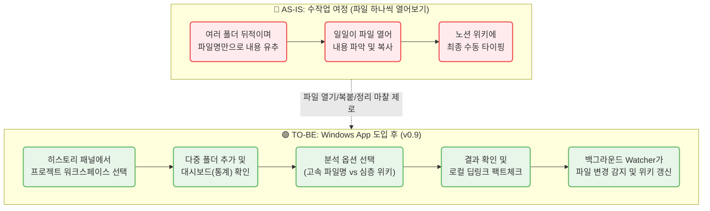

# CorpBrain MVP — PRD v0.9
- Owner 팀: Product Team
- 최종 업데이트: 2026-07-16
- 관련 문서: VPS, MVP Spec (Windows App 전환), Feature Map
- 변경 이력: v0.7(Windows 앱 기반 설계), v0.8(로직 구체화)을 거쳐 **v0.9(대시보드, 다중 폴더 워크스페이스, 실시간 동기화 기능 추가)**로 진화.

### 1. 개요 및 목표 (Overview & Goals)
* **1.1 문제 정의 (Pain + 실패 KPI):**
  * **로컬 문서 파편화 및 수동 정리 과부하 (C1):** 수많은 폴더에 분산된 로컬 문서(.docx, .pdf 등)의 내용을 일일이 열어보고 정리/구조화하는 데 심각한 업무 지연 발생 (Before: 문서 파악 및 위키 작성에 1일 평균 60~120분 낭비)
  * **기밀 유출 불안 (A1):** 외부 SaaS(Cloud AI) 솔루션 도입 시 기업 문서 유출 우려 및 ROI 증명 불가 (Before: AI 도입 반려율 77% / Failure: 경영진/보안팀 기밀 유출 검열 통과 불가)
  * **정보 탐색 실패 및 지식 자산화 누락 (E1):** 프로젝트 단위로 파일명이 불규칙하고 파일 구조가 복잡하여 과거 산출물을 찾지 못하고 재작업 발생 (Before: 주당 평균 정보 유실 및 재탐색 3건 이상)
* **1.2 Desired Outcome (Before → After 수치):**
  * **문서 파악 및 위키화 소요 시간:** Before 60분 → After 10분 이내 (약 83.3% 단축)
  * **환각/출처 불명 방어율:** AI 위키 결과물의 모든 문장에 로컬 파일 경로(딥링크) 100% 매핑하여 즉시 원본 확인.
  * **보안 사고율:** 0%. 클라우드 API 사용 시 완벽한 마스킹 제공(정규식 및 NER 기반 PII 치환), 또는 100% 로컬 LLM 구동을 통한 망분리 수준의 보안 달성.
  * **파일 구조 가시성:** 무질서한 폴더/파일명 → AI 추천 기반의 일관된 Naming Rule(`[{Date}]_{ProjectName}_{DocumentType}_{Seq}.{ext}`) 자동 일괄 개편.

### 2. 사용자 및 여정 (Users & Journey)
* **2.1 타겟 페르소나 요약:**
  * **C1 (실무자):** 프로젝트 산출물 정리에 지친 기획자/개발자.
  * **A1 (B2B 도입 검토자/보안팀):** 로컬에서만 도는 폐쇄형 AI 솔루션을 선호.
  * **E1 (PM):** 산재된 클라이언트 요구사항 문서들을 하나의 위키로 묶어내야 하는 책임자.

* **2.2 [Mermaid] 사용자 여정 시각화 (Before vs After):**

### 3. 기능 요구사항 (Functional Requirements)

#### 3.1 Must-Have (MVP 필수 — 첫 윈도우 버전 구현 목표)

- **F1. 워크스페이스 기반 로컬 폴더 파서 및 대시보드 (Workspace & Dashboard):**
    - **상세 기능 1 (히스토리 및 다중 폴더):** 좌측 히스토리 패널을 통해 '프로젝트 워크스페이스' 단위로 분석 세션을 영구 저장(재부팅 시 복구)합니다. 단일 폴더뿐만 아니라 `[+ 폴더 추가]` 버튼으로 여러 폴더를 하나의 워크스페이스로 병합(Merge)하거나 새 프로젝트로 독립시킬 수 있습니다.
    - **상세 기능 2 (오버뷰 대시보드):** 폴더 선택 직후, **[프로젝트 오버뷰 대시보드]**를 렌더링하여 총 파일 개수, 총 용량(MB), 포맷별 비중을 시각화합니다. **또한 이러한 통계를 기반으로 '고속 분석'과 '심층 분석' 시 각각 어느 정도의 시간(Estimated Time)이 소요될지 예측하여 UI에 함께 표기**하므로, 사용자가 직관적으로 분석 모드를 결정할 수 있습니다.
    - **방어 로직 (OS 제약):** C드라이브 루트 등 과도한 혼재 폴더 선택 시 경고창을 띄우며, `Windows`, `.git`, `node_modules` 등 블랙리스트는 탐색에서 원천 제외합니다. 1회 최대 스캔 수(10,000개) 도달 시 일시 중지합니다.
    - **지원 포맷 제한:** `.docx`, `.pdf`, `.txt`, `.md` 만 분석 대상으로 필터링.

- **F2. 하이브리드 LLM 구동 엔진 (Dual AI Engine):**
    - **상세 기능:** 환경 설정에서 2가지 LLM 구동 방식을 제공합니다.
        - **Option A (클라우드 API):** OpenAI/Anthropic API 사용. PII(기밀) 데이터는 텍스트 추출 직후 마스킹 처리되어 클라우드로 전송됨. 속도와 품질이 우수.
        - **Option B (로컬 LLM):** Ollama / Llama 3 등 구동. 완전 폐쇄형 보안 100% 유지.
            - *원클릭 자동 온보딩:* 분석 전 Ollama Ping 테스트 실패 시, 사용자가 터미널을 다룰 필요 없도록 **앱 내 원클릭 설치**(`OllamaSetup.exe` 다운 및 `pull llama3`)를 백그라운드로 지원합니다.

- **F3. 다단계 시맨틱 분석 파이프라인 (Analysis Options):**
    - **분석 옵션 1 (파일명 기반 고속 분석):** 전체 트리의 파일명과 폴더 경로만 추출하여 유추. (결과: JSON + 요약 라벨) 불명확한 파일명은 앞 1,000 Bytes를 추출해 보완. 핵심 문서는 중요도(Score)를 높여 상단에 하이라이트.
    - **분석 옵션 2 (내용 기반 심층 분석 & LLM Wiki 생성):** 전체 내용을 파싱 및 청킹(Chunking)하여 로컬 벡터 DB에 저장 후 하나의 구조화된 'Wiki 마크다운' 초안을 생성. 1-Depth 폴더별로 탭(Tab)이나 목차를 격리하여 맥락 환각(Hallucination)을 막습니다.

- **F4. 일괄 폴더/파일명 개편 (Batch Rename & Restructure):**
    - **상세 기능:** 일관된 Naming Rule(`[{Date}]_{ProjectName}...`)을 추천하며, Diff 미리보기 승인 후 OS 레벨 일괄 `rename` 수행. [실행 취소(Undo)] 기능 100% 보장.

- **F5. 로컬 딥링크 기반 Trust-Anchor (Local Path Mapping):**
    - **상세 기능:** 생성된 위키 문장마다 로컬 원본을 여는 딥링크(`file:///...`) 100% 삽입. 클릭 시 OS 기본 연결 프로그램(Word 등) 호출.

- **F6. 실시간 감지 및 백그라운드 위키 갱신 (Live Sync & Watcher):**
    - **상세 기능:** 분석된 워크스페이스 내 파일(`.docx, .pdf, .txt, .md`)의 추가 및 수정 이벤트를 실시간으로 감지하여 기존 위키에 지식을 업데이트(Merge) 합니다.
    - **4가지 맞춤형 모드:**
        1. **수동 분석 (기본값):** 알림(토스트)만 노출하고, 유저가 승인 버튼을 누를 때 갱신.
        2. **완전 실시간:** 감지 즉시 백그라운드 갱신.
        3. **스마트 유휴시간:** PC 입력이 없거나 야간 시간에 모아서 갱신.
        4. **감지 끄기:** 데몬 중지.

#### 3.2 Should-Have / Could-Have
- **Should-Have:** 생성된 Wiki 문서를 외부 노션/컨플루언스 포맷으로 복사(Export) 하는 기능.

#### 3.3 Won't-Have (MVP 제외)
- **`.hwp`, `.xlsx`, `.pptx` 지원:** 파일 구조 파싱 난이도가 높으므로 V2로 이관.
- **Mac / Linux 지원:** Windows OS 전용 데스크톱 설치형 앱(`.exe`) 한정.

### 4. 사용자 스토리 및 수용 기준 (User Stories & AC)
* **Story ID:** `CB-STORY-101` (분석 옵션 1)
  * **As a** 실무자, **I want** 문서가 너무 많을 때 파일명 구조만으로 주요 문서를 파악하기를, **so that** 내용을 전부 읽지 않고 핵심부터 접근할 수 있다. (비용 5% 미만, 1분 내 처리)
* **Story ID:** `CB-STORY-102` (실시간 동기화)
  * **As a** 기획자, **I want** 워크스페이스의 문서가 수정되면 앱이 이를 스스로 감지하고 위키에 반영하기를, **so that** 수동 재분석 없이 항상 최신 지식을 열람할 수 있다.

### 5. 아키텍처 개요 (High-Level Architecture)
* **프론트엔드 (UI):** React 기반 데스크톱 UI + **좌측 히스토리(워크스페이스) 패널**
* **코어/백엔드:** Python 내장 (PyInstaller 패키징)
  * 파싱 모듈 (docx, pdfminer, txt, md)
  * 로컬 Vector DB (ChromaDB 또는 FAISS)
  * **파일 시스템 이벤트 감지기 (Python `watchdog`)**
* **데이터 저장:** 로컬 SQLite (`corpbrain_meta.db`)
  * `Workspace_Meta`: 프로젝트 목록, 포함된 루트 폴더들, 위키 생성 데이터 영구 보관.
  * `File_Meta` / `Rename_History`: 파싱 캐시(`last_modified` 비교) 및 복원 기록.

### 6. 마일스톤 및 롤아웃 플랜
1. **MVP 0.1:** Windows UI 스캐너, 대시보드 뷰, 고속 분석 우선 구현. (클라우드 API 전용)
2. **MVP 0.5:** 전체 텍스트 파싱, 로컬 DB 융합, 위키 생성(옵션 2) 및 좌측 히스토리 탑재.
3. **MVP 1.0:** 일괄 Rename, 로컬 LLM 원클릭 셋업, 백그라운드 실시간 동기화 포함 오픈 베타 배포.
