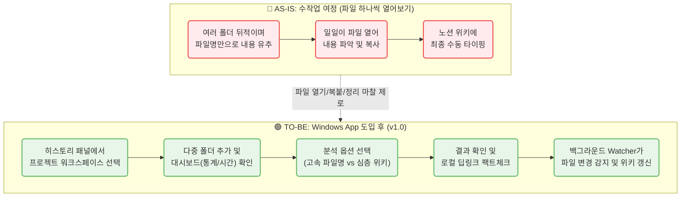

# CorpBrain MVP — PRD v1.0
- Owner 팀: Product Team
- 최종 업데이트: 2026-07-16
- 관련 문서: `01_CorpBrain_VPS.md` (제품 비전 선언문)
- 변경 이력: v0.9 기능을 유지하면서, 누락되었던 비즈니스 비전, 전략적 전제, 비기능 요구사항(NFR), 측정 지표(Telemetry) 등을 포함하여 완벽한 PRD 구조를 갖춘 v1.0으로 리팩토링.

---

### 1. Product Vision & Value Proposition (제품 비전 및 가치)
* **Elevator Pitch:** CorpBrain은 지식 유실과 보안 유출의 딜레마를 겪고 있는 10인 미만 중소기업을 위한 100% 로컬 구동형 Windows AI 지식 관리 솔루션입니다. 흩어진 로컬 문서를 클릭 몇 번으로 스캔하여 자동 구조화된 위키로 변환함으로써, 데이터 유출 없이 제로-마찰(Zero-Friction)로 사내 지식을 자산화합니다.
* **Core Values:**
  1. **Absolute Privacy:** 데이터 유출 0% (로컬 LLM 기반 망분리 수준 보안).
  2. **Zero-Friction:** 백그라운드 감지기(Watcher)를 통한 문서 수정 실시간 위키 갱신.
  3. **Trust-Anchor:** 딥링크 기술을 이용해 의심되는 요약 내용의 로컬 원문 즉각 팩트체크.

### 2. Context & Assumptions (전략적 피벗 근거와 전제)
* **피벗 사유 (SaaS → Local App):** 타겟 고객(중소기업)이 초기 서버 구축 비용이나 SaaS 구독료, 그리고 무엇보다 기밀 유출 리스크에 큰 거부감을 가지기 때문에 '설치 즉시 동작하는(Out-of-the-box)' 무설치급 로컬 앱 형태로 전략 전환.
* **시스템 전제 조건 (Assumptions):**
  - 주 타겟층의 업무용 기기 환경에 맞춰 MVP는 **Windows OS**로 제한한다.
  - 로컬 LLM(Ollama) 구동 시 개인 PC 리소스를 사용하므로, 일정 수준의 CPU/GPU 자원 점유가 발생함을 사용자가 인지하고 동의한다.

### 3. 개요 및 목표 (Overview & Goals)
* **3.1 문제 정의 (Pain + 실패 KPI):**
  * **로컬 문서 파편화 (C1):** 수많은 폴더에 분산된 문서 파악에 1일 60~120분 낭비.
  * **기밀 유출 불안 (A1):** SaaS 솔루션의 기밀 유출 검열 통과 불가.
  * **정보 탐색 실패 (E1):** 주당 3건 이상의 정보 유실 및 재작업 발생.
* **3.2 Desired Outcome (성공 지표):**
  * **문서 파악 소요 시간:** 60분 → 10분 이내 (약 83.3% 단축).
  * **보안 사고율:** 0% 달성.
* **3.3 Anti-Goals (하지 않을 것):**
  * 우리는 **'사내 전사 통합 검색 엔진(Enterprise Search)'**을 만드는 것이 아닙니다. 파일 내부의 단순 텍스트 검색(Ctrl+F) 보다는, 분산된 파일들의 **'맥락을 융합하여 요약된 위키 지식'**을 생산하는 데 집중합니다.
  * 우리는 **'중앙집중형 클라우드 문서 저장소(Google Drive 등)'**를 만들지 않습니다. 파일 원본은 유저의 PC에 물리적으로 그대로 두며, 앱은 그 메타데이터와 요약된 위키 구조만 관리합니다.

### 4. 사용자 및 여정 (Users & Journey)
* **4.1 타겟 페르소나 요약:**
  * **C1 (실무자):** 산출물 정리에 지친 기획자/개발자.
  * **A1 (보안/검토자):** 폐쇄형 AI 선호자.
  * **E1 (PM):** 요구사항 문서 취합 책임자.
* **4.2 [Mermaid] 사용자 여정 시각화:**

### 5. 기능 요구사항 (Functional Requirements)
* **F1. 워크스페이스 기반 파서 및 대시보드:**
  - **다중 폴더 히스토리:** '프로젝트 워크스페이스' 단위로 분석 세션 영구 보존. 다중 폴더 병합 가능.
  - **오버뷰 대시보드:** 분석 전 파일 개수, 용량, **예상 소요 시간(Estimated Time)** 표시로 옵션 결정 지원.
  - **방어 로직:** 1만 개 스캔 도달 시 일시 정지. 블랙리스트 폴더(Windows 등) 및 미지원 포맷 무시.
* **F2. 하이브리드 LLM 구동 엔진:**
  - **Option A (클라우드 API):** PII 마스킹(정규식/NER) 처리 후 전송.
  - **Option B (로컬 LLM):** Ollama 연동. 앱 내 원클릭 백그라운드 온보딩(설치 및 다운로드) 지원.
* **F3. 다단계 시맨틱 분석 파이프라인:**
  - **고속 분석 (폴더 및 파일명 위주):** 폴더 구조가 담고 있는 맥락과 파일명을 결합하여 유추. 핵심 문서 점수화 및 하이라이트.
  - **심층 분석 (위키 생성):** 로컬 벡터 DB 활용, 1-Depth 폴더별 탭 분리로 맥락 혼선(Hallucination) 방지.
* **F4. 일괄 폴더/파일명 개편:**
  - Naming 템플릿 추천, Diff 승인 후 일괄 변경. `Rename_History` DB 기반 [실행 취소(Undo)] 100% 보장.
* **F5. 로컬 딥링크 기반 Trust-Anchor:**
  - 위키 문장에 로컬 원문 연결 딥링크 삽입 (`os.startfile` 브릿지).
* **F6. 실시간 감지 및 백그라운드 위키 갱신 (Watcher):**
  - 워크스페이스 내 문서(`.docx, .pdf, .txt, .md`) 수정 실시간 감지. [수동/실시간/유휴시간/끄기] 옵션 제공.

### 6. 비기능 요구사항 (Non-Functional Requirements)
* **6.1 보안 및 프라이버시 (Security):**
  * 생성되는 로컬 DB(SQLite, ChromaDB) 파일은 윈도우 OS의 앱 데이터 영역(`LocalAppData`)에 격리 보관되며, 앱 코드상에 외부 클라우드로 파일 내용을 은밀히 전송하는 Telemetry가 원천 배제되어야 한다.
  * Option A(클라우드) 선택 시, PII 필터링은 네트워크 I/O가 발생하기 전 메모리 상에서 완료되어야 한다.
* **6.2 성능 및 제약 (Performance):**
  * **스캔 속도:** 로컬 파일 트리 스캔 시 UI Freezing을 방지하기 위해 1,000개 파일 스캔 및 대시보드 통계 계산이 5초 이내에 수행되어야 한다.
  * **자원 점유율:** 백그라운드 감지 데몬(Watcher)은 유휴 상태일 때 CPU 1% 미만, RAM 100MB 미만을 점유해야 한다.
* **6.3 신뢰성 (Reliability):**
  * 경로 길이가 260자(MAX_PATH)를 초과하거나 권한이 거부되는 시스템 영역 접근 시, 프로세스가 종료되지 않고 조용히 스킵(Skip & Log)되어야 한다.

### 7. 성공 측정 지표 (Telemetry & Metrics)
* 완전 폐쇄망 로컬 환경을 지향하므로, GA(Google Analytics) 등 외부 서버로의 로그 전송을 지양합니다.
* 대신, 앱 내부에 **'생산성 통계(My Analytics)' 대시보드**를 마련하여 제품의 ROI를 유저가 스스로 체감하게 합니다.
  * **절약된 시간 (Time Saved):** AI가 대신 읽어낸 문서의 총 텍스트 량(토큰 수)을 인간의 평균 독해 속도(WPM)와 비교하여 "이번 주 5시간을 절약했습니다"와 같은 가시적 수치로 표시.
  * **팩트체크 방어율 (Fact-Check Rate):** 생성된 위키 내 딥링크를 클릭해 로컬 원문을 확인한 횟수를 추적 (예: "이번 달 35번의 팩트체크로 환각을 방어했습니다.")
  * **지식 자산화 규모 (Knowledge Size):** 파편화되어 있던 파일 N개가 몇 개의 통합된 위키로 깔끔하게 압축(구조화)되었는지 압축률을 시각화.
  * **자동화 기여도 (Automation Score):** 백그라운드 Watcher 데몬이 유저 몰래 알아서 위키를 업데이트해 준 횟수 등 자동화 기여도를 수치화.

### 8. 아키텍처 개요 (High-Level Architecture)
* **프론트엔드 (UI):** React 기반 데스크톱 UI + 좌측 워크스페이스 패널
* **코어/백엔드:** Python (PyInstaller 패키징 단일 exe)
  * 파싱 모듈 (docx, pdfminer, txt, md)
  * 로컬 Vector DB (ChromaDB / FAISS)
  * 파일 시스템 이벤트 감지 데몬 (Python `watchdog`)
* **데이터 영구 저장소:** 로컬 SQLite (`corpbrain_meta.db`)
  * `Workspace_Meta`, `File_Meta`, `Rename_History`

### 9. 마일스톤 및 롤아웃 플랜
1. **MVP 0.1:** UI 파일 스캐너, 대시보드 뷰, 파일명 기반 고속 분석 기능 구현. (클라우드 API로 검증)
2. **MVP 0.5:** 전체 텍스트 파싱, 로컬 DB 융합, 위키 생성(심층 분석) 및 워크스페이스 개념 이식.
3. **MVP 1.0:** 일괄 Rename, 로컬 LLM 원클릭 온보딩, 백그라운드 실시간 갱신 데몬 탑재 완료 후 사내 테스트(CBT).
