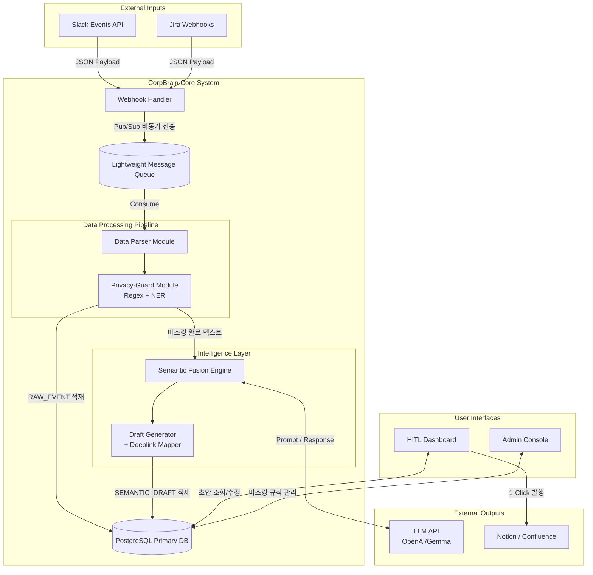
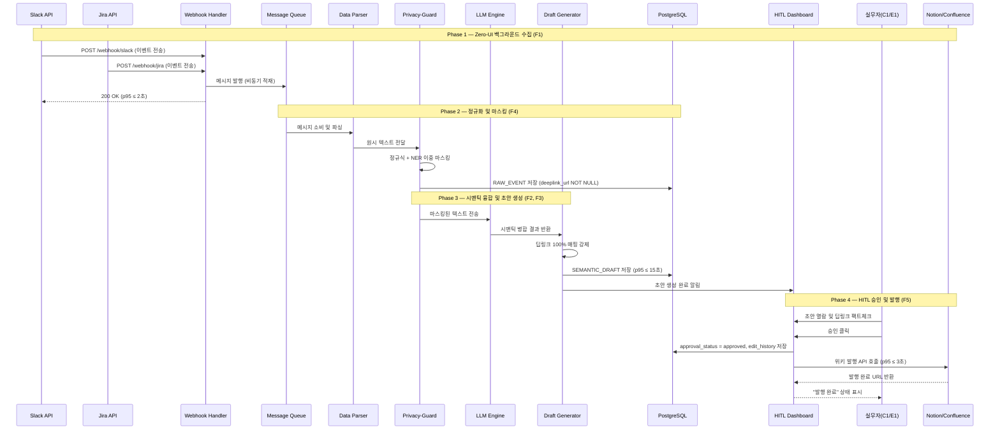
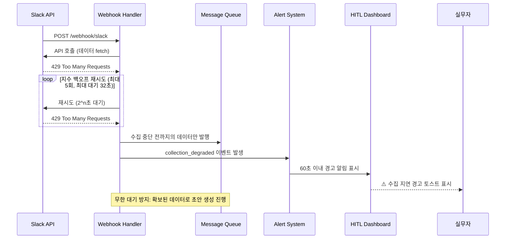
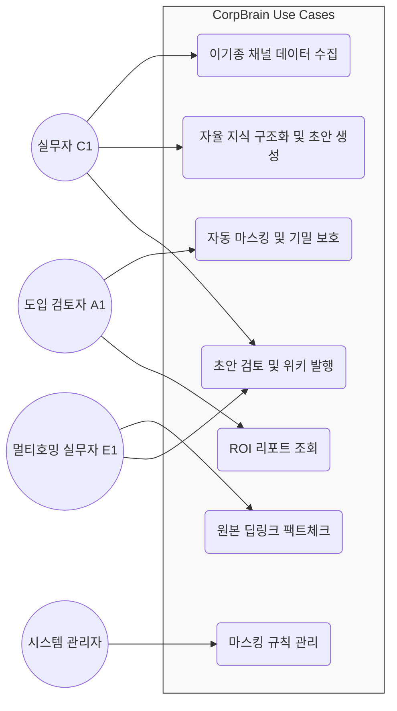
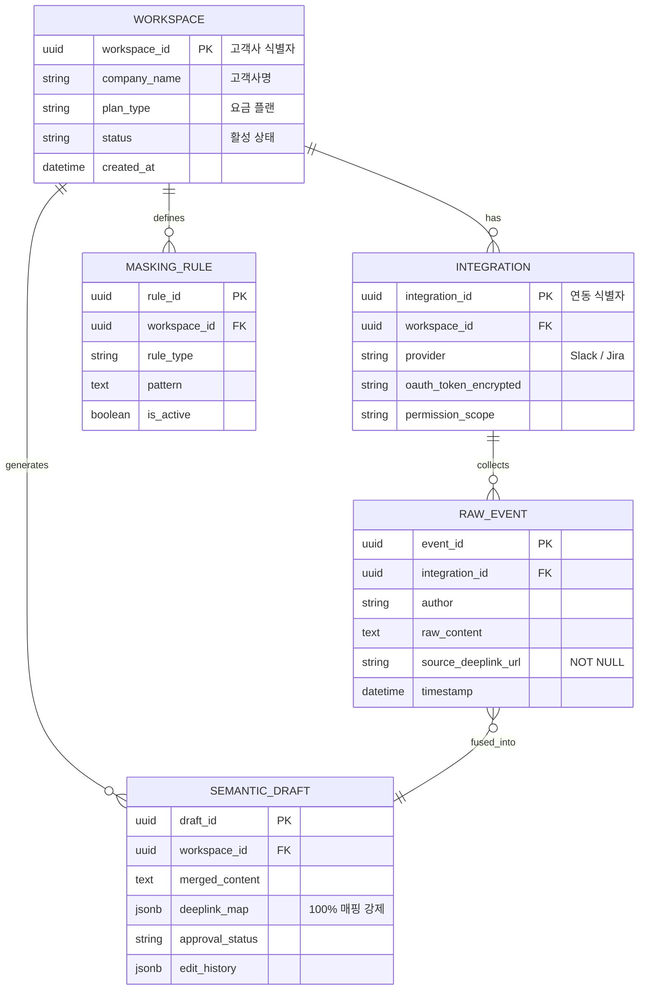
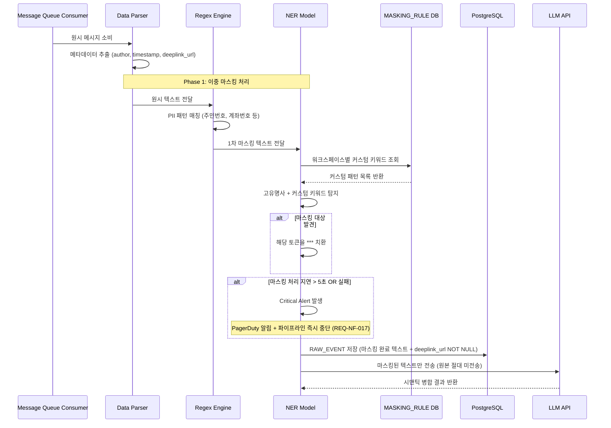
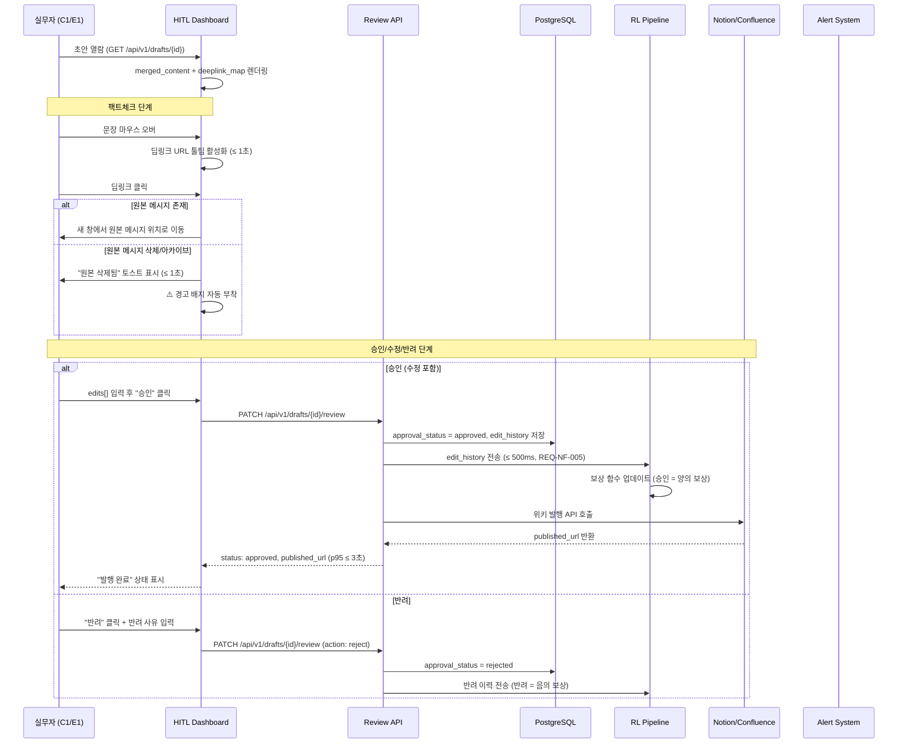
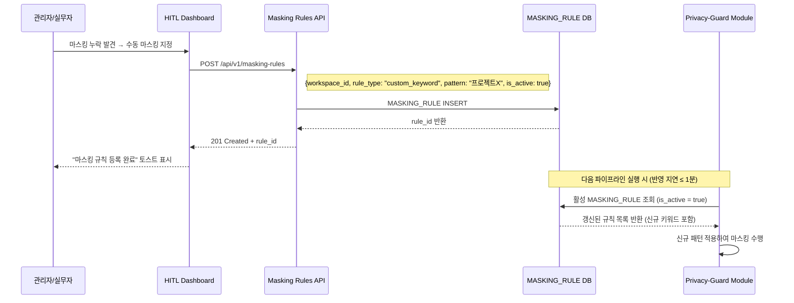
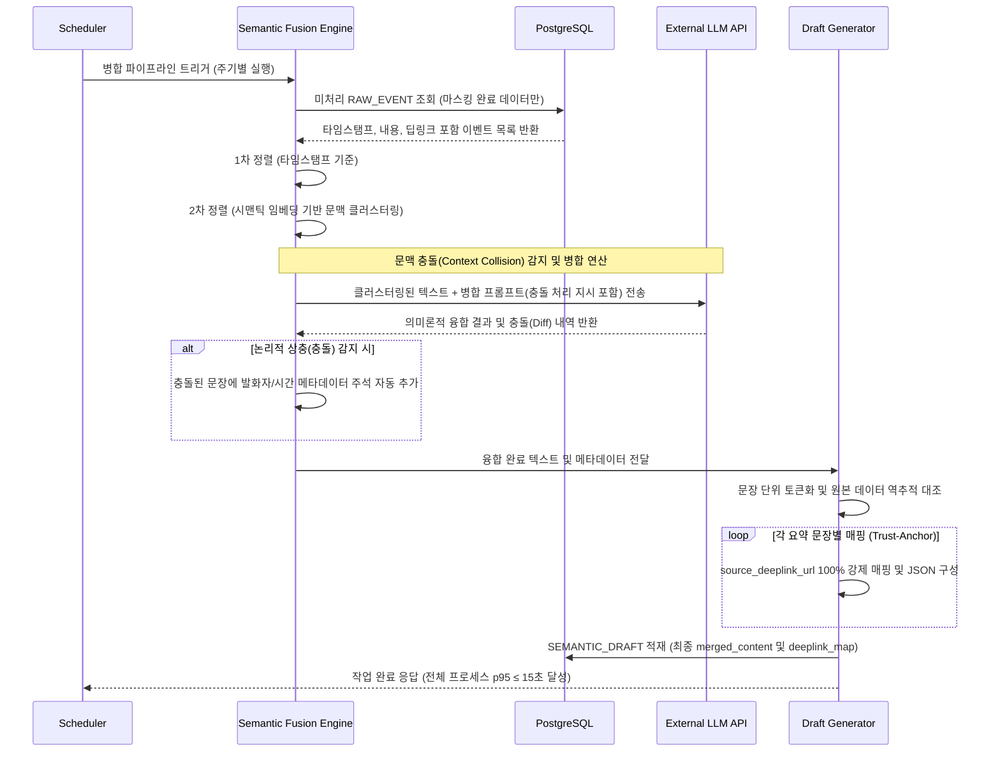
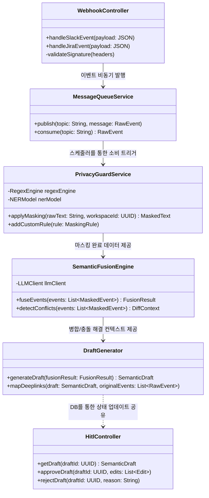

# Software Requirements Specification (SRS)

- **Document ID:** SRS-001
- **Revision:** v0.3
- **Date:** 2026-05-14
- **Standard:** ISO/IEC/IEEE 29148:2018
- **Source PRD:** CorpBrain MVP — PRD v0.5 (2026-05-14)

---

## 1. Introduction

### 1.1 Purpose

본 SRS는 CorpBrain MVP의 소프트웨어 요구사항을 ISO/IEC/IEEE 29148:2018 표준에 준거하여 정의한다. 본 문서의 목적은 다음과 같다:

1. **문제 정의:** 10인 미만 혁신 IT 스타트업의 실무자·관리자가 이기종 협업 채널(Slack, Jira 등)에 산재한 비정형 논의를 수동으로 교차 대조·정리하는 과정에서 1일 평균 60~120분의 업무 시간이 낭비되고 있다. 외부 AI 솔루션 도입 시 기밀 유출 우려로 인한 반려율이 높고(가설: 77%), 다중 채널 관리 중 주당 평균 3건의 정보 누락이 발생한다.
2. **솔루션 목표:** Zero-UI 백그라운드 자동 수집, 시맨틱 융합 초안 생성, 원본 딥링크 100% 매핑, 엔터프라이즈급 PII 마스킹을 통해 문서화 소요 시간을 10분 이내로 단축(83.3% 절감)하고, 보안 사고율 0%, 환각 방어율 100%를 달성한다.
3. **대상 독자:** 개발팀, QA팀, 프로덕트 매니저, 아키텍트, 외부 이해관계자.

### 1.2 Scope

#### 1.2.1 In-Scope (MVP 범위)

| 구분 | 항목 | 비고 |
|---|---|---|
| **F1** | Zero-UI 백그라운드 자동 수집기 | Sprint 1: Slack 우선, Sprint 2: Jira |
| **F2** | 자율 지식 구조화 및 초안 생성 (Semantic Fusion Engine) | 타임스탬프 + 시맨틱 임베딩 병합 |
| **F3** | Trust-Anchor (원본 딥링크 매핑) | 100% 강제 매핑 |
| **F4** | Privacy-Guard (엔터프라이즈급 기밀 마스킹) | 정규식 + NER 이중 적용 |
| **F5** | HITL 승인 대시보드 | Should-Have, RL 피드백 루프 포함 |
| **F6** | ROI 자동 산출 리포트 | Could-Have, 세일즈 키트로 수동 대체 가능 |

#### 1.2.2 Out-of-Scope (MVP 제외)

| 항목 | 제외 근거 |
|---|---|
| AI 초개인화 맞춤 추천 | 초기 데이터 편향 위험, 핵심 가치(이기종 채널 융합) 이탈. AOS/DOS Q4 해당 |
| 자체 Parsing 원천 기술 R&D | KSF #5 '비핵심 기술 외부 조달' 전략. Unstructured 등 오픈소스 파서 활용 |
| On-Premise 인프라 구축 | AOS 0.4 / DOS -0.4로 Q4 최하위. SaaS 아키텍처와 충돌. 추후 엔터프라이즈 패키지로 분리 |

#### 1.2.3 Constraints (제약사항)

| ID | 제약사항 | 근거 |
|---|---|---|
| CON-01 | 경량 메시지 큐(Redis 등) 비동기 아키텍처 채택 필수 | ADR-01: 초기 인프라 오버헤드 최소화 및 데이터 유실률 0% SLO 달성 |
| CON-02 | 파서(Parser) 원천 기술은 외부 조달 | ADR-02: 자체 개발 시 MVP 일정 3개월+ 지연 리스크 |
| CON-03 | 서드파티 API 연동 시 Read-only 권한만 요구 | 권한 남용 차단, 고객사 보안 정책 준수 |
| CON-04 | LLM 벤더(OpenAI 등) API 가용성에 종속 | 벤더 장애 시 융합 엔진 중단 |
| CON-05 | 고객사 Admin의 서드파티 앱 권한 허용 필수 | 온보딩 전제 조건 |

#### 1.2.4 Assumptions (가정)

| ID | 가정 | 상태 |
|---|---|---|
| ASM-01 | 타겟 스타트업의 1일 평균 메시지 생성량은 인당 500건 이하 | 가설 |
| ASM-02 | 실무자(C1)는 기존 툴 UI 변화 없이 대시보드 알림 확인에 거부감 없음 | 가설 |
| ASM-03 | Slack Events API 및 Jira Webhooks는 안정적으로 가용함 | 전제 |

### 1.3 Definitions, Acronyms, Abbreviations

| 용어 | 정의 |
|---|---|
| **Zero-UI** | 사용자가 별도의 창을 띄우거나 수동 업로드 없이, 백그라운드에서 자동으로 데이터를 수집·처리하는 아키텍처 패턴 |
| **TTC (Time-to-Conversion)** | 탐색 시작부터 문서화 완료(초안 승인)까지 소요되는 시간. 북극성 지표 |
| **HITL (Human-in-the-Loop)** | 자동 생성된 결과물에 대해 인간이 최종 검토·승인·수정하는 프로세스 |
| **Trust-Anchor** | AI 생성 문장에 원본 출처 딥링크를 100% 매핑하여 팩트체크를 보장하는 메커니즘 |
| **Privacy-Guard** | 정규식 패턴 매칭 + NER 모델을 이중 적용하여 PII 및 기밀 키워드를 마스킹하는 모듈 |
| **Semantic Fusion** | 이기종 채널의 비정형 텍스트를 타임스탬프 기반 시간순 정렬 + 시맨틱 임베딩 기반 의미론적 병합을 동시 수행하는 처리 방식 |
| **PII (Personally Identifiable Information)** | 주민등록번호, 계좌번호 등 개인 식별 가능 정보 |
| **NER (Named Entity Recognition)** | 텍스트에서 고유명사·개체명을 자동 인식하는 자연어 처리 기술 |
| **JTBD (Jobs to be Done)** | 사용자가 특정 상황에서 달성하고자 하는 과업 프레임워크 |
| **AOS (Adjusted Opportunity Score)** | 기회 점수 보정값. Pain의 빈도·강도·대안 부재를 종합 평가 |
| **DOS (Discovered Opportunity Score)** | 발견된 기회 점수. 정성 인터뷰 기반 발견 기회 크기 |
| **MoSCoW** | Must / Should / Could / Won't 우선순위 분류 프레임워크 |
| **RL (Reinforcement Learning)** | 사용자 피드백(승인/반려)을 보상 함수로 활용하는 강화학습 |
| **SLA (Service Level Agreement)** | 서비스 수준 합의. 가용성, 응답시간 등의 보장 수준 |
| **SLO (Service Level Objective)** | 서비스 수준 목표. SLA 내부의 구체적 측정 목표 |
| **RPO (Recovery Point Objective)** | 장애 시 허용 가능한 데이터 손실 시점 |
| **RTO (Recovery Time Objective)** | 장애 발생 후 서비스 복구까지 허용 시간 |
| **K-Factor** | 바이럴 계수. 기존 사용자 1명이 유입시키는 신규 사용자 수 |
| **PLG (Product-Led Growth)** | 제품 자체가 성장 동력이 되는 전략 |
| **Validator** | PRD 내 가설·수치의 정합성을 검증하는 역할 또는 기준 |

### 1.4 References

| ID | 문서명 | 설명 |
|---|---|---|
| REF-01 | CorpBrain MVP PRD v0.5 | 본 SRS의 원천 요구사항 문서 |
| REF-02 | VPS_v5.md (Value Proposition Sheet) | 시장 규모, ROI, 페르소나, KSF 분석 근거 |
| REF-03 | Deep Research 분석 결과 | JTBD, AOS/DOS, CJM, Porter's 5 Forces 등 |
| REF-04 | MVP Specification | 기술 스택 및 아키텍처 설계 상세 |
| REF-05 | Revenue Model | 요금 플랜(Starter/Team) 및 수익 구조 |
| REF-06 | Feature Map | 기능별 우선순위 및 스프린트 배정 |
| REF-07 | ISO/IEC/IEEE 29148:2018 | Systems and software engineering — Life cycle processes — Requirements engineering |

---

## 2. Stakeholders

| 역할 (Role) | 대표 페르소나 | 책임 (Responsibility) | 관심사 (Interest) |
|---|---|---|---|
| **파편화 융합형 실무자** | C1 (이수아, 29세 PM) | 일일 문서화 작업 수행, 초안 검토·승인 | 복붙 노동 제거, TTC 10분 이내 달성, Zero-UI 경험 |
| **B2B 도입 검토자 (결재권자)** | A1 (강서연, 42세 DX팀장) | 솔루션 도입 결재, 보안 심사 통과, 예산 방어 | 기밀 유출 0%, ROI 정량 증명, 경영진 보안 허들 돌파 |
| **멀티호밍 한계 시험자** | E1 (한유리, 35세 에이전시 PM) | 10개+ 클라이언트 채널 동시 관리, 팩트체크 | 환각 방어 100%, 딥링크 1초 이내 팩트체크, 정보 누락 0건 |
| **시스템 관리자** | (내부) | 서드파티 앱 권한 설정, 마스킹 규칙 관리 | 최소 권한 원칙, 연동 안정성, 감사 로그 |
| **개발팀** | (내부) | 시스템 구현, 배포, 운영 모니터링 | 기술 요구사항 명확성, 테스트 가능성, 아키텍처 건전성 |

---

## 3. System Context and Interfaces

### 3.0 Component Diagram (System Architecture)

시스템의 전체적인 모듈 구성 및 내외부 인터페이스 간의 데이터 흐름은 다음과 같습니다.

### 3.1 External Systems

| 시스템 | 유형 | 프로토콜 | 용도 | 제약사항 |
|---|---|---|---|---|
| Slack Events API | Input (Webhook) | HTTPS / WebSocket | 채널 메시지 실시간 수신 | Rate Limit Tier 3 (50+ req/min), Read-only scope 강제 |
| Jira Webhooks | Input (Webhook) | HTTPS | 이슈/코멘트 변경 이벤트 수신 | 커스텀 이벤트 필터링 필요, Admin 권한 등록 |
| OpenAI / Gemma LLM API | Processing | HTTPS REST | 시맨틱 병합 및 초안 생성 | 토큰 비용 ≤ $3/인/월, 마스킹 후 전송 필수 |
| Notion API | Output | HTTPS REST | 승인된 초안의 위키 발행 | OAuth 연동, 페이지 생성 권한 필요 |
| Confluence API | Output | HTTPS REST | 승인된 초안의 위키 발행 | OAuth 연동, 페이지 생성 권한 필요 |
| Stripe Billing API | Monitoring | HTTPS REST | 구독 관리, 유료 전환 추적 | - |
| Mixpanel | Analytics | HTTPS | TTC 추적, 코호트 리텐션 분석 | - |
| GA4 | Analytics | HTTPS | 랜딩페이지 전환율 측정 | - |
| Datadog APM | Monitoring | Agent | API p95 latency, 에러율 추적 | - |
| UptimeRobot | Monitoring | HTTPS | 외부 합성 모니터링, SLA 측정 | 1분 주기 헬스체크 |
| PagerDuty | Alerting | HTTPS | Critical 알림 및 온콜 호출 | - |

### 3.2 Client Applications

| 클라이언트 | 유형 | 설명 |
|---|---|---|
| HITL 대시보드 | Web Application | 초안 검토, 승인/수정/반려, 마스킹 규칙 관리, ROI 리포트 조회 |
| 관리자 콘솔 | Web Application | 워크스페이스 설정, 연동 관리, 사용자 권한 관리 |
| Grafana 운영 대시보드 | Web Application | p50/p95/p99 Latency, API 에러율, 비용 모니터링 시각화 |

### 3.3 API Overview

#### 3.3.1 Internal Core API

| Method | Endpoint | 기능 | 관련 기능 |
|---|---|---|---|
| `POST` | `/webhook/slack` | Slack 이벤트 수신 및 큐 적재 | F1 |
| `POST` | `/webhook/jira` | Jira 이벤트 수신 및 큐 적재 | F1 |
| `POST` | `/api/v1/drafts/generate` | 시맨틱 초안 생성 요청 | F2, F3, F4 |
| `PATCH` | `/api/v1/drafts/{draft_id}/review` | 초안 승인/수정/반려 (HITL) | F5 |
| `GET` | `/api/v1/reports/roi` | ROI 리포트 조회 | F6 |
| `POST` | `/api/v1/masking-rules` | 커스텀 마스킹 규칙 등록 | F4 |
| `GET` | `/api/v1/drafts/{draft_id}` | 초안 상세 조회 (딥링크 포함) | F3 |
| `GET` | `/api/v1/health` | 헬스체크 | 운영 |

#### 3.3.2 External Dependency API

| API | 방향 | 용도 | 제약사항 |
|---|---|---|---|
| Slack Events API | Inbound | 채널 메시지 Webhook 수신 | Rate Limit Tier 3 |
| Jira Webhooks | Inbound | 이슈/코멘트 변경 이벤트 수신 | Admin 권한 필요 |
| OpenAI / Gemma API | Outbound | LLM 추론(시맨틱 병합) | $3/인/월 상한, 마스킹 후 전송 |
| Notion API | Outbound | 위키 페이지 생성/업데이트 | OAuth, 페이지 생성 권한 |
| Confluence API | Outbound | 위키 페이지 생성/업데이트 | OAuth, 페이지 생성 권한 |

### 3.4 Interaction Sequences (핵심 시퀀스 다이어그램)

#### 3.4.1 핵심 플로우: Zero-UI 수집 → 초안 생성 → 승인 발행

#### 3.4.2 실패 대응 플로우: Rate Limit 초과 시 재시도 및 경고

---

## 4. Specific Requirements

### 4.1 Functional Requirements

> 모든 기능 요구사항은 PRD의 User Story 및 Feature를 Source로 하며, MoSCoW 우선순위를 Priority로 반영한다. 하나의 Story/Feature는 복수의 REQ-FUNC로 분해한다.

#### 4.1.0 UseCase Diagram

본 시스템의 주요 액터와 제공되는 핵심 기능 간의 관계는 아래의 UseCase 다이어그램과 같다.

#### 4.1.1 F1 — Zero-UI 백그라운드 자동 수집기

| ID | 요구사항 | Source | Priority | Acceptance Criteria |
|---|---|---|---|---|
| REQ-FUNC-001 | 시스템은 Slack Events API Webhook을 통해 지정된 채널의 메시지를 실시간으로 수신하여야 한다. 사용자의 수동 업로드나 별도 UI 조작 없이 백그라운드에서 동작하여야 한다. | CB-STORY-001, F1 | Must | **Given** Slack 워크스페이스에 CorpBrain 앱이 Read-only scope로 설치된 상태에서, **When** 지정 채널에 새 메시지가 게시되면, **Then** 해당 메시지가 Webhook Handler를 통해 수신되어야 한다. 수신 누락률 = 0%. |
| REQ-FUNC-002 | 시스템은 Jira Webhooks를 통해 이슈 생성, 코멘트 추가, 상태 변경 이벤트를 수신하여야 한다. (Sprint 2 구현 대상) | CB-STORY-001, F1 | Must | **Given** Jira 프로젝트에 Webhook이 Admin 권한으로 등록된 상태에서, **When** 이슈/코멘트 변경 이벤트가 발생하면, **Then** 해당 이벤트가 커스텀 필터를 거쳐 수신되어야 한다. 이벤트 수신 누락률 = 0%. |
| REQ-FUNC-003 | 수신된 Webhook 이벤트는 경량 메시지 큐(Redis 등)를 경유하여 비동기로 적재되어야 한다. 동기식 폴링은 사용하지 않는다. | CB-STORY-001, F1 | Must | **Given** Webhook Handler가 이벤트를 수신한 상태에서, **When** 이벤트를 큐에 발행하면, **Then** 큐 Consumer가 해당 메시지를 소비하여 DB에 RAW_EVENT로 적재하여야 한다. 메시지 큐 적재 건수 vs. DB 적재 레코드 수 일치율 = 100%. |
| REQ-FUNC-004 | 써드파티 API Rate Limit 초과 시, 지수 백오프(Exponential Backoff) 재시도 로직이 적용되어야 한다. 최대 재시도 횟수는 5회, 최대 대기 시간은 32초이다. | CB-STORY-001, F1 | Must | **Given** 써드파티 API가 429 Too Many Requests를 반환할 때, **When** Webhook Handler가 재시도를 수행하면, **Then** 2^n초 간격(1, 2, 4, 8, 16, 32초)으로 최대 5회까지 재시도하여야 한다. |
| REQ-FUNC-005 | 재시도 5회 초과 시, 수집 중단 전까지의 데이터만으로 초안 생성을 진행하고, 대시보드에 60초 이내 `collection_degraded` 경고 알림을 표시하여야 한다. | CB-STORY-001, F1 | Must | **Given** 재시도 횟수가 5회를 초과한 상태에서, **When** 시스템이 수집을 중단하면, **Then** ① 확보된 데이터만으로 초안 생성이 진행되고, ② 대시보드에 60초 이내 경고 알림이 표시되어야 한다. 데이터 증발률 = 0%. |

#### 4.1.2 F2 — 자율 지식 구조화 및 초안 생성 (Semantic Fusion Engine)

| ID | 요구사항 | Source | Priority | Acceptance Criteria |
|---|---|---|---|---|
| REQ-FUNC-006 | 시스템은 이기종 채널에서 수집된 비정형 텍스트를 타임스탬프 기반 시간순으로 정렬하여야 한다. | CB-STORY-001, F2 | Must | **Given** 복수 채널(Slack, Jira)에서 수집된 RAW_EVENT가 존재할 때, **When** 초안 생성 API(`POST /api/v1/drafts/generate`)가 호출되면, **Then** 발화 타임스탬프 기준으로 시간순 정렬된 결과가 포함되어야 한다. |
| REQ-FUNC-007 | 시스템은 시맨틱 임베딩 기반 의미론적 병합을 수행하여 유사 발화를 하나의 문맥으로 통합하여야 시맨틱 병합을 수행하여야 한다. | CB-STORY-001, F2 | Must | **Given** 시간순 정렬된 RAW_EVENT 집합이 존재할 때, **When** Semantic Fusion Engine이 가동되면, **Then** 의미론적으로 유사한 발화가 하나의 구조화된 섹션으로 병합되어야 한다. 문맥 충돌/오류 발생률 < 5%. |
| REQ-FUNC-008 | 시스템은 유사 발화 간 문맥 충돌(Context Collision)을 감지하고, 발화자·시간·원본 채널 메타데이터를 대조하여 Diff/Conflict를 자동 관리하여야 한다. | CB-STORY-001, F2 | Must | **Given** 동일 주제에 대한 상충 발화가 존재할 때, **When** 병합 엔진이 충돌을 감지하면, **Then** 발화자·시간·채널 메타데이터 기반 Diff를 생성하고 초안에 충돌 마커를 포함하여야 한다. |
| REQ-FUNC-009 | 초안 생성 API(`POST /api/v1/drafts/generate`)는 workspace_id, time_range, channels, masking_enabled를 입력으로 받고, draft_id, merged_content, deeplink_map, masking_applied를 반환하여야 한다. | CB-STORY-001, F2 | Must | **Given** 유효한 workspace_id와 time_range가 제공될 때, **When** 초안 생성 API가 호출되면, **Then** 명시된 JSON 스키마에 부합하는 응답이 반환되어야 한다. p95 응답 속도 ≤ 15초. |

#### 4.1.3 F3 — Trust-Anchor (원본 딥링크 매핑)

| ID | 요구사항 | Source | Priority | Acceptance Criteria |
|---|---|---|---|---|
| REQ-FUNC-010 | 시맨틱 융합 엔진이 생성한 초안의 모든 요약 문장에 원본 메시지(Slack 스레드, Jira 티켓)로 이동 가능한 딥링크 앵커가 100% 강제 매핑되어야 한다. | CB-STORY-003, F3 | Must | **Given** 초안이 생성 완료된 상태에서, **When** deeplink_map을 검증하면, **Then** 초안 내 모든 요약 문장에 대해 유효한 source_url이 매핑되어야 한다. 딥링크 매핑률 = 100%. |
| REQ-FUNC-011 | 사용자가 대시보드에서 특정 문장에 마우스를 오버하면 원본 URL이 즉시 활성화되어야 한다. | CB-STORY-003, F3 | Must | **Given** 초안이 HITL 대시보드에 렌더링된 상태에서, **When** 사용자가 요약 문장에 마우스를 오버하면, **Then** 해당 문장의 원본 딥링크 URL이 툴팁 또는 팝오버로 1초 이내에 활성화되어야 한다. |
| REQ-FUNC-012 | 딥링크 앵커 클릭 시, 정확히 해당 발화가 존재하는 원본 메신저 URL 위치로 이동하여야 한다. | CB-STORY-003, F3 | Must | **Given** 사용자가 딥링크 앵커를 클릭할 때, **When** 새 창이 열리면, **Then** 정확한 원본 메시지 위치로 이동하여야 한다. 링크 랜딩 오류율 < 0.1%. |
| REQ-FUNC-013 | 딥링크가 가리키는 원본 메시지가 삭제 또는 아카이브된 경우, '원본 삭제됨' 안내 토스트를 1초 이내 표시하고 해당 문장에 ⚠️ 경고 배지를 자동 부착하여야 한다. | CB-STORY-003, F3 | Must | **Given** 딥링크가 가리키는 원본 메시지가 삭제/아카이브된 상태에서, **When** 사용자가 딥링크를 클릭하면, **Then** ① '원본 삭제됨' 토스트가 1초 이내 표시되고, ② 해당 문장에 ⚠️ 경고 배지가 자동 부착되어야 한다. |

#### 4.1.4 F4 — Privacy-Guard (엔터프라이즈급 기밀 마스킹)

| ID | 요구사항 | Source | Priority | Acceptance Criteria |
|---|---|---|---|---|
| REQ-FUNC-014 | 수집된 원시 데이터가 외부 LLM 서버로 전송되기 전, 정규식 패턴 매칭을 적용하여 PII(주민등록번호, 계좌번호 등)를 탐지하고 `***`로 마스킹 처리하여야 한다. | CB-STORY-002, F4 | Must | **Given** 주민등록번호 또는 계좌번호가 포함된 텍스트가 수집될 때, **When** Privacy-Guard 정규식 모듈을 거치면, **Then** 해당 PII가 `***`로 치환되어야 한다. 마스킹 누락률 = 0%. |
| REQ-FUNC-015 | 정규식 패턴 매칭에 추가하여, NER(Named Entity Recognition) 모델을 이중으로 적용하여 고유명사 기반 기밀 정보를 탐지하여야 한다. | CB-STORY-002, F4 | Must | **Given** 정규식으로 탐지되지 않는 고유명사 기밀이 포함된 텍스트에서, **When** NER 모델이 적용되면, **Then** 해당 기밀이 추가로 탐지되어 마스킹되어야 한다. 이중 적용 후 마스킹 정확도 ≥ 99.9%. |
| REQ-FUNC-016 | 고객사별 사전 정의 기밀 키워드를 탐지하고 `***`로 마스킹 처리하여야 한다. | CB-STORY-002, F4 | Must | **Given** MASKING_RULE 테이블에 고객사 커스텀 키워드가 등록된 상태에서, **When** 해당 키워드가 포함된 텍스트가 수집되면, **Then** 해당 키워드가 `***`로 마스킹되어야 한다. |
| REQ-FUNC-017 | 마스킹 처리된 문장은 문맥이 훼손되지 않되, 기밀 식별 정보만 가려진 상태여야 한다. | CB-STORY-002, F4 | Must | **Given** 마스킹이 적용된 초안이 생성될 때, **When** 사용자가 이를 열람하면, **Then** 문맥 흐름은 유지되되 기밀만 마스킹된 상태여야 한다. 문맥 훼손에 따른 수정 개입률 < 2%. |
| REQ-FUNC-018 | 사용자가 HITL 대시보드에서 수동으로 마스킹 처리를 지정하면, 해당 키워드가 커스텀 정규식 사전에 즉시 반영되어 다음 파이프라인부터 자동 차단되어야 한다. | CB-STORY-002, F4 | Must | **Given** 마스킹 누락이 발견되어 사용자가 HITL 대시보드에서 수동 마스킹을 지정할 때, **When** 커스텀 규칙 등록 API(`POST /api/v1/masking-rules`)가 호출되면, **Then** 해당 키워드가 MASKING_RULE 테이블에 즉시 저장되고, 다음 파이프라인 실행 시 자동 적용되어야 한다. 업데이트 반영 지연 ≤ 1분. |
| REQ-FUNC-019 | PII 마스킹 테스트셋(주민번호 100건 + 계좌번호 50건 + 커스텀 키워드 50건 = 총 200건)을 CI/CD 파이프라인에서 매 배포 시 자동 회귀 테스트로 실행하여야 한다. 마스킹 누락 1건 발생 시 배포를 차단(Build Break)하여야 한다. | CB-STORY-002, F4 | Must | **Given** CI/CD 파이프라인이 실행될 때, **When** 마스킹 회귀 테스트가 수행되면, **Then** 200건 테스트셋 전체에 대해 마스킹 성공률 100%가 달성되어야 한다. 1건이라도 누락 시 배포 차단. |

#### 4.1.5 F5 — HITL 승인 대시보드

| ID | 요구사항 | Source | Priority | Acceptance Criteria |
|---|---|---|---|---|
| REQ-FUNC-020 | 시맨틱 엔진이 생성한 초안을 사용자가 '승인', '수정', '반려' 중 하나의 액션을 수행할 수 있는 인터페이스를 제공하여야 한다. | CB-STORY-001, F5 | Should | **Given** 초안이 pending 상태로 대시보드에 표시될 때, **When** 사용자가 초안을 열람하면, **Then** '승인', '수정', '반려' 버튼이 제공되어야 한다. |
| REQ-FUNC-021 | 초안 승인/반려 API(`PATCH /api/v1/drafts/{draft_id}/review`)는 action, edits, publish_to를 입력으로 받고, 승인 시 위키 발행 API를 호출하여 '발행 완료' 상태를 반환하여야 한다. | CB-STORY-001, F5 | Should | **Given** 사용자가 '승인' 버튼을 클릭할 때, **When** review API가 호출되면, **Then** 위키 발행이 완료되고 published_url이 반환되어야 한다. 승인 후 발행 완료까지 p95 ≤ 3초. |
| REQ-FUNC-022 | 사용자의 승인/반려/수정 행동 데이터(edit_history)가 RL 보상 함수(Reward Function)의 입력으로 전달되어야 한다. | CB-STORY-003, F5 | Should | **Given** 사용자가 초안을 수정한 후 승인할 때, **When** edit_history가 저장되면, **Then** 해당 이력이 RL 피드백 루프로 500ms 이내에 전달되어야 한다. |
| REQ-FUNC-023 | 사용자가 대시보드에서 딥링크 대조 후 AI 초안을 수동으로 교정할 때, 교정 내역이 로깅되어야 한다. | CB-STORY-003, F5 | Should | **Given** 사용자가 초안 문장을 수정할 때, **When** 수정을 완료하면, **Then** original 텍스트와 corrected 텍스트가 sentence_index와 함께 edit_history에 기록되어야 한다. |

#### 4.1.6 F6 — ROI 자동 산출 리포트

| ID | 요구사항 | Source | Priority | Acceptance Criteria |
|---|---|---|---|---|
| REQ-FUNC-024 | 팀장 권한으로 시스템 통계 리포트를 조회할 때, 자동화로 절약된 잉여 시간 및 환산 인건비가 시각화되어야 한다. | CB-STORY-002, F6 | Could | **Given** 팀장 권한의 사용자가 ROI 리포트 API(`GET /api/v1/reports/roi`)를 호출할 때, **When** 대시보드가 렌더링되면, **Then** 월간 절약 시간(분), 환산 인건비(원), ROI 배수가 표시되어야 한다. 대시보드 응답시간 ≤ 1초. |
| REQ-FUNC-025 | ROI 리포트는 팀장 이상 권한을 가진 사용자만 접근 가능하여야 한다. | CB-STORY-002, F6 | Could | **Given** 일반 실무자 권한의 사용자가 ROI 리포트에 접근을 시도할 때, **When** API 호출이 발생하면, **Then** 403 Forbidden 응답이 반환되어야 한다. |

### 4.2 Non-Functional Requirements

#### 4.2.1 Performance (성능)

| ID | 요구사항 | 측정 기준 | 측정 도구 | Source |
|---|---|---|---|---|
| REQ-NF-001 | Slack/Jira API Webhook 수신 후 시스템 적재까지의 네트워크 지연시간은 p95 ≤ 2초여야 한다. | `POST /webhook/slack` 및 `POST /webhook/jira` 엔드포인트 p95 latency | Datadog APM | PRD §5.1 |
| REQ-NF-002 | 마일스톤 단위 대규모 텍스트의 초안 융합 생성(LLM 추론 포함) 시 p95 응답 속도는 ≤ 15초여야 한다. | `POST /api/v1/drafts/generate` p95 latency | Datadog APM | PRD §5.1 |
| REQ-NF-003 | ROI 및 HITL 대시보드 렌더링 초기 로드 시간은 p95 ≤ 1초여야 한다. | LCP (Largest Contentful Paint) | Lighthouse CI (매 배포 시 자동 측정) | PRD §5.1 |
| REQ-NF-004 | 초안 승인 후 위키 발행 완료까지의 지연 시간은 p95 ≤ 3초여야 한다. | `PATCH /api/v1/drafts/{draft_id}/review` p95 latency | Datadog APM | CB-STORY-001 AC |
| REQ-NF-005 | RL 피드백 루프 전송 지연은 ≤ 500ms여야 한다. | edit_history 저장 후 RL 파이프라인 도달 시간 | 내부 이벤트 로그 | CB-STORY-003 AC |
| REQ-NF-006 | 탐색부터 문서화 완료까지 전체 소요 시간(TTC)은 ≤ 10분이어야 한다. | `draft_generated` → `draft_approved` 시간차 (고유 사용자, 세션 단위) | Mixpanel | PRD §1.3 북극성 KPI |

#### 4.2.2 Reliability / Availability (신뢰성/가용성)

| ID | 요구사항 | 측정 기준 | 측정 도구 | Source |
|---|---|---|---|---|
| REQ-NF-007 | API Rate Limit 대비 백오프 및 큐 시스템을 통해 데이터 유실률 0%를 달성하여야 한다. | 메시지 큐 적재 건수 vs. DB 적재 레코드 수 자동 대조 | 주 1회 자동 대조 스크립트 | PRD §5.2 |
| REQ-NF-008 | 전체 플랫폼 SLA 가용성은 ≥ 99.9%여야 한다. 월간 허용 다운타임 ≤ 43.2분. | 외부 합성 모니터링, 1분 주기 헬스체크 | UptimeRobot | PRD §5.2 |
| REQ-NF-009 | 다중 채널 연동 시 교착상태(Deadlock) 발생률은 0%여야 한다. | PostgreSQL `pg_stat_activity` Deadlock 탐지 쿼리 (5분 주기 크론) | PostgreSQL + Cron | PRD §5.2 |
| REQ-NF-010 | 딥링크 매핑률은 항상 100%를 유지하여야 한다. 100% 미만 하락 시 초안 생성을 즉시 중단한다. | deeplink_map 검증 자동화 | 내부 검증 로직 + PagerDuty | PRD §5.4 Level 2 |
| REQ-NF-011 | RPO(Recovery Point Objective)는 ≤ 1시간, RTO(Recovery Time Objective)는 ≤ 30분이어야 한다. | DB 백업 주기 및 복구 테스트 | PostgreSQL WAL + 복구 드릴 | ISO 29148 보완 |

#### 4.2.3 Security (보안)

| ID | 요구사항 | 측정 기준 | 검증 방법 | Source |
|---|---|---|---|---|
| REQ-NF-012 | LLM 처리 전 정규식 및 NER 모델 기반 PII 사전 마스킹 정확도는 ≥ 99.9%여야 한다. F1-Score ≥ 0.999 미달 시 배포를 차단한다. | 200건 테스트셋(주민번호 100 + 계좌 50 + 커스텀 50) | 매 모델 업데이트 시 회귀 테스트 | PRD §5.3 |
| REQ-NF-013 | OAuth 연동 토큰 및 사용자 스토리지는 AES-256 알고리즘으로 암호화하여 저장하여야 한다. | 암호화 적용 여부 감사 | 보안 감사 / 코드 리뷰 | PRD §5.3 |
| REQ-NF-014 | 전송 구간은 TLS 1.3을 적용하여야 연동하여야 한다. | TLS 버전 검증 | SSL Labs 테스트 | PRD §5.3 |
| REQ-NF-015 | 서드파티 워크스페이스 연동 시 '최소 읽기 권한(Read-only)'만을 요구하여야 한다. | OAuth scope 설정 검증 | 연동 설정 코드 리뷰 | PRD §5.3 |
| REQ-NF-016 | 모든 API 호출은 감사 로그(Audit Log)에 기록되어야 한다. 로그에는 호출자 ID, 타임스탬프, 엔드포인트, 응답 코드가 포함되어야 한다. | 감사 로그 포맷 및 완전성 | 로그 샘플 검증 | ISO 29148 보완 |
| REQ-NF-017 | PII 마스킹 모듈 처리 지연 > 5초 또는 마스킹 실패 로그 1건 발생 시 PagerDuty Critical 알림을 발생시키고 파이프라인을 즉시 중단하여야 한다. | 마스킹 모듈 latency 및 에러 로그 | Grafana Alert + PagerDuty | PRD §5.4 Level 2 |

#### 4.2.4 Monitoring (모니터링)

| ID | 요구사항 | 측정 기준 | 측정 도구 | Source |
|---|---|---|---|---|
| REQ-NF-018 | Grafana + Prometheus 연동 대시보드에 p50/p95/p99 Latency 및 API 에러율을 실시간 시각화하여야 한다. | 대시보드 패널 구성 완전성 | Grafana | PRD §5.4 |
| REQ-NF-019 | 사용자 문장 수정 빈도(환각율 프록시)가 주간 평균 대비 1.5배 이상 급증 시 엔지니어링 Slack 채널에 Warning 알림을 발송하여야 한다. | 주간 수정 빈도 통계 | 내부 이벤트 로그 + Slack Alert | PRD §5.4 Level 1 |
| REQ-NF-020 | 외부 API Rate Limit 소진율 80% 도달 시 내부 Slack Alert를 발송하여야 한다. | API 사용량 대비 한도 비율 | Grafana Alert | PRD §5.4 Level 1 |

#### 4.2.5 Cost (비용)

| ID | 요구사항 | 측정 기준 | 측정 도구 | Source |
|---|---|---|---|---|
| REQ-NF-021 | 1인당 월간 LLM 토큰 소모 비용(API Cost)은 최대 $3.00 이하로 유지하여야 한다. Starter 플랜 $12 기준 최소 75% 마진을 방어한다. | OpenAI Usage API 일별 집계, 인당 환산 비용 | Grafana 대시보드 | PRD §5.5 |
| REQ-NF-022 | 비용 모니터링 대시보드에서 월 한도액 80% 초과 시 Warning, 95% 초과 시 Critical Alert를 발생시켜야 한다. | 월간 누적 비용 대비 한도 비율 | Grafana Alert | PRD §5.5 |

#### 4.2.6 Scalability (확장성)

| ID | 요구사항 | 측정 기준 | Source |
|---|---|---|---|
| REQ-NF-023 | 시스템은 인당 1일 500건 메시지 기준, 동시 50개 워크스페이스(500명)의 부하를 처리할 수 있어야 한다. | 부하 테스트(k6/Locust) 결과 p95 latency 유지 여부 | ASM-01 + 성장 목표 |
| REQ-NF-024 | 경량 메시지 큐(Redis 등)는 스케일 아웃 또는 파티셔닝을 통해 처리량을 선형적으로 확장할 수 있어야 한다. | 파티션 증설 후 처리량 비례 증가 여부 | ADR-01 |

#### 4.2.7 Maintainability (유지보수성)

| ID | 요구사항 | 측정 기준 | Source |
|---|---|---|---|
| REQ-NF-025 | 커스텀 마스킹 규칙 추가 시 코드 변경 없이 MASKING_RULE 테이블 갱신만으로 적용 가능하여야 한다. | 규칙 추가 후 파이프라인 자동 반영 시간 ≤ 1분 | REQ-FUNC-018 |
| REQ-NF-026 | 파서(Parser) 모듈은 외부 조달 라이브러리 교체 시 인터페이스 계약만 유지하면 교체 가능하여야 한다 (Adapter Pattern). | 파서 교체 후 기존 테스트 스위트 통과 여부 | ADR-02 |

#### 4.2.8 Business KPI (비즈니스 성과 지표)

| ID | 요구사항 | Baseline | Target (MVP) | Cadence | 측정 경로 | Source |
|---|---|---|---|---|---|---|
| REQ-NF-027 | 랜딩페이지 가입/데모 전환율 | 0% | ≥ 5.0% | Weekly | GA4: `page_view(landing)` → 30분 이내 `signup_completed` 비율 | PRD §1.3 |
| REQ-NF-028 | 첫 연동 후 초안 무수정 승인율 | 0% | ≥ 80.0% | Daily | 내부 로그: `first_integration_connected` 후 최초 `draft_approved` 시 `edit_count = 0` 비율 | PRD §1.3 |
| REQ-NF-029 | 베타 유저 → 유료(Starter/Team) 전환율 | 0% | ≥ 15.0% | Monthly | Stripe: `trial_started` → 30일 이내 `subscription_activated` 비율 | PRD §1.3 |
| REQ-NF-030 | 사내 K-Factor (타 부서 팀원 초대율) | 0 | ≥ 1.2 | Monthly | 내부 초대 추적: `invite_sent` 수 / 활성 사용자 수 | PRD §1.3 |
| REQ-NF-031 | D30 계정 리텐션 (해지율 억제) | 0% | ≥ 90.0% | Monthly | Mixpanel Cohort: 가입 후 30일 `any_active_event` 발생 여부 | PRD §1.3 |

---

## 5. Traceability Matrix

### 5.1 Story ↔ Requirement ID ↔ Test Case ID

| Story ID | Story 요약 | Requirement IDs | Test Case ID |
|---|---|---|---|
| CB-STORY-001 | C1: 이기종 채널 백그라운드 융합 초안 → 1-Click 승인 | REQ-FUNC-001~009, REQ-FUNC-020~023 | TC-001 ~ TC-013 |
| CB-STORY-002 | A1: PII 마스킹 → 보안 허들 돌파 + ROI 증명 | REQ-FUNC-014~019, REQ-FUNC-024~025 | TC-014 ~ TC-021 |
| CB-STORY-003 | E1: 딥링크 팩트체크 → 환각 리스크 제거 | REQ-FUNC-010~013, REQ-FUNC-022~023 | TC-022 ~ TC-029 |

### 5.2 Feature ↔ Requirement ID Mapping

| Feature | Priority | Requirement IDs |
|---|---|---|
| F1: Zero-UI 수집기 | Must | REQ-FUNC-001 ~ 005, REQ-NF-001, REQ-NF-007, REQ-NF-009 |
| F2: Semantic Fusion Engine | Must | REQ-FUNC-006 ~ 009, REQ-NF-002, REQ-NF-006 |
| F3: Trust-Anchor | Must | REQ-FUNC-010 ~ 013, REQ-NF-010 |
| F4: Privacy-Guard | Must | REQ-FUNC-014 ~ 019, REQ-NF-012 ~ 017 |
| F5: HITL 대시보드 | Should | REQ-FUNC-020 ~ 023, REQ-NF-003, REQ-NF-005 |
| F6: ROI 리포트 | Could | REQ-FUNC-024 ~ 025, REQ-NF-003 |

### 5.3 KPI ↔ NFR Mapping

| KPI (PRD §1.3) | Requirement ID |
|---|---|
| TTC ≤ 10분 (북극성) | REQ-NF-006 |
| 랜딩페이지 전환율 ≥ 5% | REQ-NF-027 |
| 초안 무수정 승인율 ≥ 80% | REQ-NF-028 |
| 유료 전환율 ≥ 15% | REQ-NF-029 |
| K-Factor ≥ 1.2 | REQ-NF-030 |
| D30 리텐션 ≥ 90% | REQ-NF-031 |

### 5.4 Test Case Summary

| Test Case ID | 대상 요구사항 | 테스트 유형 | 설명 |
|---|---|---|---|
| TC-001 | REQ-FUNC-001 | Integration | Slack Webhook 수신 및 메시지 큐 발행 E2E 테스트 |
| TC-002 | REQ-FUNC-002 | Integration | Jira Webhook 수신 및 메시지 큐 발행 E2E 테스트 |
| TC-003 | REQ-FUNC-003 | Integration | 메시지 큐 → DB 적재 일치율 검증 |
| TC-004 | REQ-FUNC-004, 005 | Chaos | Slack API Mock 429 강제 주입, 지수 백오프 동작 및 경고 알림 검증 |
| TC-005 | REQ-FUNC-006~008 | Unit/Integration | 시간순 정렬 + 시맨틱 병합 + 충돌 감지 테스트 |
| TC-006 | REQ-FUNC-009 | API | 초안 생성 API 스키마 및 p95 latency 검증 |
| TC-007 | REQ-FUNC-010 | Unit | 딥링크 매핑률 100% 자동 검증 |
| TC-008 | REQ-FUNC-011, 012 | E2E | 마우스 오버 → 딥링크 활성화 → 원본 랜딩 검증 |
| TC-009 | REQ-FUNC-013 | E2E | 삭제된 원본 메시지 딥링크 클릭 시 경고 배지 표시 검증 |
| TC-010 | REQ-FUNC-014~016 | Regression | PII 200건 테스트셋 마스킹 회귀 테스트 (CI/CD) |
| TC-011 | REQ-FUNC-017 | Manual/Semi-auto | 마스킹 후 문맥 훼손도 평가 (수정 개입률 < 2%) |
| TC-012 | REQ-FUNC-018 | Integration | 커스텀 마스킹 규칙 등록 → 1분 이내 반영 검증 |
| TC-013 | REQ-FUNC-019 | CI/CD | 배포 파이프라인 마스킹 Build Break 동작 검증 |
| TC-014 | REQ-FUNC-020, 021 | E2E | 대시보드 승인/수정/반려 플로우 및 위키 발행 검증 |
| TC-015 | REQ-FUNC-022, 023 | Integration | 수정 이력 로깅 및 RL 피드백 전송 검증 |
| TC-016 | REQ-FUNC-024, 025 | API/E2E | ROI 리포트 조회 및 권한 검증 |
| TC-017 | REQ-NF-001~003 | Performance | p95 latency 부하 테스트 (k6/Locust) |
| TC-018 | REQ-NF-008 | Monitoring | SLA 99.9% 가용성 검증 (30일 모니터링) |
| TC-019 | REQ-NF-012~015 | Security | 보안 감사 및 TLS/AES 적용 검증 |
| TC-020 | REQ-NF-021, 022 | Cost | LLM 비용 모니터링 및 Alert 임계치 검증 |

---

## 6. Appendix

### 6.1 API Endpoint List

| # | Method | Endpoint | 기능 | 요청 Body 주요 필드 | 응답 Body 주요 필드 | 관련 REQ | 인증 | Rate Limit |
|---|---|---|---|---|---|---|---|---|
| 1 | `POST` | `/webhook/slack` | Slack 이벤트 수신 | Slack Events API payload | `200 OK` | REQ-FUNC-001 | Slack Signing Secret | N/A (Slack 측 제어) |
| 2 | `POST` | `/webhook/jira` | Jira 이벤트 수신 | Jira Webhook payload | `200 OK` | REQ-FUNC-002 | Jira Webhook Secret | N/A (Jira 측 제어) |
| 3 | `POST` | `/api/v1/drafts/generate` | 시맨틱 초안 생성 | `workspace_id`, `time_range`, `channels`, `masking_enabled` | `draft_id`, `status`, `merged_content`, `deeplink_map`, `masking_applied`, `generated_at` | REQ-FUNC-006~010, REQ-NF-002 | Bearer Token (JWT) | 10 req/min/workspace |
| 4 | `GET` | `/api/v1/drafts/{draft_id}` | 초안 상세 조회 | - | `draft_id`, `merged_content`, `deeplink_map`, `approval_status`, `edit_history` | REQ-FUNC-010~012 | Bearer Token | 60 req/min/user |
| 5 | `PATCH` | `/api/v1/drafts/{draft_id}/review` | 초안 승인/수정/반려 | `action`, `edits[]`, `publish_to` | `status`, `published_url` | REQ-FUNC-020~023, REQ-NF-004 | Bearer Token | 30 req/min/user |
| 6 | `POST` | `/api/v1/masking-rules` | 커스텀 마스킹 규칙 등록 | `workspace_id`, `rule_type`, `pattern`, `is_active` | `rule_id`, `created_at` | REQ-FUNC-018 | Bearer Token (Admin) | 10 req/min/workspace |
| 7 | `GET` | `/api/v1/reports/roi` | ROI 리포트 조회 | `workspace_id`, `period` | `saved_minutes`, `saved_cost_krw`, `roi_multiplier` | REQ-FUNC-024~025, REQ-NF-003 | Bearer Token (Manager+) | 10 req/min/user |
| 8 | `GET` | `/api/v1/health` | 헬스체크 | - | `status`, `timestamp`, `version` | REQ-NF-008 | None | Unlimited |

### 6.2 Entity & Data Model

시스템의 핵심 데이터 엔터티와 그들 간의 관계를 나타내는 ERD(Entity Relationship Diagram)는 다음과 같습니다.

#### 6.2.1 WORKSPACE

| 필드명 | 데이터 타입 | 제약조건 | 설명 |
|---|---|---|---|
| `workspace_id` | UUID | PK, NOT NULL | 고객사 고유 식별자 |
| `company_name` | VARCHAR(255) | NOT NULL | 고객사명 |
| `plan_type` | ENUM('starter', 'team') | NOT NULL, DEFAULT 'starter' | 요금 플랜 |
| `status` | ENUM('active', 'suspended', 'trial') | NOT NULL, DEFAULT 'trial' | 활성 상태 |
| `created_at` | TIMESTAMP WITH TZ | NOT NULL, DEFAULT NOW() | 생성 시각 |

#### 6.2.2 INTEGRATION

| 필드명 | 데이터 타입 | 제약조건 | 설명 |
|---|---|---|---|
| `integration_id` | UUID | PK, NOT NULL | 연동 고유 식별자 |
| `workspace_id` | UUID | FK → WORKSPACE, NOT NULL | 소속 워크스페이스 |
| `provider` | ENUM('slack', 'jira') | NOT NULL | 연동 플랫폼 |
| `oauth_token_encrypted` | TEXT | NOT NULL | AES-256 암호화된 OAuth 토큰 (REQ-NF-013) |
| `permission_scope` | ENUM('read_only') | NOT NULL, DEFAULT 'read_only' | 권한 범위 (REQ-NF-015) |
| `last_synced_at` | TIMESTAMP WITH TZ | NULLABLE | 마지막 동기화 시간 |

#### 6.2.3 RAW_EVENT

| 필드명 | 데이터 타입 | 제약조건 | 설명 |
|---|---|---|---|
| `event_id` | UUID | PK, NOT NULL | 수집 이벤트 고유 키 |
| `integration_id` | UUID | FK → INTEGRATION, NOT NULL | 수집 연동 참조 |
| `author` | VARCHAR(255) | NOT NULL | 발화자 식별자 |
| `raw_content` | TEXT | NOT NULL | 원본 메시지 텍스트 |
| `source_deeplink_url` | VARCHAR(2048) | **NOT NULL** | 원본 메시지 딥링크 URL (REQ-FUNC-010: 100% 매핑 강제) |
| `channel_name` | VARCHAR(255) | NOT NULL | 수집 채널/프로젝트명 |
| `timestamp` | TIMESTAMP WITH TZ | NOT NULL | 발화 타임스탬프 |

#### 6.2.4 MASKING_RULE

| 필드명 | 데이터 타입 | 제약조건 | 설명 |
|---|---|---|---|
| `rule_id` | UUID | PK, NOT NULL | 마스킹 규칙 고유 키 |
| `workspace_id` | UUID | FK → WORKSPACE, NOT NULL | 소속 워크스페이스 (멀티테넌트) |
| `rule_type` | ENUM('pii_regex', 'custom_keyword') | NOT NULL | 규칙 유형 |
| `pattern` | TEXT | NOT NULL | 정규식 패턴 또는 키워드 |
| `is_active` | BOOLEAN | NOT NULL, DEFAULT TRUE | 활성화 여부 |
| `updated_at` | TIMESTAMP WITH TZ | NOT NULL, DEFAULT NOW() | 최종 수정 시각 |

#### 6.2.5 SEMANTIC_DRAFT

| 필드명 | 데이터 타입 | 제약조건 | 설명 |
|---|---|---|---|
| `draft_id` | UUID | PK, NOT NULL | 초안 고유 식별자 |
| `workspace_id` | UUID | FK → WORKSPACE, NOT NULL | 소속 워크스페이스 |
| `merged_content` | TEXT | NOT NULL | 시맨틱 병합된 초안 본문 |
| `deeplink_map` | JSONB | NOT NULL | 문장별 원본 딥링크 매핑 (100% 강제, REQ-FUNC-010) |
| `approval_status` | ENUM('pending', 'approved', 'rejected') | NOT NULL, DEFAULT 'pending' | 승인 상태 |
| `edit_history` | JSONB | NULLABLE | 사용자 수정 이력 (RL 피드백용, REQ-FUNC-022) |
| `generated_at` | TIMESTAMP WITH TZ | NOT NULL, DEFAULT NOW() | 생성 시각 |

#### 6.2.6 Entity Relationship 세부

| 관계 | 카디널리티 | 설명 |
|---|---|---|
| WORKSPACE → INTEGRATION | 1:N | 하나의 워크스페이스에 복수의 채널 연동 |
| WORKSPACE → MASKING_RULE | 1:N | 고객사별 독립 마스킹 규칙 관리 (멀티테넌트) |
| WORKSPACE → SEMANTIC_DRAFT | 1:N | 하나의 워크스페이스에서 복수 초안 생성 |
| INTEGRATION → RAW_EVENT | 1:N | 하나의 연동에서 복수 이벤트 수집 |
| RAW_EVENT → SEMANTIC_DRAFT | N:1 | 복수 이벤트가 하나의 초안으로 융합 |

### 6.3 Detailed Interaction Models

#### 6.3.1 Privacy-Guard 마스킹 파이프라인 상세

#### 6.3.2 HITL 승인 → 위키 발행 → RL 피드백 상세

#### 6.3.3 커스텀 마스킹 규칙 등록 플로우

#### 6.3.4 시맨틱 융합 및 문맥 충돌 해결 상세 플로우

다중 채널의 복합적인 발화가 하나의 초안으로 병합되고, 원본 출처가 매핑되는 과정의 매우 상세한 시퀀스입니다.

### 6.4 Validation Plan (검증 계획)

#### 6.4.1 롤아웃 단계 및 Gate 조건

| 단계 | 대상 | 목적 | Gate 조건 |
|---|---|---|---|
| **Internal PoC** | 개발팀/기획팀 자체 Slack/Jira 데이터 | 맥락 충돌 병합 정확도, 딥링크 생성률 검증 | 초안 무수정 승인율 ≥ 60%, 충돌 병합 오류율 ≤ 5% |
| **Closed Beta** | 사전 신청 스타트업 5곳 | 보안 마스킹 실효성, C1/E1 UI/UX 수용성 | TTC 단축률 ≥ 80%, 딥링크 클릭 후 승인율 ≥ 90% |
| **Open Beta** | SOM 타겟 전체 | 결재권자(A1) ROI 리포트 반응도, 유료 전환율 | Team 플랜 유료 전환율 ≥ 15%, D30 계정 리텐션 ≥ 90% |

#### 6.4.2 A/B 테스트 실험 설계

| 실험 ID | 가설 | 실험 설계 | 성공 임계치 | 관련 REQ |
|---|---|---|---|---|
| EXP-001 | 딥링크 100% 매핑 시 초안 승인율 20%↑ | Closed Beta 30명, 대조군(딥링크 無) vs. 실험군(딥링크 유), 2주 | p-value < 0.05, 승인율 20%p 상회 | REQ-FUNC-010~013 |
| EXP-002 | 마스킹+ROI 시연 시 도입 승인율 30%↑ | Open Beta 세일즈 미팅 20건, 대조군(표준 소개) vs. 실험군(마스킹 시연+ROI) | p-value < 0.10, 전환율 30%p 상회 | REQ-FUNC-014~019, 024~025 |

#### 6.4.3 가설 → 실험 연결 매핑

| 가설 ID | PRD 내 가설 | 검증 실험 | 성공 임계치 | 실패 시 대응 |
|---|---|---|---|---|
| H-001 | 딥링크 제공 시 초안 승인율 20%↑ | EXP-001 (A/B, n=30) | p-value < 0.05 | 딥링크 UX 개선 후 재실험 |
| H-002 | 마스킹+ROI 시연 시 도입 승인율 30%↑ | EXP-002 (코호트, n=20) | p-value < 0.10 | 세일즈 키트 재설계 |
| H-003 | 문맥 충돌률 80% 감소 | EXP-001 Secondary (수정 개입률) | 대조군 대비 유의미 감소 | 시맨틱 엔진 병합 로직 튜닝 |
| H-004 | 문서화 이탈/포기율 > 40% (Before) | Internal PoC 무수정 승인율 | Gate 1: ≥ 60% | 초안 품질 개선 후 재측정 |

### 6.5 Class Diagram (Domain Model)

시스템의 내부 비즈니스 로직과 컴포넌트 간의 책임(Responsibility)을 정의하는 도메인 모델 클래스 다이어그램입니다.

---

> **End of Document**
> Document ID: SRS-001 | Revision: v0.3 | Date: 2026-05-14 | Standard: ISO/IEC/IEEE 29148:2018
