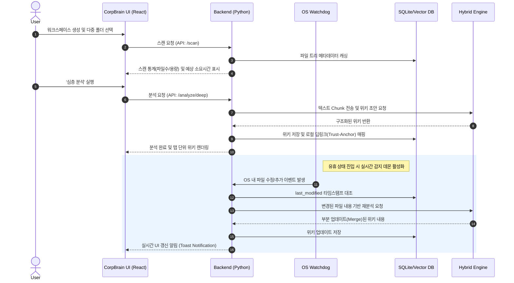
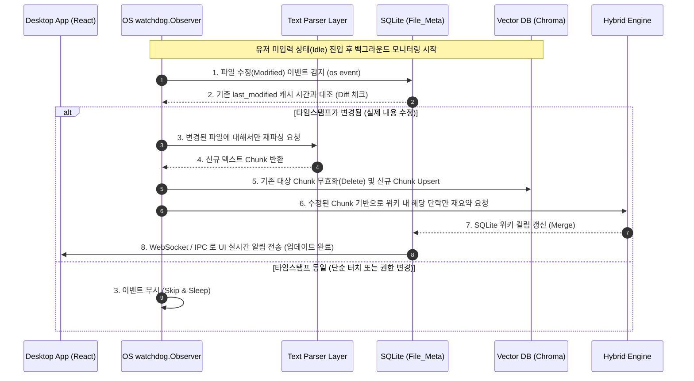

# Software Requirements Specification (SRS)
Document ID: SRS-001
Revision: 1.0
Date: 2026-07-16
Standard: ISO/IEC/IEEE 29148:2018

-------------------------------------------------
## 1. Introduction
### 1.1 Purpose
본 Software Requirements Specification (SRS)의 목적은 10인 미만 중소기업의 로컬 문서 파편화 및 기밀 유출 리스크를 해결하기 위한 'CorpBrain MVP' 데스크톱 애플리케이션의 기술적 요구사항을 완벽히 정의하는 데 있습니다. 본 문서는 PRD v1.0에서 정의된 비즈니스 목표(문서 파악 시간 83.3% 단축, 보안 사고 0%)를 달성하기 위한 구체적인 시스템 동작, 인터페이스, 그리고 제약 사항을 명시하며, 향후 설계, 구현 및 테스트의 원천 기준(Source of Truth)으로 사용됩니다.

### 1.2 Scope
**In-Scope (범위 내):**
- Windows OS 기반의 독립 실행형(Standalone) 데스크톱 애플리케이션(`.exe`) 제공
- 로컬 파일 시스템(`.docx, .pdf, .txt, .md`) 스캔 및 텍스트 파싱 처리
- 로컬 Vector DB(ChromaDB/FAISS) 및 SQLite를 이용한 메타데이터 및 지식 위키 영구 저장
- 환경 설정에 따른 하이브리드 LLM 구동 엔진 (클라우드 API Option A, 로컬 Ollama Option B) 연동
- 파일 추가 및 수정 이벤트의 실시간 감지(Watcher) 및 백그라운드 위키 자동 갱신
- 생성된 위키에서 원문으로 직결되는 파일 시스템 딥링크(Trust-Anchor) 제공
- 다중 폴더 병합 기반 워크스페이스 기능 및 대시보드(통계, 예상 소요 시간 표기)
- 파일명 일괄 개편(Batch Rename) 및 실행 취소(Undo) 지원
- 앱 내장형 생산성 통계(My Analytics) 대시보드 제공

**Out-of-Scope (범위 외):**
- 사내 전사 통합 검색 엔진(Enterprise Search) 시스템 구축
- 중앙 집중형 클라우드 문서 저장소 서비스
- MVP 기준 `.hwp`, `.xlsx`, `.pptx` 등의 복합 구조 문서 지원
- MVP 기준 Mac, Linux 환경 지원
- Google Analytics 등 외부 통계 서버로의 사용 로그 원격 전송

### 1.3 Definitions, Acronyms, Abbreviations
- **AOS (Adjusted Opportunity Score):** 조정된 기회 점수. 시장 내 기회의 크기와 실현 가능성을 평가하는 지표.
- **DOS (Discovered Opportunity Score):** 발굴 기회 점수.
- **JTBD (Jobs to be Done):** 고객이 제품을 구매하거나 사용하는 근본적인 동기(완수할 과업).
- **PII (Personally Identifiable Information):** 개인식별정보. 클라우드 전송 전 필수적으로 마스킹 처리되어야 하는 민감 데이터.
- **Trust-Anchor (신뢰 닻):** AI의 요약본(Wiki)과 로컬 원문(Source)을 직접 연결(딥링크)하여 환각(Hallucination) 리스크를 검증하는 팩트체크 브릿지.
- **Zero-Friction (제로-마찰):** 수동 업로드나 정리 과정 없이, 백그라운드 데몬(Watcher)을 통해 시스템 상태(지식 위키)가 유저 몰래 자동으로 최신화되는 UX 원칙.
- **Watcher:** 운영체제(Windows OS) 레벨의 파일 시스템 이벤트를 감지하여 데이터베이스 변경을 트리거하는 백그라운드 프로세스.

### 1.4 References
- **REF-01:** `10_CorpBrain_PRD_v1.0.md` (Product Requirements Document v1.0)
- **REF-02:** `01_CorpBrain_VPS.md` (Value Proposition Statement)

---

## 2. Stakeholders

| Role (역할) | Responsibility (책임) | Interest (주요 관심사) |
| :--- | :--- | :--- |
| **C1 (실무자)** | 파편화된 프로젝트 산출물을 스캔하여 프로젝트 맥락을 파악하고 위키를 활용. | 수많은 문서를 일일이 열어보지 않고 내용의 핵심을 신속하게 파악하여 낭비되는 시간 최소화. |
| **A1 (보안/검토자)** | 신규 소프트웨어 도입 시 사내 기밀 유출 여부 및 망분리 규정 준수 검토. | 로컬 LLM을 통한 완벽한 폐쇄형 보안 환경 유지 및 외부 서버로의 데이터 전송 원천 차단. |
| **E1 (PM/관리자)** | 여러 요구사항 문서 및 산출물을 하나의 프로젝트 위키로 취합 및 최신성 유지. | 워크스페이스의 문서 변경 시 위키가 자동으로 갱신되어 정보 유실을 방지하고 정확한 팩트체크(딥링크)가 작동하는 것. |

---

## 3. System Context and Interfaces

### 3.1 External Systems
- **OS File System (Windows):** 문서 원본이 저장된 로컬 스토리지 환경이며, 파일 이벤트 감지(`watchdog` 트리거) 및 딥링크(`os.startfile`) 실행을 수행하는 핵심 기반 플랫폼.
- **Ollama Service (로컬 LLM):** Option B 선택 시, 개인 PC의 로컬 자원(CPU/GPU)을 활용하여 추론(Inference)을 오프라인으로 수행하는 외부 바이너리 데몬.
- **Cloud LLM API (OpenAI/Anthropic):** Option A 선택 시, 완벽히 PII 마스킹 처리된 텍스트 청크를 네트워크로 전송받아 빠른 텍스트 추론 및 요약을 반환하는 원격 엔드포인트.

### 3.2 Client Applications
- **CorpBrain Desktop App:** React(UI)와 Python 백엔드가 결합되어 PyInstaller로 패키징된 독립형 실행 파일(`.exe`). 

### 3.3 API Overview
컴포넌트 간 통신을 위해 사용되는 주요 내부 인터페이스는 다음과 같습니다 (상세 명세는 Appendix 6.1 참조).
- **`GET /api/v1/workspace/{id}/scan`**: 지정된 로컬 파일 트리 내의 유효 포맷 문서를 고속 스캔하여 대시보드 통계(예상 시간 등) 반환.
- **`POST /api/v1/analyze/fast`**: 파일명 및 폴더 맥락 기반의 고속 분석 수행 및 중요도 랭킹 생성.
- **`POST /api/v1/analyze/deep`**: 전체 로컬 문서 파싱 후 벡터 기반 심층 위키 생성.
- **`POST /api/v1/llm/inference`**: 하이브리드 엔진 라우터를 거쳐 지정된 LLM(Option A 또는 B)으로 텍스트 추론 요청.

### 3.4 Interaction Sequences

#### 핵심 시퀀스: 다중 폴더 분석 및 백그라운드 위키 실시간 갱신 (Watcher)

---

## 4. Specific Requirements

### 4.1 Functional Requirements

| ID | Feature | Source (PRD/Story) | Priority | Description | Acceptance Criteria (Given/When/Then) |
| :--- | :--- | :--- | :--- | :--- | :--- |
| **REQ-FUNC-001** | Workspace Creation | REF-01 (F1) | Must | 다중 폴더를 병합하여 영구적인 프로젝트 워크스페이스를 생성할 수 있다. | **Given** 사용자가 2개 이상의 로컬 폴더를 선택했을 때, **When** 워크스페이스 생성을 요청하면, **Then** 시스템은 이를 하나의 논리적 워크스페이스로 병합하고 좌측 히스토리 패널에 저장한다. |
| **REQ-FUNC-002** | Dashboard Rendering | REF-01 (F1) | Must | 스캔 직후 분석 전 파일 개수, 총 용량, 분석 예상 시간을 시각화한다. | **Given** 워크스페이스 선택 직후, **When** 파일 트리 스캔이 완료되면, **Then** 스캔된 파일의 총 용량과 개수를 기반으로 산정된 예상 소요 시간(Estimated Time)을 대시보드에 즉시 표기한다. |
| **REQ-FUNC-003** | Scan Validation | REF-01 (F1) | Must | 스캔 시 10,000개 초과 파일 또는 OS 시스템 폴더는 제외해야 정지한다. | **Given** 로컬 파일 트리를 순회하는 도중, **When** 파일 수가 1만 개를 초과하거나 `.git`, `Windows`와 같은 블랙리스트 폴더를 만나면, **Then** 스캔을 일시 정지하거나 해당 폴더를 무시(Skip)한다. |
| **REQ-FUNC-004** | Hybrid LLM Router | REF-01 (F2) | Must | 환경 설정에 따라 Cloud API 또는 로컬 LLM으로 추론 요청을 라우팅한다. | **Given** 사용자가 Option A(클라우드)를 선택했을 때, **When** 텍스트 분석 요청이 발생하면, **Then** 정규식 및 NER 기반으로 PII를 마스킹 처리한 후 외부 API로 전송한다. |
| **REQ-FUNC-005** | Local LLM Onboarding | REF-01 (F2) | Must | Option B 선택 시 Ollama 미설치 환경에서는 원클릭 백그라운드 설치를 지원한다. | **Given** Option B(로컬 LLM) 모드이나 PC에 Ollama가 없을 때, **When** 분석을 시도하면, **Then** 터미널 노출 없이 백그라운드에서 Ollama 설치 및 모델 Pull 작업을 자동으로 수행한다. |
| **REQ-FUNC-006** | Fast Analysis | REF-01 (F3)   CB-STORY-101 | Must | 폴더 맥락과 파일명만을 파싱하여 핵심 문서를 유추하고 중요도를 하이라이트한다. | **Given** 사용자가 '고속 분석'을 선택했을 때, **When** 파일명과 경로 메타데이터의 추출이 완료되면, **Then** 각 파일의 중요도를 점수화하여 주요 문서 목록을 상단에 렌더링한다. |
| **REQ-FUNC-007** | Deep Analysis Wiki | REF-01 (F3) | Must | 문서의 텍스트 전체를 벡터DB에 파싱하고, 1-Depth 폴더별로 분리된 구조적 위키를 생성한다. | **Given** 사용자가 '심층 분석'을 선택했을 때, **When** 파일 내용 전체 파싱 및 청킹이 완료되면, **Then** 맥락 융합 위키를 마크다운으로 생성하되 환각을 막기 위해 1-Depth 폴더 단위로 탭을 분리하여 표시한다. |
| **REQ-FUNC-008** | Batch Rename | REF-01 (F4) | Should | 분석된 맥락을 바탕으로 Naming 템플릿을 추천하고, 승인 시 일괄 변경을 수행한다. | **Given** 일괄 개편을 요청했을 때, **When** AI가 추천한 변경 전/후 Diff를 사용자가 승인(Apply)하면, **Then** OS 명령어로 물리적인 파일명을 일괄 변경한다. |
| **REQ-FUNC-009** | Undo Rename | REF-01 (F4) | Should | Batch Rename 실행 후, 언제든지 원본 상태로 복구할 수 있는 Undo 기능을 제공한다. | **Given** 파일명이 일괄 변경된 상태에서, **When** 사용자가 [실행 취소(Undo)]를 클릭하면, **Then** `Rename_History` DB를 참조하여 변경 직전의 경로와 이름으로 100% 원복한다. |
| **REQ-FUNC-010** | Local Deep-link | REF-01 (F5) | Must | 위키 문장과 로컬 원문 파일을 매핑하는 딥링크(Trust-Anchor)를 생성한다. | **Given** 생성된 위키 문장을 렌더링할 때, **When** 사용자가 특정 문장의 출처 딥링크를 클릭하면, **Then** `os.startfile` 브릿지를 호출하여 OS 기본 프로그램(Word 등)으로 원본 파일을 띄운다. |
| **REQ-FUNC-011** | File Watcher Sync | REF-01 (F6)   CB-STORY-102 | Must | OS 파일 변경을 감지하여 백그라운드에서 위키를 실시간으로 재분석/병합(Merge)한다. | **Given** 감지 옵션이 '실시간'으로 설정된 상태에서, **When** OS 상에서 해당 워크스페이스 내 문서가 추가/수정되면, **Then** 데몬이 변경분을 재분석하여 위키 초안을 자동 업데이트하고 UI에 알림을 띄운다. |
| **REQ-FUNC-012** | Analytics Dashboard | REF-01 (F7) | Must | 사용자가 직관적으로 체감할 수 있는 생산성 통계(절약된 시간 등)를 산출하여 제공한다. | **Given** 사용자가 'My Analytics' 메뉴에 진입할 때, **When** 누적된 메타데이터를 로드하면, **Then** 총 텍스트량에 WPM을 곱한 [절약된 시간]과 [팩트체크 딥링크 클릭 수]를 시각화하여 보여준다. |

### 4.2 Non-Functional Requirements

| ID | Category | Metric / Standard | Description |
| :--- | :--- | :--- | :--- |
| **REQ-NF-001** | **Performance** | Latency (UI) | 로컬 파일 트리 1,000개 스캔 및 대시보드 통계(예상 시간 등) 계산은 5초 이내에 완료되어 UI Freezing 현상을 원천 방지해야 한다 (p95 < 5000ms). |
| **REQ-NF-002** | **Performance** | Resource Usage | 백그라운드 파일 감지 데몬(Watcher)은 PC 유휴 상태(Idle)일 때 CPU 점유율 1% 미만, RAM 100MB 미만을 철저히 유지하여 사용자의 기존 업무 퍼포먼스에 지장을 주지 않아야 한다. |
| **REQ-NF-003** | **Security** | Data Isolation | 애플리케이션 생성된 모든 메타데이터 및 로컬 DB (SQLite, ChromaDB) 파일은 윈도우 OS의 `LocalAppData` 영역에만 격리 보관되며 다른 프로세스의 침범을 최소화한다. |
| **REQ-NF-004** | **Security** | Telemetry Blocking | 폐쇄망 수준의 보안 보장을 위해 외부 클라우드(Google Analytics 등)로 파일 내용이나 시스템 사용 로그를 무단 전송하는 로직은 코드 레벨에서 원천적으로 배제되어야 한다 (보안 사고율 0% 달성). |
| **REQ-NF-005** | **Security** | Privacy/Masking | Option A (Cloud API) 선택 시 작동하는 PII 필터링 모듈은 외부 네트워크 I/O(소켓 연결)가 발생하기 전, 클라이언트 측 메모리 상에서 선제적으로 정규식/NER 치환을 100% 완료해야 한다. |
| **REQ-NF-006** | **Reliability** | Exception Handling | Windows OS의 최대 경로 길이 제한(MAX_PATH, 260자)을 초과하거나 권한이 거부되는 시스템 딥 영역의 파일에 접근 시, 앱이 크래시(Crash)되지 않고 조용히 해당 파일을 스킵(Skip)한 후 로그만 남겨 가용성을 유지해야 한다. |
| **REQ-NF-007** | **Maintainability** | Archiving (Persistence) | 생성된 위키와 파싱 메타데이터는 재부팅 후에도 즉각적으로 로드 및 검색이 가능하도록 SQLite(`Workspace_Meta`, `File_Meta`) 구조에 안전하게 영구 저장(Persistence)되어야 한다. |

---

## 5. Traceability Matrix

본 매트릭스는 비즈니스 요구사항(PRD User Story 및 챕터)이 시스템 기능 요구사항(REQ)으로 분해되고, 최종적으로 테스트 케이스(TC)로 어떻게 검증되는지 양방향 추적성(Bi-directional Traceability)을 보장합니다.

| Source (User Story / PRD) | Requirement ID | Feature Description | Test Case ID |
| :--- | :--- | :--- | :--- |
| REF-01 (F1) | REQ-FUNC-001 | Workspace Creation | TC-WS-001 |
| REF-01 (F1) | REQ-FUNC-002 | Dashboard Rendering | TC-WS-002 |
| REF-01 (F1) | REQ-FUNC-003 | Scan Validation (Limits) | TC-WS-003 |
| REF-01 (F2) | REQ-FUNC-004 | Hybrid LLM Router | TC-LLM-001 |
| REF-01 (F2) | REQ-FUNC-005 | Local LLM Onboarding | TC-LLM-002 |
| CB-STORY-101 | REQ-FUNC-006 | Fast Analysis (Score/Highlight) | TC-ANA-001 |
| REF-01 (F3) | REQ-FUNC-007 | Deep Analysis Wiki (Chunking) | TC-ANA-002 |
| REF-01 (F4) | REQ-FUNC-008 | Batch Rename (Diff Apply) | TC-RN-001 |
| REF-01 (F4) | REQ-FUNC-009 | Undo Rename (Rollback) | TC-RN-002 |
| REF-01 (F5) | REQ-FUNC-010 | Local Deep-link (Trust-Anchor) | TC-UX-001 |
| CB-STORY-102 | REQ-FUNC-011 | File Watcher Sync (Auto Merge) | TC-SYNC-001 |
| REF-01 (F7) | REQ-FUNC-012 | My Analytics Dashboard | TC-UX-002 |
| PRD 6.2 (성능 제한) | REQ-NF-001 | UI Latency < 5s | TC-PERF-001 |
| PRD 6.2 (자원 제한) | REQ-NF-002 | CPU < 1%, RAM < 100MB | TC-PERF-002 |
| PRD 6.1 (보안 격리) | REQ-NF-003 | LocalAppData Isolation | TC-SEC-001 |
| PRD 6.1 (데이터 무단전송 금지) | REQ-NF-004 | Telemetry Blocking | TC-SEC-002 |
| PRD 6.1 (PII 처리) | REQ-NF-005 | Privacy/Masking before I/O | TC-SEC-003 |
| PRD 6.3 (신뢰성) | REQ-NF-006 | Exception Handling (MAX_PATH) | TC-REL-001 |
| PRD 6.3 (유지보수성) | REQ-NF-007 | Archiving (Persistence DB) | TC-REL-002 |

---

## 6. Appendix

### 6.1 API Endpoint List
내부 UI 컴포넌트(React)와 백엔드 코어(Python) 간의 통신을 위한 로컬 RESTful API 명세입니다.

| Method | Endpoint | Description | Request Payload | Response Body |
| :--- | :--- | :--- | :--- | :--- |
| `GET` | `/api/v1/workspace/{id}/scan` | 선택된 워크스페이스 내 파일 스캔 수행 | - | `{ total_files: int, total_mb: float, est_time_sec: int }` |
| `POST` | `/api/v1/analyze/fast` | 파일명/경로 구조 기반 고속 스캔 및 점수화 | `{ workspace_id: str }` | `{ summary: str, top_files: array }` |
| `POST` | `/api/v1/analyze/deep` | 전체 텍스트 파싱, DB 임베딩 및 위키 초안 생성 | `{ workspace_id: str }` | `{ markdown_wiki: str, chunk_mappings: dict }` |
| `POST` | `/api/v1/llm/inference` | 하이브리드 엔진 라우터를 통한 LLM 추론 요청 | `{ mode: 'A'|'B', prompt: str }` | `{ result: str, tokens_used: int }` |
| `POST` | `/api/v1/rename/apply` | AI 추천 이름 적용(Batch Rename) 승인 | `{ diff_list: array }` | `{ status: 'success', history_id: str }` |
| `POST` | `/api/v1/rename/undo` | 실행 취소(Undo Rename) 및 원복 | `{ history_id: str }` | `{ status: 'success', restored: int }` |

### 6.2 Entity & Data Model
로컬 환경의 상태 관리 및 영구 저장을 위해 SQLite(`corpbrain_meta.db`)에 생성될 스키마 정의입니다.

| Entity | Field Name | Data Type | Description | Constraints / Notes |
| :--- | :--- | :--- | :--- | :--- |
| **Workspace_Meta** | `workspace_id` | PK (UUID) | 워크스페이스 고유 식별자 | Auto Generated |
| | `name` | String | 유저가 지정한 프로젝트 이름 | |
| | `root_paths` | JSON | 병합된 대상 폴더들의 절대 경로 배열 | List of absolute paths |
| | `last_synced_at` | DateTime | 마지막으로 위키가 갱신된(Sync) 시점 | |
| **File_Meta** | `file_id` | PK (UUID) | 개별 파일 식별자 | |
| | `workspace_id` | FK (UUID) | 해당 파일이 소속된 워크스페이스 | `Workspace_Meta` 참조 |
| | `original_path` | String | OS상의 물리적 절대 경로 | |
| | `last_modified` | Float | OS 파일 수정 타임스탬프 | Watcher 데몬 캐싱 및 비교용 |
| | `vector_ids` | JSON | ChromaDB 내 대응되는 Chunk ID들 | |
| **Rename_History**| `history_id` | PK (UUID) | 이름 변경 작업 세션 ID | |
| | `workspace_id` | FK (UUID) | 소속 워크스페이스 | `Workspace_Meta` 참조 |
| | `old_paths` | JSON | 변경 이전의 원본 경로 목록 | 실행 취소(Undo) 시 원복 타겟 |
| | `new_paths` | JSON | 변경 이후의 현재 경로 목록 | |

### 6.3 Detailed Interaction Models
백그라운드 Watcher 데몬(실시간 동기화)의 핵심 동작 메커니즘을 구체화한 상세 시퀀스 다이어그램입니다.

