# Software Requirements Specification (SRS)
Document ID: SRS-001  
Revision: 1.0  
Date: 2026-07-16  
Standard: ISO/IEC/IEEE 29148:2018

-------------------------------------------------

## 1. Introduction

### 1.1 Purpose

본 Software Requirements Specification(SRS)은 10인 미만 중소기업이 겪고 있는 **로컬 문서 파편화**(C1: 1일 60~120분 낭비) 및 **기밀 유출 불안**(A1: SaaS 솔루션 검열 미통과) 문제를 해결하기 위한 **CorpBrain MVP** 데스크톱 애플리케이션의 기술적 요구사항을 완전하게 정의한다.

본 문서는 PRD v1.0(REF-01)에서 정의된 비즈니스 목표—**문서 파악 소요 시간 60분 → 10분 이내(83.3% 단축)** 및 **보안 사고율 0%**—를 달성하기 위한 구체적 시스템 동작, 인터페이스, 데이터 모델, 그리고 제약 사항을 명시하며, 향후 설계·구현·테스트·인수(Acceptance)의 **원천 기준(Source of Truth)**으로 사용된다.

### 1.2 Scope

**In-Scope (범위 내):**

| # | 항목 | 설명 |
|---|------|------|
| S-01 | Windows 독립형 데스크톱 앱 | PyInstaller 패키징 단일 `.exe` 제공 |
| S-02 | 로컬 파일 파싱 | `.docx`, `.pdf`, `.txt`, `.md` 포맷 지원 |
| S-03 | 로컬 DB 영구 저장 | SQLite(메타데이터) + ChromaDB/FAISS(벡터) |
| S-04 | 하이브리드 LLM 엔진 | Option A(클라우드 API, PII 마스킹) / Option B(로컬 Ollama) |
| S-05 | 실시간 Watcher | OS 파일 변경 감지 및 백그라운드 위키 자동 갱신 |
| S-06 | Trust-Anchor 딥링크 | 위키 문장 → 로컬 원문 파일 직결 |
| S-07 | 워크스페이스 & 대시보드 | 다중 폴더 병합, 파일 통계, 예상 소요 시간 표시 |
| S-08 | 일괄 Rename & Undo | AI 추천 네이밍 일괄 적용 및 100% 원복 |
| S-09 | 앱 내장 생산성 통계 | My Analytics 대시보드 (절약 시간, 팩트체크율 등) |

**Out-of-Scope (범위 외):**

| # | 항목 | 근거 |
|---|------|------|
| X-01 | 전사 통합 검색 엔진(Enterprise Search) | PRD §3.3 Anti-Goals |
| X-02 | 중앙집중형 클라우드 문서 저장소 | PRD §3.3 Anti-Goals |
| X-03 | `.hwp`, `.xlsx`, `.pptx` 복합 문서 지원 | MVP 기준 제외 |
| X-04 | macOS / Linux 환경 | MVP는 Windows OS 한정 |
| X-05 | GA 등 외부 원격 통계 전송 | PRD §7 폐쇄망 원칙 |

### 1.3 Definitions, Acronyms, Abbreviations

| 용어 | 정의 |
|------|------|
| **AOS (Adjusted Opportunity Score)** | 시장 내 기회의 크기와 실현 가능성을 조정하여 산출한 기회 점수 |
| **ChromaDB** | 로컬 환경에서 작동하는 오픈소스 벡터 임베딩 데이터베이스 |
| **Deep-link (딥링크)** | 위키 문장과 원문 파일 간의 직결 하이퍼링크(`os.startfile` 기반) |
| **DOS (Discovered Opportunity Score)** | 사용자 리서치를 통해 발굴된 기회의 우선순위 점수 |
| **FAISS** | Facebook AI Similarity Search. 벡터 유사도 검색 라이브러리 |
| **JTBD (Jobs to be Done)** | 고객이 제품을 사용하는 근본적 동기(완수할 과업) |
| **NER (Named Entity Recognition)** | 텍스트에서 고유명사(인명, 지명 등)를 자동 식별하는 AI 기술 |
| **Ollama** | 로컬 환경에서 LLM을 구동하기 위한 오픈소스 런타임 |
| **PII (Personally Identifiable Information)** | 개인식별정보. 클라우드 전송 전 마스킹 필수 |
| **Trust-Anchor (신뢰 닻)** | AI 요약본(Wiki)과 로컬 원문(Source)을 딥링크로 연결하여 환각(Hallucination)을 검증하는 팩트체크 메커니즘 |
| **Validator** | PRD 내 사용자 스토리의 검증 담당 역할(페르소나) |
| **Watcher** | OS 파일 시스템 이벤트를 감지하여 DB 변경을 트리거하는 백그라운드 데몬(Python `watchdog` 기반) |
| **WPM (Words Per Minute)** | 분당 처리 단어 수. 인간 평균 독해 속도 산출 기준 |
| **Zero-Friction (제로-마찰)** | 수동 업로드 없이 백그라운드 Watcher를 통해 지식 위키가 자동 최신화되는 UX 원칙 |

### 1.4 References

| ID | 문서명 | 비고 |
|----|--------|------|
| **REF-01** | `10_CorpBrain_PRD_v1.0.md` | Product Requirements Document v1.0 |
| **REF-02** | `01_CorpBrain_VPS.md` | Value Proposition Statement (제품 비전 선언문) |
| **REF-03** | ISO/IEC/IEEE 29148:2018 | Systems and software engineering — Life cycle processes — Requirements engineering |

### 1.5 Constraints and Assumptions

#### 1.5.1 Constraints (제약사항)

| ID | 유형 | 내용 |
|----|------|------|
| CON-01 | Platform | MVP는 **Windows OS**(10/11) 환경으로 제한한다. |
| CON-02 | Architecture | SaaS가 아닌 **완전 로컬 구동형** 단일 `.exe` 형태로 배포한다 (PyInstaller 패키징). |
| CON-03 | Security | 애플리케이션 코드에 외부 클라우드로 파일 내용을 은밀히 전송하는 Telemetry 로직을 **원천 배제**해야 한다. |
| CON-04 | File System | Windows MAX_PATH(260자) 제한 및 시스템 폴더 접근 권한 제약을 방어적으로 처리해야 한다. |
| CON-05 | Resource | 로컬 LLM(Ollama) 구동 시 사용자 PC의 CPU/GPU 자원을 점유하므로 유휴 시 리소스 영향을 최소화해야 한다. |
| CON-06 | Data Format | MVP에서 지원하는 파일 포맷은 `.docx`, `.pdf`, `.txt`, `.md`로 한정한다. |

#### 1.5.2 Assumptions (가정)

| ID | 내용 |ㄹ
|----|------|
| ASM-01 | 주 타겟 사용자(10인 미만 중소기업)의 업무용 기기는 Windows OS이다. |
| ASM-02 | 로컬 LLM 구동 시 일정 수준의 CPU/GPU 자원 점유가 발생함을 사용자가 인지하고 동의한다. |
| ASM-03 | 사용자는 분석 대상 문서가 저장된 로컬 폴더에 대한 읽기/쓰기 권한을 보유하고 있다. |
| ASM-04 | Option A(클라우드 API) 사용 시 사용자는 유효한 API 키를 직접 입력하며, 해당 비용은 사용자 부담이다. |
| ASM-05 | 인간의 평균 독해 속도(WPM)는 약 200~250 WPM을 기준으로 절약 시간을 산출한다. |

#### 1.5.3 Risks (리스크)

| ID | 리스크 | 완화 전략 |
|----|--------|-----------|
| RSK-01 | 로컬 LLM 추론 품질이 클라우드 대비 낮을 수 있음 | 하이브리드 엔진으로 사용자가 Option A/B를 자유롭게 전환 가능하도록 설계 |
| RSK-02 | 대용량 문서(수천 개) 처리 시 PC 리소스 과부하 | 10,000개 파일 상한 및 일시 정지 방어 로직 적용 |
| RSK-03 | PII 마스킹 정규식/NER 모델의 미탐(False Negative) | 마스킹 실패 시 전송 차단 Fail-Safe 설계, 추후 마스킹 모델 개선 |

---

## 2. Stakeholders

| Role (역할) | Responsibility (책임) | Interest (주요 관심사) |
|:---|:---|:---|
| **C1 (실무자 — 기획자/개발자)** | 파편화된 프로젝트 산출물을 스캔하여 프로젝트 맥락을 파악하고, 생성된 위키를 업무에 활용한다. | 수많은 문서를 일일이 열어보지 않고 핵심 내용을 **10분 이내**에 파악하여 1일 60~120분의 낭비 시간을 제거한다. |
| **A1 (보안/검토자)** | 신규 소프트웨어 도입 시 사내 기밀 유출 여부 및 망분리 규정 준수를 검토한다. | 로컬 LLM을 통한 **폐쇄형 보안 환경** 유지 및 외부 서버로의 데이터 전송 **원천 차단** 확인. |
| **E1 (PM/관리자)** | 여러 요구사항 문서 및 산출물을 하나의 프로젝트 위키로 취합하고 최신성을 유지한다. | 워크스페이스 내 문서 변경 시 위키가 **자동 갱신**되어 정보 유실 방지 및 **딥링크 팩트체크** 정상 동작. |
| **개발팀** | 본 SRS에 기반하여 시스템을 설계·구현·테스트한다. | 모호하지 않은 기능/비기능 요구사항, 테스트 가능한 AC, 명확한 데이터 모델 및 API 명세. |
| **QA 팀** | Traceability Matrix 및 AC를 기반으로 테스트 케이스를 설계·실행한다. | 각 요구사항 ID에 대응하는 TC ID, 측정 가능한 성능 기준, 재현 가능한 시나리오. |

---

## 3. System Context and Interfaces

### 3.1 External Systems

| 시스템 | 유형 | 설명 |
|--------|------|------|
| **OS File System (Windows)** | 로컬 | 문서 원본이 저장된 로컬 스토리지. 파일 이벤트 감지(`watchdog`) 및 딥링크(`os.startfile`) 실행의 기반 플랫폼. |
| **Ollama Service** | 로컬 데몬 | Option B 선택 시 개인 PC의 로컬 CPU/GPU 자원을 활용하여 오프라인 추론(Inference)을 수행하는 외부 바이너리 프로세스. |
| **Cloud LLM API (OpenAI/Anthropic)** | 원격 | Option A 선택 시 PII 마스킹 완료된 텍스트를 전송받아 추론·요약 결과를 반환하는 외부 REST 엔드포인트. |

### 3.2 Client Applications

| 구성요소 | 기술 스택 | 설명 |
|----------|-----------|------|
| **CorpBrain Desktop App** | React(UI) + Python(Core) | PyInstaller로 패키징된 독립형 실행 파일(`.exe`). React 기반 UI와 Python 백엔드가 IPC(Inter-Process Communication)로 결합. |

### 3.3 API Overview

내부 UI 컴포넌트(React)와 백엔드 코어(Python) 간 통신을 위한 주요 로컬 API는 다음과 같다. 상세 명세는 **Appendix 6.1** 참조.

| Method | Endpoint | 설명 | 관련 기능 |
|--------|----------|------|-----------|
| `POST` | `/api/v1/workspace` | 워크스페이스 생성 (다중 폴더 병합) | F1 |
| `GET` | `/api/v1/workspace/{id}` | 워크스페이스 상세 조회 | F1 |
| `DELETE` | `/api/v1/workspace/{id}` | 워크스페이스 삭제 | F1 |
| `GET` | `/api/v1/workspace/{id}/scan` | 파일 트리 스캔 및 대시보드 통계 반환 | F1 |
| `POST` | `/api/v1/analyze/fast` | 파일명/경로 기반 고속 분석 | F3 |
| `POST` | `/api/v1/analyze/deep` | 전체 텍스트 파싱 및 위키 생성 | F3 |
| `POST` | `/api/v1/llm/inference` | 하이브리드 LLM 라우터 추론 요청 | F2 |
| `POST` | `/api/v1/llm/onboard` | Ollama 원클릭 설치 및 모델 다운로드 | F2 |
| `POST` | `/api/v1/rename/apply` | AI 추천 Batch Rename 적용 | F4 |
| `POST` | `/api/v1/rename/undo` | Rename 실행 취소 (원복) | F4 |
| `GET` | `/api/v1/workspace` | 전체 워크스페이스 목록 조회 | F1 |
| `GET` | `/api/v1/analyze/{task_id}/progress` | 분석 진행 상태 조회 | F3 |
| `GET` | `/api/v1/llm/health` | LLM 엔진 연결 상태 확인 | F2 |
| `GET` | `/api/v1/analytics/summary` | My Analytics 생산성 통계 조회 | F7 |
| `PUT` | `/api/v1/watcher/config` | Watcher 동작 모드 설정 변경 | F6 |
| `GET` | `/api/v1/watcher/status` | Watcher 현재 상태 조회 | F6 |

### 3.4 Interaction Sequences

#### 3.4.1 핵심 시퀀스: 워크스페이스 생성 → 심층 분석 → 위키 생성

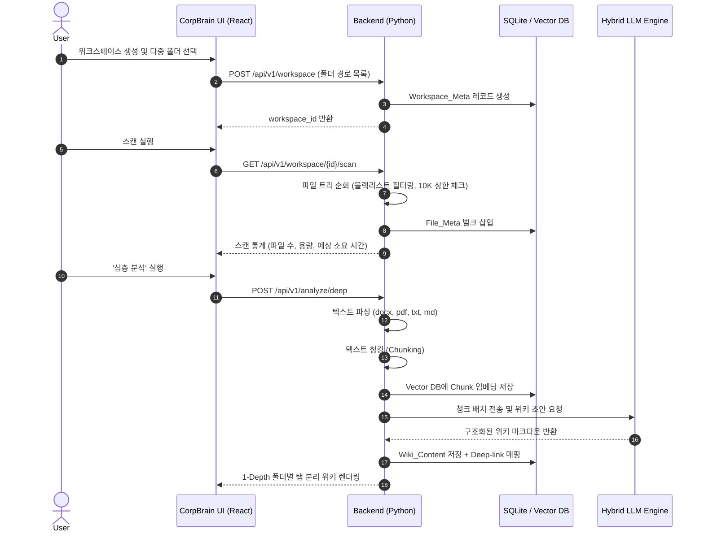

#### 3.4.2 핵심 시퀀스: 백그라운드 Watcher 실시간 위키 갱신

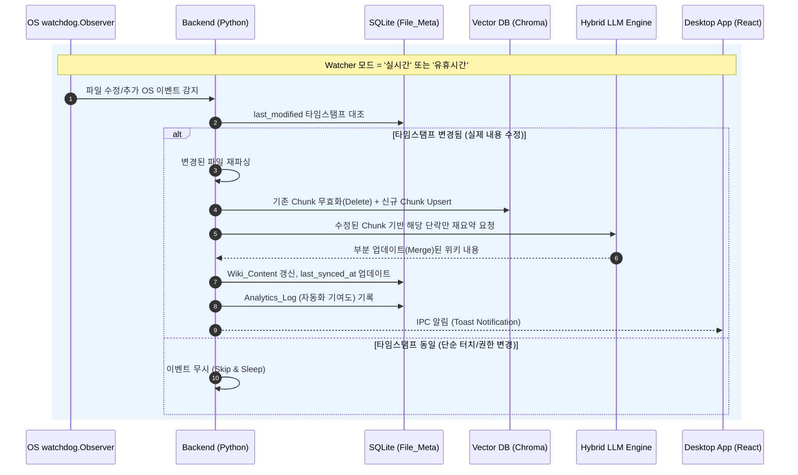

#### 3.4.3 핵심 시퀀스: 고속 분석 및 문서 중요도 랭킹

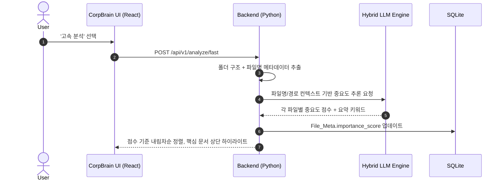

### 3.5 Use Case Diagram

시스템 경계 내 주요 기능(Use Case)과 3개 액터(C1/A1/E1)의 상호작용을 조감한다.

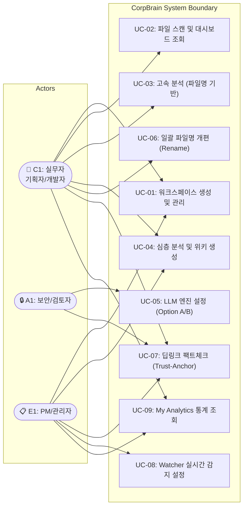

| UC ID | Use Case | 주요 액터 | 관련 기능 | 관련 REQ-FUNC |
|-------|----------|----------|-----------|---------------|
| UC-01 | 워크스페이스 생성 및 관리 | C1, E1 | F1 | 001~002 |
| UC-02 | 파일 스캔 및 대시보드 조회 | C1 | F1 | 003~006 |
| UC-03 | 고속 분석 (파일명 기반) | C1 | F3 | 012 |
| UC-04 | 심층 분석 및 위키 생성 | C1, E1 | F3 | 013~015 |
| UC-05 | LLM 엔진 설정 (Option A/B) | A1 | F2 | 007~011 |
| UC-06 | 일괄 파일명 개편 (Rename) | C1 | F4 | 016~019 |
| UC-07 | 딥링크 팩트체크 (Trust-Anchor) | C1, A1, E1 | F5 | 020~022 |
| UC-08 | Watcher 실시간 감지 설정 | E1 | F6 | 023~026 |
| UC-09 | My Analytics 통계 조회 | C1, E1 | F7 | 027~030 |

### 3.6 Component Diagram

CorpBrain 시스템의 계층 구조와 컴포넌트 간 의존 관계를 명시한다.

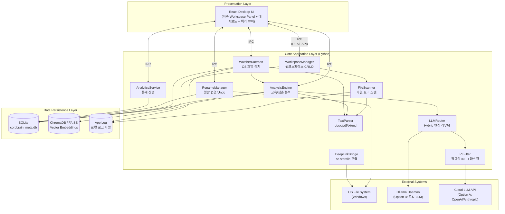

---

## 4. Specific Requirements

### 4.1 Functional Requirements

#### 4.1.1 F1: 워크스페이스 기반 파서 및 대시보드

| ID | Feature | Source (PRD) | Priority | Description | Acceptance Criteria (Given/When/Then) |
|:---|:---|:---|:---|:---|:---|
| **REQ-FUNC-001** | Workspace Creation | REF-01 §5 F1 | Must | 사용자가 2개 이상의 로컬 폴더를 선택하여 하나의 논리적 프로젝트 워크스페이스로 병합·생성할 수 있다. | **Given** 사용자가 2개 이상의 로컬 폴더를 선택했을 때, **When** 워크스페이스 생성을 요청하면, **Then** 시스템은 `Workspace_Meta` 레코드를 생성하고 좌측 히스토리 패널에 해당 워크스페이스를 영구 표시한다. |
| **REQ-FUNC-002** | Workspace Persistence | REF-01 §5 F1 | Must | 생성된 워크스페이스는 애플리케이션 재시작 후에도 히스토리 패널에서 즉시 접근 가능해야 한다. | **Given** 워크스페이스가 1개 이상 생성된 상태에서, **When** 앱을 종료 후 재실행하면, **Then** 이전에 생성된 모든 워크스페이스가 히스토리 패널에 동일한 순서로 표시된다. |
| **REQ-FUNC-003** | Dashboard Scan Stats | REF-01 §5 F1 | Must | 파일 트리 스캔 직후 파일 개수, 총 용량, 분석 예상 소요 시간을 오버뷰 대시보드에 시각화한다. | **Given** 워크스페이스 선택 직후, **When** 파일 트리 스캔이 완료되면, **Then** 스캔된 파일의 총 개수, 총 용량(MB), 분석 예상 소요 시간(초)을 대시보드에 즉시 표기한다. |
| **REQ-FUNC-004** | Scan File Limit Guard | REF-01 §5 F1 | Must | 파일 트리 스캔 시 10,000개 파일 도달 시 일시 정지하고 사용자에게 확인을 요청한다. | **Given** 로컬 파일 트리를 순회하는 도중, **When** 유효 파일 수가 10,000개에 도달하면, **Then** 스캔을 일시 정지하고 사용자에게 계속 진행 여부를 확인하는 다이얼로그를 표시한다. |
| **REQ-FUNC-005** | Blacklist Folder Filter | REF-01 §5 F1 | Must | `.git`, `Windows`, `node_modules` 등 블랙리스트 폴더 및 미지원 포맷 파일을 스캔에서 자동 제외한다. | **Given** 파일 트리 순회 중, **When** 사전 정의된 블랙리스트 폴더명 또는 미지원 확장자(`S-02` 외)를 만나면, **Then** 해당 경로를 Skip하고 로그에 기록한 뒤 다음 항목으로 진행한다. |
| **REQ-FUNC-006** | Supported Format Parsing | REF-01 §5 F1 | Must | `.docx`, `.pdf`, `.txt`, `.md` 4개 포맷의 텍스트를 정상적으로 추출한다. | **Given** 워크스페이스 내에 4개 지원 포맷 파일이 각 1개 이상 존재할 때, **When** 텍스트 파싱을 실행하면, **Then** 각 포맷에서 본문 텍스트가 정상 추출되어 빈 문자열이 아닌 결과를 반환한다. |

#### 4.1.2 F2: 하이브리드 LLM 구동 엔진

| ID | Feature | Source (PRD) | Priority | Description | Acceptance Criteria (Given/When/Then) |
|:---|:---|:---|:---|:---|:---|
| **REQ-FUNC-007** | Hybrid LLM Router | REF-01 §5 F2 | Must | 환경 설정(Option A/B)에 따라 Cloud API 또는 로컬 Ollama로 추론 요청을 라우팅한다. | **Given** 사용자가 설정에서 Option A 또는 B를 선택했을 때, **When** 텍스트 분석 요청이 발생하면, **Then** 선택된 엔진으로 추론 요청을 전달하고 결과를 동일한 인터페이스로 반환한다. |
| **REQ-FUNC-008** | PII Masking (Option A) | REF-01 §5 F2, §6.1 | Must | Option A(클라우드) 선택 시 네트워크 I/O 발생 전 메모리 상에서 PII를 정규식/NER 기반으로 마스킹 처리한다. | **Given** Option A 모드에서 텍스트 전송 직전, **When** PII 필터링 모듈이 실행되면, **Then** 소켓 연결 이전에 메모리 상에서 이메일, 전화번호, 주민등록번호 등 PII 패턴이 `[MASKED]`로 치환되고, 원문은 로컬에만 보존된다. |
| **REQ-FUNC-009** | PII Masking Fail-Safe | REF-01 §6.1 | Must | PII 마스킹 처리 중 오류 발생 시 해당 텍스트의 외부 전송을 차단한다. | **Given** PII 필터링 처리 중 예외가 발생했을 때, **When** 마스킹 결과의 무결성을 검증하면, **Then** 해당 텍스트 청크의 외부 전송을 차단하고 오류 로그를 기록하며 사용자에게 알림을 표시한다. |
| **REQ-FUNC-010** | Local LLM Onboarding | REF-01 §5 F2 | Must | Option B 선택 시 Ollama 미설치 환경에서 원클릭 백그라운드 설치 및 모델 다운로드를 지원한다. | **Given** Option B 모드이나 PC에 Ollama가 미설치 상태일 때, **When** 사용자가 분석을 시도하면, **Then** 터미널 노출 없이 백그라운드에서 Ollama 설치 및 지정 모델 Pull을 자동 수행하고, 진행률(%)을 UI에 표시한다. |
| **REQ-FUNC-011** | LLM Health Check | REF-01 §5 F2 | Should | 선택된 LLM 엔진(Option A/B)의 연결 상태를 확인하여 사용 가능 여부를 표시한다. | **Given** 설정 화면 또는 분석 시작 직전, **When** LLM Health Check를 수행하면, **Then** Option A는 API 키 유효성 및 네트워크 도달성을, Option B는 Ollama 데몬 응답을 검증하여 상태 아이콘(✅/❌)을 표시한다. |

#### 4.1.3 F3: 다단계 시맨틱 분석 파이프라인

| ID | Feature | Source (PRD) | Priority | Description | Acceptance Criteria (Given/When/Then) |
|:---|:---|:---|:---|:---|:---|
| **REQ-FUNC-012** | Fast Analysis | REF-01 §5 F3 | Must | 폴더 구조 맥락과 파일명만을 파싱하여 핵심 문서를 유추하고 중요도를 점수화하여 하이라이트한다. | **Given** 사용자가 '고속 분석'을 선택했을 때, **When** 파일명과 경로 메타데이터 추출이 완료되면, **Then** 각 파일의 중요도를 0~100 점수로 산정하여 상위 문서를 UI 상단에 하이라이트 표시한다. |
| **REQ-FUNC-013** | Deep Analysis Wiki | REF-01 §5 F3 | Must | 문서 전체 텍스트를 파싱·청킹하여 벡터 DB에 저장하고, 1-Depth 폴더별로 분리된 구조적 위키를 마크다운으로 생성한다. | **Given** 사용자가 '심층 분석'을 선택했을 때, **When** 전체 파일 파싱 및 청킹이 완료되면, **Then** 벡터 DB에 임베딩을 저장하고 1-Depth 폴더 단위로 탭을 분리한 마크다운 위키를 생성하여 UI에 렌더링한다. |
| **REQ-FUNC-014** | Folder-Tab Separation | REF-01 §5 F3 | Must | 심층 분석 위키는 1-Depth 폴더별 탭으로 분리하여 맥락 혼선(Hallucination)을 방지한다. | **Given** 위키 생성이 완료된 상태에서, **When** 위키를 렌더링하면, **Then** 워크스페이스 하위 1-Depth 폴더 각각이 독립 탭으로 분리되어 표시되고, 탭 간 내용이 혼합되지 않는다. |
| **REQ-FUNC-015** | Analysis Progress Indicator | REF-01 §5 F3 | Should | 고속/심층 분석 진행 중 처리된 파일 수 / 전체 파일 수 비율을 프로그레스 바로 표시한다. | **Given** 분석이 시작된 상태에서, **When** 파일 처리가 진행되면, **Then** `처리 완료 N / 전체 M` 형태의 프로그레스 바와 잔여 예상 시간을 UI에 실시간으로 업데이트한다. |

#### 4.1.4 F4: 일괄 폴더/파일명 개편

| ID | Feature | Source (PRD) | Priority | Description | Acceptance Criteria (Given/When/Then) |
|:---|:---|:---|:---|:---|:---|
| **REQ-FUNC-016** | Naming Template Recommendation | REF-01 §5 F4 | Should | 분석된 파일 맥락을 기반으로 AI가 Naming 템플릿(규칙)을 추천한다. | **Given** 워크스페이스 분석이 완료된 상태에서, **When** 사용자가 '일괄 개편'을 요청하면, **Then** AI가 파일 내용과 폴더 구조를 고려한 Naming 템플릿을 1개 이상 추천한다. |
| **REQ-FUNC-017** | Rename Diff Preview | REF-01 §5 F4 | Should | 변경 전/후 파일명을 Diff 형태로 미리보기 표시하여 사용자 승인을 받는다. | **Given** AI가 Naming 추천을 완료했을 때, **When** Diff 미리보기를 렌더링하면, **Then** 각 파일의 기존 이름(빨강)과 신규 이름(초록)을 나란히 표시하고 개별/전체 승인 버튼을 제공한다. |
| **REQ-FUNC-018** | Batch Rename Execute | REF-01 §5 F4 | Should | 사용자 승인(Apply) 후 OS 명령어로 물리적 파일명을 일괄 변경한다. | **Given** 사용자가 Diff를 승인(Apply)했을 때, **When** 일괄 변경을 실행하면, **Then** OS 레벨에서 물리적 파일명이 변경되고, 변경 이전 경로와 이후 경로가 `Rename_History` DB에 기록된다. |
| **REQ-FUNC-019** | Undo Rename | REF-01 §5 F4 | Should | Batch Rename 실행 후 언제든 원본 상태로 100% 원복하는 Undo 기능을 제공한다. | **Given** 파일명이 일괄 변경된 상태에서, **When** 사용자가 [실행 취소(Undo)]를 클릭하면, **Then** `Rename_History` DB를 참조하여 변경 직전의 경로와 이름으로 100% 원복하고, 실패한 파일이 있으면 목록을 표시한다. |

#### 4.1.5 F5: 로컬 딥링크 기반 Trust-Anchor

| ID | Feature | Source (PRD) | Priority | Description | Acceptance Criteria (Given/When/Then) |
|:---|:---|:---|:---|:---|:---|
| **REQ-FUNC-020** | Deep-link Generation | REF-01 §5 F5 | Must | 생성된 위키의 각 문장(또는 단락)에 해당 로컬 원문 파일로의 딥링크(Trust-Anchor)를 자동 매핑한다. | **Given** 심층 분석 위키가 생성 완료된 상태에서, **When** 위키 내용을 렌더링하면, **Then** 각 요약 문장 옆에 출처 파일 경로를 포함한 딥링크 아이콘이 표시된다. |
| **REQ-FUNC-021** | Deep-link Navigation | REF-01 §5 F5 | Must | 딥링크 클릭 시 `os.startfile` 브릿지를 호출하여 OS 기본 프로그램으로 원본 파일을 연다. | **Given** 위키에서 딥링크를 렌더링한 상태에서, **When** 사용자가 특정 문장의 딥링크 아이콘을 클릭하면, **Then** `os.startfile`을 호출하여 해당 로컬 파일이 OS 기본 연결 프로그램(Word, Adobe Reader 등)으로 열린다. |
| **REQ-FUNC-022** | Broken Link Detection | REF-01 §5 F5 | Should | 원문 파일이 이동/삭제되어 딥링크가 깨진 경우 시각적으로 표시한다. | **Given** 위키에 딥링크가 매핑된 상태에서, **When** 대상 파일이 OS 상에서 이동 또는 삭제되면, **Then** 해당 딥링크를 비활성화(회색 처리)하고 "원본 파일을 찾을 수 없습니다" 툴팁을 표시한다. |

#### 4.1.6 F6: 실시간 감지 및 백그라운드 위키 갱신 (Watcher)

| ID | Feature | Source (PRD) | Priority | Description | Acceptance Criteria (Given/When/Then) |
|:---|:---|:---|:---|:---|:---|
| **REQ-FUNC-023** | Watcher Mode Config | REF-01 §5 F6 | Must | 파일 감지 동작 모드를 [수동 / 실시간 / 유휴시간 / 끄기] 중 선택할 수 있다. | **Given** 설정 화면에서 Watcher 모드를 변경할 때, **When** 사용자가 4개 옵션 중 하나를 선택하면, **Then** 선택된 모드가 `Watcher_Config` DB에 저장되고 즉시 적용된다. |
| **REQ-FUNC-024** | Real-time File Detection | REF-01 §5 F6 | Must | '실시간' 모드에서 워크스페이스 내 `.docx`, `.pdf`, `.txt`, `.md` 파일의 추가/수정을 OS 이벤트로 감지한다. | **Given** Watcher가 '실시간' 모드로 활성화된 상태에서, **When** 워크스페이스 내 지원 포맷 파일이 추가 또는 수정되면, **Then** 1초 이내에 해당 이벤트를 감지하여 처리 큐에 적재한다. |
| **REQ-FUNC-025** | Background Wiki Update | REF-01 §5 F6 | Must | 감지된 변경분을 백그라운드에서 재분석하여 위키를 자동 업데이트(Merge)하고 UI에 알림을 보낸다. | **Given** Watcher가 파일 변경 이벤트를 감지한 상태에서, **When** 변경된 파일의 `last_modified` 타임스탬프가 DB 캐시와 상이하면, **Then** 해당 파일만 재파싱·재요약하여 위키를 부분 갱신하고 Toast 알림을 표시한다. |
| **REQ-FUNC-026** | Idle-mode Watcher | REF-01 §5 F6 | Should | '유휴시간' 모드에서는 사용자 미입력 상태(Idle) 진입 후에만 백그라운드 분석을 시작한다. | **Given** Watcher가 '유휴시간' 모드인 상태에서, **When** 사용자 키보드/마우스 입력이 일정 시간(기본 5분) 이상 없으면, **Then** 누적된 변경 이벤트를 일괄 처리하고 유저 입력 재개 시 처리를 일시 중단한다. |

#### 4.1.7 Telemetry & My Analytics (생산성 통계)

| ID | Feature | Source (PRD) | Priority | Description | Acceptance Criteria (Given/When/Then) |
|:---|:---|:---|:---|:---|:---|
| **REQ-FUNC-027** | Time Saved Metric | REF-01 §7 | Must | AI가 처리한 총 텍스트량(토큰 수)을 인간 평균 독해 속도(WPM)와 비교하여 "절약된 시간"을 산출한다. | **Given** 분석이 1회 이상 완료된 상태에서, **When** My Analytics 화면에 진입하면, **Then** `처리된 총 토큰 수 ÷ (250 WPM × 평균 토큰/단어 비율)`로 산출한 절약 시간을 "이번 주 N시간 절약" 형태로 표시한다. |
| **REQ-FUNC-028** | Fact-Check Rate Metric | REF-01 §7 | Must | 생성된 위키 내 딥링크를 클릭하여 원문을 확인한 누적 횟수를 추적·표시한다. | **Given** 딥링크가 1회 이상 클릭된 상태에서, **When** My Analytics 화면에 진입하면, **Then** "이번 달 N번의 팩트체크로 환각을 방어했습니다" 형태의 수치를 표시한다. |
| **REQ-FUNC-029** | Knowledge Size Metric | REF-01 §7 | Must | 파편화된 파일 N개가 몇 개의 통합 위키로 구조화되었는지 압축률을 시각화한다. | **Given** 1개 이상의 워크스페이스에서 위키가 생성된 상태에서, **When** My Analytics 화면에 진입하면, **Then** `원본 파일 수 : 생성된 위키 수` 비율과 압축률(%)을 차트로 시각화한다. |
| **REQ-FUNC-030** | Automation Score Metric | REF-01 §7 | Must | Watcher 데몬이 자동으로 위키를 업데이트한 누적 횟수를 수치화한다. | **Given** Watcher에 의한 자동 갱신이 1회 이상 발생한 상태에서, **When** My Analytics 화면에 진입하면, **Then** "Watcher가 자동으로 N회 위키를 갱신했습니다" 형태의 자동화 기여도 수치를 표시한다. |

### 4.2 Non-Functional Requirements

| ID | Category | Metric / Standard | Description | Verification Method |
|:---|:---|:---|:---|:---|
| **REQ-NF-001** | Performance | Latency (Scan) | 로컬 파일 트리 1,000개 스캔 및 대시보드 통계 계산이 **p95 < 5,000ms** 이내에 완료되어 UI Freezing을 방지해야 한다. | TC-PERF-001: 1,000개 파일이 포함된 테스트 폴더에서 스캔 10회 반복, p95 응답 시간 측정 |
| **REQ-NF-002** | Performance | Resource Usage (Idle) | 백그라운드 Watcher 데몬 유휴 상태에서 **CPU 점유율 < 1%**, **RAM < 100MB**를 유지해야 한다. | TC-PERF-002: Watcher 활성 상태에서 5분간 리소스 모니터링, 평균/최대 CPU·RAM 측정 |
| **REQ-NF-003** | Performance | Deep Analysis Throughput | 100개 파일(평균 5KB/파일) 심층 분석이 Option A(클라우드) 기준 **300초 이내**에 완료되어야 한다. | TC-PERF-003: 100개 표준 테스트 파일 세트로 심층 분석 3회 반복, 완료 시간 측정 |
| **REQ-NF-004** | Security | Data Isolation | 모든 메타데이터 및 로컬 DB(SQLite, ChromaDB) 파일은 **`%LocalAppData%\CorpBrain`** 경로에만 격리 보관되어야 한다. | TC-SEC-001: 앱 설치 후 DB 파일 생성 경로 검증, 타 경로 미생성 확인 |
| **REQ-NF-005** | Security | Telemetry Blocking | 외부 클라우드(GA 등)로 파일 내용·시스템 사용 로그를 무단 전송하는 로직이 코드 레벨에서 **원천 배제**되어야 한다 (보안 사고율 0%). | TC-SEC-002: 네트워크 패킷 캡처(Wireshark)로 Option B 모드에서 외부 통신 제로 확인 |
| **REQ-NF-006** | Security | PII Pre-masking | Option A 선택 시 PII 필터링은 네트워크 I/O(소켓 연결) 발생 전 클라이언트 측 **메모리 상에서 100% 완료**되어야 한다. | TC-SEC-003: 테스트 PII 데이터 세트 투입 후 네트워크 전송 페이로드에 PII 잔존 여부 검증 |
| **REQ-NF-007** | Reliability | Exception Handling | MAX_PATH(260자) 초과 경로 또는 권한 거부 영역 접근 시 앱이 **크래시(Crash)되지 않고 Skip & Log** 처리하여 가용성을 유지해야 한다. | TC-REL-001: 260자 초과 경로 포함 폴더 스캔 시 앱 정상 동작 및 로그 기록 확인 |
| **REQ-NF-008** | Reliability | Data Persistence | 생성된 위키와 메타데이터는 앱 재시작 후에도 **즉시 로드 및 검색 가능**하도록 SQLite에 영구 저장되어야 한다. | TC-REL-002: 위키 생성 후 앱 강제 종료 → 재시작 → 위키 온전성 검증 |
| **REQ-NF-009** | Reliability | Rename Rollback Integrity | Batch Rename 실행 취소(Undo) 시 **100%** 원본 상태로 복구되어야 한다. | TC-REL-003: 50개 파일 Rename 후 Undo 실행, 모든 파일의 원본 경로 복원 확인 |
| **REQ-NF-010** | Availability | Graceful Degradation | Ollama 데몬이 응답하지 않거나 Cloud API 키가 만료된 경우에도, 기존 위키 조회·딥링크·대시보드 기능은 **정상 동작**해야 한다. | TC-AVAIL-001: LLM 연결 차단 상태에서 기존 위키 조회, 딥링크 클릭, 대시보드 표시 정상 확인 |
| **REQ-NF-011** | Availability | RPO / RTO | 앱 비정상 종료 시 **RPO(Recovery Point Objective) ≤ 마지막 DB 커밋 시점**, **RTO(Recovery Time Objective) ≤ 30초**(앱 재시작 후 정상 서비스까지). | TC-AVAIL-002: 분석 중 프로세스 강제 종료 후 재시작, 30초 이내 정상 서비스 복구 및 데이터 손실 범위 검증 |
| **REQ-NF-012** | Scalability | File Count Headroom | 단일 워크스페이스 내 **10,000개 파일**까지 스캔·분석·위키 생성이 정상 동작해야 한다. | TC-SCALE-001: 10,000개 파일 워크스페이스에서 전체 파이프라인 동작 검증 |
| **REQ-NF-013** | Scalability | Workspace Count | 동시에 **50개 이상**의 워크스페이스를 히스토리에 보존하고 전환할 수 있어야 한다. | TC-SCALE-002: 50개 워크스페이스 생성 후 전환·조회 응답 시간 < 2초 확인 |
| **REQ-NF-014** | Maintainability | Log Rotation | 앱 로그 파일은 **최대 50MB** 또는 **30일** 기준으로 자동 로테이션되어야 한다. | TC-MAINT-001: 로그 파일 크기 50MB 초과 또는 30일 경과 시 로테이션 동작 확인 |
| **REQ-NF-015** | Maintainability | Config Portability | 사용자 설정(LLM 모드, Watcher 옵션 등)은 JSON/TOML 파일로 내보내기·불러오기가 가능해야 한다. | TC-MAINT-002: 설정 Export → Import 후 모든 설정값 동일 확인 |
| **REQ-NF-016** | Cost | Unit Processing Cost | Option A(클라우드) 사용 시 **파일 1개당 평균 API 호출 비용**을 산출하여 사용자에게 누적 비용 정보를 제공해야 한다. | TC-COST-001: 100개 파일 분석 후 표시된 누적 비용과 실제 API 사용량 대조 검증 |
| **REQ-NF-017** | Monitoring | Internal Health Metrics | 앱 내부적으로 분석 성공/실패 횟수, 평균 분석 소요 시간, Watcher 이벤트 처리 건수를 **로컬 로그**에 기록해야 한다. | TC-MON-001: 로그 파일에서 정의된 메트릭 항목의 존재 및 정확성 확인 |

---

## 5. Traceability Matrix

| Source (PRD Section / Story) | Requirement ID | Feature Description | Test Case ID |
|:---|:---|:---|:---|
| REF-01 §5 F1 (워크스페이스) | REQ-FUNC-001 | Workspace Creation | TC-WS-001 |
| REF-01 §5 F1 | REQ-FUNC-002 | Workspace Persistence | TC-WS-002 |
| REF-01 §5 F1 | REQ-FUNC-003 | Dashboard Scan Stats | TC-WS-003 |
| REF-01 §5 F1 | REQ-FUNC-004 | Scan File Limit Guard | TC-WS-004 |
| REF-01 §5 F1 | REQ-FUNC-005 | Blacklist Folder Filter | TC-WS-005 |
| REF-01 §5 F1 | REQ-FUNC-006 | Supported Format Parsing | TC-WS-006 |
| REF-01 §5 F2 (LLM 엔진) | REQ-FUNC-007 | Hybrid LLM Router | TC-LLM-001 |
| REF-01 §5 F2, §6.1 | REQ-FUNC-008 | PII Masking (Option A) | TC-LLM-002 |
| REF-01 §6.1 | REQ-FUNC-009 | PII Masking Fail-Safe | TC-LLM-003 |
| REF-01 §5 F2 | REQ-FUNC-010 | Local LLM Onboarding | TC-LLM-004 |
| REF-01 §5 F2 | REQ-FUNC-011 | LLM Health Check | TC-LLM-005 |
| REF-01 §5 F3 (분석 파이프라인) | REQ-FUNC-012 | Fast Analysis | TC-ANA-001 |
| REF-01 §5 F3 | REQ-FUNC-013 | Deep Analysis Wiki | TC-ANA-002 |
| REF-01 §5 F3 | REQ-FUNC-014 | Folder-Tab Separation | TC-ANA-003 |
| REF-01 §5 F3 | REQ-FUNC-015 | Analysis Progress Indicator | TC-ANA-004 |
| REF-01 §5 F4 (Rename) | REQ-FUNC-016 | Naming Template Recommendation | TC-RN-001 |
| REF-01 §5 F4 | REQ-FUNC-017 | Rename Diff Preview | TC-RN-002 |
| REF-01 §5 F4 | REQ-FUNC-018 | Batch Rename Execute | TC-RN-003 |
| REF-01 §5 F4 | REQ-FUNC-019 | Undo Rename | TC-RN-004 |
| REF-01 §5 F5 (딥링크) | REQ-FUNC-020 | Deep-link Generation | TC-DL-001 |
| REF-01 §5 F5 | REQ-FUNC-021 | Deep-link Navigation | TC-DL-002 |
| REF-01 §5 F5 | REQ-FUNC-022 | Broken Link Detection | TC-DL-003 |
| REF-01 §5 F6 (Watcher) | REQ-FUNC-023 | Watcher Mode Config | TC-WATCH-001 |
| REF-01 §5 F6 | REQ-FUNC-024 | Real-time File Detection | TC-WATCH-002 |
| REF-01 §5 F6 | REQ-FUNC-025 | Background Wiki Update | TC-WATCH-003 |
| REF-01 §5 F6 | REQ-FUNC-026 | Idle-mode Watcher | TC-WATCH-004 |
| REF-01 §7 (Telemetry) | REQ-FUNC-027 | Time Saved Metric | TC-STAT-001 |
| REF-01 §7 | REQ-FUNC-028 | Fact-Check Rate Metric | TC-STAT-002 |
| REF-01 §7 | REQ-FUNC-029 | Knowledge Size Metric | TC-STAT-003 |
| REF-01 §7 | REQ-FUNC-030 | Automation Score Metric | TC-STAT-004 |
| REF-01 §6.2 (성능) | REQ-NF-001 | Scan Latency p95 < 5s | TC-PERF-001 |
| REF-01 §6.2 (자원) | REQ-NF-002 | Watcher CPU < 1%, RAM < 100MB | TC-PERF-002 |
| REF-01 §6.2 (처리량) | REQ-NF-003 | Deep Analysis < 300s / 100 files | TC-PERF-003 |
| REF-01 §6.1 (보안 격리) | REQ-NF-004 | LocalAppData Isolation | TC-SEC-001 |
| REF-01 §6.1 (Telemetry 차단) | REQ-NF-005 | Telemetry Blocking | TC-SEC-002 |
| REF-01 §6.1 (PII 처리) | REQ-NF-006 | PII Pre-masking | TC-SEC-003 |
| REF-01 §6.3 (신뢰성) | REQ-NF-007 | Exception Handling (MAX_PATH) | TC-REL-001 |
| REF-01 §6.3 (영구 저장) | REQ-NF-008 | Data Persistence | TC-REL-002 |
| REF-01 §5 F4 | REQ-NF-009 | Rename Rollback Integrity | TC-REL-003 |
| PRD §2 (전제) | REQ-NF-010 | Graceful Degradation | TC-AVAIL-001 |
| PRD §3.2 (성공 지표) | REQ-NF-011 | RPO / RTO | TC-AVAIL-002 |
| PRD §5 F1 (방어 로직) | REQ-NF-012 | File Count Headroom (10K) | TC-SCALE-001 |
| PRD §5 F1 | REQ-NF-013 | Workspace Count (50+) | TC-SCALE-002 |
| 운영 기준 | REQ-NF-014 | Log Rotation | TC-MAINT-001 |
| 운영 기준 | REQ-NF-015 | Config Portability | TC-MAINT-002 |
| PRD §7 (비용 지표) | REQ-NF-016 | Unit Processing Cost | TC-COST-001 |
| PRD §7 (모니터링) | REQ-NF-017 | Internal Health Metrics | TC-MON-001 |

---

## 6. Appendix

### 6.1 API Endpoint List

내부 UI 컴포넌트(React)와 백엔드 코어(Python) 간의 통신을 위한 로컬 RESTful API 전체 명세.

| # | Method | Endpoint | Description | Request Payload | Response Body | Related REQ |
|---|--------|----------|-------------|-----------------|---------------|-------------|
| 1 | `POST` | `/api/v1/workspace` | 워크스페이스 생성 (다중 폴더 병합) | `{ name: str, root_paths: str[] }` | `{ workspace_id: str, created_at: datetime }` | REQ-FUNC-001 |
| 2 | `GET` | `/api/v1/workspace/{id}` | 워크스페이스 상세 정보 조회 | — | `{ workspace_id: str, name: str, root_paths: str[], last_synced_at: datetime }` | REQ-FUNC-002 |
| 3 | `GET` | `/api/v1/workspace` | 전체 워크스페이스 목록 조회 | — | `{ workspaces: array }` | REQ-FUNC-002 |
| 4 | `DELETE` | `/api/v1/workspace/{id}` | 워크스페이스 삭제 | — | `{ status: 'success' }` | REQ-FUNC-001 |
| 5 | `GET` | `/api/v1/workspace/{id}/scan` | 파일 트리 스캔 및 대시보드 통계 반환 | — | `{ total_files: int, total_mb: float, est_time_sec: int, skipped_files: int }` | REQ-FUNC-003~006 |
| 6 | `POST` | `/api/v1/analyze/fast` | 파일명/경로 기반 고속 분석 및 중요도 점수화 | `{ workspace_id: str }` | `{ summary: str, top_files: [{ file_id: str, score: int, keywords: str[] }] }` | REQ-FUNC-012 |
| 7 | `POST` | `/api/v1/analyze/deep` | 전체 텍스트 파싱, 벡터 임베딩, 위키 생성 | `{ workspace_id: str }` | `{ wiki_tabs: [{ folder: str, markdown: str }], chunk_count: int }` | REQ-FUNC-013~014 |
| 8 | `GET` | `/api/v1/analyze/{task_id}/progress` | 분석 진행 상태 조회 | — | `{ processed: int, total: int, percent: float, eta_sec: int }` | REQ-FUNC-015 |
| 9 | `POST` | `/api/v1/llm/inference` | 하이브리드 LLM 라우터를 통한 추론 요청 | `{ mode: 'A'\|'B', prompt: str, chunks: str[] }` | `{ result: str, tokens_used: int, cost_usd: float? }` | REQ-FUNC-007 |
| 10 | `POST` | `/api/v1/llm/onboard` | Ollama 원클릭 설치 및 모델 다운로드 | `{ model_name: str }` | `{ status: 'installing'\|'downloading'\|'ready', progress_pct: int }` | REQ-FUNC-010 |
| 11 | `GET` | `/api/v1/llm/health` | LLM 엔진 연결 상태 확인 | — | `{ option_a: { status: str }, option_b: { status: str, model: str? } }` | REQ-FUNC-011 |
| 12 | `POST` | `/api/v1/rename/apply` | AI 추천 Naming 일괄 적용 | `{ workspace_id: str, diff_list: [{ old: str, new: str }] }` | `{ status: 'success', history_id: str, renamed_count: int }` | REQ-FUNC-016~018 |
| 13 | `POST` | `/api/v1/rename/undo` | Rename 실행 취소 및 원복 | `{ history_id: str }` | `{ status: 'success', restored: int, failed: [{ path: str, reason: str }] }` | REQ-FUNC-019 |
| 14 | `PUT` | `/api/v1/watcher/config` | Watcher 동작 모드 설정 변경 | `{ workspace_id: str, mode: 'manual'\|'realtime'\|'idle'\|'off' }` | `{ status: 'success', applied_mode: str }` | REQ-FUNC-023 |
| 15 | `GET` | `/api/v1/watcher/status` | Watcher 현재 상태 조회 | — | `{ mode: str, is_running: bool, last_event_at: datetime?, queued_events: int }` | REQ-FUNC-024~026 |
| 16 | `GET` | `/api/v1/analytics/summary` | My Analytics 생산성 통계 조회 | `?period=week\|month\|all` | `{ time_saved_min: float, fact_check_count: int, knowledge_ratio: str, automation_count: int }` | REQ-FUNC-027~030 |

### 6.2 Entity & Data Model

로컬 환경의 상태 관리 및 영구 저장을 위해 SQLite(`corpbrain_meta.db`)에 생성될 스키마 정의.

#### Entity Relationship Diagram (ERD)

7개 엔티티 간의 관계를 시각화한 ER 다이어그램.

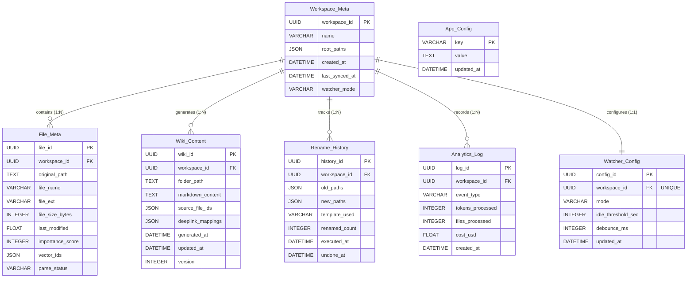

> **관계 요약:** `Workspace_Meta`가 중심 엔티티이며, `File_Meta`·`Wiki_Content`·`Rename_History`·`Analytics_Log`와 1:N, `Watcher_Config`와 1:1 관계. `App_Config`는 전역 설정으로 독립.

#### 6.2.1 Workspace_Meta

| Field Name | Data Type | Constraints | Description |
|:---|:---|:---|:---|
| `workspace_id` | UUID (PK) | Auto Generated, NOT NULL | 워크스페이스 고유 식별자 |
| `name` | VARCHAR(255) | NOT NULL | 유저가 지정한 프로젝트 이름 |
| `root_paths` | JSON | NOT NULL | 병합된 대상 폴더들의 절대 경로 배열 |
| `created_at` | DATETIME | DEFAULT CURRENT_TIMESTAMP | 워크스페이스 생성 시각 |
| `last_synced_at` | DATETIME | NULLABLE | 마지막 위키 갱신(Sync) 시점 |
| `watcher_mode` | VARCHAR(20) | DEFAULT 'off' | Watcher 동작 모드 (manual/realtime/idle/off) |

#### 6.2.2 File_Meta

| Field Name | Data Type | Constraints | Description |
|:---|:---|:---|:---|
| `file_id` | UUID (PK) | Auto Generated, NOT NULL | 개별 파일 식별자 |
| `workspace_id` | UUID (FK) | REFERENCES Workspace_Meta, NOT NULL | 소속 워크스페이스 |
| `original_path` | TEXT | NOT NULL, UNIQUE per workspace | OS상의 물리적 절대 경로 |
| `file_name` | VARCHAR(255) | NOT NULL | 파일명 (확장자 포함) |
| `file_ext` | VARCHAR(10) | NOT NULL | 확장자 (.docx, .pdf, .txt, .md) |
| `file_size_bytes` | INTEGER | NOT NULL | 파일 크기 (bytes) |
| `last_modified` | FLOAT | NOT NULL | OS 파일 수정 타임스탬프 (epoch) |
| `importance_score` | INTEGER | NULLABLE, 0~100 | 고속 분석 중요도 점수 |
| `vector_ids` | JSON | NULLABLE | ChromaDB 내 대응 Chunk ID 목록 |
| `parse_status` | VARCHAR(20) | DEFAULT 'pending' | 파싱 상태 (pending/parsed/error/skipped) |

#### 6.2.3 Wiki_Content

| Field Name | Data Type | Constraints | Description |
|:---|:---|:---|:---|
| `wiki_id` | UUID (PK) | Auto Generated, NOT NULL | 위키 콘텐츠 고유 식별자 |
| `workspace_id` | UUID (FK) | REFERENCES Workspace_Meta, NOT NULL | 소속 워크스페이스 |
| `folder_path` | TEXT | NOT NULL | 1-Depth 폴더 경로 (탭 분리 기준) |
| `markdown_content` | TEXT | NOT NULL | 생성된 마크다운 위키 본문 |
| `source_file_ids` | JSON | NOT NULL | 위키 생성에 사용된 File_Meta ID 목록 |
| `deeplink_mappings` | JSON | NOT NULL | 문장 인덱스 → 원문 파일 경로 매핑 |
| `generated_at` | DATETIME | DEFAULT CURRENT_TIMESTAMP | 위키 최초 생성 시각 |
| `updated_at` | DATETIME | ON UPDATE CURRENT_TIMESTAMP | 위키 최종 갱신 시각 |
| `version` | INTEGER | DEFAULT 1 | 위키 버전 (Merge 시 증가) |

#### 6.2.4 Rename_History

| Field Name | Data Type | Constraints | Description |
|:---|:---|:---|:---|
| `history_id` | UUID (PK) | Auto Generated, NOT NULL | 이름 변경 작업 세션 ID |
| `workspace_id` | UUID (FK) | REFERENCES Workspace_Meta, NOT NULL | 소속 워크스페이스 |
| `old_paths` | JSON | NOT NULL | 변경 이전 원본 경로 목록 |
| `new_paths` | JSON | NOT NULL | 변경 이후 현재 경로 목록 |
| `template_used` | VARCHAR(255) | NULLABLE | 적용된 Naming 템플릿명 |
| `renamed_count` | INTEGER | NOT NULL | 변경된 파일 수 |
| `executed_at` | DATETIME | DEFAULT CURRENT_TIMESTAMP | 실행 시각 |
| `undone_at` | DATETIME | NULLABLE | Undo 실행 시각 (NULL = 미원복) |

#### 6.2.5 Analytics_Log

| Field Name | Data Type | Constraints | Description |
|:---|:---|:---|:---|
| `log_id` | UUID (PK) | Auto Generated, NOT NULL | 로그 고유 식별자 |
| `workspace_id` | UUID (FK) | REFERENCES Workspace_Meta, NOT NULL | 소속 워크스페이스 |
| `event_type` | VARCHAR(50) | NOT NULL | 이벤트 유형 (analysis_complete, deeplink_click, watcher_update, rename_execute) |
| `tokens_processed` | INTEGER | NULLABLE | 처리된 토큰 수 (Time Saved 산출용) |
| `files_processed` | INTEGER | NULLABLE | 처리된 파일 수 |
| `cost_usd` | FLOAT | NULLABLE | Option A API 호출 비용 (USD) |
| `created_at` | DATETIME | DEFAULT CURRENT_TIMESTAMP | 이벤트 발생 시각 |

#### 6.2.6 Watcher_Config

| Field Name | Data Type | Constraints | Description |
|:---|:---|:---|:---|
| `config_id` | UUID (PK) | Auto Generated, NOT NULL | 설정 고유 식별자 |
| `workspace_id` | UUID (FK) | REFERENCES Workspace_Meta, UNIQUE, NOT NULL | 대상 워크스페이스 (1:1) |
| `mode` | VARCHAR(20) | DEFAULT 'off' | 동작 모드 (manual/realtime/idle/off) |
| `idle_threshold_sec` | INTEGER | DEFAULT 300 | 유휴 판단 임계값 (초) |
| `debounce_ms` | INTEGER | DEFAULT 2000 | 이벤트 디바운싱 대기 시간 (ms) |
| `updated_at` | DATETIME | ON UPDATE CURRENT_TIMESTAMP | 최종 설정 변경 시각 |

#### 6.2.7 App_Config

| Field Name | Data Type | Constraints | Description |
|:---|:---|:---|:---|
| `key` | VARCHAR(100) (PK) | NOT NULL | 설정 키 (예: llm_mode, api_key_encrypted) |
| `value` | TEXT | NOT NULL | 설정 값 |
| `updated_at` | DATETIME | ON UPDATE CURRENT_TIMESTAMP | 최종 변경 시각 |

### 6.3 Detailed Interaction Models

#### 6.3.1 상세 시퀀스: Batch Rename 실행 및 Undo 플로우

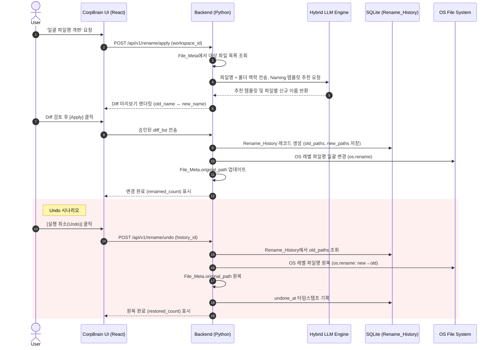

#### 6.3.2 상세 시퀀스: Ollama 원클릭 온보딩 (Option B)

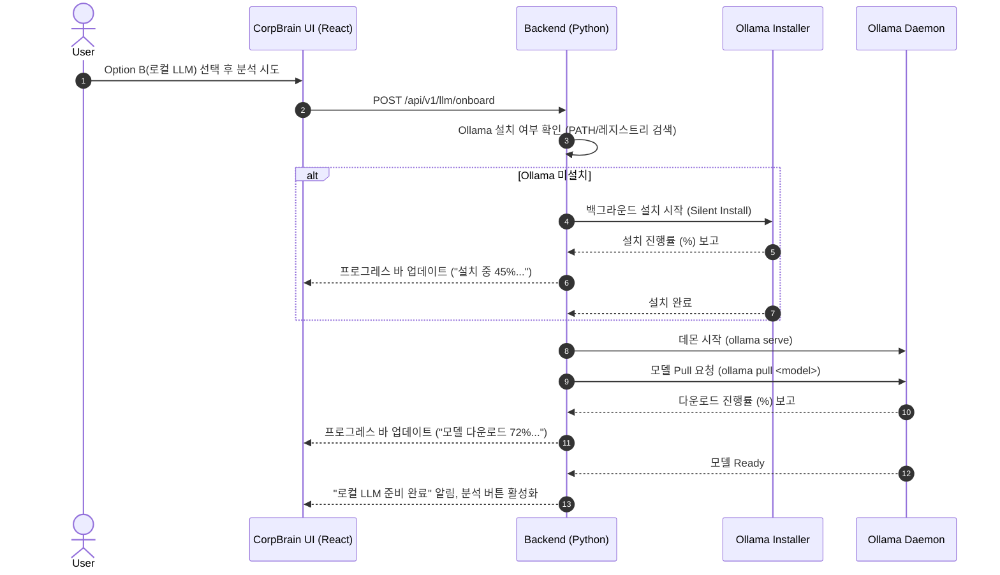

#### 6.3.3 상세 시퀀스: PII 마스킹 및 Cloud API 전송 (Option A)

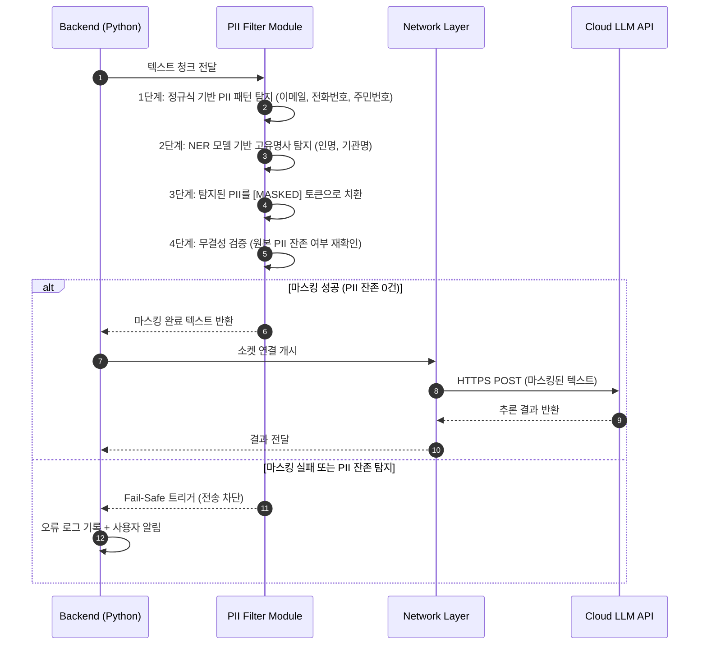

#### 6.3.4 상세 시퀀스: My Analytics 통계 산출

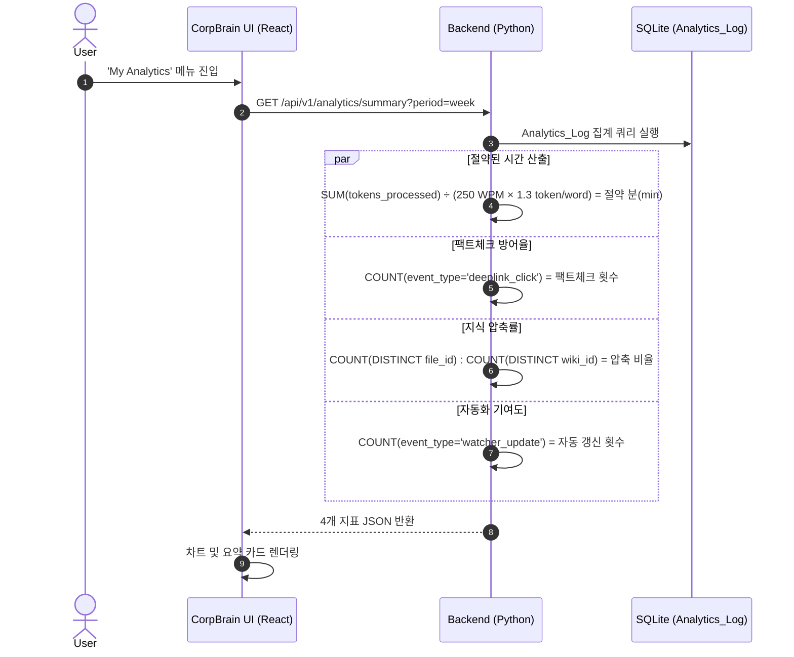

#### 6.3.5 상세 시퀀스: Watcher 유휴시간(Idle) 모드 동작

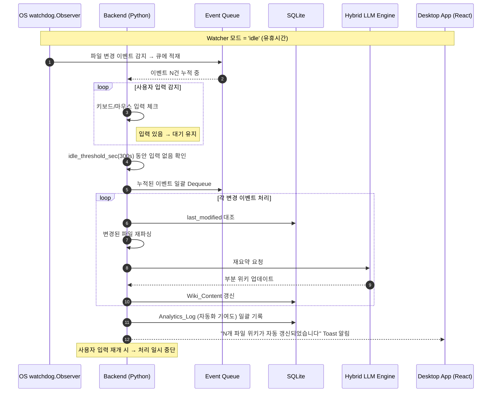

### 6.4 Class Diagram (핵심 모듈 구조)

CorpBrain 백엔드(Python Core)의 핵심 클래스와 의존 관계를 명시한다.

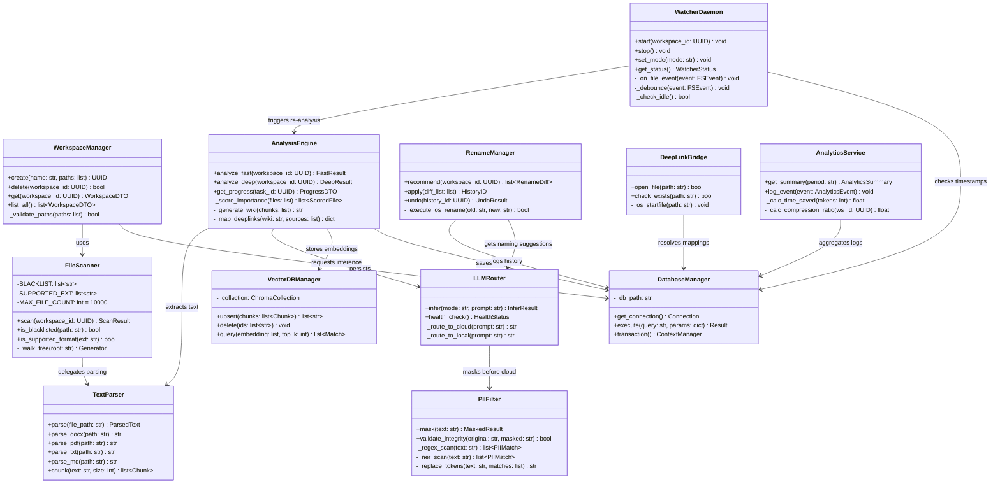

---

*— End of Document —*
