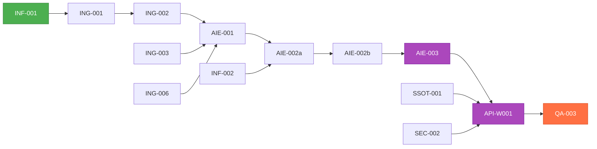

# CorpBrain MVP — Task 의존성 상세 다이어그램

> **기준**: `01_Task_Breakdown_List.md` (v4) 의 선행 태스크 컬럼 기반  
> **노드 수**: 64개 | **Epic 그룹**: 14개  
> **화살표 방향**: `선행 Task --> 후행 Task` (의존 방향)

---

## 1. 전체 의존성 다이어그램 (Full View)

```mermaid
flowchart TD

%% ============================================================
%% SUBGRAPH: Data Contract (SSOT)
%% ============================================================
subgraph SSOT["📋 0. Data Contract — SSOT"]
  SSOT-001["SSOT-001\nAPI Contract/DTO\n(OpenAPI Spec)"]
  SSOT-002["SSOT-002\nMock Data\nSeed/Fixture"]
  SSOT-003["SSOT-003\nWebhook Inbound\nPayload Schema"]
end

%% ============================================================
%% SUBGRAPH: UI/UX Design (DES)
%% ============================================================
subgraph DES["🎨 1. UI/UX Design"]
  DES-001["DES-001\nTrust-Anchor UI"]
  DES-002["DES-002\nMasking Rule UI"]
  DES-003["DES-003\nHITL Dashboard UI"]
  DES-004["DES-004\nROI Report UI"]
end

%% ============================================================
%% SUBGRAPH: Infrastructure (INF)
%% ============================================================
subgraph INF["🏗️ 2. Infrastructure"]
  INF-001["INF-001\nPostgreSQL + Redis"]
  INF-002["INF-002\nGemma LLM Server"]
  INF-003["INF-003\nCI/CD Pipeline"]
  INF-004["INF-004\nMonitoring\n(Datadog/Grafana)"]
  INF-005["INF-005\nDB Backup\nRTO/RPO"]
  INF-006["INF-006\nDeadlock Detect\nCron"]
  INF-007["INF-007\nUptimeRobot\nPagerDuty"]
  INF-008["INF-008\nTLS 1.3\nCost Alert"]
  INF-009["INF-009\nDB Schema\nMigration"]
end

INF-001 --> INF-003
INF-001 --> INF-004
INF-001 --> INF-005
INF-001 --> INF-006
INF-001 --> INF-009
INF-004 --> INF-007
INF-004 --> INF-008
INF-009 --> SSOT-002

%% ============================================================
%% SUBGRAPH: Data Ingestion (ING)
%% ============================================================
subgraph ING["📥 3. Data Ingestion"]
  ING-001["ING-001\nWebhook Handler\n+ Redis Queue"]
  ING-002["ING-002\nSlack Events API"]
  ING-003["ING-003\nJira Webhooks"]
  ING-004["ING-004\nExponential\nBackoff"]
  ING-005["ING-005\nWebhook Signature\nVerify"]
  ING-006["ING-006\nData Parser\n(Adapter)"]
end

INF-001 --> ING-001
SSOT-003 --> ING-001
ING-001 --> ING-002
SSOT-003 --> ING-002
ING-001 --> ING-003
SSOT-003 --> ING-003
ING-001 --> ING-004
ING-001 --> ING-005
ING-001 --> ING-006

%% ============================================================
%% SUBGRAPH: Privacy & Security (SEC)
%% ============================================================
subgraph SEC["🔒 4. Privacy & Security"]
  SEC-001["SEC-001\nRegex PII Masking"]
  SEC-002["SEC-002\nNER Double Masking"]
  SEC-003["SEC-003\nCustom Masking Rule"]
  SEC-004["SEC-004\nAES-256 Encryption"]
  SEC-005["SEC-005\nAudit Log Middleware"]
  SEC-006["SEC-006\nPII Test Set 200"]
end

INF-001 --> SEC-001
SEC-001 --> SEC-002
INF-002 --> SEC-002
SEC-001 --> SEC-003
SEC-001 --> SEC-006

%% ============================================================
%% SUBGRAPH: Auth (AUTH)
%% ============================================================
subgraph AUTH["🔑 5. Auth"]
  AUTH-001["AUTH-001\nJWT Auth"]
  AUTH-002["AUTH-002\nRBAC Middleware"]
end

INF-001 --> AUTH-001
AUTH-001 --> AUTH-002
AUTH-001 --> SEC-005

%% ============================================================
%% SUBGRAPH: AI Engine (AIE)
%% ============================================================
subgraph AIE["🤖 6. AI Engine"]
  AIE-001["AIE-001\nData Sort Preprocess"]
  AIE-002a["AIE-002a\nSemantic Merge"]
  AIE-002b["AIE-002b\nContext Collision Diff"]
  AIE-003["AIE-003\nTrust-Anchor Mapping"]
  AIE-004["AIE-004\nRL Feedback Loop"]
end

ING-002 --> AIE-001
ING-003 --> AIE-001
ING-006 --> AIE-001
AIE-001 --> AIE-002a
INF-002 --> AIE-002a
AIE-002a --> AIE-002b
AIE-002b --> AIE-003
INF-001 --> AIE-004

%% ============================================================
%% SUBGRAPH: API Write (API-W)
%% ============================================================
subgraph APIW["✏️ 7. API Core — Write"]
  API-W001["API-W001\nPOST drafts/generate"]
  API-W002["API-W002\nPOST masking-rules"]
  API-W003["API-W003\nPATCH drafts/review"]
end

SSOT-001 --> API-W001
AIE-003 --> API-W001
SEC-002 --> API-W001
SSOT-001 --> API-W002
INF-009 --> API-W002
SSOT-001 --> API-W003

%% ============================================================
%% SUBGRAPH: API Read (API-R)
%% ============================================================
subgraph APIR["📖 8. API Core — Read"]
  API-R001["API-R001\nGET draft detail"]
  API-R002["API-R002\nGET draft list"]
  API-R003["API-R003\nGET masking rules"]
  API-R004["API-R004\nGET ROI report"]
  API-R005["API-R005\nGET health check"]
end

SSOT-001 --> API-R001
INF-009 --> API-R001
SSOT-001 --> API-R002
INF-009 --> API-R002
SSOT-001 --> API-R003
INF-009 --> API-R003
SSOT-001 --> API-R004
AUTH-002 --> API-R004
API-R001 --> API-W003

%% ============================================================
%% SUBGRAPH: API Middleware (API-M)
%% ============================================================
subgraph APIM["⚙️ 9. API Middleware"]
  API-M001["API-M001\nRate Limiting"]
  API-M002["API-M002\nPush Notification\n(WebSocket/SSE)"]
end

AUTH-001 --> API-M001
INF-001 --> API-M002

%% ============================================================
%% SUBGRAPH: External System (EXT)
%% ============================================================
subgraph EXT["🔌 10. External System"]
  EXT-001["EXT-001\nNotion API"]
  EXT-002["EXT-002\nConfluence API"]
  EXT-003["EXT-003\nStripe Billing"]
end

API-W003 --> EXT-001
API-W003 --> EXT-002

%% ============================================================
%% SUBGRAPH: Frontend App (APP)
%% ============================================================
subgraph APP["🖥️ 11. Frontend App"]
  APP-001["APP-001\nHITL Editor UI"]
  APP-002["APP-002\nTrust-Anchor Hover UI"]
  APP-003["APP-003\nBadge & Toast Alert UI"]
  APP-004["APP-004\nMasking Rule Mgmt UI"]
  APP-005["APP-005\nROI Dashboard UI"]
  APP-006["APP-006\nIntegration Settings UI"]
  APP-007["APP-007\nGA4/Mixpanel Tracking"]
  APP-008["APP-008\nPush Notify UI"]
  APP-009["APP-009\nDraft List UI"]
end

DES-003 --> APP-001
API-R001 --> APP-001
DES-001 --> APP-002
APP-001 --> APP-002
APP-002 --> APP-003
DES-002 --> APP-004
API-W002 --> APP-004
API-R003 --> APP-004
DES-004 --> APP-005
API-R004 --> APP-005
API-M002 --> APP-008
APP-001 --> APP-008
DES-003 --> APP-009
API-R002 --> APP-009

%% ============================================================
%% SUBGRAPH: Test Automation (TEST)
%% ============================================================
subgraph TEST["🧪 12. Test Automation"]
  TEST-001["TEST-001\nIngestion Integration"]
  TEST-002["TEST-002\nAI Engine Unit/Integ"]
  TEST-003["TEST-003\nE2E Playwright"]
  TEST-004["TEST-004\nSecurity Audit Test"]
end

ING-002 --> TEST-001
ING-003 --> TEST-001
ING-004 --> TEST-001
AIE-002b --> TEST-002
AIE-003 --> TEST-002
APP-001 --> TEST-003
APP-002 --> TEST-003
APP-003 --> TEST-003
SEC-004 --> TEST-004
INF-008 --> TEST-004

%% ============================================================
%% SUBGRAPH: QA & Ops (QA)
%% ============================================================
subgraph QA["🔍 13. QA & Ops"]
  QA-001["QA-001\nHallucination Alert"]
  QA-002["QA-002\nRate Limit Alert"]
  QA-003["QA-003\nK6 Load Test"]
end

INF-004 --> QA-001
API-W003 --> QA-001
INF-004 --> QA-002
ING-004 --> QA-002
API-W001 --> QA-003
API-W003 --> QA-003

%% ============================================================
%% STYLE
%% ============================================================
classDef root fill:#4CAF50,stroke:#2E7D32,color:#fff
classDef leaf fill:#FF7043,stroke:#D84315,color:#fff
classDef critical fill:#AB47BC,stroke:#7B1FA2,color:#fff

class SSOT-003,DES-001,DES-002,DES-003,DES-004,INF-002,SEC-004,EXT-003,APP-006,APP-007,API-R005 root
class SSOT-002,TEST-001,TEST-002,TEST-003,TEST-004,QA-001,QA-002,QA-003,EXT-001,EXT-002,APP-003,APP-005,APP-008,APP-009,APP-004,SEC-006,SEC-003,SEC-005,INF-003,INF-005,INF-006,INF-007,API-M001,AIE-004 leaf
class INF-001,SSOT-001,AIE-003,SEC-002,API-W001,API-W003 critical
```

---

## 2. Critical Path (최장 의존 체인)

**최장 체인 (8단계):**  
`INF-001 → ING-001 → ING-002 → AIE-001 → AIE-002a → AIE-002b → AIE-003 → API-W001`

> [!WARNING]
> 이 경로가 전체 프로젝트의 **일정 병목**. `INF-002`(LLM 서버)도 `AIE-002a`에서 합류하므로 `INF-001`과 **병렬 착수 필수**.

---

## 3. 루트 노드 (선행 태스크 없음 — 즉시 착수 가능)

| Task ID | 기능명 | Epic |
|---|---|---|
| **SSOT-001** | API Contract/DTO 스키마 정의 | Data Contract |
| **SSOT-003** | Webhook Inbound Payload 스키마 | Data Contract |
| **DES-001** | Trust-Anchor UI/UX 설계 | UI/UX Design |
| **DES-002** | 마스킹 규칙 관리 UI/UX 설계 | UI/UX Design |
| **DES-003** | HITL 승인 대시보드 UI/UX 설계 | UI/UX Design |
| **DES-004** | ROI 리포트 UI/UX 설계 | UI/UX Design |
| **INF-001** | PostgreSQL + Redis 구축 | Infrastructure |
| **INF-002** | Gemma LLM 서버 구축 | Infrastructure |
| **SEC-004** | AES-256 암호화 모듈 | Privacy & Security |
| **API-R005** | 헬스체크 API | API Read |
| **EXT-003** | Stripe Billing 연동 | External System |
| **APP-006** | 연동 설정 관리 화면 | Frontend App |
| **APP-007** | GA4/Mixpanel 트래킹 | Frontend App |

> 🟢 **13개 루트 노드**가 병렬 착수 가능. 이 중 `INF-001`과 `SSOT-001`이 후방 의존성이 가장 많은 **슈퍼 루트**.

---

## 4. 리프 노드 (후행 태스크 없음 — 최종 산출물)

| Task ID | 기능명 | Epic |
|---|---|---|
| SSOT-002 | Mock Data Seed | Data Contract |
| INF-003 | CI/CD Pipeline | Infrastructure |
| INF-005 | DB Backup RTO/RPO | Infrastructure |
| INF-006 | Deadlock Detect Cron | Infrastructure |
| INF-007 | UptimeRobot/PagerDuty | Infrastructure |
| SEC-003 | Custom Masking Rule | Privacy & Security |
| SEC-005 | Audit Log Middleware | Privacy & Security |
| SEC-006 | PII Test Set 200 | Privacy & Security |
| AIE-004 | RL Feedback Loop | AI Engine |
| API-M001 | Rate Limiting | API Middleware |
| APP-003~009 | Frontend 최종 UI들 | Frontend App |
| TEST-001~004 | 모든 테스트 태스크 | Test Automation |
| QA-001~003 | 모든 QA 태스크 | QA & Ops |
| EXT-001, 002 | Notion/Confluence 연동 | External System |

---

## 5. 의존성 통계

| 메트릭 | 값 |
|---|---|
| 전체 Task 수 | 64 |
| 루트 노드 (선행 0) | 13 |
| 리프 노드 (후행 0) | ~24 |
| 최장 체인 깊이 | 8 단계 |
| 가장 많은 후행 의존을 가진 노드 | **INF-001** (12개 직접 후행) |
| 두 번째 허브 노드 | **SSOT-001** (8개 직접 후행) |
| 세 번째 허브 노드 | **INF-009** (5개 직접 후행) |

---

## 6. 범례

| 색상 | 의미 |
|---|---|
| 🟢 초록 (`root`) | 선행 태스크 없음 — 즉시 착수 가능 |
| 🟠 주황 (`leaf`) | 후행 태스크 없음 — 최종 산출물 |
| 🟣 보라 (`critical`) | Critical Path 상의 핵심 허브 노드 |
| 화살표 방향 | `선행 → 후행` (의존 방향) |
