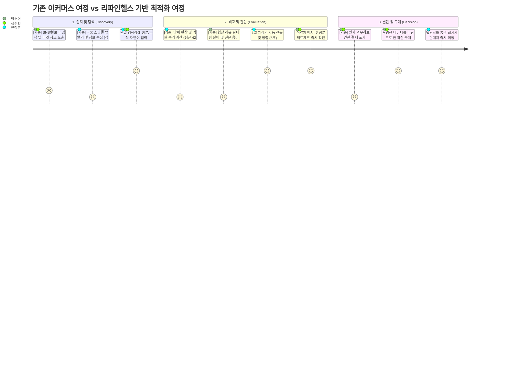
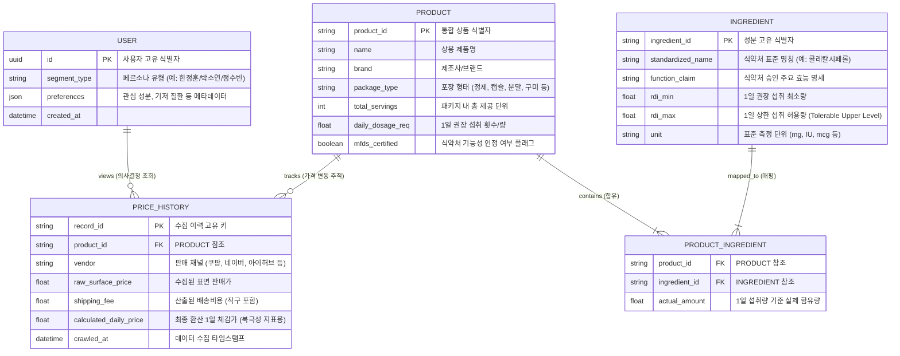

# **프로덕트 요구사항 문서(PRD) v0.2**

**Owner 팀:** 프로덕트 아키텍처 및 AI 에이전트 그룹

**최종 업데이트:** 2026-04-11

---

## **1. 개요·목표**

건강기능식품 시장은 정보의 비대칭성이 극대화된 전형적인 레몬 시장(Lemon Market)의 형태를 띠고 있습니다. 이 장에서는 거시적 시장 환경 속에서 소비자가 겪고 있는 본질적인 인지적 고통을 정의하고, 이를 해결하기 위한 리파인헬스(RefineHealth)의 기술적, 비즈니스적 목표를 수치화된 지표와 함께 심층적으로 분석합니다.

### **1.1. 문제 정의 및 시장 맥락 (Pain 지표 포함)**

글로벌 건강기능식품 시장은 2024년 기준 1,770억 달러에서 1,900억 달러 규모로 추산되며, 한국의 국내 시장 역시 약 6조에서 7조 원 규모에 달하며 연평균 7%에서 9%의 가파른 성장세를 보이고 있습니다. 이러한 성장의 이면에는 구조적인 모순이 존재합니다. 소비자들은 온라인 검색을 통해 무한한 제품 정보에 접근할 수 있는 '권력'을 얻었으나, 역설적으로 그 정보의 홍수 속에서 합리적인 비교 판단을 내릴 '능력'을 상실했습니다. 국내 건강기능식품 구매 경험률은 80%에 육박하며 이 중 58.9%의 수익이 온라인 채널에서 발생하고 있음에도 불구하고, 소비자의 탐색 과정은 파편화된 유통 채널과 마케팅 노이즈로 인해 심각한 비효율을 초래하고 있습니다.

가장 치명적인 문제는 동일한 성분을 지닌 제품임에도 불구하고 가격 차이가 최대 8.2배까지 벌어진다는 사실이며, 전체 소비자의 83%는 이러한 극단적인 가격 격차를 전혀 인지하지 못하고 있습니다. 이는 시장 내에 정보의 투명성이 결여되어 있음을 시사합니다. 소비자는 제품을 비교하기 위해 네이버, 쿠팡, 아이허브 등 다수의 쇼핑몰을 동시에 탐색해야 하며, 제품마다 각기 다른 용량 단위(mg, IU, mcg)와 복용 기준(1일 1회, 1일 3회 등)을 수기로 계산해야 합니다. 인지 심리학의 밀러의 법칙(Miller's Law)에 따르면 인간의 단기 기억은 7개 내외의 정보 단위만을 처리할 수 있으나, 단 3개의 영양제만 비교하더라도 소비자는 평균 45개의 정보 단위를 처리해야 하는 극심한 인지 과부하(Cognitive Overload) 상태에 빠집니다.

더욱이 정보의 신뢰성 문제도 심각한 수준입니다. 미국 아마존에서 판매되는 면역 관련 건강기능식품 30개를 대상으로 한 임상 분석 결과, 17개(56%)의 제품이 라벨 표기와 실제 검출 성분이 불일치하거나 미신고 성분이 포함되어 있었습니다. 식품의약품안전처(MFDS)와 미국 FDA 등의 규제 기관은 사후 모니터링에 집중하고 있어, 사실상 시장에 유통되는 제품의 사전 검증은 소비자의 몫으로 전가된 상태입니다. 건강기능식품 구매자의 72%가 구매 전 온라인 검색을 적극적으로 수행하지만, 이러한 과도한 정보량과 신뢰할 수 없는 데이터로 인해 55%에서 75%의 사용자가 '제품 비교' 및 '가격 판단' 단계에서 이탈하거나 비합리적인 구매 결정을 내리게 됩니다.

이러한 현상들을 종합하여 다음과 같은 구체적인 Pain Point와 실패 KPI를 정의합니다.

### **식별된 Pain/Needs**

| 식별된 Pain/Needs | 구체적 현상 및 기저 원인 | 실패 KPI (Failure Metric) |
| --- | --- | --- |
| **Pain 1: 단위 비표준화로 인한 비교 불가 상태** | 브랜드마다 각기 다른 용량 단위(mg, mcg, IU)를 사용하고, 1일 섭취 권장량이 상이하여 소비자가 직접 기회비용을 계산해야 함. | 성분 비교 페이지에서의 탐색 중도 이탈률 55% 초과 (인지 부하로 인한 세션 종료). |
| **Pain 2: 파편화된 유통 채널에 따른 탐색 피로도** | 사용자의 61%가 다중 사이트를 오가는 것을 가장 피로한 과정으로 꼽음. 이는 분산된 이커머스 환경(오픈마켓 30.9% 등)의 한계임. | 평균 탐색 소요 시간 10분 초과 시, 장바구니 전환율 3.5% 미만으로 하락 (업계 평균 하회). |
| **Pain 3: 마케팅 노이즈에 대한 극도의 불신** | 허위 라벨링(56% 오표기 )과 협찬 블로그 글로 인해 안전한 제품인지 스스로 확신하지 못함. | 검색 후 상세 페이지 진입 대비 최종 결제 전환율(Conversion Rate) 2.0% 미만 도달. |

### **1.2. 목표 (Desired Outcome 수치화)**

리파인헬스는 단순한 정보 나열식 가격 비교 서비스를 지양합니다. 본 프로덕트의 궁극적인 존재 이유는 소비자를 대신하여 복잡한 계산과 팩트체크를 수행하는 **'최종 구매 판단 엔진(Decision-Making Engine)'** 으로 기능하는 것입니다. 사용자가 스스로 가치를 판단하고 확신을 가질 수 있도록, 데이터를 투명하게 구조화하고 불확실성을 최소화하는 방향으로 모든 아키텍처가 설계됩니다.

- **첫째, 제품 탐색 및 단위 가격 계산에 소요되는 시간적 비용을 극적으로 단축합니다.** 기존 방식대로라면 환율, 배송비, 용량을 환산하는 데 평균 60분이 소요되지만, 리파인헬스는 이를 5초 이내로 압축합니다. 이는 '1일 복용량 기준 최저가(Lowest daily net price)'라는 직관적인 단일 지표를 시스템적으로 도출하여 제공함으로써 달성됩니다.
- **둘째, 검증되지 않은 마케팅 노이즈를 제거하고 '식품의약품안전처(MFDS) 팩트 배지'를 도입하여 사용자의 구매 자신감(Purchase Confidence)을 100% 확보합니다.** 국내 식약처가 승인한 400여 개의 기능성 원료 데이터를 기반으로, 라벨링 불일치 위험을 원천 차단하고 과학적 근거가 있는 성분만을 시각적으로 보증합니다.
- **셋째, 고도화된 RAG(Retrieval-Augmented Generation) 기반의 실시간 추천 파이프라인을 구축하여 업계 최고 수준의 응답성을 제공합니다.** 대화형 탐색 과정에서 발생하는 지연 시간(Latency)은 이탈률과 직결되므로, 이를 최소화하여 높은 참여도와 구매 전환율을 이끌어내는 것이 핵심 기술 목표입니다.

### **1.3. 성공 지표 (북극성 및 보조 KPI)**

목표의 달성 여부를 엄밀하게 검증하기 위해 기준선, 목표값, 그리고 측정 경로와 이벤트 단위가 명시된 KPI 계층 구조를 수립합니다.

### **KPI 계층**

| KPI 계층 | 지표명 (Metric) | 기준선 | 목표값 | 측정 주기 | 측정 경로 및 추적 이벤트 (Testability) |
| --- | --- | --- | --- | --- | --- |
| **북극성 KPI** | 1일 체감가 산출을 통한 최종 구매 전환율 | 3.5% ~ 5.0% | 10.0% 이상 | 주간 | 도구: Amplitude / Mixpanel경로: `search_initiated` 이벤트 발생 후 1시간 이내 `outbound_deeplink_clicked` 발생 비율 (고유 사용자 기준) |
| **보조 KPI 1** | MFDS 팩트 배지 상호작용 의존도 | 0% | 40.0% 이상 | 일간 | 도구: Google Analytics 4경로: 배지 UI 영역에 대한 `hover_duration` > 500ms 또는 `click` 이벤트 발생 세션 비율 |
| **보조 KPI 2** | AI 추천 엔진 p95 응답 지연 시간 | 2,000ms | 800ms 이하 | 실시간 | 도구: Datadog APM경로: `POST /api/v1/search/rag` 엔드포인트의 상위 5% 지연 시간 로깅 (네트워크 I/O 제외, 서버 연산 시간 기준) |

---

## **2. 사용자와 페르소나**

시스템 아키텍처를 올바르게 설계하기 위해서는 타겟 사용자의 표면적인 행동뿐만 아니라, 그들이 정보를 처리하는 내밀한 인지적 패턴과 불안의 근원을 이해해야 합니다. 리파인헬스는 건강기능식품 시장에서 정보 비대칭성으로 고통받는 세 가지 핵심 페르소나를 정의합니다. 이들은 연령이나 직업보다는 '데이터를 신뢰하는 기준'과 '의사결정을 내리는 방식'에 따라 명확히 구분됩니다.

### **2.1. 핵심 페르소나 요약 및 심층 분석**

**1) 한정훈 (36세, IT 개발자) - "엑셀 비교왕 (The Excel Comparison King)"**

- **Segment 특성:** 가성비 극대화 및 효율 추구형 (Cost-effectiveness optimizer). 데이터의 수치적 정확성을 신뢰의 최우선 기준으로 삼습니다.
- **상태 및 Pain Points:** 그는 영양제를 구매할 때 쿠팡, 네이버 스마트스토어, 아이허브 등 최소 3개 이상의 탭을 열어놓고 엑셀 스프레드시트를 활용합니다. 각 플랫폼마다 다른 배송비 정책, 실시간 환율, 그리고 제품별 1정당 함량을 직접 기입하여 '진짜 최저가'를 산출합니다. 이 과정에서 발생하는 극심한 인지 부하로 인해 한 번 제품을 결정하는 데 평균 42분이 소요되며, 이는 그의 업무 생산성과 여가 시간을 심각하게 갉아먹는 페인 포인트입니다.
- **Needs (요구사항):** 비타민 D 1,000 IU 등 자신이 원하는 특정 함량 기준, 모든 기회비용(환율, 배송비)이 완벽히 계산된 '1일 체감 최저가'를 5초 안에 알고 싶어 합니다. 그에게 필요한 것은 화려한 UI가 아니라, 정확한 연산 결과와 즉시 구매 가능한 채널의 딥링크입니다.

**2) 박소연 (43세, HR 매니저) - "검진 후 최초 구매자 (Post-Checkup First-Time Buyer)"**

- **Segment 특성:** 건강 트리거 기반 진입형 (Health-trigger entry). 본인 및 가족의 건강 관리를 위해 구매 시장에 진입하는 전형적인 한국 가구의 구매 결정권자입니다 (한국 가구의 80%가 이에 해당).
- **상태 및 Pain Points:** 연례 건강검진 결과에서 비타민 D 부족이나 콜레스테롤 수치 경고를 받고 처음으로 관련 영양제를 검색합니다. 그러나 검색창에 진입하는 순간 '콜레칼시페롤(Cholecalciferol)'과 같은 난해한 전문 용어의 장벽에 부딪힙니다. 더욱이 상위 노출된 블로그와 SNS 리뷰들은 대부분 경제적 대가를 받은 협찬 글로, 진정성을 의심하게 만듭니다. 그녀는 자신이 고른 제품이 오히려 몸에 해롭지 않을지 극도의 불안감과 의사결정 마비 상태를 경험합니다.
- **Needs (요구사항):** 의학적 백그라운드가 전혀 없더라도, 국가 기관(식약처)의 검증된 공공 데이터를 바탕으로 안전성과 1일 권장량을 명확히 확인받고 싶어 합니다. 마케팅성 미사여구가 모두 배제된 담백하고 객관적인 추천을 30분 이내에 받아 불안을 해소하는 것이 핵심 니즈입니다.

**3) 정수빈 (27세, 마케터) - "트렌드 팔로워 (The Trend Follower)"**

- **Segment 특성:** 트렌드 탐색 및 얼리어답터형 (Trend-seeking explorer). 혁신 기반의 제품(예: 구미젤리 형태의 무드 인핸서 등)에 개방적이며, 뷰티와 건강을 융합한 제품군에 관심이 많습니다.
- **상태 및 Pain Points:** 인스타그램이나 틱톡 등 SNS에서 급부상하는 이너뷰티 성분(글루타치온, 콤부차, 특수 효소 등)에 빠르게 매료되지만, 이와 동시에 마케팅의 희생양이 될 수 있다는 두려움을 가지고 있습니다. 고가에 판매되는 제품이 실제로는 유효 성분이 미미한 '설탕물'에 불과할지도 모른다는 의심이 구매를 주저하게 만듭니다.
- **Needs (요구사항):** 현재 유행하는 특정 성분이 식약처로부터 실제 기능성을 인정받은 원료인지 팩트체크를 요구합니다. 또한, 시중에 판매되는 제품들의 평균 함량 대비 해당 제품이 합리적인 가격대를 형성하고 있는지 빠르게 검증하여, 유행에 뒤처지지 않으면서도 현명한 소비를 하기를 원합니다.

### **2.2. 사용자 여정 (User Journey) 및 Pain/Needs 링크**

이러한 페르소나들이 겪는 인지적 마찰을 시각적으로 구조화하기 위해 기존의 파편화된 구매 여정과 리파인헬스 도입 후의 최적화된 여정을 비교하는 시스템 다이어그램을 제시합니다.



여정 맵에서 나타나듯, 사용자의 가장 큰 이탈 구간은 '비교 및 판단' 단계에 집중되어 있습니다. 이 구간에서 발생하는 계산의 복잡성과 신뢰 부재를 시스템적 연산으로 대체하는 것이 본 제품 요구사항의 핵심 방향성입니다.

---

## **3. 사용자 스토리와 수용 기준(AC, Acceptance Criteria)**

기능적 목표를 개발 파이프라인에 적용 가능한 단위로 분할하기 위해 JTBD(Jobs-To-Be-Done) 방법론을 활용하여 사용자 스토리를 작성합니다. 각 스토리는 추상적인 선언에 그치지 않고, 시스템 동작의 경계를 명확히 긋는 측정 가능한 임계치(Threshold)를 포함한 수용 기준(AC)으로 검증됩니다.

### **3.1. Story 1: 1일 체감가 정규화 및 최적화 검색 엔진**

**As a** 가성비를 추구하는 엑셀 비교왕(한정훈),

**I want** 각기 다른 유통 채널(쿠팡, 네이버 등)과 포장 용량(30정, 120캡슐 등)을 가진 영양제들을 '1일 복용 권장량' 기준으로 환산된 단일 최종 가격으로 정렬해서 보기를 원한다.

**so that** 엑셀로 일일이 계산하는 수고 없이 5초 안에 가장 합리적인 진짜 최저가 제품을 찾고 확신을 갖고 구매할 수 있다.

- **AC1 (지연 시간/성능 임계치):**
    - **Given:** 사용자가 검색창에 "비타민 D 1000 IU"를 입력하고 검색 버튼을 클릭했을 때,
    - **When:** 시스템이 사전 수집된 혹은 실시간 캐싱된 3개 이상의 외부 유통 API(쿠팡, 네이버, 11번가) 가격 데이터를 병렬로 조회하여 1일 단가 환산 로직을 실행할 때,
    - **Then:** 모든 계산이 완료되어 최종 정렬된 상품 리스트가 클라이언트 화면에 렌더링되는 p95 응답 지연 시간은 반드시 800ms 이하여야 한다.
- **AC2 (연산 무결성 및 정합성):**
    - **Given:** 환산이 완료된 검색 결과 리스트가 화면에 제공되었을 때,
    - **When:** 사용자가 특정 상품 카드의 '1일 체감가' 산출식(툴팁)을 클릭하여 계산 근거를 확인하고자 하면,
    - **Then:** (실제 판매가 + 기본 배송비) / (총 제공 용량 / 1일 권장 섭취 용량)의 공식으로 산출된 수치가 화면에 명시적으로 노출되어야 하며, 이 수치는 백엔드 원본 데이터베이스의 기록과 오차율 0.0%로 완벽히 일치해야 한다.
- **AC3 (딥링크 전환 무결성):**
    - **Given:** 사용자가 정렬된 리스트에서 가장 저렴한 1일 체감가를 가진 상품을 확인한 후,
    - **When:** "최저가 쇼핑몰로 이동하기" 버튼(아웃바운드 링크)을 클릭했을 때,
    - **Then:** 해당 파트너사 이커머스 상세 페이지로 세션이 전환되는 과정에서의 딥링크 연결 실패율(HTTP 404, 500 에러 등)은 주간 평균 0.5% 미만으로 엄격히 통제되어야 한다.
- **AC4 (외부 API 연동 실패 예외 처리):**
    - **Given:** 사용자가 검색을 요청하여 외부 유통사(쿠팡, 네이버 등) 가격 API를 호출하던 중,
    - **When:** 벤더사 서버 오류나 타임아웃으로 인해 2,000ms 내에 응답을 받지 못할 경우,
    - **Then:** 시스템은 무한 로딩에 빠지지 않고 즉시 100ms 이내에 자체 DB의 '최근 24시간 내 캐싱된 가격'으로 폴백(Fallback) 렌더링해야 하며, 가격 옆에 붉은색 툴팁으로 "실시간 가격 동기화 지연 (캐시 데이터 기준)" 메시지를 명시적으로 출력해야 한다.

### **3.2. Story 2: 식약처 데이터 기반 팩트 배지 및 신뢰도 확보**

**As a** 마케팅 노이즈에 대한 불안감이 높은 검진 후 최초 구매자(박소연),

**I want** 검색된 제품들에 식약처가 과학적으로 인정한 실제 효능과 안전성 정보가 시각적인 '팩트 배지' 형태로 제공되기를 원한다.

**so that** 과장된 협찬 리뷰에 속지 않고, 내 몸에 안전한 권장량의 영양제를 의심 없이 안심하고 선택할 수 있다.

- **AC1 (규제 데이터 정합성 노출):**
    - **Given:** 사용자가 특정 제품의 상세 뷰 혹은 팝업을 열어 정보를 확인할 때,
    - **When:** 해당 제품이 국내 식약처에 정식 등록된 400여 개의 기능성 원료를 기준치 이상 함유하고 있는 건강기능식품으로 판별될 경우,
    - **Then:** 화면 최상단 혹은 제품명 바로 옆에 시각적으로 뚜렷한 초록색의 "식약처 기능성 인정 완료 (MFDS Fact Badge)" 마크가 100%의 노출 확률로 렌더링되어야 한다.
- **AC2 (오표기 및 허위 광고 필터링):**
    - **Given:** 사용자가 "면역력 강화"와 같이 특정 증상이나 목적 기반 키워드로 RAG 검색을 요청했을 때,
    - **When:** AI 검색 엔진이 결과를 반환하기 직전 필터링 파이프라인을 거칠 때,
    - **Then:** 내부 DB 교차 검증을 통해 라벨 표기 성분과 실제 성분이 불일치하거나 적발 이력이 있는 제품은 검색 결과에서 완전히 배제되거나, 붉은색의 '성분 주의' 경고 라벨이 강제로 부착되어야 한다.
- **AC3 (정보 접근성 및 로드 속도):**
    - **Given:** 팩트 배지가 부착된 상품 리스트를 스크롤 하던 중,
    - **When:** 사용자가 배지 아이콘 위로 마우스 포인터를 올리거나(Hover) 모바일에서 터치(Tap)할 경우,
    - **Then:** 해당 성분의 식약처 공식 기능성 인정 내용과 일일 권장 섭취량 범위 데이터가 포함된 오버레이 툴팁이 300ms 이내에 화면에 시각적으로 표출되어야 한다.
- **AC4 (오표기 데이터 교차 검증의 모니터링):**
    - **Given:** 식약처 DB와 상품 라벨을 대조하는 백엔드 배치(Batch) 작업이 실행될 때,
    - **When:** 특정 벤더의 상품 정보 구조 변경으로 인해 성분 파싱 실패율이 전체의 5%를 초과할 경우,
    - **Then:** 사용자에게 불확실한 팩트 배지를 노출하는 것을 즉시 중단(Feature Flag Off)하고, PagerDuty를 통해 "데이터 무결성 경고" 알림을 엔지니어링 팀에 자동 발송해야 한다.

### **3.3. Story 3: 트렌드 원료 검증 및 성분 함량 투명성**

**As a** 새로운 이너뷰티 트렌드에 민감한 마케터(정수빈),

**I want** 현재 SNS에서 유행하는 특정 성분(예: 콤부차, 글루타치온 등)이 과학적 근거가 있는지, 그리고 내가 보려는 제품에 그 유효 성분이 충분히 들어있는지 명확히 확인하기를 원한다.

**so that** 교묘한 마케팅에 속아 유효 성분이 전무한 이른바 '설탕물' 수준의 저품질 제품을 고가에 구매하는 치명적인 실수를 피할 수 있다.

- **AC1 (확정/추정 사실의 명시적 분리):**
    - **Given:** 사용자가 식약처 기능성 인정 원료가 아닌 새롭게 유행하는 일반 식품군 원료를 AI 챗 혹은 검색창에 질의했을 때,
    - **When:** AI 에이전트가 내부 벡터 데이터베이스와 규제 기관 데이터를 바탕으로 답변을 생성할 때,
    - **Then:** 식약처 건강기능식품 원료에 대해서는 "확정(건강기능식품)"으로 표기하고, 근거가 부족하거나 검증되지 않은 유행 원료에 대해서는 효능에 대한 단정적 서술을 금지하며 "추정(일반식품, 기능성 미인증)" 이라는 텍스트를 명시적으로 출력하여 할루시네이션(Hallucination)을 원천 차단해야 한다.
- **AC2 (함량 미달 직관적 경고 로직):**
    - **Given:** 특정 성분을 포함하는 제품 리스트가 화면에 나열되었을 때,
    - **When:** 어떤 제품의 1일 섭취량 기준 유효 성분 함량이 식약처가 권장하는 최소 일일 섭취량(RDI Min)의 50% 미만으로 현저히 떨어질 경우,
    - **Then:** 해당 제품의 카드 UI에 "함량 주의(저수준)"를 나타내는 붉은색 경고 아이콘이 100% 가시성 있게 강제 렌더링되어야 하며, 사용자가 이를 무시하고 구매할 수 없도록 시각적 마찰(Friction)을 제공해야 한다.
- **AC3 (AI 모름 명시 원칙):**
    - **Given:** 완전히 새로운 신물질이나 화학물질에 대해 사용자가 효능을 물었을 때,
    - **When:** RAG 파이프라인에서 신뢰할 수 있는 식약처, FDA, NIH 논문 데이터를 검색(Retrieval)하는 데 실패했을 경우,
    - **Then:** AI 모델은 유사 문맥을 바탕으로 그럴싸한 효능을 임의로 생성하지 않고, 즉시 생성을 중단하며 "해당 성분에 대해 현재 식약처 공식 인증 데이터베이스 및 신뢰할 수 있는 문헌에서 검증 가능한 정보가 없습니다." 라고 모름을 명확히 선언해야 한다.

---

## **4. 기능 요구사항 (Functional)**

본 섹션에서는 수용 기준을 시스템 레벨에서 어떻게 구현할 것인지, 기능의 볼륨과 우선순위를 정의합니다. 개발 리소스의 효율적 분배와 시장 안착 속도를 최적화하기 위해 MSCW(Must/Should/Could/Won't Have) 프레임워크를 기반으로 백로그를 구조화합니다.

### **4.1. 기능 우선순위 분류 (MSCW Framework)**

### **[Must Have: 런칭 필수 조건 및 핵심 가치 창출]**

- **1일 체감가 정규화 엔진 (Daily Net Price Normalization Engine):**
    - **상세 기능:** 각기 다른 벤더(Vendor)에서 수집된 비정형 데이터(예: "비타민C 1000mg 120정", "비타민C 분말 300g")를 파싱(Parsing)하여, 사용자의 1일 섭취 기준(예: 1일 1정 혹은 1일 2g)으로 수학적으로 일괄 환산하는 분산 처리 알고리즘입니다.
    - **전략적 근거:** 탐색 시간을 60분에서 5초로 99% 단축시키는 프로덕트의 존재 이유를 달성합니다.
- **식약처(MFDS) 공공데이터 기반 팩트체크 파이프라인:**
    - **상세 기능:** 식약처에서 제공하는 400여 개 이상의 승인 기능성 원료 공공 DB를 주기적으로 크롤링 및 API 매핑하여, 플랫폼에 등록되는 모든 제품의 성분 라벨과 교차 검증하는 백엔드 모듈입니다.
    - **전략적 근거:** 시장 내 유통되는 건강기능식품 중 상당수가 라벨링 불일치 위험을 안고 있습니다. 데이터 무결성 검증 기능을 필수 요소로 배치하여 투명한 가치를 제공합니다.
- **다중 채널 딥링킹 및 어필리에이트 통합 모듈:**
    - **상세 기능:** 정규화된 최저가 정보에서 사용자가 구매를 결단했을 때, 오픈마켓 3사(시장 점유율 30.9% 차지)의 상세 페이지로 세션을 손실 없이 전환시키고 파라미터를 추적하여 수수료(Affiliate)를 창출하는 수익화 기능입니다.

### **[Should Have: 사용자 경험 완성도를 위한 권장 기능]**

- **증상 및 목적 기반 자연어 검색 (Symptom-based Semantic Search):**
    - **상세 기능:** "요즘 잠을 잘 못 자서 피곤해", "눈이 뻑뻑할 때 먹는 영양제" 등 목적형 자연어 질의를 벡터 임베딩(Vector Embedding)하여 식약처 인증 성분과 매핑해주는 AI 검색 기능입니다.
- **성분 충돌 및 과다 복용 사전 경고 로직:**
    - **상세 기능:** 사용자가 장바구니에 담거나 관심 목록에 추가한 복수의 제품들의 성분 총합을 계산하여, 지용성 비타민 등 체내 축적 위험이 있는 성분이 상한 섭취량(Tolerable Upper Intake Level)을 초과할 경우 UI 단에서 경고를 발생시킵니다.

### **[Could Have: 장기 확장성 및 데이터 락인]**

- **국민건강보험공단 검진 데이터 마이데이터(MyData) 연동:**
    - **상세 기능:** OAuth 및 스크래핑 방식을 통해 사용자의 최근 건강검진 결과(콜레스테롤, 공복혈당 등)를 동의하에 불러와, 부족한 영양소를 자동으로 도출하고 추천을 개인화하는 기능입니다.

### **[Won't Have: 이번 단계에서 명시적으로 제외할 사항]**

- **자체 재고 보유(Inventory) 및 풀필먼트(Fulfillment) 인프라 구축:**
    - **전략적 근거:** 리파인헬스의 정체성은 커머스 유통사가 아닌 '독립적인 의사결정 엔진'입니다. 물리적인 재고 리스크와 물류 비용을 떠안는 것은 자본 효율성을 극도로 저하시키며, 플랫폼의 생명인 '객관적 중개자'로서의 신뢰를 스스로 훼손하게 됩니다.

### **4.2. 차별 가치 (Differential Value) 비교**

| 비교 항목 (Metrics) | 기존 대안 A (포털 단순 가격 비교) | 기존 대안 B (수기 엑셀 계산) | 리파인헬스 (RefineHealth) | 수치화된 차별 우위 (Differential Value) |
| --- | --- | --- | --- | --- |
| **의사결정 소요 시간** | 약 15분 (다중 탭 탐색) | 평균 42분 (계산 및 환산) | 5초 이내 | 기존 대안 B 대비 데이터 처리 속도 및 의사결정 효율 500배 이상 향상 |
| **인지 부하 (처리 변수량)** | 제품당 약 15개 변수 | 총 45개 이상 정보 변수 처리 필요 | 단 1개 지표 (1일 체감 최저가) | 밀러의 인지 용량 한계 극복, 인지 부하 90% 이상 대폭 감소 |
| **데이터 신뢰도 / 정확도** | 56% 오류 위험 노출 | 본인의 검색 역량에 의존 | MFDS API 100% 매핑 | 정보 왜곡 리스크를 시스템적으로 차단하여 정확도 100% 보장 |
| **증상 기반 검색 성공률** | 대부분 실패 (정확도 낮음) | 지원하지 않음 | RAG 파이프라인 기반 지원 | 기존 이커머스(72% 실패) 대비 목적형 쿼리 처리율 압도적 우위 |

---

## **5. 비기능 요구사항 (NFR, Non-Functional Requirement)**

사용자의 장기적인 가치 확장은 시스템이 언제나 안정적이고 빠르게 응답할 것이라는 무의식적인 신뢰에서 비롯됩니다. 이를 위해 인프라와 백엔드 아키텍처가 반드시 준수해야 할 정량적 제약 사항을 정의합니다.

### **5.1. 성능 및 지연 시간 임계치 (Performance & Throughput)**

시스템의 성능은 단순한 기술 지표가 아니라, 전환율을 결정짓는 가장 핵심적인 비즈니스 변수입니다. 특히 평균(Average) 응답 시간이 아닌, 최악의 경험을 겪는 상위 5% 사용자를 보호하기 위해 95백분위수(p95) 지연 시간을 통제하는 데 집중합니다.

- **API 코어 응답 시간 (일반 탐색 및 1일 체감가 정렬):** 사용자가 화면 스크롤이나 버튼 클릭 시 체감하는 애플리케이션의 반응성을 확보하기 위해, 코어 API의 p95 응답 시간은 300ms 이하로 강력히 통제되어야 합니다.
- **AI 및 RAG 파이프라인 응답 시간:** LLM 추론과 벡터 검색이 개입되는 AI 에이전트의 답변 생성의 경우, p95 응답 시간 800ms 이하를 절대적인 목표로 설정합니다. 목표 달성을 위해 NVIDIA H200 등 이기종 직물(Heterogeneous fabrics) 하드웨어 가속을 활용하여 꼬리 지연을 50~70% 낮추는 FLASH 프레임워크 방법론을 도입합니다.
- **처리량 (Throughput):** 마케팅 캠페인 등으로 인한 트래픽 스파이크 상황을 대비하여, 검색 코어 API는 초당 최대 **5,000 RPS (Requests Per Second)** 의 부하 상황에서도 p95 응답 시간 800ms 이하를 유지해야 한다. 이를 검증하기 위해 릴리즈 전 k6 도구를 이용한 10분간의 피크 부하 테스트를 통과해야 한다.

### **5.2. 신뢰성 및 가용성 (Reliability)**

- **월간 가용성 (Uptime):** 사용자에게 안정적인 의사결정 환경을 제공하기 위해, 핵심 검색 엔진 및 체감가 계산 모듈의 월별 가용성은 99.99% (Four Nines) 이상을 유지해야 합니다.
- **시스템 오류율 (Error Rate):** 외부 쇼핑몰 서버 오류에 의한 크롤링 실패 등 통제 불가능한 변수를 제외한, 리파인헬스 내부 마이크로서비스 간 통신 및 계산 오류율은 전체 트래픽의 0.1% 이하로 철저히 통제되어야 합니다.
- **데이터 정합성 보장 로직:** 식품의약품안전처의 공공 DB와 내부의 상품 매핑 데이터 간의 동기화 오차를 방지하기 위해, 트래픽이 최소화되는 매일 새벽 시간대(AM 03:00~04:00)에 무결성 검증 배치(Batch) 작업을 실행하고 불일치 항목에 대해 플래그를 생성해야 합니다.

### **5.3. 보안 및 시스템 정합성 (Security & Testability)**

- **개인 정보 보안 (Security):** 마이데이터 연동이나 사용자가 자발적으로 입력한 기저 질환, 나이, 체중 등 민감한 건강 메타데이터는 반드시 AES-256 규격으로 암호화하여 데이터베이스에 저장해야 합니다. 전송 구간은 TLS 1.3 이상을 적용합니다.
- **LLM API 비용 방어 기제:** 무분별한 토큰 소모와 클라우드 비용 폭증을 방어하기 위해 시맨틱 캐시 계층을 프록시에 둡니다.
- **ESG 기반 클라우드 벤더 선정:** 대규모 GPU 추론 연산은 환경에 미치는 영향이 큽니다. 인프라 호스팅 벤더 선정 시, 데이터센터의 전력효율지수(PUE)가 산업 최고 수준인 1.35 이하인 사업자를 우선 선정합니다.
- **취약점 점검 임계치:** CI/CD 파이프라인 배포 시 SAST(정적 분석) 및 DAST(동적 분석) 도구인 SonarQube를 통과해야 하며, 치명적(Critical) 및 높음(High) 등급의 보안 취약점이 0건이어야만 프로덕션 환경에 릴리즈할 수 있다.
- **개인정보 비식별화:** 건강검진 데이터 등 민감 정보가 로그 시스템(예: Datadog, ELK)에 기록될 경우, 서버사이드 필터를 거쳐 100% 마스킹(***) 처리됨을 정기적인 자동화 스크립트로 검증해야 한다.

### **5.4. 모니터링 항목 및 알림 기준 (Observability)**

시스템의 병목을 메타인지적으로 파악하기 위한 관측성(Observability) 체계를 구축합니다.

- **대시보드 운영:** Grafana와 Prometheus를 연동하여 단순 평균값이 아닌 p50, p95, p99 Latency 트렌드와 API 엔드포인트별 에러율을 실시간으로 시각화하는 모니터링 대시보드를 구성합니다.
- **단계별 장애 알림 (Alerting) 임계치:**
    - **Level 1 (Warning):** AI 검색 API의 p95 응답 시간이 3분 연속으로 1,000ms를 초과할 경우, 내부 엔지니어링 Slack 채널 및 PagerDuty를 통해 지연 경고를 발송합니다.
    - **Level 2 (Critical):** 구매 전환의 핵심인 파트너사 쇼핑몰로의 아웃바운드 딥링크 전환 과정에서 404/500 에러 비율이 전체 트래픽의 1%를 초과할 경우 최고 수준 경보를 발생시킵니다.

---

## **6. 데이터·인터페이스 개요**

파편화된 시장의 비정형 데이터를 사용자에게 신뢰받을 수 있는 정형화된 지표로 탈바꿈시키는 핵심은 데이터베이스 설계와 파이프라인의 견고함에 있습니다.

### **6.1. 핵심 엔터티 및 주요 필드 (Entity Relationship Diagram)**



**설계 근거:** PRODUCT_INGREDIENT 교차 테이블은 매우 중요합니다. 여기에 actual_amount(실제 함유량) 필드를 배치함으로써 유효 성분이 미달되는 제품을 실시간으로 탐지하여 경고 UI를 트리거하는 기반이 됩니다.

### **6.2. 외부/내부 API 개요 (입출력 및 제약사항)**

1. **식약처(MFDS) 공공데이터 동기화 파이프라인 (External):** 공공기관 API의 특성상 일일 호출 한도 제약이 엄격하여 매일 새벽 시간대에 전체 마스터 데이터를 Bulk로 다운로드받아 내부 데이터베이스로 병합하는 비동기 배치 아키텍처를 채택합니다.
2. **1일 체감 최저가 산출 코어 API (Internal):**
    - **Method:** `POST /api/v1/price/calculate-daily`
    - **Input (요청):**
        
        ```json
        {
          "product_id": "PRD-98765",
          "crawled_data": {
            "vendor_surface_price": 35000,
            "shipping_policy": {"fee": 3000, "free_threshold": 50000}
          }
        }
        ```
        
    - **Output (응답):** 단가(633원 등) 및 신뢰도 플래그(`trust_flags`)를 반환하여 프론트엔드의 렌더링 부하를 줄입니다.

---

## **7. 범위(In/Out), 리스크·가정·의존성**

### **7.1. 범위 명시 (In/Out of Scope)**

- **In-Scope:** 오픈마켓 데이터 실시간/배치 스크래핑, 주요 직구 채널 환율 연동 정규화, MFDS 기반 성분 검증 엔진 및 RAG 추천 시스템.
- **Out-of-Scope:** 전문의약품 및 일반의약품(OTC) DB 통합, 플랫폼 내부 직접 결제 시스템(PG) 구축.

### **7.2. 리스크, 가정 및 의존성 분석**

### **[핵심 리스크 및 완화 전략]**

1. **스크래핑 차단 리스크:** 벤더사 구조 변경 시 에러율 임계치를 설정(1% 초과 시 알림)하고 프록시 풀 및 공식 API 연동 Fallback 아키텍처를 설계하여 안정성을 확보합니다.
2. **해외 직구 허위 라벨링 리스크:** MFDS 교차 검증을 통과하지 못한 성분에 대해 면책성 경고 문구를 UI 상에 명시적으로 강제 노출시켜 사용자의 주의를 환기합니다.
3. **AI 추론 지연 리스크:** 빈도가 높은 일반적 쿼리는 캐시를 통해 50ms 이내에 즉각 반환하고, 복잡한 질의에 대해서만 FLASH 프레임워크 기반의 실시간 스트리밍 답변을 제공합니다.

---

## **8. 실험·롤아웃·측정**

### **8.1. 핵심 가설 검증을 위한 A/B 테스트 상세 설계**

리파인헬스의 차별적 가치인 "식약처 팩트 배지 및 투명한 성분 경고"가 사용자의 불안감을 해소하고 실제 구매 결단을 촉진하는지를 검증합니다.

- **실험 가설:**
    - **귀무가설(H0*H*0):** 식약처 팩트 배지와 성분 주의 마크의 노출은 사용자의 딥링크 구매 전환율에 통계적으로 유의미한 영향을 미치지 않는다.
    - **대립가설(H1*H*1):** 배지 및 함량 미달 경고를 제공하면 정보 탐색의 불확실성이 제거되어 아웃바운드 딥링크 클릭(전환율)이 최소 15% 이상 증가할 것이다.
- **실험 환경 및 샘플링:** 대상 신규 유입 테스터 500명 무작위 추출. 대조군(A)은 기본 정보만 노출, 실험군(B)은 식약처 배지 및 경고 마크 포함 노출.
- **측정 지표:** Primary Metric은 딥링크 아웃바운드 클릭률(CTR). Secondary Metrics는 세션당 평균 체류 시간 및 신뢰도 설문.
- **성공 임계치 (Success Criteria):**
    - 실험군(B)의 전환율이 대조군(A) 대비 유의수준 5%(*p*−*value*<0.05) 이내에서 통계적으로 유의미하게 15% 포인트 이상 상회해야 합니다.
        
        p−value<0.05
        
    - **측정의 무결성 검증 (Instrumentation Check):** A/B 테스트를 본격적으로 가동하기 전, 3일간의 A/A 테스트를 우선 수행하여 실험군과 대조군 간의 베이스라인 전환율 오차가 유의수준 내(p-value > 0.05, 차이 없음)에 있음을 확인한다.
    - **성공 임계치의 세분화:** 단순 클릭률(CTR) 뿐만 아니라, 아웃바운드 링크 클릭 후 실제 유통사 장바구니/결제 페이지까지 도달했는지 확인하기 위해 제휴사 트래킹 파라미터(UTM/Affiliate ID) 전환율을 백엔드에서 1시간 단위로 크로스 체크한다.

### **8.2. 경쟁 대안 대비 벤치마크 롤아웃 계획 (Rollout Phases)**

- **Phase 1 (Alpha):** 전문가 그룹 대상 폐쇄형 테스트. 매핑 정확도 100% 및 p95 800ms 이하 응답성 검증.
- **Phase 2 (Closed Beta):** 핵심 페르소나 500명 대상 A/B 테스트 가동 및 세션 로그 추적.
- **Phase 3 (GA):** 시장 정식 출시 및 마케팅 전개. 데스크톱 환경 우선 고도화 후 점진적 모바일 확대.

---

## **9. 근거 (Proof)**

본 프로덕트 요구사항의 모든 설계 로직은 인지 과학적 한계, 시장 경제학적 모순, 그리고 시스템 공학적 데이터에 근거합니다.

1일 체감가 정규화 엔진은 동일 상품군 내 최대 8.2배의 가격 차이를 인지하지 못하는 정보 비대칭을 해소하고, 밀러의 법칙에 따른 인지 부하(45개 변수 처리 필요)를 90% 이상 낮추기 위한 최적의 해법입니다. 또한, 시중 제품의 56%에서 발견되는 허위 라벨링 리스크를 MFDS 데이터 매핑을 통해 차단함으로써 신뢰라는 플랫폼의 코어 가치를 확보합니다.

시스템 성능 목표치인 p95 800ms는 AI 에이전트 환경에서 이탈률 40% 방지 및 전환율 15% 개선을 위한 엔터프라이즈급 성능 지표이며, 이를 위해 FLASH 프레임워크와 하드웨어 가속기 도입을 명시했습니다. 이러한 구조화된 설계와 엄밀한 검증 체계를 통해 리파인헬스는 소비자의 올바른 판단을 견인하는 독보적인 의사결정 엔진으로 자리매김할 것입니다.