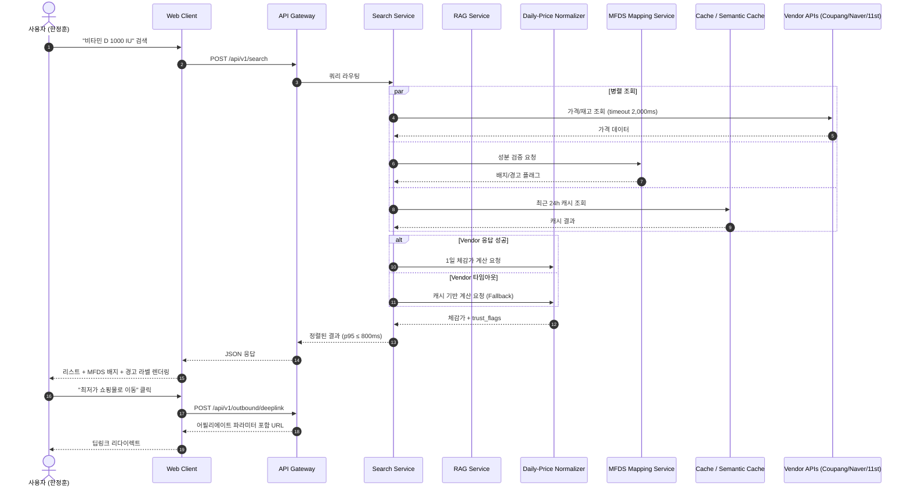
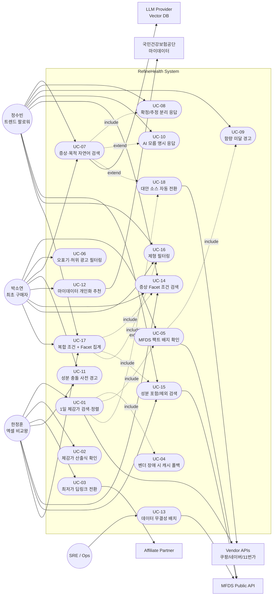
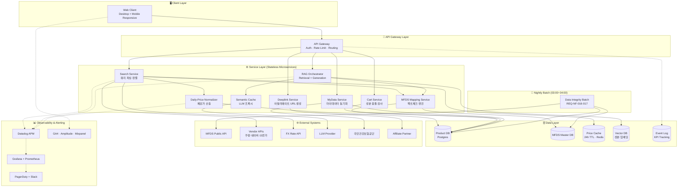
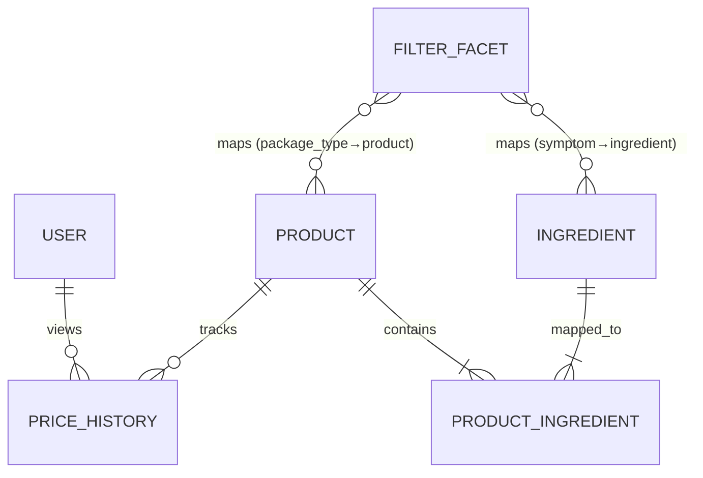
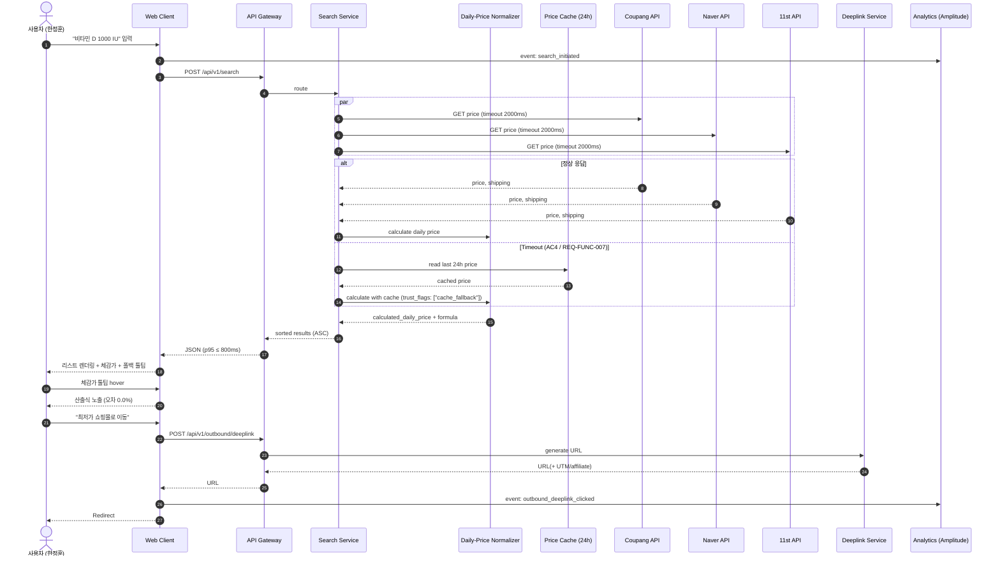
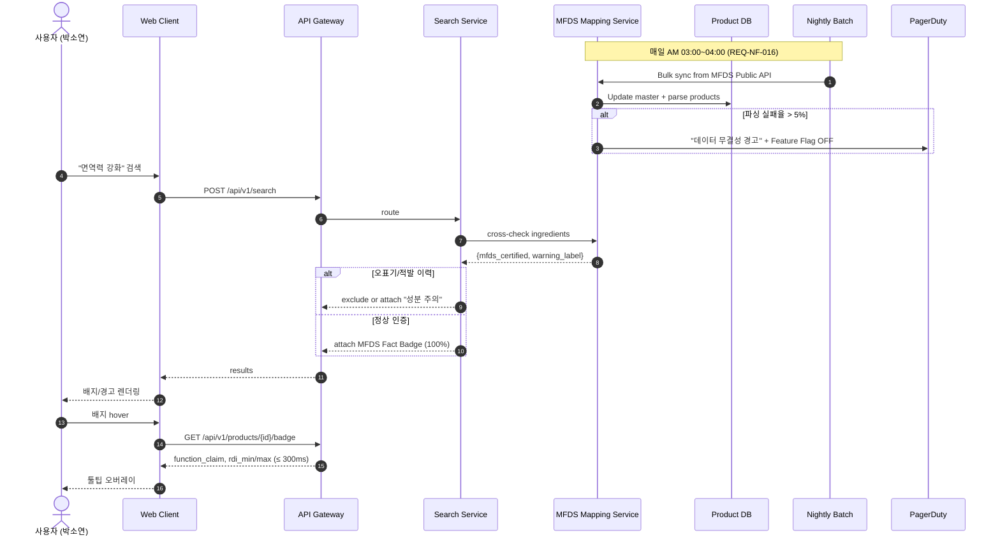
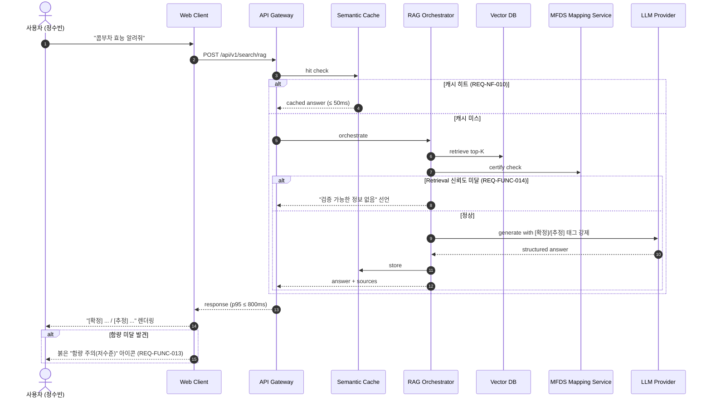
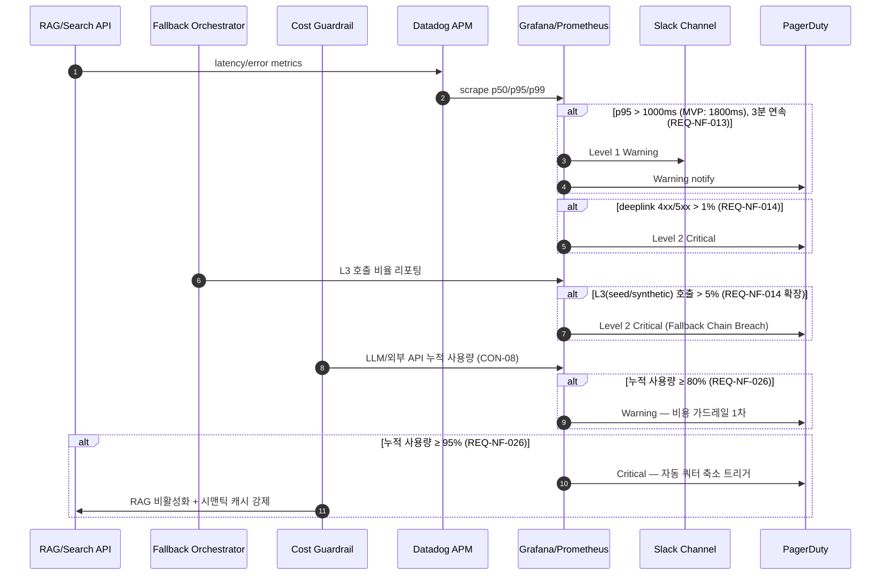
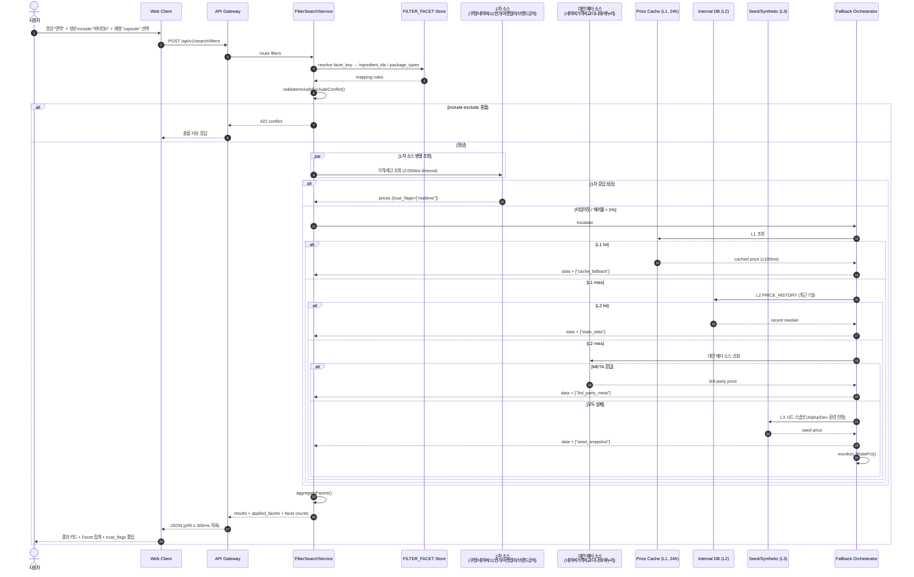

# **Software Requirements Specification (SRS)**

Document ID: SRS-001

Revision: 1.2

Date: 2026-04-18

Standard: ISO/IEC/IEEE 29148:2018

Source PRD: RefineHealth-PRD-v0.2.md

### **Change Log**

| Revision | Date | Author | 주요 변경 사항 |
| --- | --- | --- | --- |
| 1.0 | 2026-04-18 | Mika (SRS Engineer) | PRD 기반 최초 작성. Functional 20건, Non-Functional 24건, Sequence Diagram 5종, ERD 1종. |
| 1.1 | 2026-04-18 | Mika (SRS Engineer) | Use Case View(3.5), Component Architecture(3.6), Class Diagram(6.2.7) 추가. 핵심 UML 다이어그램 커버리지 완성. |
| 1.2 | 2026-04-18 | Mika (SRS Engineer) | ① MVP 월 인프라 비용 제약(CON-08) 신설 및 충돌 NFR에 MVP 조건부 완화 조항 추가. ② Assumptions(ASM-01) 확장 및 대안 데이터 소스 가정(ASM-05) 신설. ③ External Systems에 마켓컬리·브랜드 공식 홈페이지 추가. ④ External Service Fallback Matrix(3.1.2) 신설로 내부 DB 우회 전략 명시. ⑤ 구조화 조건 검색 요구사항 4건(REQ-FUNC-021~024) 및 API-09(`/api/v1/search/filters`) 신설, 검색 조건 ERD(FILTER_FACET) 추가. ⑥ 외부 참조(REF-02~08) 제거 및 근거를 PRD 본문 기반 직접 서술로 치환. |

---

## **1. Introduction**

### **1.1 Purpose**

본 SRS는 건강기능식품 시장의 정보 비대칭성(Lemon Market)과 소비자 인지 과부하(Cognitive Overload)를 해소하기 위한 **RefineHealth** 플랫폼의 소프트웨어 요구사항을 정의한다. RefineHealth는 파편화된 유통 채널과 비표준화된 용량 단위, 라벨링 오표기 리스크로 인해 발생하는 비합리적 구매 결정을 시스템적 연산으로 대체하는 **최종 구매 판단 엔진(Decision-Making Engine)**이다.

**시장 및 문제 맥락 (PRD §1.1 직접 인용 기반)**

- 국내 건강기능식품 구매 경험률은 약 80%에 달하며, 이 중 온라인 채널 매출 비중은 58.9%로 집계된다. 그럼에도 동일 성분 제품 간 가격 차이가 최대 **8.2배**에 달하고, 소비자의 83%는 이 격차를 인지하지 못한다.
- 소비자는 3개 이상의 채널을 동시에 비교해야 하며, 단 3개 제품만 비교하더라도 **평균 45개의 정보 단위**를 처리해야 한다. 이는 인간 단기기억 한계(약 7±2 정보 단위)를 크게 상회하므로 인지 과부하가 구조적으로 발생한다.
- 미국 아마존에서 유통된 면역 관련 건강기능식품 30종 중 **17종(약 56%)이 라벨 표기와 실제 검출 성분이 불일치**하거나 미신고 성분을 포함한 것으로 분석된 바 있으며, 이는 마켓 전반의 라벨링 신뢰 리스크를 대표한다.
- 이러한 구조적 요인으로 55~75%의 사용자가 비교·판단 단계에서 이탈하거나 비합리적 결정을 내린다.

**성능 목표의 근거 (PRD §5.1 기반)**

RAG 파이프라인 p95 ≤ 800ms(Phase 3 목표)는 AI 에이전트 환경에서 이탈률 40% 방지 및 전환율 개선에 요구되는 엔터프라이즈급 성능 임계치다. Phase 3 GA에서는 이기종 가속(FLASH 프레임워크 기반 NVIDIA H200 클래스) 도입으로 꼬리 지연을 축소하되, MVP 단계에서는 CON-08(월 10만원 인프라 비용 상한)에 따라 관리형 LLM API + 시맨틱 캐시 조합으로 대체한다(§1.5.1의 MVP 조건부 완화표 참고).

**범위**

본 문서는 다음을 구현 가능하고 테스트 가능한 수준까지 상세화한다.

- 1일 체감가 정규화 엔진(F1)
- MFDS 공공데이터 기반 팩트체크 파이프라인(F2, 400여 기능성 원료 매핑)
- 다중 채널 딥링킹/어필리에이트 통합(F3)
- 증상·목적 기반 자연어 RAG 검색(F4) 및 구조화 조건 검색(F4 확장: 증상/성분/제형 Facet)
- 성분 충돌/과다 복용 경고(F5)
- 국민건강보험공단 마이데이터 연동(F6)

### **1.2 Scope**

### **1.2.1 In-Scope**

| 구분 | 항목 |
| --- | --- |
| 데이터 수집 | 오픈마켓(쿠팡, 네이버, 11번가) 실시간/배치 스크래핑 |
| 데이터 수집 | 주요 직구 채널 환율 연동 및 단위 정규화(mg/IU/mcg) |
| 검증 엔진 | 식약처(MFDS) 400여 개 기능성 원료 기반 성분 검증 엔진 |
| AI 엔진 | RAG 기반 증상/목적 자연어 추천 시스템 |
| 수익화 | 아웃바운드 딥링크 및 어필리에이트 트래킹 |
| 플랫폼 | 데스크톱 웹 환경 우선 지원(Phase 3에서 모바일 확대) |

### **1.2.2 Out-of-Scope**

| 구분 | 항목 | 제외 사유 |
| --- | --- | --- |
| 의약품 | 전문의약품/일반의약품(OTC) DB 통합 | 규제 영역 상이, 의료법 준수 복잡성 |
| 결제 | 플랫폼 내부 직접 결제 시스템(PG) | 객관적 중개자로서의 포지셔닝 훼손 |
| 재고/물류 | 자체 재고 보유 및 풀필먼트 인프라 | 자본 효율성 저하, 독립성 훼손 |

### **1.2.3 Quantitative Scope Targets (Desired Outcomes)**

| 항목 | 기준선(AS-IS) | 목표(TO-BE) | 관련 NFR |
| --- | --- | --- | --- |
| 탐색·계산 소요 시간 | 평균 42~60분 | 5초 이내 | REQ-NF-001, REQ-NF-002 |
| 최종 구매 전환율(북극성) | 3.5%~5.0% | 10.0% 이상 | REQ-NF-019 |
| MFDS 배지 상호작용 의존도 | 0% | 40.0% 이상 | REQ-NF-020 |
| RAG p95 응답 지연 | 2,000ms | 800ms 이하 | REQ-NF-002, REQ-NF-021 |

### **1.3 Definitions, Acronyms, Abbreviations**

| 용어 | 정의 |
| --- | --- |
| JTBD (Jobs-To-Be-Done) | 사용자가 특정 상황에서 달성하고자 하는 과업 중심의 요구 분석 방법론 |
| AOS (Adjusted Opportunity Score) | 사용자 문제 중요도와 불만족도를 가중 보정한 기회 점수 |
| DOS (Discovered Opportunity Score) | 시장 탐색·조사 과정에서 새로 식별된 기회 점수 |
| Validator | 사용자 가설/요구사항의 타당성을 검증하는 주체 혹은 절차 |
| Persona | 행동·인지 패턴을 기준으로 추상화한 대표 사용자 모델 |
| MFDS | 식품의약품안전처(Ministry of Food and Drug Safety) |
| RDI | Recommended Daily Intake, 1일 권장 섭취량 |
| TUL | Tolerable Upper Intake Level, 1일 상한 섭취 허용량 |
| RAG | Retrieval-Augmented Generation, 검색 증강 생성 |
| FLASH | 이기종 하드웨어 가속을 활용한 꼬리 지연 축소 프레임워크 |
| p50 / p95 / p99 | 응답 시간 백분위수 지표 |
| RPS | Requests Per Second, 초당 처리 요청 수 |
| SAST / DAST | 정적/동적 보안 취약점 분석 |
| PUE | Power Usage Effectiveness, 데이터센터 전력효율지수 |
| Feature Flag | 특정 기능의 노출을 런타임에 제어하는 플래그 |
| Deeplink | 외부 유통사 상세 페이지로 직접 진입시키는 파라미터 포함 URL |
| 1일 체감가 | (실제 판매가 + 기본 배송비) / (총 제공 용량 / 1일 권장 섭취 용량) |

### **1.4 References**

본 SRS는 **PRD(REF-01) 단일 Source of Truth 원칙**을 채택한다. 기존 v1.1에서 외부 문서로 분리 참조했던 임상 분석 결과, 인지 부하 근거, 성능 가속 프레임워크, 시장 통계, 보안 가이드 등은 PRD 본문에 이미 포함되어 있으므로 별도 참조 경로를 두지 않고, 본 SRS의 해당 본문에서 PRD의 근거를 직접 서술하는 방식으로 통합한다. 문서 준거 표준은 상단 헤더의 `Standard:` 필드에 고정되어 있다.

| 참조 ID | 문서/출처 | 비고 |
| --- | --- | --- |
| REF-01 | RefineHealth-PRD-v0.2.md | 본 SRS의 유일한 Source of Truth. 모든 근거(시장 통계, 인지 부하, 허위 라벨링 리스크, 성능 가속 전략 등)는 본 PRD에서 직접 인용한다. |

**Removed from v1.1 (PRD 본문으로 흡수)**

| 구(舊) 참조 ID | 처리 방식 |
| --- | --- |
| REF-02 ISO/IEC/IEEE 29148:2018 | 문서 상단 `Standard:` 필드로 이동. References 테이블에서 제외. |
| REF-03 MFDS 공공데이터 400여 기능성 원료 | 본 SRS 1.2 / 4.1(REQ-FUNC-008) 본문에 직접 서술. |
| REF-04 아마존 임상 분석 56% 오표기 | 1.1 Purpose 본문에 허위 라벨링 리스크 근거로 직접 서술. |
| REF-05 밀러의 법칙 | 1.1 Purpose 본문에 인지 과부하 근거로 직접 서술. |
| REF-06 FLASH / NVIDIA H200 | NFR(REQ-NF-002) 설계 근거로 직접 서술. MVP 단계에서는 CON-08 비용 제약에 따라 적용이 유예된다(§1.5.1, §4.2 참고). |
| REF-07 국내 시장 통계(구매 경험률 80%, 온라인 58.9%) | 1.1 Purpose 본문에 시장 맥락으로 직접 서술. |
| REF-08 OWASP Top 10 / NIST SP 800-53 | 보안 NFR(REQ-NF-006~009) 본문에 설계 근거로 직접 서술. |

### **1.5 Constraints and Assumptions (ADR 통합)**

### **1.5.1 Constraints**

| ID | 제약 구분 | 내용 |
| --- | --- | --- |
| CON-01 | 규제 | MFDS 공공 API는 일일 호출 한도 제약이 있어 실시간 호출 불가. 매일 새벽 Bulk 배치 병합 아키텍처 채택. |
| CON-02 | 법률 | 전문의약품·OTC 데이터는 본 시스템의 취급 범위에서 제외. |
| CON-03 | 플랫폼 | Phase 1~2는 데스크톱 웹 환경 우선. 모바일은 Phase 3에서 확대. |
| CON-04 | 인프라(ESG) | 클라우드 벤더의 데이터센터 PUE ≤ 1.35 충족 사업자만 선정. |
| CON-05 | 보안 | 민감 건강 메타데이터는 AES-256 저장, TLS 1.3 이상 전송 강제. |
| CON-06 | 배포 | SAST/DAST에서 Critical/High 취약점 0건이어야 프로덕션 릴리즈 가능. |
| CON-07 | 결제 | 내부 PG 구축 금지, 외부 유통사 딥링크 전환만 허용. |
| CON-08 | 비용 (MVP) | **MVP 단계(Phase 1 Alpha ~ Phase 2 Closed Beta)의 총 월간 인프라 비용 상한 ≤ 100,000 KRW/월.** 컴퓨트·스토리지·LLM/벡터 DB·외부 API·관측성을 모두 합산한 총량 기준이며, 무료 티어(클라우드 Free Tier, LLM 공용 크레딧 등) 최대 활용을 전제로 한다. Phase 3(GA) 진입 시 본 제약은 재평가되며, 트래픽·전환 지표에 기반하여 예산이 단계적으로 상향된다. |

**CON-08이 유발하는 MVP 기간 NFR 조건부 완화**

CON-08은 기존 성능·가용성 NFR 중 비용 민감 항목과 직접 충돌한다. 다음 항목은 MVP 기간에 한해 조건부 완화하며, Phase 3 진입 시 원래의 NFR 목표를 재적용한다.

| 관련 NFR | MVP 완화 적용치 | Phase 3 GA 복원치 |
| --- | --- | --- |
| REQ-NF-002 (RAG p95 ≤ 800ms) | NVIDIA H200 전용 가속 미도입. 관리형 LLM API + 시맨틱 캐시로 **p95 ≤ 1,500ms** 허용. 캐시 히트 구간은 원래 목표 유지. | p95 ≤ 800ms 복원, 이기종 가속 도입 검토. |
| REQ-NF-003 (5,000 RPS 부하) | k6 피크 테스트 목표치 **≤ 500 RPS**로 축소(10분 기준). | 5,000 RPS 복원. |
| REQ-NF-004 (Uptime 99.99%) | SLO **≥ 99.5%** 로 완화(월 ≤ 약 3.6시간 다운타임 허용). | 99.99% 복원. |
| REQ-NF-011 (PUE ≤ 1.35) | 프리 티어 우선 선정, PUE 기준 **best-effort** 적용(공시 가능한 리전 우선). | PUE ≤ 1.35 엄격 적용. |

### **1.5.2 Assumptions**

| ID | 가정 내용 |
| --- | --- |
| ASM-01 | 오픈마켓 3사(쿠팡/네이버/11번가) 및 마켓컬리, 주요 브랜드 공식 홈페이지의 가격·재고 데이터는 공식 API, 어필리에이트 파트너 피드, 또는 스크래핑 중 가용한 경로를 통해 24시간 내 최신 상태로 확보 가능하다. |
| ASM-02 | 식약처 기능성 원료 공공 DB는 주 단위 이상의 주기로 갱신되며, 일일 Bulk 동기화로 정합성을 유지할 수 있다. |
| ASM-03 | 사용자 단말은 표준 HTTPS/TLS 1.3을 지원하는 최신 브라우저 환경이다. |
| ASM-04 | NVIDIA H200 등 이기종 가속 인프라의 FLASH 프레임워크 운용은 Phase 3(GA) 이후 적용을 전제로 한다. MVP 구간(CON-08)에서는 관리형 LLM API + 시맨틱 캐시 조합으로 대체한다. |
| ASM-05 | **ASM-01의 1차 데이터 소스가 가용하지 않거나 불충분한 경우, 다음 대안 데이터 소스 계층을 순차적으로 활용할 수 있다.** ① **가격비교 메타 소스**: 네이버쇼핑 가격비교 공개 페이지, 다나와, 에누리 등 3rd-party 가격비교 사이트의 스크래핑 또는 공식 파트너 피드. ② **내부 Price Cache**: Redis 기반 24시간 TTL 캐시 및 `PRICE_HISTORY` 테이블(최근 7일 윈도우). ③ **사전 확보 시드 DB**: 서비스 론칭 전 수집·정제된 Top 200 SKU 상품 마스터 및 정적 가격 스냅샷. ④ **더미/목업 데이터셋**: 개발·스테이징·Alpha 환경 한정으로 사용하는 합성 가격 데이터. 각 소스는 응답 데이터에 `trust_flags`(`cache_fallback`, `3rd_party_meta`, `seed_snapshot`, `synthetic`)를 부착하여 사용자에게 신뢰도 저하 사유가 명시되도록 한다(§3.1.2 Fallback Matrix 참고). |

### **1.5.3 Key Risks (요약)**

| ID | 리스크 | 완화 전략 | 관련 REQ |
| --- | --- | --- | --- |
| RSK-01 | 벤더 스크래핑 구조 변경으로 가격 수집 실패 | 에러율 1% 초과 시 PagerDuty 알림, 프록시 풀 + 공식 API Fallback | REQ-FUNC-007, REQ-NF-014 |
| RSK-02 | 해외 직구 허위 라벨링 | MFDS 교차 검증 실패 시 면책 경고 강제 노출 | REQ-FUNC-009 |
| RSK-03 | RAG 추론 지연 | 고빈도 쿼리 시맨틱 캐시(50ms 이내), 복잡 쿼리 FLASH 스트리밍 | REQ-NF-002, REQ-NF-010 |
| RSK-04 | LLM Hallucination | "모름 명시 원칙" 강제, 확정/추정 텍스트 분리 | REQ-FUNC-012, REQ-FUNC-014 |

---

## **2. Stakeholders**

| Stakeholder | Role | Responsibility | Primary Interest |
| --- | --- | --- | --- |
| 한정훈 (36세, IT 개발자) — 엑셀 비교왕 | End User (Cost-Optimizer) | 가성비 기반 구매 판단 수행 | 1일 체감 최저가 5초 이내 산출, 딥링크 즉시 전환 |
| 박소연 (43세, HR 매니저) — 검진 후 최초 구매자 | End User (Health-Trigger Entrant) | 가족 건강을 위한 신뢰 기반 구매 | MFDS 검증 기반 안전성·권장량 확인, 마케팅 노이즈 배제 |
| 정수빈 (27세, 마케터) — 트렌드 팔로워 | End User (Trend Explorer) | 유행 성분의 팩트체크 기반 합리 소비 | 유효 성분 함량 검증, 기능성 인정 여부 확인 |
| Product Owner / PM | Product Leadership | 요구사항 승인, 우선순위 확정, 로드맵 관리 | KPI 달성(북극성 10%), MSCW 우선순위 준수 |
| ML/AI Engineer | Development | RAG 파이프라인, LLM, 시맨틱 캐시 구현 | p95 800ms, Hallucination 0건 |
| Backend Engineer | Development | 가격 정규화·MFDS 매핑·딥링크 모듈 | 데이터 정합성, 오류율 0.1% 이하 |
| Data/Crawling Engineer | Data Pipeline | 벤더 스크래핑, Bulk 배치 운영 | 수집 안정성, 파싱 실패율 관리 |
| SRE / DevOps | Operations | 가용성, 관측성, 알림 체계 운영 | 99.99% Uptime, p95/p99 준수 |
| Security Engineer | Security | AES-256/TLS 1.3, SAST/DAST, PII 마스킹 | Critical/High 취약점 0건 |
| QA Engineer | Quality Assurance | AC 기반 테스트, k6 부하 테스트, A/B 무결성 | 테스트 커버리지, AC 통과율 |
| MFDS (식품의약품안전처) | External Data Provider | 400여 기능성 원료 공공데이터 제공 | 공공데이터 신뢰성 유지 |
| 오픈마켓 3사 (쿠팡/네이버/11번가) | External Data Source / Affiliate Partner | 가격·재고 데이터 제공, 어필리에이트 수수료 | 트래픽 유입, 파트너 SLA 준수 |
| Cloud / GPU Vendor | Infrastructure Provider | NVIDIA H200 등 가속 인프라, PUE ≤ 1.35 데이터센터 제공 | ESG 준수, SLA 준수 |

---

## **3. System Context and Interfaces**

### **3.1 External Systems**

### **3.1.1 External System Inventory**

| 외부 시스템 | 역할 | 연동 방식 | 제약/SLA |
| --- | --- | --- | --- |
| MFDS 공공데이터 API | 기능성 원료·RDI/TUL 마스터 | 일일 Bulk 비동기 배치(AM 03:00~04:00) | 호출 한도 제약, 단방향 수신 |
| 쿠팡 / 네이버 / 11번가 | 1차 가격·배송비·재고 수집 소스 | 실시간 스크래핑 + 공식 API Fallback + 24시간 캐시 | 2,000ms 타임아웃 시 캐시 폴백 |
| **마켓컬리 (신규)** | 프리미엄·신선 유통 채널 가격 보강 | 스크래핑 + 어필리에이트 파트너 피드(가용 시) + 24h 캐시 | 2,000ms 타임아웃 시 캐시 폴백 |
| **브랜드 공식 홈페이지 (신규)** | 브랜드 직판가·공식 단독 할인가 수집 | 화이트리스트 도메인 스크래핑(robots.txt 준수) + 24h 캐시 | 오픈마켓 대비 상대적 저빈도 갱신 허용, 2,000ms 타임아웃 시 캐시 폴백 |
| 아이허브 등 직구 채널 | 해외 가격/환율 연동 | 배치 수집 + 환율 API 연동 | 단위 정규화 필요 |
| 네이버쇼핑 가격비교 / 다나와 / 에누리 (대안 소스) | 1차 소스 불가 시 가격 메타 정보 보강 | 스크래핑 또는 공식 제휴 피드 | 응답에 `trust_flags=["3rd_party_meta"]` 강제 부착 |
| LLM Provider / Vector DB | RAG 검색·추론 | Semantic Cache 프록시 경유 | 토큰 비용 방어 필수, MVP에서 CON-08 준수 |
| Datadog APM / Grafana·Prometheus | 관측성 | 엔드포인트별 p50/p95/p99 수집 | 실시간 로깅 |
| GA4 / Amplitude / Mixpanel | 사용자 행동 분석 | 이벤트 트래킹 | KPI 측정 근거 |
| PagerDuty / Slack | 장애 알림 | Webhook | Level 1/2 알림 채널 |
| 국민건강보험공단 (Phase 3+, F6) | 마이데이터 | OAuth 기반 동의 스크래핑 | 개인정보 강한 암호화 필수 |

### **3.1.2 External Service Fallback Matrix**

외부 서비스가 일시적으로 가용하지 않거나(타임아웃, 4xx/5xx, 구조 변경) 호출 한도·비용 제약으로 차단된 경우, 사용자 경험을 끊지 않기 위한 **3계층 우회 전략**을 정의한다. 모든 Fallback 경로는 응답 페이로드의 `trust_flags` 배열에 해당 플래그를 부착해야 하며(REQ-FUNC-007 확장), 프론트엔드는 플래그 종류에 따라 툴팁/아이콘을 차등 노출한다.

**Fallback 계층 원칙**

- **L1 — 내부 캐시 (Hot Path)**: 최근 24시간 Redis 캐시. 100ms 이내 응답. 일반적 네트워크 실패의 95% 이상 커버.
- **L2 — 내부 마스터/히스토리 DB (Warm Path)**: `PRODUCT`/`PRICE_HISTORY`/`MFDS_MASTER` 테이블. 최근 7일 이내 데이터 허용, 7일 초과 시 `trust_flags=["stale_data"]`.
- **L3 — 시드/더미 데이터 (Cold / Dev Path)**: 서비스 론칭 전 사전 확보한 Top 200 SKU 시드 스냅샷 및 합성 데이터. **프로덕션 사용자 화면에는 노출 금지이며, 개발·스테이징·Alpha 환경 한정**으로만 사용. 사용 시 `trust_flags=["seed_snapshot"]` 또는 `["synthetic"]` 강제 부착.

**외부 시스템별 Fallback 경로**

| 외부 시스템 | 장애 트리거 | L1 (캐시) | L2 (내부 DB) | L3 (시드/더미) | 사용자 노출 |
| --- | --- | --- | --- | --- | --- |
| 쿠팡/네이버/11번가 | 타임아웃 2,000ms 또는 에러율 > 1% | Redis 24h Price Cache → 100ms 응답 | `PRICE_HISTORY` 최근 7일 Median | 시드 SKU 가격 스냅샷(Alpha 한정) | `cache_fallback` 붉은 툴팁 + "실시간 동기화 지연" 문구 |
| 마켓컬리 | 동상 | 동상 | 동상 | 동상 | 동상 |
| 브랜드 공식 홈페이지 | 타임아웃 또는 페이지 구조 변경 | Redis 24h 캐시 | `PRICE_HISTORY` 브랜드 채널 레코드 | 브랜드 공식 스냅샷(Alpha 한정) | 동상 |
| MFDS 공공 API | 일일 Bulk 배치 실패 또는 호출 한도 초과 | 전일 배치 결과(≤ 24h) | `MFDS_MASTER` 테이블 마지막 성공 스냅샷 | 400여 원료 시드 데이터셋 | `mfds_stale` 플래그 + 배지 렌더링 유지(최대 72h) |
| LLM Provider / Vector DB | LLM 5xx 또는 토큰 한도(CON-08) 초과 | Semantic Cache 히트(≤ 50ms) | 사전 정의된 FAQ/템플릿 응답 세트 | "모름 명시" 선언(REQ-FUNC-014) | `cache_hit` 또는 `unknown_declared` |
| FX Rate API | 환율 API 응답 없음 | 당일 고시 환율 캐시 | 전일 환율 스냅샷(최대 48h) | 고정 환율표(Alpha 한정) | `fx_stale` 플래그 |
| 국민건강보험공단(F6) | OAuth 실패 또는 점검 | 동의 유효 기간 내 마지막 동기화 스냅샷 | 사용자 수동 입력 보완 | (해당 없음, 민감 정보) | `mydata_stale` 플래그, 개인화 가중치 축소 |

**Fallback 체인 종료 조건**

- L1·L2·L3 모두 실패하는 경우 검색 결과는 "일시적으로 가격 정보를 제공할 수 없습니다" 플레이스홀더 카드로 대체하며, 상품 카드 자체는 MFDS 정보만으로 렌더링한다(`trust_flags=["price_unavailable"]`).
- Fallback 체인이 작동 중임을 **SRE 대시보드(REQ-NF-012)에 실시간 노출**하고, L3까지 내려간 호출이 전체의 5% 초과 시 PagerDuty Level 2 Critical을 발송한다(REQ-NF-014 확장).

### **3.2 Client Applications**

| 구분 | 우선순위 | 비고 |
| --- | --- | --- |
| Desktop Web | Phase 1 우선 | 데스크톱 환경 우선 고도화 |
| Mobile Web (Responsive) | Phase 3 확대 | 터치 기반 배지 Hover 대응 포함 |
| Native Mobile App | Won't (본 단계) | 향후 로드맵 |

### **3.3 API Overview**

| API ID | Endpoint | 용도 | 내/외부 |
| --- | --- | --- | --- |
| API-01 | `POST /api/v1/search` | 일반 상품 검색 및 정렬 | Internal |
| API-02 | `POST /api/v1/search/rag` | 증상/목적 자연어 RAG 검색 | Internal |
| API-03 | `POST /api/v1/price/calculate-daily` | 1일 체감가 계산 코어 | Internal |
| API-04 | `GET /api/v1/products/{id}/badge` | MFDS 팩트 배지 및 성분 검증 결과 | Internal |
| API-05 | `POST /api/v1/outbound/deeplink` | 어필리에이트 파라미터 포함 딥링크 생성 | Internal |
| API-06 | `GET /api/v1/ingredients/{id}` | 성분 상세(표준명, 효능, RDI/TUL) | Internal |
| API-07 | `POST /api/v1/cart/interaction-check` | 성분 충돌·과다 복용 사전 경고(F5) | Internal |
| API-08 | `POST /api/v1/mydata/sync` | 국민건강보험공단 검진 데이터 연동(F6) | Internal |
| **API-09** | **`POST /api/v1/search/filters`** | **구조화 조건 검색(증상/성분/제형/인증/가격대 Facet)** | **Internal** |
| **API-10** | **`GET /api/v1/search/facets`** | **현재 결과 집합에 대한 Facet 집계(각 옵션별 매칭 건수 반환)** | **Internal** |
| EXT-01 | MFDS Public Data API | 기능성 원료 Bulk 동기화 | External |
| EXT-02 | Coupang / Naver / 11st Vendor API | 1차 가격/재고 조회 | External |
| **EXT-03** | **Kurly / Brand Official Sites** | **마켓컬리·브랜드 공식 홈페이지 가격 수집** | External |
| EXT-04 | FX Rate API | 해외 직구 환율 환산 | External |
| **EXT-05** | **3rd-Party Price Meta (Naver Shopping 가격비교, Danawa, Enuri)** | **1차 소스 장애 시 대안 가격 메타 소스** | External |

### **3.4 Interaction Sequences (핵심 시퀀스)**

### **3.5 Use Case View**

Mermaid는 공식적인 UML UseCase 표기를 지원하지 않으므로, 동등한 의미를 갖는 `flowchart` 기반 표기를 사용한다. 원형 노드는 **액터(Actor)**, 라운드형 노드는 **유스케이스(UseCase)**, 사각형 노드는 **외부 시스템(Supporting Actor)** 으로 구분한다.

### **3.5.1 Use Case Inventory**

| UC ID | Use Case | Primary Actor | Supporting Actor | 관련 REQ |
| --- | --- | --- | --- | --- |
| UC-01 | 1일 체감가 검색 및 정렬 | 한정훈 | Vendor APIs, Price Cache | REQ-FUNC-001~004, REQ-NF-001 |
| UC-02 | 체감가 산출식 확인 | 한정훈 | — | REQ-FUNC-005 |
| UC-03 | 최저가 딥링크 전환 | 한정훈 | Affiliate Partner | REQ-FUNC-006, REQ-NF-015 |
| UC-04 | 벤더 장애 시 캐시 폴백 조회 | 한정훈 (System-initiated) | Price Cache | REQ-FUNC-007 |
| UC-05 | MFDS 팩트 배지 확인 | 박소연 | MFDS Master | REQ-FUNC-008, REQ-FUNC-010 |
| UC-06 | 오표기/허위 광고 필터링 | 박소연 (System-enforced) | MFDS Master | REQ-FUNC-009 |
| UC-07 | 증상·목적 기반 자연어 검색(RAG) | 박소연, 정수빈 | LLM Provider, Vector DB | REQ-FUNC-015, REQ-NF-002 |
| UC-08 | 확정/추정 분리 응답 수신 | 정수빈 | LLM Provider | REQ-FUNC-012 |
| UC-09 | 함량 미달 경고 확인 | 정수빈 | — | REQ-FUNC-013 |
| UC-10 | AI 모름 명시 응답 수신 | 정수빈 | LLM Provider | REQ-FUNC-014 |
| UC-11 | 장바구니 성분 충돌 사전 경고 | 한정훈, 박소연 | — | REQ-FUNC-016 |
| UC-12 | 마이데이터 기반 개인화 추천 | 박소연 | 국민건강보험공단 | REQ-FUNC-017, REQ-NF-024 |
| UC-13 | 데이터 무결성 배치 (운영) | SRE | MFDS Public API | REQ-FUNC-011, REQ-NF-016, REQ-NF-017 |
| **UC-14** | **증상/목적 Facet 기반 조건 검색** | **박소연, 한정훈, 정수빈** | — | **REQ-FUNC-021** |
| **UC-15** | **성분 포함/제외 조건 검색** | **한정훈, 정수빈** | MFDS Master | **REQ-FUNC-022** |
| **UC-16** | **제형(정제/캡슐/분말/구미/액상) 필터링** | **박소연, 정수빈** | — | **REQ-FUNC-023** |
| **UC-17** | **복합 조건 검색 및 Facet 집계** | **한정훈, 박소연, 정수빈** | — | **REQ-FUNC-024** |
| **UC-18** | **외부 소스 장애 시 대안 데이터 소스 자동 전환** | **System-initiated** | 3rd-Party Price Meta, Internal DB | **ASM-05, REQ-FUNC-007 확장** |

### **3.5.2 Use Case Diagram (Mermaid)**

### **3.6 Component Architecture**

시스템은 **클라이언트 / API Gateway / 서비스 레이어 / 데이터 레이어 / 외부 시스템 / 관측성 레이어**의 6개 논리 구획으로 구성된다. 모든 서비스는 Stateless 마이크로서비스로 수평 확장 가능해야 한다(REQ-NF-023).

**컴포넌트 책임 요약**

| 컴포넌트 | 책임 | 주요 REQ |
| --- | --- | --- |
| API Gateway | 인증·레이트 리밋·라우팅, 이벤트 로깅 | REQ-NF-007, REQ-FUNC-019 |
| Search Service | 쿼리 파싱, 벤더 병렬 호출, 결과 정렬, **구조화 Facet 조건 검색(증상/성분/제형/인증)**, Facet 집계 | REQ-FUNC-001, 002, 004, **021~024** |
| Daily-Price Normalizer | 체감가 수학적 환산, 오차율 0% | REQ-FUNC-003 |
| MFDS Mapping Service | 기능성 원료 매핑, 오표기 탐지, 배지 판정, 성분 메타데이터(효능·RDI·TUL) 제공 | REQ-FUNC-008~011, REQ-FUNC-022 |
| RAG Orchestrator | Retrieval, [확정]/[추정] 분리, 모름 선언 | REQ-FUNC-012, 014, 015 |
| Semantic Cache | 고빈도 쿼리 50ms 반환, LLM 비용 방어 | REQ-NF-010 |
| Deeplink Service | UTM/Affiliate URL 생성, 링크 무결성 | REQ-FUNC-006, REQ-NF-015 |
| Cart Service | 성분 총합 계산, TUL 초과 경고 | REQ-FUNC-016 |
| MyData Service | OAuth 동의, 검진 데이터 수신, 동의 철회 삭제 | REQ-FUNC-017, REQ-NF-024 |
| Price Cache (Redis) | 24h TTL, 벤더 장애 폴백 공급 | REQ-FUNC-007 |
| Vector DB | 성분/효능 임베딩, Top-K Retrieval | REQ-FUNC-015 |
| Data Integrity Batch | MFDS 동기화, 파싱 실패 감시, Feature Flag 제어 | REQ-NF-016, 017, REQ-FUNC-011 |
| **Fallback Orchestrator** | **외부 소스 장애 시 L1→L2→L3 자동 계층 전환, `trust_flags` 부착, PagerDuty 알림** | **ASM-05, REQ-FUNC-007 확장, REQ-NF-014** |

---

## **4. Specific Requirements**

### **4.1 Functional Requirements**

우선순위 표기: **M**(Must) / **S**(Should) / **C**(Could) / **W**(Won't, 이번 단계 제외)

| REQ ID | Source (Story / Feature) | 요구사항 | Acceptance Criteria (Given/When/Then) | Priority |
| --- | --- | --- | --- | --- |
| REQ-FUNC-001 | Story 1 / F1 | 사용자는 단일 검색창에 성분명+함량(예: "비타민 D 1000 IU") 자연어를 입력하여 검색을 시작할 수 있어야 한다. | G: 사용자가 검색창을 활성화, W: 자연어 쿼리를 입력·제출, T: 시스템은 해당 쿼리를 성분·함량 토큰으로 파싱하여 내부 검색 파이프라인으로 전달한다. | M |
| REQ-FUNC-002 | Story 1 / F1 | 검색 서비스는 쿠팡/네이버/11번가 등 3개 이상 외부 가격 API를 **병렬**로 조회해야 한다. | G: 검색 요청 수신, W: 3개 이상의 벤더 엔드포인트 호출, T: 모든 호출이 병렬(Parallel) 실행되며 직렬 실행이 관측되지 않는다(APM Trace 검증). | M |
| REQ-FUNC-003 | Story 1 / F1 | 시스템은 `(실제 판매가 + 기본 배송비) / (총 제공 용량 / 1일 권장 섭취 용량)` 공식으로 1일 체감가를 산출해야 한다. | G: 벤더 가격·배송비·용량·RDI 데이터 수신, W: 정규화 엔진 실행, T: 산출값이 백엔드 DB 원본과 **오차율 0.0%** 일치한다. | M |
| REQ-FUNC-004 | Story 1 / F1 | 검색 결과는 1일 체감가 기준 **오름차순 정렬**되어 클라이언트에 반환되어야 한다. | G: 체감가 산출 완료, W: 응답 직전, T: 결과 배열이 `calculated_daily_price ASC`로 정렬되고, 동가일 경우 `mfds_certified=true` 제품이 우선한다. | M |
| REQ-FUNC-005 | Story 1 / F1 | 각 상품 카드는 '1일 체감가 산출식'을 툴팁/모달로 제공해야 한다. | G: 결과 리스트 노출, W: 사용자가 체감가 UI 위에 hover/click, T: 산출 공식과 입력 변수(판매가/배송비/용량/RDI)가 **명시적으로 노출**된다. | M |
| REQ-FUNC-006 | Story 1 / F3 | "최저가 쇼핑몰로 이동" 버튼은 어필리에이트 파라미터가 결합된 딥링크로 전환해야 한다. | G: 사용자가 아웃바운드 버튼 클릭, W: 딥링크 생성 API 호출, T: UTM/Affiliate ID가 포함된 URL로 리다이렉트되고 이벤트 `outbound_deeplink_clicked`가 기록된다. | M |
| REQ-FUNC-007 | Story 1 / F1 / RSK-01 | 벤더 API가 2,000ms 내 응답하지 않을 경우 **자체 DB의 24시간 내 캐시 가격**으로 폴백 렌더링하고, "실시간 가격 동기화 지연(캐시 데이터 기준)" 툴팁을 붉은색으로 노출해야 한다. | G: 검색 중 벤더 API 호출, W: 2,000ms 내 응답 미수신, T: **100ms 이내** 캐시 가격으로 폴백 응답하고 지연 경고 툴팁이 가격 옆에 표시된다. | M |
| REQ-FUNC-008 | Story 2 / F2 | MFDS 등록 400여 기능성 원료를 기준치 이상 함유한 제품에는 "식약처 기능성 인정 완료 (MFDS Fact Badge)"를 **100% 노출 확률**로 렌더링해야 한다. | G: 제품 상세 뷰 진입, W: `mfds_certified=true` AND `actual_amount ≥ rdi_min`, T: 제품명 옆 초록색 배지가 렌더링된다. | M |
| REQ-FUNC-009 | Story 2 / F2 / RSK-02 | 라벨 표기 성분과 실제 성분이 불일치하거나 적발 이력이 있는 제품은 **검색 결과에서 배제**되거나 붉은색 "성분 주의" 경고 라벨이 강제 부착되어야 한다. | G: 목적 기반 쿼리 실행, W: MFDS 교차검증에서 불일치 판정, T: 해당 제품이 결과에서 제외되거나 `warning_label="성분 주의"` 필드가 강제 부착되어 렌더링된다. | M |
| REQ-FUNC-010 | Story 2 / F2 | MFDS 팩트 배지 hover/tap 시 식약처 공식 기능성 인정 내용과 일일 권장 섭취 범위 툴팁을 **300ms 이내** 노출해야 한다. | G: 배지 렌더링 상태, W: 사용자가 hover 또는 tap, T: 오버레이 툴팁이 300ms 이내 표시되고 `function_claim`, `rdi_min`, `rdi_max`가 포함된다. | M |
| REQ-FUNC-011 | Story 2 / F2 / RSK-01 | 특정 벤더의 성분 파싱 실패율이 전체의 5%를 초과하면 MFDS 배지 노출을 **Feature Flag Off**하고 "데이터 무결성 경고" 알림을 PagerDuty로 자동 발송해야 한다. | G: 배치 대조 작업 실행, W: 파싱 실패율 > 5%, T: 해당 벤더 범위의 배지 Flag가 즉시 Off 되고 PagerDuty 알림이 발송된다. | M |
| REQ-FUNC-012 | Story 3 / F2·F4 | AI 응답은 건강기능식품 인증 원료는 "확정(건강기능식품)", 유행성 일반식품 원료는 "추정(일반식품, 기능성 미인증)"으로 **명시적 텍스트 분리**해야 한다. | G: 자연어 성분 질의, W: RAG 생성 직전 필터링, T: 응답 텍스트 내 `[확정]` 또는 `[추정]` 태그가 필수 포함되고, 미인증 원료에 대한 단정형 서술이 금지된다. | M |
| REQ-FUNC-013 | Story 3 / F2 | 제품의 1일 섭취 기준 유효 성분이 RDI Min의 **50% 미만**일 경우 "함량 주의(저수준)" 경고 아이콘을 제품 카드에 강제 렌더링해야 한다. | G: 결과 리스트 렌더링, W: `actual_amount < rdi_min × 0.5`, T: 붉은색 경고 아이콘이 100% 가시성으로 표시되고 tooltip에 "식약처 권장량 미달" 문구가 출력된다. | M |
| REQ-FUNC-014 | Story 3 / F4 / RSK-04 | RAG Retrieval 단계에서 MFDS/FDA/NIH 데이터 검색 실패 시 AI는 **임의 생성**을 중단하고 "현재 식약처 공식 인증 데이터베이스 및 신뢰할 수 있는 문헌에서 검증 가능한 정보가 없습니다."라고 명시해야 한다. | G: 신물질 효능 질의, W: Retrieval 결과 신뢰도 임계값 미달, T: 모델 생성이 중단되고 사전 정의된 "모름 선언" 문구가 응답으로 반환된다. | M |
| REQ-FUNC-015 | F4 | 시스템은 "요즘 잠을 못 자서 피곤해" 등 증상·목적 기반 자연어를 벡터 임베딩하여 식약처 인증 성분과 매핑해 추천해야 한다. | G: 증상 기반 자연어 질의, W: 벡터 검색 실행, T: Top-K 후보가 MFDS 인증 성분 기준으로 매핑되어 반환되고 각 후보에 `mfds_certified` 플래그가 포함된다. | S |
| REQ-FUNC-016 | F5 | 장바구니/관심 목록 내 복수 제품의 성분 총합이 TUL을 초과할 경우 UI 경고를 발생시켜야 한다. | G: 장바구니에 2개 이상 제품 존재, W: 성분 합산 계산, T: 특정 성분 합계 > `rdi_max(TUL)`인 경우 경고 모달이 노출되고 `/api/v1/cart/interaction-check` 응답에 위반 성분 목록이 포함된다. | S |
| REQ-FUNC-017 | F6 | OAuth 동의 하에 국민건강보험공단 검진 결과를 불러와 부족 영양소를 도출·추천해야 한다. | G: 사용자가 마이데이터 동의 완료, W: 검진 수치(콜레스테롤·공복혈당 등) 수신, T: 결핍 후보 성분이 도출되고 개인화 추천 리스트에 우선 노출된다. | C |
| REQ-FUNC-018 | 범위 제약 / Won't | 자체 재고 보유 및 풀필먼트 기능을 구현하지 않는다. | G: 제품 구매 플로우, W: 사용자가 "구매" 의도 행동, T: 내부 PG 호출이 존재하지 않고 외부 유통사 딥링크로만 전환된다. | W |
| REQ-FUNC-019 | KPI 측정 | 모든 검색 요청 시작 시 `search_initiated` 이벤트를, 아웃바운드 클릭 시 `outbound_deeplink_clicked` 이벤트를 Amplitude/Mixpanel로 전송해야 한다. | G: 검색 시작 또는 딥링크 클릭, W: 이벤트 트리거, T: 세션/사용자 ID 포함 이벤트가 분석 도구에 1시간 이내 도달한다. | M |
| REQ-FUNC-020 | KPI 측정 | MFDS 팩트 배지 영역에 대한 `hover_duration` 및 `click` 이벤트를 GA4로 전송해야 한다. | G: 배지 UI 렌더링, W: hover > 500ms 또는 click 발생, T: 세션 단위 이벤트가 기록되고 배지 상호작용 의존도 KPI 산출에 사용된다. | M |
| REQ-FUNC-021 | 조건 검색 / F4 확장 | 사용자는 검색 결과에 대해 **증상·목적 Facet(면역, 수면, 피로, 눈 건강, 관절, 장 건강 등 MFDS 기능성 클레임에 매핑된 프리셋)** 을 선택하여 결과를 제약할 수 있어야 한다. | G: 검색 결과 페이지, W: 사용자가 하나 이상의 증상 Facet을 선택, T: 결과가 해당 Facet에 매핑된 MFDS 인증 성분을 포함한 상품으로 한정되고, 응답 스키마에 `applied_facets.symptom`이 반영되며 p95 ≤ 300ms로 재렌더링된다. | M |
| REQ-FUNC-022 | 조건 검색 / F4 확장 | 사용자는 **성분 Facet(include/exclude 이중 집합)** 을 지정해 특정 성분을 포함 혹은 배제한 결과만 볼 수 있어야 한다. | G: 검색 결과 페이지, W: 사용자가 `include:[비타민D, 오메가-3]` 및 `exclude:[카페인]`을 지정, T: 모든 결과가 include 성분을 최소 1개 포함하고 exclude 성분을 0개 포함하며, 응답에 `applied_facets.ingredients`가 반영된다. include/exclude가 서로 충돌하는 성분 조합에 대해서는 422 오류와 사유를 반환한다. | M |
| REQ-FUNC-023 | 조건 검색 / F4 확장 | 사용자는 **제형(package_type) Facet — 정제, 캡슐, 연질캡슐, 분말, 구미, 액상, 젤리 등** 을 선택하여 결과를 한정할 수 있어야 한다. | G: 검색 결과 페이지, W: 사용자가 하나 이상의 제형을 선택, T: 결과가 `PRODUCT.package_type` 기준으로 필터링되고, 각 옵션 우측에 현재 결과 집합에서의 매칭 건수가 Facet 집계로 동시 노출된다. | M |
| REQ-FUNC-024 | 조건 검색 / F4 확장 | 시스템은 REQ-FUNC-021~023 및 추가 조건(MFDS 인증 여부, 1일 체감가 구간, 브랜드, 유통 채널)을 **AND 복합 조건**으로 조합하고, Facet별 매칭 건수 집계를 `GET /api/v1/search/facets`로 반환해야 한다. | G: 검색 결과 페이지, W: 사용자가 2개 이상 Facet 조합 지정, T: 응답 본문에 `results[]`와 `facets[]`(각 옵션별 `count`)가 동시 포함되고, 선택 해제 시 AND 조합이 자동 재계산되어 p95 ≤ 300ms로 재응답한다. | M |

### **4.2 Non-Functional Requirements**

| REQ ID | 분류 | 요구사항 | 측정 방법 / 임계치 | Priority |
| --- | --- | --- | --- | --- |
| REQ-NF-001 | Performance | 코어 API(검색·정렬) **p95 ≤ 300ms** | Datadog APM 엔드포인트 지연 시간 | M |
| REQ-NF-002 | Performance | RAG 파이프라인(`/api/v1/search/rag`) **Phase 3 목표: p95 ≤ 800ms** (서버 연산 시간 기준, 네트워크 I/O 제외). **MVP 완화치(CON-08): p95 ≤ 1,500ms** | Datadog APM 상위 5% 로깅 | M |
| REQ-NF-003 | Throughput | 검색 코어 API는 **Phase 3 목표: 5,000 RPS** 부하에서도 p95 ≤ 800ms 유지. **MVP 완화치(CON-08): 500 RPS** 기준 | k6 10분 피크 부하 테스트 릴리즈 전 통과 | M |
| REQ-NF-004 | Availability | 핵심 검색 엔진·체감가 계산 모듈 월별 **Phase 3 목표: Uptime ≥ 99.99%**. **MVP 완화치(CON-08): Uptime ≥ 99.5%** | Grafana Uptime 대시보드 / SLO 리포트 | M |
| REQ-NF-005 | Reliability | 내부 마이크로서비스 간 통신·계산 오류율 **≤ 0.1%** | Prometheus 에러율 지표 | M |
| REQ-NF-006 | Security | 민감 건강 메타데이터 저장 시 **AES-256 암호화** (OWASP Top 10 A02, NIST SP 800-53 SC-28 준수 설계) | DB 스키마 감사 / Key Rotation 로그 | M |
| REQ-NF-007 | Security | 모든 전송 구간 **TLS 1.3 이상** 강제 (OWASP A02, NIST SC-8 준수 설계) | SSL/TLS 스캔 리포트 | M |
| REQ-NF-008 | Security | 로그 시스템(Datadog/ELK) 내 PII는 **100% 마스킹(***)** (OWASP A09 로깅/모니터링, NIST AU-11 준수 설계) | 정기 자동화 스크립트 검증 | M |
| REQ-NF-009 | Security | 릴리즈 시 SonarQube 기반 SAST/DAST에서 **Critical/High 취약점 0건** (OWASP A06 취약 컴포넌트 관리 준수 설계) | CI/CD 게이트 통과 이력 | M |
| REQ-NF-010 | Cost / Performance | LLM 프록시에 **시맨틱 캐시** 계층 적용, 고빈도 쿼리 응답 **≤ 50ms** | Cache Hit Ratio, 응답 시간 로그 | M |
| REQ-NF-011 | ESG | **Phase 3 목표: 인프라 벤더 데이터센터 PUE ≤ 1.35**. **MVP(CON-08) 완화치: 무료 티어/저비용 리전 우선 선정, PUE는 best-effort** | 벤더 인증서/공시 자료 | M (Phase 3) / S (MVP) |
| REQ-NF-012 | Observability | p50/p95/p99 Latency 및 엔드포인트별 에러율 실시간 대시보드 운영 | Grafana + Prometheus | M |
| REQ-NF-013 | Alerting | AI 검색 API p95 > 1,000ms(MVP: 1,800ms)가 **3분 연속** 지속 시 Slack + PagerDuty "Warning" 알림 | PagerDuty 알림 이력 | M |
| REQ-NF-014 | Alerting | 아웃바운드 딥링크 404/500 에러 비율이 전체 트래픽의 **1% 초과** 시 또는 **Fallback L3(시드/더미) 호출이 전체의 5% 초과 시 "Critical" 알림** | PagerDuty 알림 이력 | M |
| REQ-NF-015 | Reliability | 딥링크 연결 실패율(HTTP 404/500) **주간 평균 ≤ 0.5%** | 주간 링크 무결성 리포트 | M |
| REQ-NF-016 | Data Integrity | 매일 **AM 03:00~04:00** MFDS↔상품 매핑 무결성 검증 배치 실행, 불일치 항목 플래그 생성 | 배치 실행 로그 | M |
| REQ-NF-017 | Data Integrity | MFDS 공공데이터 **일일 Bulk 동기화** 수행, 실패 시 재시도 및 알림 | 동기화 작업 로그 | M |
| REQ-NF-018 | Testability | 릴리즈 전 k6 **10분 피크 부하 테스트** 통과 의무(RPS 기준은 REQ-NF-003의 단계별 목표치 적용) | 릴리즈 게이트 승인 이력 | M |
| REQ-NF-019 | Business KPI (North Star) | 주간 `search_initiated` → `outbound_deeplink_clicked` 전환율 **≥ 10.0%** (1시간 윈도우, 고유 사용자 기준) | Amplitude/Mixpanel 주간 리포트 | M |
| REQ-NF-020 | Business KPI (Secondary 1) | MFDS 배지 상호작용(hover > 500ms 또는 click) 세션 비율 **≥ 40.0%** | GA4 일간 리포트 | S |
| REQ-NF-021 | Business KPI (Secondary 2) | `POST /api/v1/search/rag` **Phase 3: p95 ≤ 800ms / MVP: p95 ≤ 1,500ms** 실시간 유지 | Datadog APM 실시간 | M |
| REQ-NF-022 | Maintainability | 기능별 모듈 결합도를 낮추고 Feature Flag 기반 On/Off 제어 가능 구조 유지 | ADR 및 코드 리뷰 | S |
| REQ-NF-023 | Scalability | 수평 확장 가능한 Stateless 마이크로서비스 구조, 트래픽 3배 스파이크 시 무중단 오토스케일(MVP 구간에서는 CON-08 범위 내 오토스케일 최대치 제한 허용) | 오토스케일 정책/로드테스트 | S |
| REQ-NF-024 | Privacy | 마이데이터 연동 시 OAuth 동의 철회 즉시 해당 데이터 비가역 삭제 | 삭제 로그 / GDPR·개보법 준수 | M (F6 활성 시) |
| **REQ-NF-025** | **Cost Budget (MVP)** | **MVP 단계 총 월간 인프라 비용 ≤ 100,000 KRW (CON-08). 컴퓨트·스토리지·LLM/벡터 DB·외부 API·관측성·알림 포함 합산** | **클라우드 벤더 청구 리포트 + LLM Provider 사용량 리포트 월간 교차 검증** | **M (MVP 구간 한정)** |
| **REQ-NF-026** | **Cost Guardrail** | **LLM 토큰·외부 API 호출 월간 누적 사용량이 CON-08 상한의 80%에 도달하면 PagerDuty Warning, 95% 도달 시 자동 쿼터 축소(시맨틱 캐시 강제·RAG 비활성화)** | **비용 관측 대시보드 + 자동 쿼터 스크립트** | **M (MVP 구간 한정)** |

---

## **5. Traceability Matrix**

Story / Feature ↔ Requirement ID ↔ Test Case ID 매핑. Test Case ID는 `TC-<REQ ID>-<seq>` 컨벤션을 사용한다.

| Source (Story / Feature) | PRD AC | Requirement ID | Test Case ID | 검증 수단 |
| --- | --- | --- | --- | --- |
| Story 1 — 1일 체감가 정규화 | AC1 (p95 800ms) | REQ-FUNC-002, REQ-NF-002, REQ-NF-021 | TC-REQ-FUNC-002-01, TC-REQ-NF-002-01 | k6 부하 테스트 + Datadog |
| Story 1 | AC2 (연산 무결성) | REQ-FUNC-003, REQ-FUNC-005 | TC-REQ-FUNC-003-01, TC-REQ-FUNC-005-01 | 단위 테스트 + UI E2E |
| Story 1 | AC3 (딥링크 무결성) | REQ-FUNC-006, REQ-NF-015 | TC-REQ-FUNC-006-01, TC-REQ-NF-015-01 | 주간 링크 크롤러 |
| Story 1 | AC4 (폴백) | REQ-FUNC-007 | TC-REQ-FUNC-007-01 | 카오스 테스트(벤더 타임아웃 주입) |
| Story 2 — MFDS 팩트 배지 | AC1 (배지 노출) | REQ-FUNC-008 | TC-REQ-FUNC-008-01 | UI E2E + DB 교차 |
| Story 2 | AC2 (오표기 필터링) | REQ-FUNC-009 | TC-REQ-FUNC-009-01 | 통합 테스트 |
| Story 2 | AC3 (툴팁 300ms) | REQ-FUNC-010 | TC-REQ-FUNC-010-01 | UI 성능 측정(Lighthouse) |
| Story 2 | AC4 (파싱 실패 5%) | REQ-FUNC-011, REQ-NF-014 | TC-REQ-FUNC-011-01 | 배치 실패 시뮬레이션 |
| Story 3 — 트렌드 원료 검증 | AC1 (확정/추정) | REQ-FUNC-012 | TC-REQ-FUNC-012-01 | RAG 응답 파서 검증 |
| Story 3 | AC2 (함량 미달) | REQ-FUNC-013 | TC-REQ-FUNC-013-01 | 단위 테스트 |
| Story 3 | AC3 (모름 명시) | REQ-FUNC-014 | TC-REQ-FUNC-014-01 | Hallucination 벤치마크 |
| F4 Should | — | REQ-FUNC-015 | TC-REQ-FUNC-015-01 | 벡터 검색 Recall 평가 |
| F5 Should | — | REQ-FUNC-016 | TC-REQ-FUNC-016-01 | 시나리오 통합 테스트 |
| F6 Could | — | REQ-FUNC-017, REQ-NF-024 | TC-REQ-FUNC-017-01 | OAuth 통합 테스트 |
| Won't | — | REQ-FUNC-018 | TC-REQ-FUNC-018-01 | 정적 분석(금지 API 호출 부재 확인) |
| KPI 계측 | 북극성 | REQ-FUNC-019, REQ-NF-019 | TC-REQ-NF-019-01 | 이벤트 도달 검증 |
| KPI 계측 | 보조1 | REQ-FUNC-020, REQ-NF-020 | TC-REQ-NF-020-01 | GA4 대시보드 검증 |
| NFR 성능 | — | REQ-NF-001, REQ-NF-003, REQ-NF-018 | TC-REQ-NF-003-01 | k6 10분 피크 |
| NFR 가용성 | — | REQ-NF-004, REQ-NF-005 | TC-REQ-NF-004-01 | SLO 리포트 |
| NFR 보안 | — | REQ-NF-006 ~ 009 | TC-REQ-NF-006-01 ~ TC-REQ-NF-009-01 | 보안 감사 / CI 게이트 |
| NFR 관측성/알림 | — | REQ-NF-012 ~ 014 | TC-REQ-NF-013-01 | 알림 파이어 드릴 |
| NFR 비용/ESG | — | REQ-NF-010, REQ-NF-011 | TC-REQ-NF-010-01 | 캐시 히트율/벤더 인증서 |
| NFR 데이터 무결성 | — | REQ-NF-016, REQ-NF-017 | TC-REQ-NF-016-01 | 배치 로그 샘플링 |
| **조건 검색(증상 Facet)** | — | **REQ-FUNC-021** | **TC-REQ-FUNC-021-01** | **Facet 적용 전후 결과 셋 비교 + p95 측정** |
| **조건 검색(성분 include/exclude)** | — | **REQ-FUNC-022** | **TC-REQ-FUNC-022-01** | **포함/배제 집합 단위 테스트 + 충돌 422 검증** |
| **조건 검색(제형)** | — | **REQ-FUNC-023** | **TC-REQ-FUNC-023-01** | **UI E2E + Facet 집계 수치 일치 검증** |
| **조건 검색(복합 AND + Facet 집계)** | — | **REQ-FUNC-024** | **TC-REQ-FUNC-024-01** | **통합 테스트(2~4 Facet 조합) + `/api/v1/search/facets` 카운트 검증** |
| **External Fallback** | — | **ASM-05, REQ-FUNC-007 확장, REQ-NF-014** | **TC-ASM-05-01** | **카오스 테스트: 1차 소스 차단 → L1→L2→L3 자동 전환 + `trust_flags` 부착 검증** |
| **MVP 비용 제약** | — | **CON-08, REQ-NF-025, REQ-NF-026** | **TC-REQ-NF-025-01** | **월간 클라우드/LLM 청구 리포트 교차 검증 + 쿼터 가드레일 파이어 드릴** |

## **6. Appendix**

### **6.1 API Endpoint List**

| API ID | Method | Endpoint | Request (요약) | Response (요약) | 관련 REQ |
| --- | --- | --- | --- | --- | --- |
| API-01 | POST | `/api/v1/search` | `{ "query": "비타민 D 1000 IU", "filters": {...} }` | `{ "results": [{product_id, calculated_daily_price, mfds_certified, warning_label, trust_flags}], "latency_ms": 245 }` | REQ-FUNC-001~004, REQ-NF-001 |
| API-02 | POST | `/api/v1/search/rag` | `{ "query": "요즘 잠을 잘 못 자서 피곤해", "user_id": "u_..." }` | `{ "answer": "...[확정]...[추정]...", "retrieved_sources": [...], "recommendations": [...] }` | REQ-FUNC-012, REQ-FUNC-014, REQ-FUNC-015, REQ-NF-002 |
| API-03 | POST | `/api/v1/price/calculate-daily` | `{ "product_id": "PRD-98765", "crawled_data": { "vendor_surface_price": 35000, "shipping_policy": {"fee": 3000, "free_threshold": 50000} } }` | `{ "calculated_daily_price": 633, "trust_flags": ["cache_fallback"], "formula": "(35000+3000)/(120/1)" }` | REQ-FUNC-003, REQ-FUNC-007 |
| API-04 | GET | `/api/v1/products/{id}/badge` | path: `id` | `{ "mfds_certified": true, "function_claim": "...", "rdi_min": 10, "rdi_max": 100, "unit": "mcg", "warning_label": null }` | REQ-FUNC-008~010, REQ-FUNC-013 |
| API-05 | POST | `/api/v1/outbound/deeplink` | `{ "product_id": "PRD-98765", "vendor": "coupang", "session_id": "..." }` | `{ "url": "https://...?utm_source=refinehealth&affiliate_id=...", "expires_at": "..." }` | REQ-FUNC-006, REQ-NF-015 |
| API-06 | GET | `/api/v1/ingredients/{id}` | path: `ingredient_id` | `{ "standardized_name": "콜레칼시페롤", "function_claim": "...", "rdi_min": 10, "rdi_max": 100, "unit": "mcg" }` | REQ-FUNC-010 |
| API-07 | POST | `/api/v1/cart/interaction-check` | `{ "user_id": "...", "product_ids": ["PRD-1","PRD-2"] }` | `{ "violations": [{"ingredient_id":"...","sum":...,"tul":...}], "safe": false }` | REQ-FUNC-016 |
| API-08 | POST | `/api/v1/mydata/sync` | `{ "user_id":"...", "oauth_token":"..." }` | `{ "deficient_nutrients":["vitamin_d","omega_3"], "recommendation_bias": {...} }` | REQ-FUNC-017, REQ-NF-024 |
| **API-09** | **POST** | **`/api/v1/search/filters`** | **`{ "query": "비타민 D", "filters": { "symptom": ["immune", "fatigue"], "ingredients": { "include": ["vitamin_d"], "exclude": ["caffeine"] }, "package_type": ["tablet","capsule"], "mfds_certified": true, "daily_price_range": [0, 2000] }, "sort": "daily_price_asc" }`** | **`{ "results": [...], "applied_facets": {...}, "latency_ms": 187 }`** | **REQ-FUNC-021~024** |
| **API-10** | **GET** | **`/api/v1/search/facets`** | **query param: 현재 검색 컨텍스트(`search_session_id`)** | **`{ "facets": { "symptom": [{"key":"immune","count":42},...], "ingredients": [...], "package_type": [...] } }`** | **REQ-FUNC-024** |

### **6.2 Entity & Data Model**

### **6.2.1 USER**

| 필드 | 타입 | 제약 | 설명 |
| --- | --- | --- | --- |
| id | UUID | PK | 사용자 고유 식별자 |
| segment_type | string | enum(한정훈, 박소연, 정수빈) | 페르소나 유형 |
| preferences | JSON | AES-256 encrypted | 관심 성분·기저 질환 메타데이터 |
| created_at | datetime | NOT NULL | 가입 시각 |

### **6.2.2 PRODUCT**

| 필드 | 타입 | 제약 | 설명 |
| --- | --- | --- | --- |
| product_id | string | PK | 통합 상품 식별자 |
| name | string | NOT NULL | 상용 제품명 |
| brand | string | NOT NULL | 제조사/브랜드 |
| package_type | string | enum(tablet, capsule, softgel, powder, gummy, liquid, jelly) | 포장 형태(제형). **REQ-FUNC-023 Facet 검색의 기준 컬럼** |
| total_servings | int | > 0 | 패키지 내 총 제공 단위 |
| daily_dosage_req | float | > 0 | 1일 권장 섭취 횟수/량 |
| mfds_certified | boolean | default false | 식약처 기능성 인정 여부 |

### **6.2.3 INGREDIENT**

| 필드 | 타입 | 제약 | 설명 |
| --- | --- | --- | --- |
| ingredient_id | string | PK | 성분 고유 식별자 |
| standardized_name | string | UNIQUE | 식약처 표준 명칭 (예: 콜레칼시페롤) |
| function_claim | string | NOT NULL | 식약처 승인 주요 효능 명세 |
| symptom_tags | string[] | 배열 | **증상/목적 Facet 키(immune, sleep, fatigue, eye, joint, gut 등). REQ-FUNC-021 Facet 검색 기준** |
| rdi_min | float | ≥ 0 | 1일 권장 섭취 최소량 |
| rdi_max | float | ≥ rdi_min | 1일 상한 섭취 허용량(TUL) |
| unit | string | enum(mg, IU, mcg, g) | 표준 측정 단위 |

### **6.2.4 PRODUCT_INGREDIENT**

| 필드 | 타입 | 제약 | 설명 |
| --- | --- | --- | --- |
| product_id | string | FK → PRODUCT.product_id | 제품 참조 |
| ingredient_id | string | FK → INGREDIENT.ingredient_id | 성분 참조 |
| actual_amount | float | ≥ 0 | 1일 섭취량 기준 실제 함유량 |

### **6.2.5 PRICE_HISTORY**

| 필드 | 타입 | 제약 | 설명 |
| --- | --- | --- | --- |
| record_id | string | PK | 수집 이력 고유 키 |
| product_id | string | FK → PRODUCT.product_id | 제품 참조 |
| vendor | string | enum(coupang, naver, 11st, **kurly, brand_official**, iherb, **meta_source**) | 판매 채널 및 메타 소스 |
| raw_surface_price | float | ≥ 0 | 수집된 표면 판매가 |
| shipping_fee | float | ≥ 0 | 산출된 배송비(직구 포함) |
| calculated_daily_price | float | ≥ 0 | 최종 환산 1일 체감가 |
| trust_flags | string[] | 배열, nullable | **수집 신뢰도 플래그: `realtime`/`cache_fallback`/`3rd_party_meta`/`seed_snapshot`/`synthetic`/`stale_data`. ASM-05·§3.1.2 Fallback Matrix 준거** |
| crawled_at | datetime | NOT NULL, indexed | 데이터 수집 타임스탬프 |

### **6.2.6 FILTER_FACET (신규)**

구조화 조건 검색(REQ-FUNC-021~024)을 지원하기 위한 메타데이터 엔티티. Facet 옵션의 정의·UI 라벨·매핑 규칙을 단일 소스로 관리하여 프론트엔드와 백엔드 간 불일치를 차단한다.

| 필드 | 타입 | 제약 | 설명 |
| --- | --- | --- | --- |
| facet_id | string | PK | Facet 고유 키 (예: `symptom.immune`, `package.tablet`) |
| facet_type | string | enum(symptom, ingredient, package_type, certification, price_range, channel) | Facet 분류 |
| facet_key | string | NOT NULL | 내부 쿼리 키 (예: `immune`) |
| display_label | string | NOT NULL | UI 노출 라벨 (예: "면역력 강화") |
| mapping_rule | JSON | NOT NULL | 해당 Facet을 상품 집합으로 환원하는 규칙(예: 증상→MFDS function_claim 매핑, 성분→ingredient_id 집합) |
| priority | int | default 0 | UI 노출 정렬 우선순위 |
| active | boolean | default true | Feature Flag 연동 활성 여부 |

### **6.2.6 Entity Relationship**

> **관계 설명**: `FILTER_FACET`은 직접적인 FK 관계가 아닌 **mapping_rule(JSON)** 을 통해 `INGREDIENT`(증상 Facet 케이스) 또는 `PRODUCT`(제형 Facet 케이스) 집합으로 환원된다. 다대다 관계로 표현한 이유는 한 Facet이 복수 성분/제품에 매핑되고, 한 성분/제품이 복수 Facet에 속할 수 있기 때문이다.
> 

### **6.2.7 Class Diagram (Domain Model)**

ERD가 테이블 수준의 관계를 표현한다면, 본 Class Diagram은 도메인 서비스 계층의 행위(Behavior)까지 포함한 객체 모델을 정의한다. 서비스 클래스는 섹션 3.6 컴포넌트와 1:1 대응한다.

```mermaid
classDiagram
    %% === Domain Entities ===
    class User {
        +UUID id
        +SegmentType segment_type
        +JSON preferences
        +datetime created_at
        +getDeficientNutrients() List~Ingredient~
    }

    class Product {
        +string product_id
        +string name
        +string brand
        +PackageType package_type
        +int total_servings
        +float daily_dosage_req
        +bool mfds_certified
        +isUnderDosed(ingredient_id) bool
    }

    class Ingredient {
        +string ingredient_id
        +string standardized_name
        +string function_claim
        +float rdi_min
        +float rdi_max
        +Unit unit
        +isCertifiedFunctional() bool
    }

    class ProductIngredient {
        +string product_id
        +string ingredient_id
        +float actual_amount
        +getRatioToRdiMin() float
    }

    class PriceHistory {
        +string record_id
        +string product_id
        +Vendor vendor
        +float raw_surface_price
        +float shipping_fee
        +float calculated_daily_price
        +datetime crawled_at
        +isStale(hours) bool
    }

    %% === Value Objects / Enums ===
    class SegmentType {
        <<enumeration>>
        COST_OPTIMIZER
        HEALTH_TRIGGER
        TREND_FOLLOWER
    }

    class PackageType {
        <<enumeration>>
        TABLET
        CAPSULE
        POWDER
        GUMMY
    }

    class Vendor {
        <<enumeration>>
        COUPANG
        NAVER
        ELEVEN_ST
        KURLY
        BRAND_OFFICIAL
        IHERB
        META_SOURCE
    }

    class Unit {
        <<enumeration>>
        MG
        IU
        MCG
        G
    }

    class TrustFlag {
        <<enumeration>>
        REALTIME
        CACHE_FALLBACK
        THIRD_PARTY_META
        SEED_SNAPSHOT
        SYNTHETIC
        STALE_DATA
        LABEL_MISMATCH
        UNDERDOSED
        PRICE_UNAVAILABLE
    }

    %% === Service / Behavior Classes ===
    class DailyPriceCalculator {
        +calculate(Product, PriceHistory) DailyPriceResult
        +applyFallback(PriceHistory) DailyPriceResult
    }

    class DailyPriceResult {
        +float calculated_daily_price
        +string formula
        +List~TrustFlag~ trust_flags
    }

    class MFDSValidator {
        +crossCheck(Product) ValidationResult
        +attachBadge(Product) Product
        +monitorParsingFailure(Vendor) void
    }

    class ValidationResult {
        +bool mfds_certified
        +string warning_label
        +List~string~ mismatch_reasons
    }

    class RAGOrchestrator {
        +retrieve(query) List~Document~
        +generate(query, context) RagAnswer
        +declareUnknown() RagAnswer
    }

    class RagAnswer {
        +string answer_text
        +List~Source~ retrieved_sources
        +List~Tag~ tags
    }

    class SemanticCache {
        +get(query_hash) RagAnswer
        +put(query_hash, answer) void
        +hitRatio() float
    }

    class DeeplinkGenerator {
        +generate(product_id, vendor, session) DeeplinkURL
        +verifyIntegrity() float
    }

    class CartInteractionChecker {
        +check(List~Product~) List~Violation~
        +sumByIngredient() Map
    }

    class Violation {
        +string ingredient_id
        +float total_amount
        +float tul
    }

    class FilterFacet {
        +string facet_id
        +FacetType facet_type
        +string facet_key
        +string display_label
        +JSON mapping_rule
        +int priority
        +bool active
        +resolveToProducts() List~Product~
    }

    class FacetType {
        <<enumeration>>
        SYMPTOM
        INGREDIENT
        PACKAGE_TYPE
        CERTIFICATION
        PRICE_RANGE
        CHANNEL
    }

    class FilterSearchService {
        +searchWithFilters(query, filters) SearchResult
        +aggregateFacets(contextId) Map~FacetType, List~FacetCount~~
        +validateIncludeExcludeConflict(filters) void
    }

    class FacetCount {
        +string facet_key
        +int count
    }

    class FallbackOrchestrator {
        +route(source, payload) ResponseWithFlags
        +escalateL1ToL2() void
        +escalateL2ToL3() void
        +monitorL3RatePct() float
    }

    %% === Relationships ===
    User "1" --> "0..*" PriceHistory : views
    Product "1" --> "0..*" PriceHistory : tracks
    Product "1" --> "1..*" ProductIngredient : contains
    Ingredient "1" --> "1..*" ProductIngredient : mapped_to
    User --> SegmentType
    Product --> PackageType
    Ingredient --> Unit
    PriceHistory --> Vendor
    PriceHistory --> TrustFlag

    FilterFacet --> FacetType
    FilterSearchService ..> FilterFacet : uses
    FilterSearchService --> FacetCount : returns
    FilterFacet ..> Ingredient : resolves_to
    FilterFacet ..> Product : resolves_to

    DailyPriceCalculator ..> Product : uses
    DailyPriceCalculator ..> PriceHistory : uses
    DailyPriceCalculator --> DailyPriceResult : returns
    DailyPriceResult --> TrustFlag

    MFDSValidator ..> Product : validates
    MFDSValidator ..> Ingredient : references
    MFDSValidator --> ValidationResult : returns

    RAGOrchestrator ..> SemanticCache : delegates
    RAGOrchestrator --> RagAnswer : returns
    RAGOrchestrator ..> MFDSValidator : consults

    DeeplinkGenerator ..> Product : uses
    CartInteractionChecker ..> ProductIngredient : aggregates
    CartInteractionChecker --> Violation : returns

    FallbackOrchestrator ..> PriceHistory : reads
    FallbackOrchestrator ..> DailyPriceCalculator : supports
    FallbackOrchestrator ..> RAGOrchestrator : supports
```

**설계 근거 (Design Rationale)**

- `ProductIngredient.getRatioToRdiMin()` 은 REQ-FUNC-013(함량 미달 경고 50% 미만)을 도메인 레벨에서 계산 가능하게 한다.
- `TrustFlag` Enum을 별도로 둔 이유는 REQ-FUNC-007(캐시 폴백)과 REQ-FUNC-009(라벨 불일치) 등 **서로 다른 신뢰도 저하 사유**를 한 응답 안에 복수 부착할 수 있어야 하기 때문이다. v1.2에서 ASM-05·§3.1.2 Fallback Matrix에 대응하는 `THIRD_PARTY_META`/`SEED_SNAPSHOT`/`SYNTHETIC`/`STALE_DATA`/`PRICE_UNAVAILABLE` 값이 추가되어 외부 소스 장애 상황의 신뢰도 스펙트럼을 완전히 표현한다.
- `RAGOrchestrator.declareUnknown()` 을 별도 메서드로 분리한 것은 REQ-FUNC-014(모름 명시 원칙)를 **생성 경로와 물리적으로 분리**하여 할루시네이션 회귀를 방지하기 위함이다.
- `SemanticCache` 가 `RAGOrchestrator` 의 의존성으로 명시된 것은 REQ-NF-010(50ms 캐시 반환)이 선택 사항이 아닌 **구조적 강제**임을 표현한다. MVP 구간에서는 CON-08 비용 가드레일에 의해 캐시 히트율 자체가 비용 통제 수단으로도 사용된다(REQ-NF-026).
- `FilterFacet`과 `FilterSearchService`는 REQ-FUNC-021~024의 구조화 조건 검색을 도메인 엔티티 레벨로 고정한다. Facet 정의를 DB 엔티티로 분리한 이유는 UI 라벨·매핑 규칙·활성 여부를 운영자가 Feature Flag 수준으로 제어 가능하게 하기 위함이며, 자연어 RAG 검색(REQ-FUNC-015)과는 독립된 경로로 병행 가능해야 한다.
- `FallbackOrchestrator`는 ASM-05의 3계층 우회 전략을 **호출 주체(SearchService/RAGOrchestrator)와 분리된 단일 책임 서비스**로 고정하여, 각 호출자가 외부 장애에 직접 대응하지 않고 일관된 신뢰도 플래깅을 받도록 한다. `monitorL3RatePct()`는 REQ-NF-014의 L3 호출 5% 초과 Critical 알림 조건을 도메인 메서드로 노출한다.

### **6.3 Detailed Interaction Models**

### **6.3.1 1일 체감가 정규화 + 딥링크 전환 (Story 1 상세)**

### **6.3.2 MFDS 팩트 배지 및 오표기 필터링 (Story 2 상세)**

### **6.3.3 RAG 검색 + 확정/추정 분리 + 모름 선언 (Story 3 상세)**

### **6.3.4 운영/알림 플로우 (Observability)**

### **6.3.5 구조화 조건 검색 + Fallback 시퀀스 (REQ-FUNC-021~024, ASM-05)**

**이 시퀀스가 고정하는 3가지 불변식**

- **Facet 충돌 사전 차단**: include/exclude가 모순되는 조합은 벤더 호출 전에 422로 거절하여 불필요한 외부 트래픽을 발생시키지 않는다.
- **Fallback 체인의 일관성**: 호출 주체(FilterSearchService)는 L1~L3 경로를 직접 알 필요 없이 `FallbackOrchestrator`에 위임한다. 어떤 경로에서 응답이 오든 `trust_flags`가 항상 부착되어 UI가 신뢰도 저하를 숨길 수 없다.
- **L3 사용 가시화**: `monitorL3RatePct()`가 5%를 넘으면 REQ-NF-014 Critical 알림이 자동 발화되어 시드/합성 데이터가 프로덕션 경험으로 굳어지는 것을 차단한다.

### **6.4 Validation Plan (요약)**

| 실험 항목 | 방법 | 지표 | 성공 임계치 |
| --- | --- | --- | --- |
| 팩트 배지 전환 A/B 테스트 | 신규 유입 500명 무작위 분할(A: 기본, B: 배지+경고) | Primary: 아웃바운드 CTR, Secondary: 세션 체류·신뢰 설문 | B가 A 대비 전환율 **≥ 15%p 상승 (p < 0.05)** |
| 무결성 검증 | 본 실험 전 3일간 A/A 테스트 | 그룹 간 베이스라인 차이 | p > 0.05 (유의 차이 없음) |
| 세분화 검증 | UTM/Affiliate ID 기반 1시간 단위 백엔드 크로스체크 | CTR → 결제 도달률 | 단순 클릭 대비 실제 도달률 이탈 구간 모니터링 |
| **Facet 조건 검색 효용성** | **무작위 250명에 Facet UI 노출(B), 미노출(A) 분할** | **세션당 검색-결과 열람 비율, 딥링크 CTR** | **B의 세션당 열람 상품 수 ≥ 20% 증가 (p < 0.05)** |
| **Fallback 체인 카오스 테스트** | **1차 소스(V1~V3·마켓컬리·브랜드공식)를 Chaos Monkey로 순차 차단** | **L1/L2/L3 호출 비율, 응답 시간, `trust_flags` 부착률** | **L3 호출 ≤ 5% 유지, 모든 응답에 `trust_flags` 100% 부착** |
| **MVP 비용 가드레일 파이어 드릴** | **합성 트래픽으로 월간 비용 80%/95% 도달 시뮬레이션** | **경보 발화 지연, 자동 쿼터 축소 동작 여부** | **80% 시 Warning ≤ 5분, 95% 시 자동 축소 ≤ 10분** |

### **6.5 Rollout Phases**

| Phase | 대상 | 검증 포인트 |
| --- | --- | --- |
| Alpha | 전문가 그룹 폐쇄 | 매핑 정확도 100%, **RAG p95 ≤ 1,500ms(MVP 완화치)**, Fallback 체인 동작, Facet UI 사용성 |
| Closed Beta | 핵심 페르소나 500명 | A/B 테스트 가동, 세션 로그 추적, Facet 조건 검색 A/B, 비용 가드레일 실운영 검증 |
| GA | 데스크톱 우선 정식 출시 → 모바일 확대 | KPI 북극성 10% 달성, **RAG p95 ≤ 800ms 복원, Uptime 99.99% 복원, 5,000 RPS 부하 통과** |

---

**문서 끝 (End of SRS-001)**