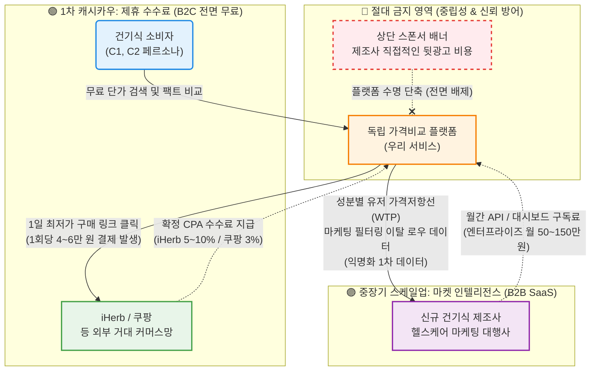

## **💡 솔루션 핵심 제안: Value Proposition Sheet**

| 항목 | 내용 요약 | 상세 서술 |
| --- | --- | --- |
| **페르소나 및 CJM 방식을 통한고객별 핵심 문제 (Pain, Needs)** | **① 단가 수동 계산의 한계 (C1)
② 광고성 정보 공해 및 성분 해독 한계 (C2, A2)
③ 데이터 오류 불신 (E2)** | • **C1 (가성비 최적화자):** 채널별(아이허브, 쿠팡 등) 환율, 배송비, 복용량을 대조하며 엑셀로 '1일 단가'를 계산하는 데 1시간 이상 소요. (수동 계산 과부하)
• **C2/A2 (건강관리·트렌드 탐색):** 블로그/카페 추천글이 '뒷광고'로 도배되어 참거짓 판별 불가. "콜레칼시페롤" 등 의학 조어를 직관적으로 해석 불가.
• **CJM 단계별 공통 Pain:** 인지/고려 단계에서의 독립 정보 부재, 결제 직전의 최종 단가 확인 수단 부재. |
| **JTBD 인터뷰 결과에 따른고객 상황별 목표 (Goal, Job)** | **① 실시간 최적화 자동 렌더링
② 논문/의학 기반 필터링 팩트체크** | • **C1 Job:** "환율 및 용량 변동이 모두 반영된 **'정확한 1일 복용량 단위 단가'를 즉시 확인**하여 최적가에 구매하고 싶다."
• **C2/A2 Job:** "광고와 마케팅 수사를 배제하고 **객관적/의학적 팩트만 필터링**하여, 안전하고 가격 거품 없는 결정을 30분 내로 마치고 지인에게 **자신 있게 공유**하고 싶다." |
| **고객이 원하는 Outcome(측정 가능한 결과치)** | **① 탐색/계산 시간 90% 단축
② 광고 수익 0 인증 & 의학 뱃지
③ 오류 0건, 1 탭 즉시 공유** | 1. **시간 비용 압축:** 60분 걸리던 다채널 교차 탐색과 엑셀 계산 수작업을 **5초 이내**로 단축.
2. **판독 강도 명세화:** 긴 줄글 설명 대신 **1개의 뱃지**(ex. "의학적 근거 확실", "광고성 거품 주의")로 이해도 극대화.
3. **공유 액션:** 공부 없이 얻은 결론 요약 카드를 **1번의 탭**만으로 SNS 및 가족 카톡방에 전달. |
| **기존 대안(Competitors / Substitutes)** | **① 정보 대체재:** 유튜브 약사 채널, 영양제 갤러리, 맘카페
**② 계산 대체재:** 개인용 구글 스프레드시트
**③ 결정 대체재:** 종근당 등 TV광고 대형 제약사 무지성 구매 | • 기존 정보 커뮤니티는 정보가 극도로 파편화되어 취합에 막대한 시간이 낭비됨.
• 기존의 가격 비교 앱이나 네이버 쇼핑은 '해외 직구 환율', '1캡슐당 실제 유효성분 함량'까지 고려한 정밀 계산을 제공하지 않음 (단순 박스 단위 최저가 표출).
• 탐색에 지친 고객은 결국 기존 대형 제약사의 비싼 베스트셀러를 무비판적으로 선택(타협)하게 됨. |
| **우리 솔루션의 핵심 제안(Value Proposition)** | **"광고 없는 팩트, 엑셀 없는 최저가"**(Anti-BS Dashboard & Super-Calc Engine) | **"건강보조식품 성분·가격 비교 초자동화 플랫폼"**우리는 수동 엑셀 계산에 지친 직구족(C1)과, 광고에 속는 것에 신물이 난 영양제 입문자(C2)에게 **'1일 복용량 기준 리얼-타임 단가'**와 **'이해하기 쉬운 의학적 팩트체크 뱃지'**를 제공함으로써, 쇼핑 탐색 시간을 **1시간에서 5초로 압축**하고 **가장 신뢰할 수 있는 구매 결정권**을 돌려줍니다. |
| **우리가 제공하는 차별적 가치(Unfair Advantage)** | **① 극한의 정규화 (Data Normalization)
② 수익 모델 역행을 통한 100% 무결성 선언** | • **계산 공식의 차별성:** 국내 업계 유일, [실시간 환율 + 제품별 1일 복용 기준량 + 배송비 + 할인코드]를 융합 연산하여 **완전히 정제된 원화(₩) 단일 단가표**를 제공.
• **독립 생태계 선언:** 상위 노출 뒷광고 및 제휴 마케팅비를 플랫폼 메인에 절대 노출하지 않는 정책으로 '데이터 오류 0% / 객관성 100%' 슬로건의 체감도를 극대화. |
| **Proof(근거 및 잠재 수요 검증 데이터)** | **① AOS/DOS 최고점 기회 요소 입증
② JTBD 인터뷰를 통한 Switch 검증** | • **시장 공백 수치화:** AOS-DOS 결합 매트릭스 결과, **"광고 배제/독립 정보" 항목이 (AOS 4.0 / DOS 3.6)** 으로 최우선 순위 혁신 기회로 도출됨.
• **JTBD 인터뷰 날조 증언:** "엑셀에 달러치고 나눗셈 하다보면 현타옵니다. 실시간 코드 반영만 되면 바로 씁니다."(C1), "논문 보기는 싫고 광고인지 아닌지만 감별해 주는 판독기가 필요해요."(A2) |

---

## **🔄 Pain – Solution – Outcome 핵심 흐름도**

우리 솔루션이 고객의 근본적인 문제를 어떻게 해결하고 어떠한 결과 가치를 창출하는지 보여주는 직관적 흐름입니다.

```mermaid
flowchart LR
    %% 스타일 정의
    classDef pain fill:#FFEbee,stroke:#EF5350,stroke-width:2px;
    classDef solution fill:#E8F5E9,stroke:#66BB6A,stroke-width:2px;
    classDef outcome fill:#E3F2FD,stroke:#42A5F5,stroke-width:2px;

    subgraph Pain ["🔥 Pain (고객의 불만/불안 지점)"]
        direction TB
        P1("1시간 낭비되는 엑셀 수동 단위 환산"):::pain
        P2("뒷광고로 도배된 영양제 리뷰 맹신 불가"):::pain
        P3("의학 용어와 정보 과잉으로 탐색 포기"):::pain
    end

    subgraph Solution ["💡 Solution (우리 플랫폼의 핵심 제안)"]
        direction TB
        S1("실시간 채널 통합 1일 단가 환산 엔진"):::solution
        S2("마케팅/제휴 제로의 독립적인 데이터 생태계"):::solution
        S3("의학 논문 기반 배지형 팩트 1탭 요약 카드"):::solution
    end

    subgraph Outcome ["🎯 Outcome (고객이 체감하는 최종 성과)"]
        direction TB
        O1("검색 5초 만에 신뢰도 100% 최저가 즉각 결제"):::outcome
        O2("지루한 성분 공부 해방 및 카카오톡 즉시 공유"):::outcome
        O3("마케팅 늪에서의 구원, 내 가족 건강의 보호"):::outcome
    end

    Pain ==> Solution ==> Outcome
```

---

## **💰 수익 구조 설계 (Revenue Model & Monetization)**

우리 플랫폼의 핵심 가치인 '독립성(광고 배제)'과 '무결성(팩트 체크)'을 훼손하지 않으면서 수익성, 성장성, 지속가능성을 확보하기 위한 수익 모델입니다. **[직접 브랜드 광고비 수취 모델]은 전면 배제**합니다.

### **1. Affiliate CPA (제휴 마케팅 수수료 배분) — 캐시카우 (수익성)**

플랫폼 내 1일 단가 비교와 팩트체크를 마친 고객이 최저가 구매 링크(아웃링크)를 통해 결제 시 발생하는 수수료 수익입니다. 고객에게는 100% 무료입니다.

- **현실 기반 수치 리서치:**
    - **iHerb 파트너스(Rewards):** 기존 고객 5%, 신규 고객 10% 수수료율 (건강보조식품 최우선 채널).
    - **쿠팡 파트너스:** 결제액의 3% 수수료 율 적용 (로켓직구 및 국내 상품 공통).
    - **건기식 이커머스 평균 객단가(AOV):** 약 40,000원 ~ 60,000원 (2~3개월치 멀티비타민 및 오메가3 대량 구매 형태).
- **예상 가치:** 1회 전환 당 평균 **1,500원 ~ 2,500원**의 순수익 창출. C1(가성비족)과 C2(건강계기)의 특성상 정기적 **재구매(Retention)가 3~6개월 단위로 반드시 발생**하므로 반복 매출(Recurring Revenue)이 누적됩니다.

### **2. B2B Market Intelligence 리포트 (데이터 라이선싱) — 성장성**

플랫폼이 축적한 1일 단가 정규화 데이터와 유저의 클릭 방어를 분석하여 실질 시장 인사이트를 제조사 및 유통사에 판매하는 B2B 모델입니다.

- **현실 기반 수치 리서치:**
    - 신규 건기식 브랜드는 자사 성분 배합이 시장 평균가 대비 어느 위치에 있는지 파악하기 위한 FGI 리서치 및 포지셔닝 조사 비용으로 프로젝트당 1천만 원 이상을 소진함.
- **예상 가치:** 특정 성분(ex. 글루타치온, 비타민D)의 채널별 실시간 단가 변동성, 마케팅 문구(광고글) 차단 전후의 유저 이탈률 등의 익명화 원천 데이터를 API 및 대시보드 형태로 제공. **월 50만 원 ~ 150만 원 규모의 엔터프라이즈(SaaS) 과금**. 소비자 대상의 중립성은 지키면서 마진율 90% 이상의 부가 수익 기반을 구축합니다.

### **3. B2C 극가성비 프리미엄 알림 구독 (Phase 3) — 지속가능성**

가성비 최적화자(C1 타겟)를 위한 핀셋 프리미엄 기능입니다. 기본적인 제품 비교는 전면 무료지만, 특정 기능에 한정하여 소액 과금합니다.

- **현실 기반 수치 리서치:** 뽐뿌, 딜바다 등 핫딜 커뮤니티 유저들의 "키워드 알림" 사용 빈도 극도로 높음. 단 1회 핫딜 구매 성공 시 1~2만 원의 차익 발생.
- **예상 가치:** 찜해둔 제품의 **역대 최저가 달성 시, 1초 내 품절 방지 앱 푸시 알림**, 환율 급하락 구간 구매 권장 알림. **월 2,900원 ~ 4,900원** 수준 구독. 극단적 유저는 1번의 핫딜 알림 수신만으로 1년 치 구독료 회수가 가능하므로 가격 저항이 현저히 낮습니다.

---

## **📈 창업 파트너/팀을 위한 시니어 가치 분석가의 3가지 제언 (Strategic Advice)**

### **1. N1(조미라)과 E1(나경아)은 버리는 것이 곧 "전략"입니다**

데이터(DOS)가 말해주고 있습니다. 500만 명에 육박하는 브랜드 맹신러(NON-user 그룹)와 디지털 소외 시니어는 플랫폼 내에 직접 유치하기 위한 마케팅 비용을 투입해서는 안 됩니다. 우리의 목표는 트래픽과 바이럴을 생산하는 확장 유저인 A2(정수빈, 트렌드 추종자)가 **카톡 요약 카드로 E1/N1에게 정보를 하달 정지(공유)하게 만드는 시스템적 플라이휠**에 집중하는 것입니다. 우리의 실질 랜딩 페이지는 웹사이트가 아니라, 자녀가 보내는 그 카톡 '공유 썸네일' 카드 1장입니다.

### **2. 초기 생존을 위한 단 하나의 기술(Engineering)은 "정규화(Normalization)"입니다.**

이 비즈니스는 화려한 AI 추천 모델보다 **'지저분한 외부 데이터를 어떻게 똑같은 기준으로 깎아서 통일하는가'**가 승패를 가릅니다. 아이허브의 mg 단위, 쿠팡의 캡슐 단위, 네이버의 포 단위를 **'1일 섭취 기준 단가'**로 정규화하는 데이터 엔지니어링 능력이 이 비즈니스의 가장 거대한 해자(Moat)가 될 것입니다 (C1 타겟, DOS 2.7 캐시카우 지표 충족).

### **3. 기능이 아닌 '신뢰'가 돈을 벌어옵니다. (E2의 경고)**

AOS 4.0으로 나타난 유저들의 가장 짙은 페인포인트는 결국 **'불신(Trust Deficit)'**이었습니다. 경쟁 앱 유저 이탈의 사유는 항상 UI 불편함이 아니라 "함량 데이터가 한 번 틀렸기 때문(EXT-2)"이었습니다. 런칭 초기, 돈을 빨리 벌기 위해 추천 상품 상단에 업체 제휴 상품(AD)을 꽂아 넣는 순간, 플랫폼의 생명인 '가치 제안(Anti-BS)'은 종말을 고합니다. 수익화는 커머스 트래픽 수수료에 맡기고, 플랫폼의 도메인 자체는 무결점 청정구역으로 끝까지 분리 방어해야 합니다.